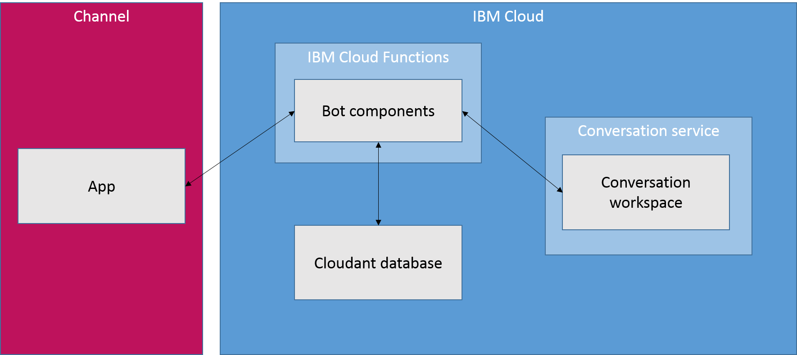

---

copyright:
  years: 2015, 2017
lastupdated: "2017-11-14"

---

{:shortdesc: .shortdesc}
{:new_window: target="_blank"}
{:tip: .tip}
{:pre: .pre}
{:codeblock: .codeblock}
{:screen: .screen}
{:javascript: .ph data-hd-programlang='javascript'}
{:java: .ph data-hd-programlang='java'}
{:python: .ph data-hd-programlang='python'}
{:swift: .ph data-hd-programlang='swift'}

# Deploying to a channel with the Conversation connector

After you have developed your workspace, you can use the Conversation connector to quickly connect it to a communication channel such as Slack or Facebook Messenger. The Conversation connector is a set of {{site.data.keyword.openwhisk}} components that mediate communication between your Conversation workspace and a Slack or Facebook app you own, storing session data in a Cloudant database. By connecting your workspace to a channel app, you can make it available as a chat bot that Slack or Facebook Messenger users can interact with.



The Conversation connector has some limitations:

- You must create a Slack or Facebook app, or have administrative permissions to modify the app you want to use.
- Because of {{site.data.keyword.openwhisk_short}} restrictions, this tool is currently available only for the {{site.data.keyword.Bluemix_notm}} US South region.

## Deploying to Slack using the Conversation tool

The Conversation tool provides a quick way to deploy a bot using the Conversation connector. The tool steps you through the process of gathering the required information to configure your channel app and the connector components, and then it automatically deploys the required components to the IBM Cloud.

**Note:** The Conversation tool interface currently supports only Slack, but you can use an automated {{site.data.keyword.Bluemix_short}} process to deploy for Facebook Messenger. For more information about deploying for Facebook Messenger, see the documentation in the Conversation connector [GitHub repository ](https://github.com/watson-developer-cloud/conversation-connector/blob/master/channels/facebook/README.md){: new_window}.

To deploy a bot using the automated deployment tool:

1. In the {{site.data.keyword.conversationshort}} tool, open the workspace you want to deploy.
1. Click the menu icon in the upper left corner, and then select **Deploy**.

   

1. Under **Deploy with Cloud Functions**, click **Deploy to Slack**.
1. On the Slack page, click **Deploy to Slack app** and follow the instructions.

   

## Deploying manually

Instead of using the automated tool to deploy your workspace as a bot, you can manually configure and deploy the required components to the IBM Cloud. There are several situations in which you might want to do this:

- **Partial redeployment**. You might want to redeploy some components of an existing deployment in order to change your configuration, correct problems, or apply a fix from a newer version.
- **Extending your bot with new capabilities**. You can modify the provided components to add new functions, such as preprocessing user input before sending it to the Conversation workspace.
- **Deploying to a new channel**. If you want to deploy a bot to a channel other than Slack or Facebook Messenger, you can follow the pattern of the existing components to develop your own components.

The Conversation connector components are hosted in a public GitHub repository, which you can download or clone. For more information, see the documentation provided in the [repository ](https://github.com/watson-developer-cloud/conversation-connector){: new_window}.

## Chatting with the bot

After you complete the deployment process, you can use the bot user name to interact with your {{site.data.keyword.conversationshort}} workspace, just as you would with any other Slack or Facebook Messenger bot.

Keep in mind that the Conversation connector preserves state separately for each user who is interacting with the bot. (In the case of Slack, a single user might have multiple unique conversations with the bot, one through direct messages and one in each channel.) This means that any variables you store in the dialog context are maintained indefinitely, unless you clear them.

If you need to be able to reset the conversation to a known starting state, you can do so within your dialog. Make sure that your dialog has a node that is executed at the end of the conversation or any other time you need to start over. Update the JSON for this node to reset all context variables to the appropriate starting values. (If necessary, you can use **Jump to** actions or a special "end conversation" intent to execute this node.)

For example, if your workspace uses a context variable called `drink_order` to store a user's beverage selection, you can use the `context.remove` method to delete this variable when the conversation ends:

```json
"context": {
   "reset_drink_order": "<?context.remove('drink_order')?>"
 }
```
{: codeblock}

For more information about modifying context variable values, see [Updating a context variable value](dialog-overview.html#updating-a-context-variable-value).

You can also clear the context, or make other changes to the behavior of the bot, by editing the deployed Cloud Functions actions. For more information, see documentation provided in the [GitHub repository ](https://github.com/watson-developer-cloud/conversation-connector){: new_window}.