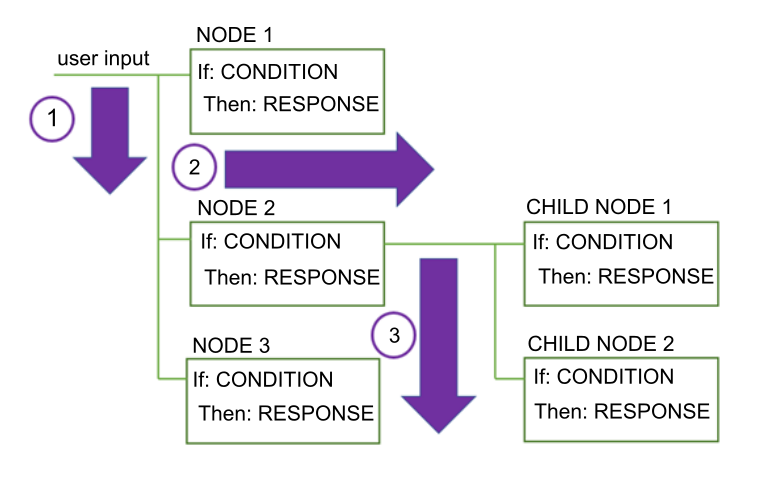

---

copyright:
  years: 2015, 2017
lastupdated: "2017-06-09"

---

{:shortdesc: .shortdesc}
{:new_window: target="_blank"}
{:tip: .tip}
{:pre: .pre}
{:codeblock: .codeblock}
{:screen: .screen}
{:javascript: .ph data-hd-programlang='javascript'}
{:java: .ph data-hd-programlang='java'}
{:python: .ph data-hd-programlang='python'}
{:swift: .ph data-hd-programlang='swift'}

# Dialogs
{:#dialog-overview}

Your dialog is represented graphically in the tool as a tree. Create a branch to process each intent that you want your bot to handle. A branch is composed of multiple nodes.
{:shortdesc}

## Dialog nodes

Each dialog node contains, at a minimum, a condition and a response.

- Condition: Specifies the information that must be present in the user input for this node in the dialog to be triggered. The information might be a specific intent, an entity value, or a context variable value. See [Conditions](dialog-conditions.html) for more information.

- Response: The utterance that the bot uses to respond to the user. The response can also be configured to trigger programmatic actions. See [Responses](dialog-responses.html) for more information.

You can think of the node as having an if/then construction: if this condition is true, then return this response.

For example, the following node is triggered if the natural language processing function of the service determines that the user input contains the `#cupcake-menu` intent. As a result of the node being triggered, the bot responds with an appropriate answer.

A single node with one condition and response can handle simple user requests. But, more often than not, users have more sophisticated questions or want help with more complex tasks. You can add child nodes that ask the user to provide any additional information that the bot needs.

## Dialog node limits
{:#dialog-node-limits}

The number of dialog nodes you can create in a single service instance depends on your service plan.

| Service plan     | Dialog nodes per service instance |
|------------------|----------------------------------:|
| Standard/Premium |                           100,000 |
| Lite             |                            25,000 |

## Dialog flow

The dialog that you create is processed by the service from top to bottom.

As it travels down the tree, if the service finds a condition that is met, it triggers that node. It then moves from left to right on the triggered node to check the user input against any child node conditions. As it checks the child nodes it moves again from top to bottom.

The services continues to work its way through the dialog tree from top to bottom, left to right, then top to bottom and left to right until it reaches the last node in the branch it is following.

When you start to build the dialog, you must determine the branches to include, and where to place them. The order of the branches is important because nodes are evaluated from top to bottom. The first base node whose condition matches the input is used; any nodes that come lower in the tree are not triggered.

If you are ready to get started, see [Creating a dialog](dialog-create.html) for assistance.
