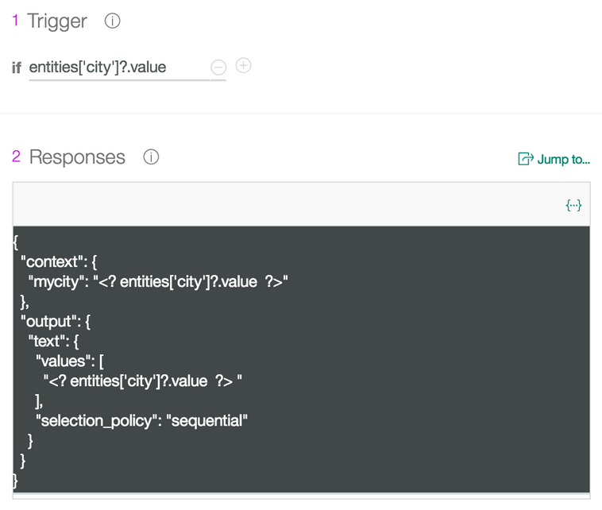

---

copyright:
  years: 2015, 2017
lastupdated: "2017-06-09"

---

{:shortdesc: .shortdesc}
{:new_window: target="_blank"}
{:tip: .tip}
{:pre: .pre}
{:codeblock: .codeblock}
{:screen: .screen}
{:javascript: .ph data-hd-programlang='javascript'}
{:java: .ph data-hd-programlang='java'}
{:python: .ph data-hd-programlang='python'}
{:swift: .ph data-hd-programlang='swift'}

# Shorthand syntax

You can use shorthand syntax to write intents, entities, and context variables as expressions in conditions, to include them in text output, and to set context variable values.
{:shortdesc}

Valid expressions in conditions are written in the Spring Expression (SpEL) language. For more information, see <a target="_blank" href="http://docs.spring.io/spring/docs/current/spring-framework-reference/html/expressions.html" title="(Opens in a new tab or window)">Spring Expression Language (SpEL) language</a>.

## Shorthand for intents

The following table shows examples of the shorthand syntax that you can use.

**Table 1. Shorthand for intents**

| Shorthand syntax        | Full syntax in SpEL |
|-------------------------|---------------------|
| `#help`                 | `intent == 'help'`  |
| `! #help`               | `intent != 'help'`  |
| `NOT #help`             | `intent != 'help'`  |
| `#help` or `#i_am_lost` | <code>(intent == 'help' &#124;&#124; intent == 'I_am_lost')</code> |

`#help` and `intent == 'help'` differ from `intents[0] == 'help'` because they do not throw an exception if no entity is detected.  They are evaluated as true only if the intent confidence exceeds a threshold.  If you wish, you can specify a custom confidence level for a condition, for example, `intents.size() > 0 && intents[0] == 'help' && intents[0].confidence > 0.1`

## Shorthand for entities

The following table shows examples of the shorthand syntax that you can use. In SpEL, the question mark `(?)` prevents a null pointer exception when *entities.year* and *entities.city* are null. Otherwise, the `.value` and `.contains` methods would be called on a null object.

**Table 2. Shorthand for entities**

| Shorthand syntax    | Full syntax in SpEL                      |
|---------------------|------------------------------------------|
| `@year`             | `entities['year']?.value`                |
| `@year == 2016`     | `entities['year']?.value == 2016`        |
| `@year != 2016`     | `entities['year']?.value != 2016`        |
| `@city == 'Boston'` | `entities['city']?.value == 'Boston'`    |
| `@city:Boston`      | `entities['city']?.contains('Boston')`   |
| `@city:(New York)`  | `entities['city']?.contains('New York')` |

**Note**: if the entity value that you want to check for contains a `)` character, you cannot use the `:` operator for comparison.  For example, if you want to check whether the city entity is `Dublin (Ohio)`, you must use `@city == 'Dublin (Ohio)'`.

Consider the condition, `entities['city']?.contains('Boston')`. This condition returns true when at least one 'Boston' city entity is found in all the @city entities.

For example, a user submits `"I want to go from Toronto to Boston."` The `@city:Toronto` and `@city:Boston` entities are detected and are represented in these entities:

-   `entities.city[0].value = 'Toronto'`
-   `entities.city[1].value = 'Boston'`

With this example, the `@city.contains('Boston')` condition in a dialog node returns true even though Boston is the second entity detected.

If there are synonyms defined for a particular entity value, such as `NY` and `NYC` synonyms for `New York` of `@city` entity, and a user submits `"I want to fly to NYC"`, the value and the literal (exact wording for the matched entity in the input) can be accessed as follows:

-   `@city = 'New York'`
-   `@city.literal = 'NYC'`

Expressions like `@city:(New York)` or `@city.contains('New York')` always refer to the value of the entity (`New York` in our example).

When you use the full SpEL syntax in the dialog response, you must enclose the entity specification in `<?` and `?>`.  When you use the full SpEL syntax to include the entity value in a condition, you do not need the `<? ?>`.  This example shows the use of the full SpEL syntax in both the condition and the response of a node.
 

[//]: # (You can specify a custom confidence level for a condition, for example, `@city && city.confidence > 0.7`.  The confidence of an entity is either 0 or 1 unless you have activated fuzzy matching of entities.)

## Shorthand for context variables

The following table shows examples of the shorthand syntax that you can use to write context variables in condition expressions.

**Table 3. Shorthand for context variables**

| Shorthand syntax           | Full syntax in SpEL                     |
|----------------------------|-----------------------------------------|
| `$card_type:VISA`          | `context['card_type'] == 'VISA'`        |
| `$card_type:(MASTER CARD)` | `context['card_type'] == 'MASTER CARD'` |
