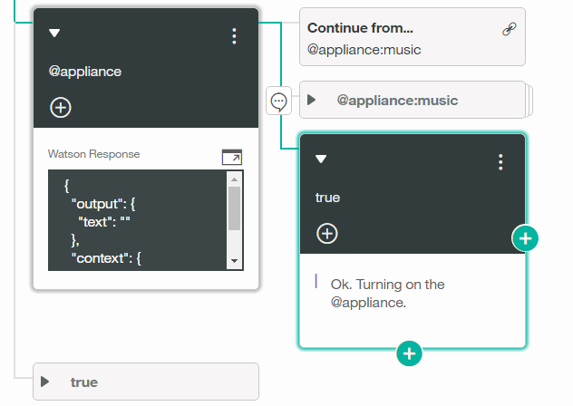

---

copyright:
  years: 2015, 2017
lastupdated: "2017-06-09"

---

{:shortdesc: .shortdesc}
{:new_window: target="_blank"}
{:tip: .tip}
{:pre: .pre}
{:codeblock: .codeblock}
{:screen: .screen}
{:javascript: .ph data-hd-programlang='javascript'}
{:java: .ph data-hd-programlang='java'}
{:python: .ph data-hd-programlang='python'}
{:swift: .ph data-hd-programlang='swift'}

# Testing your dialog

As you make changes to your dialog, you can test it at any time to see how it responds to input.
{:shortdesc}

1. From the Dialog tab, click the
 icon.
1. In the chat pane, type some text and then press Enter.

    **Tip**: Make sure the system has finished training on your most recent changes before you start to test the dialog. If the system is still training, a message appears at the top of the chat pane:

    

1. Check the response to see if the dialog correctly interpreted your input and chose the right response.

    The chat window indicates what intents and entities were recognized in the input:

    

    In the dialog editor pane, the currently active node is highlighted:

    

1. To check or set the value of a context variable, click the **Manage context** link. 
   
   Any context variables that you defined in the dialog are displayed. 
   
   In addition, a `$timezone` context variable is listed. The "Try it out" pane user interface gets user locale information from the web browser and uses it to set the `$timezone` context variable. This context variable makes it easier to deal with time references in test dialog exchanges. Consider doing something similar in your user application. If not specified, Greenwich Mean Time (GMT) is used.
   
   You can add a variable and set its value to see how the dialog responds in the next test dialog turn. This capability is helpful if, for example, the dialog is set up to show different responses based on a context variable value that is provided by the user.
   
      1. To add a context variable, specify the variable name, and press Enter. 
      1. To define a default value for the context variable, find the context variable you added in the list, and then specify a value for it.
   
   See [Context variables](dialog-context.html) for more information.

1. Continue to interact with the dialog to see how the conversation flows through it. 
   - To find and resubmit a test utterance, you can press the Up key to cycle through your recent inputs.
   - To remove prior test utterances from the chat pane and start over, click the **Clear** link.
     Not only are the test utterances and responses removed, but this action also clears the values of any context variables that were set as a result of your interactions with the dialog. Context variable values that you explicitly set or change are not cleared. 

### What to do next

If you determine that the wrong intents or entities are being recognized, you might need to modify your intent or entity definitions. 

If the right intents and entities are being recognized, but the wrong nodes are being triggered in your dialog, make sure your conditions are written correctly.
