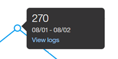
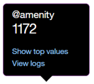
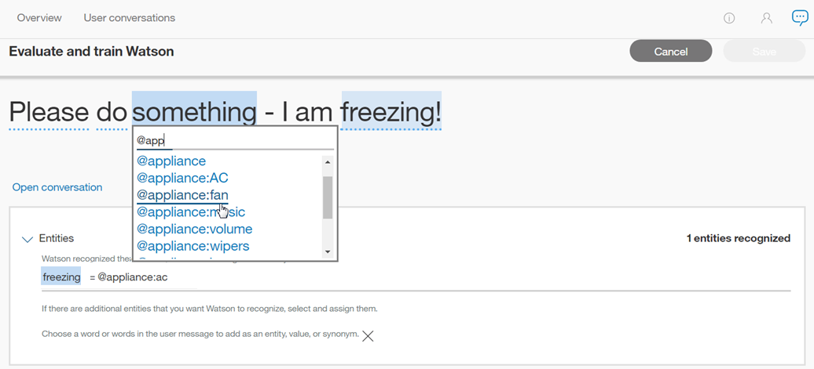

---

copyright:
  years: 2015, 2017
lastupdated: "2017-06-09"

---

{:shortdesc: .shortdesc}
{:new_window: target="_blank"}
{:tip: .tip}
{:pre: .pre}
{:codeblock: .codeblock}
{:screen: .screen}
{:javascript: .ph data-hd-programlang='javascript'}
{:java: .ph data-hd-programlang='java'}
{:python: .ph data-hd-programlang='python'}
{:swift: .ph data-hd-programlang='swift'}

# Improving understanding

The Improve component of the {{site.data.keyword.conversationshort}} service provides a history of conversations with users. You can use this history to improve your bot's understanding of users' inputs.
{:shortdesc}

While you develop your workspace, you use the **Try it out** panel to verify that it recognizes the correct intents and entities in test inputs, and make corrections as needed.  In the **Improve** panel, you can view information about actual conversations with your users and make similar corrections to improve the accuracy with which intents and entities are recognized.

## Using the Overview page

The Overview page of the Improve component provides a summary of interactions with your bot.  You can view the amount of traffic for a given time period, as well as the intents and entities that were recognized most often in user conversations.  The statistics that are displayed on the **Overview** page cover a longer period of time than the period for which logs of user conversations are retained.  These statistics represent external traffic that has interacted with your bot; they do not include interactions that use the **Try it out** panel in the tool.

You can use the Overview page to answer questions like these:

* Which months had the largest and smallest numbers of conversations last year?
* What was the average number of conversations per week during the first quarter?
* Which intents appeared most often last week?
* Which entity values were recognized the most times during September?

To open the **Overview** page, select **Overview** in the navigation bar. If **Overview** is not visible, use the  menu to open the page.

Use the time period control to choose the period for which data is displayed.  This control affects all data shown on the page: not just the number of conversations displayed in the graph, but also the statistics displayed along with the graph, and the lists of top intents and entities.

You can choose whether to view data for a single day, a week, a month, a quarter, or a year.  In each case, the data points on the graph adjust to an appropriate measurement period.  For example, when viewing a graph for a day, the data is presented in hourly values, but when viewing a graph for a week, the data is shown by day.  A week always runs from Sunday through Saturday.  You cannot create custom time periods, such as a week that runs from Thursday to the following Wednesday, or a month that begins on any date other than the first.

You can select **View logs** to open the **User Conversations** page with the date range filtered to match the time period that you have selected for the **Overview** page.  Depending on your plan and the date range that you selected, it is possible that the **User Conversations** page will show no data.

While viewing the graph, you can click on an individual data point to see the numeric value, as shown here:

You can use the **View logs** link to open the **User Conversations** page with the date range filtered to match the data point.

In addition to the graph, four statistics related to the displayed data are shown:

1.  The total number of conversations that took place during this time period
1.  The median conversation time of conversations during this time period
1.  The maximum number of conversations for a single data point within the time period
1.  The minimum number of conversations for a single data point within the time period

You also see the intents and entities that were recognized most often during the specified time period. By default you see the top three of each, but you can change that to a larger number.

Intents are shown in a simple list. In addition to seeing the number of times an intent was recognized, you can use the **View logs** link to open the **User Conversations** page with the date range filtered to match the data you are viewing, and the intent filtered to match the selected intent.

Entities are shown in a bar chart. For each entity, you can select the bar to see the number that the bar represents; select **Show top values** to see a list of the values that were identified for this entity during the time period, or select **View logs** to open the **User Conversations** page with the date range filtered to match the data you are viewing and the entity filtered to match the selected entity.

The page shows when the data that it displays was last updated. You can select **Refresh data**, at the top of the page, if you think that newer data might be available.

## Viewing user conversations

To open the chat logs, select **User conversations** in the navigation bar. If **User conversations** is not visible, use the  menu to open the page.

When you open the **User conversations** page, the chat logs for the last 90 days are provided, with the newest first. The top intent and any entities used in the message, the message text, and the bot's reply are available.

The length of time for which chat logs are retained depends on your {{site.data.keyword.conversationshort}} service plan:

| Service plan     | Chat log retention |
|------------------|--------------------|
| Standard/Premium | Last 30 days       |
| Lite             | Last 7 days        |

You can expand each message to see what the user said in the whole conversation, how your bot answered, and the conversation ID. To do this, select **Open conversation**. You are automatically taken to the message you selected within that conversation.

You can also filter the chat logs by *Search user statements...* (keyword search), *Intents*, *Entities*, and *Date range*:

- *Search user statements...* - Type a word in the search bar. This searches the user's input, but not your bot's reply.
- *Intents* - Select the drop-down menu and type an intent in the input field, or choose from the populated list. You can select more than one intent, which filters the results using any of the    selected intents.
- *Entities* - Select the drop-down menu and type an entity name in the input field, or choose from the populated list. You can select more than one entity, which filters the results by any of the selected entities. If you filter by intent *and* entity, your results will include the messages that have both values.
- *Date range* - Select the drop-down menu and choose **Last 7 days**, **Last 30 days**, **Last 90 days (Default)**, or **Custom**. If you choose Custom, type the date range or select it from the calendar. Chat logs history is dependent on your service plan, as stated in the plan description.

Your chat logs might take some time to update. Allow at least 30 minutes after a user's input before filtering for that content.

## Viewing chat logs
When you select **User conversations**, the default view lists the messages for your selected date range (default is 90 days), the recognized intent (#intent) and any recognized entity (@entity) values. For intents that are not recognized, the value shown is *No classification*; if an entity is not recognized, or has not been provided, the value shown is *No entities*.

## Viewing an individual conversation
You can expand each message to see what the user said in the whole conversation, and how your bot answered. To do this, select **Open conversation**. You are automatically taken to the message you selected within that conversation.

## Correcting an intent

1.  To correct an intent, select the  edit icon beside the chosen #intent.
1.  Select the drop-down list and choose the correct intent for this input. Begin typing in the entry field and the list of intents is filtered. You can also choose to "[Mark as irrelevant](irrelevant_utterance.html)" from this menu.
1.  Select **Save**.

## Adding an entity value or synonym

1.  To add an entity value or synonym, select the  edit icon beside the chosen @entity.
1.  Select **Add entity**. 
1.  Now, select a word or phrase in the underlined user input.
1.  From the drop-down list, choose an entity to which the highlighted phrase will be added as a value. Begin typing in the entry field and the list of entities and values is filtered. To add the highlighted phrase as a synonym for an existing value, choose the entity:value from the drop-down list. 
1.  Select **Save**. 
