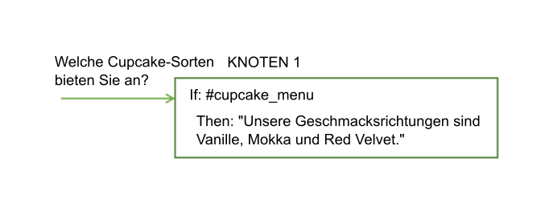
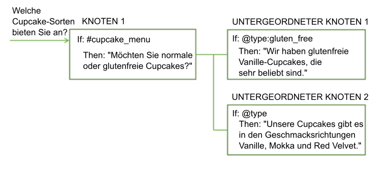
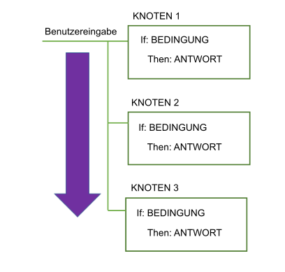
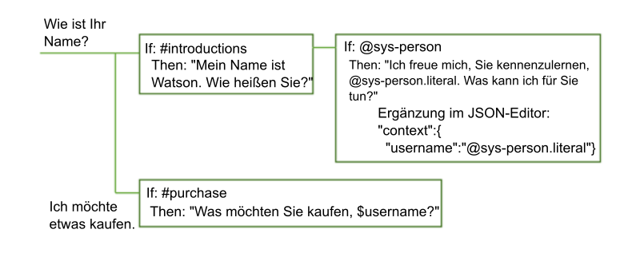
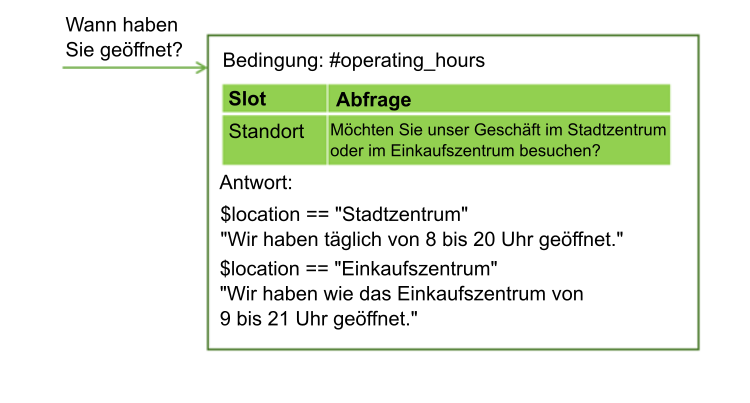
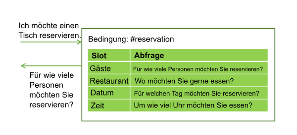
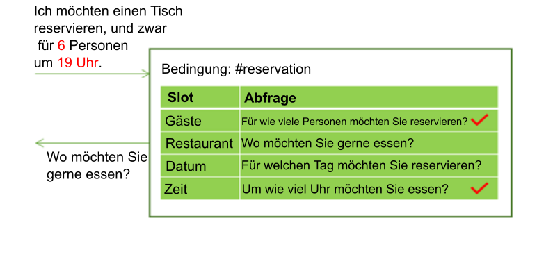
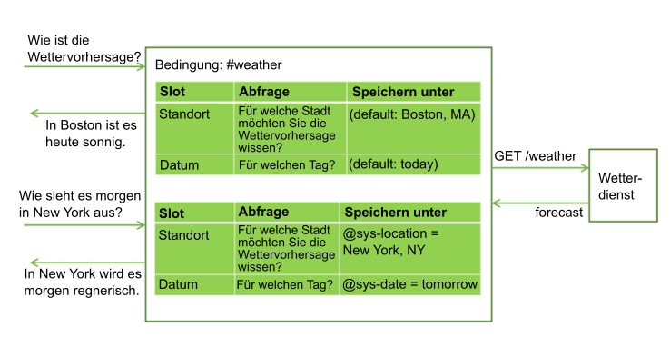
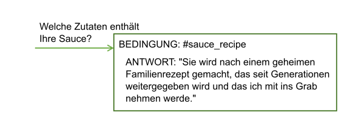

---

copyright:
  years: 2015, 2017
lastupdated: "2017-10-19"

---

{:shortdesc: .shortdesc}
{:new_window: target="_blank"}
{:tip: .tip}
{:pre: .pre}
{:codeblock: .codeblock}
{:screen: .screen}
{:javascript: .ph data-hd-programlang='javascript'}
{:java: .ph data-hd-programlang='java'}
{:python: .ph data-hd-programlang='python'}
{:swift: .ph data-hd-programlang='swift'}

# Dialogmodul erstellen
{: #dialog-build}

Das Dialogmodul verwendet die Absichten und Entitäten, die in der Benutzereingabe angegeben sind, sowie Kontext aus der Anwendung, um mit dem Benutzer zu interagieren und letztendlich eine sinnvolle Antwort zu liefern.
{: shortdesc}

Die Antwort könnte die Antwort auf eine Frage wie beispielsweise `Wo kann ich tanken?` oder die Ausführung eines Befehls sein, z. B. das Einschalten des Radios. Entweder geben die Absicht und die Entität genug Informationen an, damit die korrekte Antwort ermittelt werden kann, oder das Dialogmodul kann vom Benutzer eine weitere Eingabe erfragen, die benötigt wird, um richtig zu antworten. Fragt ein Benutzer beispielsweise 'Wo bekomme ich etwas zu essen?', kann es sein, dass geklärt werden muss, ob er beispielsweise ein Restaurant, ein Lebensmittelgeschäft oder einen Take-Away-Imbiss sucht. Sie können weitere Details in einer Textantwort abfragen und einen oder mehrere untergeordnete Knoten erstellen, um die neue Eingabe zu verarbeiten.

<iframe class="embed-responsive-item" id="youtubeplayer" type="text/html" width="640" height="390" src="https://www.youtube.com/embed/oQUpejt6d84?rel=0" frameborder="0" webkitallowfullscreen mozallowfullscreen allowfullscreen> </iframe>

## Dialogmodule im Überblick
{: #overview}

Ihr Dialogmodul wird im Tool grafisch als Baumstruktur dargestellt. Erstellen Sie für jede Absicht, die Ihr Dialog verarbeiten soll, eine Verzweigung. Eine Verzweigung besteht aus mehreren Knoten.

### Dialogmodulknoten

Jeder Dialogmodulknoten enthält mindestens eine Bedingung und eine Antwort.


- Bedingung: Gibt die Informationen an, die in der Benutzereingabe für diesen Knoten im Dialogmodul enthalten sein müssen, damit der Knoten ausgelöst wird. Die Informationen können eine bestimmte Absicht, ein Entitätswert oder ein Wert für eine Kontextvariable sein. Weitere Informationen enthält der Abschnitt [Bedingungen](#conditions).
- Antwort: Die verbale Äußerung, mit der der Service dem Benutzer antwortet. Die Antwort kann ebenfalls so konfiguriert werden, dass programmgestützte Aktionen ausgeführt werden. Weitere Informationen enthält der Abschnitt [Antworten](#responses).

Ein Knoten ist mit einer IF-THEN-Konstruktion vergleichbar; falls diese Bedingung zutrifft, wird diese Antwort zurückgegeben.

Der folgende Knoten wird beispielsweise ausgelöst, wenn die Funktion für die Verarbeitung natürlicher Sprache des Service feststellt, dass die Benutzereingabe die Absicht `#cupcake-menu` enthält. Als Ergebnis der Knotenauslösung reagiert der Service mit einer entsprechenden Antwort.



Ein einzelner Knoten mit einer Bedingung und einer Antwort kann einfache Benutzeranforderungen abwickeln. Meistens haben Benutzer jedoch kompliziertere Fragen oder benötigen Hilfe bei komplexeren Aufgaben. Durch das Hinzufügen von untergeordneten Knoten können Sie den Benutzer auffordern, alle weiteren Informationen anzugeben, die der Service benötigt.



### Dialogmodulablauf

Das Dialogmodul, das Sie erstellen, wird durch den Service von oben nach unten verarbeitet.



Wenn der Service beim Durcharbeiten der Baumstruktur eine Bedingung findet, die erfüllt ist, löst er den entsprechenden Knoten aus. Anschließend bewegt er sich auf dem ausgelösten Knoten von links nach rechts, um die Benutzereingabe anhand von etwaigen untergeordneten Knotenbedingungen zu überprüfen. Die Überprüfung der untergeordneten Knoten erfolgt wieder von oben nach unten.

Der Service setzt die Durcharbeitung der Baumstruktur für das Dialogmodul von oben nach unten, links nach rechts, dann von oben nach unten und links nach rechts fort, bis er den letzten Knoten in der verfolgten Verzweigung erreicht.


Wenn Sie damit beginnen, das Dialogmodul zu erstellen, müssen Sie festlegen, welche Verzweigungen Sie aufnehmen wollen und wo sie platziert sein sollen. Die Reihenfolge der Verzweigungen ist wichtig, weil Knoten von oben nach unten ausgewertet werden. Der erste Basisknoten, dessen Bedingung der Eingabe entspricht, wird verwendet. Alle Knoten, die in der Baumstruktur unter ihm liegen, werden nicht ausgelöst.

## Bedingungen
{: #conditions}

Ein Knotenbedingung legt fest, ob dieser Knoten im Dialog verwendet wird. Antwortbedingungen bestimmen, welche Antwort für einen Benutzer angezeigt wird.
Zum Definieren einer Bedingung können Sie eines oder mehrere der folgenden Artefakte in einer beliebigen Kombination verwenden:

- **Kontextvariable**: Der Knoten wird verwendet, wenn der Ausdruck der Kontextvariablen, die Sie angeben, mit 'true' ausgewertet wird. Verwenden Sie die Syntax `$variablenname:wert` oder `$variablenname == 'wert'`. Weitere Informationen enthält der Abschnitt [Kontextvariablen](#context).

  Verwenden Sie den Wert einer Kontextvariablen nicht zum Definieren einer Knoten- oder Antwortbedingung in demselben Dialogmodulknoten, in dem Sie den Wert der Kontextvariablen festlegen.
{: tip}

- **Entität**: Der Knoten wird verwendet, wenn ein Wert oder Synonym für die Entität in der Benutzereingabe erkannt wird. Verwenden Sie die Syntax `@entitätsname`. Beispiel: `@stadt`.

  Erstellen Sie unbedingt einen Peerknoten, der den Fall abwickelt, dass keiner der Werte bzw. keines der Synonyme für die Entität erkannt werden.
  {: tip}

- **Entitätswert**: Der Knoten wird verwendet, wenn der Entitätswert in der Benutzereingabe erkannt wird. Verwenden Sie die Syntax `@entitätsname:wert`. Beispiel: `@stadt:Berlin`. Geben Sie einen definierten Wert für die Entität an, kein Synonym.

  Wenn Sie in einem Peerknoten überprüfen wollen, ob eine Entität vorhanden ist, ohne einen bestimmten Wert für sie anzugeben, achten Sie darauf, den Knoten, der diesen bestimmten Entitätswert prüft, darüber anzuordnen.
{: tip}

- **Absicht**: Die einfachste Bedingung ist eine einzelne Absicht. Der Knoten wird verwendet, wenn die Benutzereingabe dieser Absicht entspricht. Verwenden Sie die Syntax `#absichtsname`. `#wetter` überprüft beispielsweise, ob in der Benutzereingabe die Absicht `wetter` erkannt wird. Wenn dies der Fall ist, wird der Knoten verarbeitet.

- **Sonderbedingung**: Dies sind Bedingungen, die mit dem Service bereitgestellt werden und die Sie zur Ausführung von allgemeinen Dialogmodulfunktionen verwenden können.

  <table>
  <tr>
    <td>Bedingungsname</td>
    <td>Beschreibung</td>
  </tr>
  <tr>
    <td>anything_else</td>
    <td>Sie können diese Bedingung am Ende eines Dialogmoduls verwenden, damit sie verarbeitet wird, wenn die Benutzereingabe mit keinen anderen Dialogmodulknoten übereinstimmt. Durch diese Bedingung wird der Knoten **Anything else** ausgelöst.</td>
  </tr>
  <tr>
    <td>conversation_start</td>
    <td>Wie **welcome** wird diese Bedingung während der ersten Dialogmodulphase mit 'true' ausgewertet. Anders als **welcome** wird sie unabhängig davon mit 'true' ausgewertet, ob die erstmalige Anforderung aus der Anwendung eine Benutzereingabe enthält oder nicht. Ein Knoten mit der Bedingung **conversation_start** kann verwendet werden, um am Anfang des Dialogmoduls Kontextvariablen zu initialisieren oder andere Tasks auszuführen.</td>
  </tr>
  <tr>
    <td>false</td>
    <td>Diese Bedingung wird immer mit 'false' ausgewertet. Sie können sie am Anfang einer Verzweigung verwenden, die sich noch in der Entwicklung befindet, um ihre Verwendung zu verhindern, oder aber als Bedingung für einen Knoten, der eine allgemeine Funktion bereitstellt und nur als Ziel einer Aktion **Springen zu** dient.</td>
  </tr>
  <tr>
    <td>irrelevant</td>
    <td>Diese Bedingung wird mit 'true' ausgewertet, wenn der Service 'Conversation' feststellt, dass die Benutzereingabe irrelevant ist.</td>
  </tr>
  <tr>
    <td>true</td>
    <td>Diese Bedingung wird immer mit 'true' ausgewertet. Sie können sie am Ende einer Liste von Knoten oder Antworten verwenden, um alle Antworten abzufangen, die keiner der vorherigen Bedingungen entsprechen.</td>
  </tr>
  <tr>
    <td>welcome</td>
    <td>Diese Bedingung wird in der ersten Runde des Dialogmoduls (beim Beginn des Dialogs) und nur dann mit 'true' ausgewertet, wenn die erstmalige Anforderung aus der Anwendung keine Benutzereingabe enthält. Bei allen nachfolgenden Dialogmodulrunden wird sie mit 'false' ausgewertet. Der Knoten **Welcome** wird durch diese Bedingung ausgelöst. Ein Knoten mit dieser Bedingung dient normalerweise dazu, den Benutzer zu begrüßen, beispielsweise durch die Ausgabe einer Nachricht wie 'Willkommen bei unserer Pizza-Bestellapp'.</td>
  </tr>
  </table>

### Bedingungssyntax

Verwenden Sie eine der folgenden Syntaxoptionen, um gültige Ausdrücke in Bedingungen zu erstellen:

- Spring Expression Language (SpEL): Diese Ausdruckssprache unterstützt die Abfrage und Bearbeitung eines Objektgraphs zur Laufzeit. Weitere Informationen finden Sie auf der Seite zu [Spring Expression Language (SpEL) ](http://docs.spring.io/spring/docs/current/spring-framework-reference/html/expressions.html){: new_window}.

- Verwenden Sie Kurzbefehle, um Absichten, Entitäten und Kontextvariablen zu referenzieren. Weitere Informationen finden Sie unter [Auf Objekte zugreifen und Objekte auswerten](expression-language.html).

Verwenden Sie reguläre Ausdrücke, um Werte für Bedingungen zu überprüfen. Verwenden Sie beispielsweise die Methode `String.find`, um eine übereinstimmende Zeichenfolge zu suchen. Weitere Informationen enthält der Abschnitt [Methoden](dialog-methods.html).

### Tipps zur Verwendung von Bedingungen

- Wenn Sie lediglich den Wert der ersten erkannten Instanz eines Entitätstyps auswerten wollen, können Sie die Syntax `@entität == 'bestimmter_wert'` anstelle des Formats `@entität:(bestimmter_wert)` verwenden. Wenn Sie beispielsweise die Syntax `@gerät == 'Klimaanlage'` verwenden, werten Sie nur den Wert der ersten erkannten Entität `@gerät` aus. Die Verwendung von `@gerät:(Klimaanlage)` wird jedoch auf `entity['gerät'].contains('Klimaanlage')` erweitert, was immer dort zu einer Übereinstimmung führt, wo mindestens eine Entität `@gerät` mit dem Wert 'Klimaanlage' in der Benutzereingabe erkannt wird.
- Achten Sie bei Verwendung von numerischen Variablen darauf, dass die Variablen Werte besitzen. Falls eine Variable keinen Wert besitzt, wird sie bei einem Vergleich numerischer Werte so behandelt, als ob sie einen Nullwert (0) enthält. Wenn Sie beispielsweise den Wert einer Variablen mit der Bedingung `@preis < 100` überprüfen und die Entität '@preis' null ist, wird die Bedingung mit `true` ausgewertet, weil 0 kleiner als 100 ist, obwohl nie ein Preis festgelegt wurde. Um die Überprüfung von Nullvariablen zu verhindern, verwenden Sie eine Bedingung wie `@preis AND @preis < 100`. Falls '@preis' keinen Wert besitzt, gibt diese Bedingung richtigerweise 'false' zurück.
- Falls Sie eine Entität als Bedingung verwenden und die unscharfe Suche aktiviert ist, wird `@entitätsname` nur dann mit 'true' ausgewertet, wenn die Konfidenz der Übereinstimmung größer ist als 30 %. Also nur dann, wenn `@entitätsname.confidence > .3` zutrifft.

## Antworten
{: #responses}

Die Dialogmodulantwort definiert, wie dem Benutzer geantwortet wird.

Zur Beantwortung können Sie die folgenden Antworttypen verwenden:

- [Einfache Textantwort](#simple-text)
- [Mehrere bedingte Antworten](#multiple)
- [Komplexe Antwort](#complex)

### Einfache Textantwort
{: #simple-text}

Wenn Sie eine Textantwort angeben wollen, geben Sie einfach den Text ein, den der Service für den Benutzer anzeigen soll.


#### Varianten hinzufügen
{: #variety}

Wenn Benutzer Ihren Dialogservice häufig nutzen, ist es für sie möglicherweise langweilig, immer dieselben Begrüßungen und Antworten zu erhalten. Durch das Hinzufügen von *Varianten* zu Ihren Antworten können Sie im Dialog dieselbe Bedingung unterschiedlich beantworten lassen.

<iframe class="embed-responsive-item" id="youtubeplayer" type="text/html" width="640" height="390" src="https://www.youtube.com/embed/nAlIW3YPrAs?rel=0" frameborder="0" webkitallowfullscreen mozallowfullscreen allowfullscreen> </iframe>

Im folgenden Beispiel unterscheiden sich die Antworten, die der Service auf Fragen zu Filialstandorten gibt, von einer Interaktion zur nächsten Interaktion:


Sie können auswählen, ob die Antwortvarianten nacheinander oder ein einer Zufallsreihenfolge verwendet werden sollen. Standardmäßig werden Antworten turnusmäßig nacheinander verwendet, so als ob sie aus einer sortierten Liste ausgewählt würden.

### Bedingte Antworten
{: #multiple}

Ein einzelner Dialogmodulknoten kann unterschiedliche Antworten bereitstellen, die jeweils durch eine andere Bedingung ausgelöst werden. Verwenden Sie diese Lösung, wenn Sie mehrere Szenarios in einem einzigen Knoten abdecken wollen.

<iframe class="embed-responsive-item" id="youtubeplayer" type="text/html" width="640" height="390" src="https://www.youtube.com/embed/KcvVQAsnhLM?rel=0" frameborder="0" webkitallowfullscreen mozallowfullscreen allowfullscreen> </iframe>

Der Knoten besitzt weiterhin eine Hauptbedingung, also die Bedingung für die Verwendung des Knotens und die Verarbeitung der Bedingungen und Antworten, die er enthält.

Im folgenden Beispiel verwendet der Service Informationen, die zuvor über den Standort des Benutzers erfasst wurden, um die Antwort anzupassen und Informationen zu der Filiale bereitzustellen, die für den Benutzer am nächsten liegt. Weitere Informationen zum Speichern von Informationen, die vom Benutzer erfasst wurden, finden Sie unter [Kontextvariablen](#context).


Dieser einzelne Knoten bietet jetzt die äquivalente Funktion von vier separaten Knoten.

Die Bedingungen werden, ebenso wie Knoten, nacheinander ausgewertet. Achten Sie darauf, dass Ihre Bedingungen und Antworten in der richtigen Reihenfolge aufgeführt sind. Falls Sie die Reihenfolge ändern müssen, wählen Sie eine Bedingung aus und verschieben Sie sie mithilfe der angezeigten Pfeile in der Liste nach oben oder unten. Wenn Sie den Kontext aktualisieren wollen, müssen Sie dies in jeder einzelnen Antwort vornehmen. Es gibt keinen gemeinsamen Antwortabschnitt. Die Aktion **Springen zu** wird verarbeitet, nachdem eine Antwort ausgewählt und übermittelt wurde. Falls Sie eine Aktion **Springen zu** hinzufügen, wird sie nach allen Antworten ausgeführt, die aus dem Knoten zurückgegeben werden.
{: tip}

### Komplexe Antwort
{: #complex}

Um eine komplexere Antwort anzugeben, können Sie den JSON-Editor verwenden und die Antwort in der Eigenschaft `"output":{}` angeben.

Wenn Sie einen Kontextvariablenwert in die Antwort einbeziehen wollen, geben Sie ihn mit der Syntax `$variablenname` an. Weitere Informationen finden Sie unter [Kontextvariablen](#context).

```json
{
  "output": {
    "text": "Hallo $user"
  }
}
```
{: codeblock}

Um mehrere Anweisungen anzugeben, die in separaten Zeilen angezeigt werden sollen, definieren Sie die Ausgabe als JSON-Array.

```json
{
  "output": {
    "text": ["Hallo!", "Wie geht's?"]
  }
}
```
{: codeblock}

Der erste Satz wird in einer Zeile angezeigt und der zweite Satz wird darunter in einer neuen Zeile angezeigt. 

Um ein komplexeres Verhalten zu implementieren, können Sie den Ausgabetext als komplexes JSON-Objekt definieren. Beispielsweise können Sie mit einem komplexen Objekt in der JSON-Ausgabe das Verhalten nachahmen, das beim Hinzufügen von Antwortvarianten zum Knoten erreicht wird. Sie können die folgenden Eigenschaften in das komplexe Objekt einbeziehen:

- **values**: Ein JSON-Array aus Zeichenfolgen, das mehrere Versionen des Ausgabetextes enthält, den dieser Dialogmodulknoten zurückgeben kann. Die Reihenfolge, in der die Werte im Array zurückgegeben werden, richtet sich nach dem Attribut `selection_policy`.

- **selection_policy**: Die folgenden Werte sind gültig:

    - **random**: Das System wählt den Ausgabetext zufällig im Array `values` aus und wiederholt die einzelnen Einträge nicht fortlaufend. Beispiel: In 'output.text' sind drei Werte enthalten. Bei den ersten drei Malen wird ein Wert zufällig ausgewählt, aber nicht wiederholt. Nachdem alle Ausgabewerte verwendet wurden, wählt das System einen anderen Wert zufällig aus und wiederholt den Prozess.

        ```json
        {
            "output":{
                "text":{
                    "values":["Hallo.","Hi.","Hallöchen!"],
                    "selection_policy":"random"
                }
            }
        }
        ```
        {: codeblock}

    Das System gibt eine Begrüßung aus diesen drei Optionen zurück, die es zufällig auswählt. Wenn die Antwort das nächste Mal ausgelöst wird, wird eine andere Begrüßung aus der Liste angezeigt. Die Begrüßung wird wieder zufällig gewählt, lediglich mit der Einschränkung, dass die zuvor verwendete Begrüßung nicht wiederholt wird.

    - **sequential**: Das System gibt bei der ersten Auslösung des Dialogmodulknotens den ersten Ausgabetext zurück, bei der zweiten Auslösung den zweiten Ausgabetext usw.

        ```json
        {
            "output":{
                "text":{
                    "values":["Hallo.", "Hi.","Hallöchen!"],
                    "selection_policy":"sequential"
                }
            }
        }
        ```
        {: codeblock}

- **append**: Gibt an, ob ein Wert an ein Array angehängt werden soll oder die Werte im Array mit dem neuen Wert bzw. den neuen Werten überschrieben werden sollen. Bei der Einstellung 'false' wird die in zuvor ausgeführten Dialogmodulknoten erfasste Ausgabe durch den Textwert überschrieben, der in diesem speziellen Knoten angegeben ist.

    ```json
    {
        "output":{
            "text":{
                "values": ["Hallo."],
                "append":false
            }
        }
    }
    ```
    {: codeblock}

    In diesem Fall wird der gesamte andere Ausgabetext durch diesen Ausgabetext überschrieben.

Das Standardverhalten geht von `selection_policy = random` und `append = true` aus. Wenn das Wertarray mehr als ein Element enthält, wird der Ausgabetext unter den Elementen zufällig ausgewählt.

### Nächste Schritte definieren
{: #jump-to}

Nachdem die angegebene Antwort ausgegeben wurde, können Sie den Service anweisen, eine der folgenden Aktionen auszuführen:

- **Auf Benutzereingabe warten**: Der Service wartet, bis der Benutzer als Reaktion auf die Antwort eine neue Eingabe bereitstellt. Beispielsweise kann die Antwort eine Frage enthalten, die der Benutzer mit 'Ja' oder 'Nein' beantworten muss. Das Dialogmodul wird erst dann fortgesetzt, wenn der Benutzer eine weitere Eingabe bereitgestellt hat.
- **Zu anderem Dialogmodulknoten springen**: Verwenden Sie diese Option, wenn Sie das Warten auf eine Benutzereingabe umgehen wollen und der Dialog direkt mit untergeordneten Knoten oder einem ganz anderen Dialogmodulknoten fortgesetzt werden soll. Mit einer Aktion 'Springen zu' können Sie den Ablauf von mehreren Positionen in der Baumstruktur beispielsweise zu einem allgemeinen Dialogmodulknoten weiterleiten.
  >Hinweis: Der Zielknoten, zu dem gesprungen werden soll, muss vorhanden sein, damit Sie die Aktion 'Springen zu' für diesen Knoten konfigurieren können.

#### Aktion 'Springen zu' konfigurieren

Falls Sie auswählen, dass zu einem anderen Knoten gesprungen werden soll, müssen Sie angeben, ob die Aktionsziele in der **Antwort** oder der **Bedingung** des ausgewählten Dialogmodulknotens angegeben sind.

- **Antwort**: Falls die Anweisung auf den Antwortteil des ausgewählten Dialogmodulknotens abzielt, wird sie sofort ausgeführt. Dies bedeutet, dass das System den Bedingungsteil des ausgewählten Dialogmodulknotens nicht auswertet und den Antwortteil des ausgewählten Dialogmodulknotens unmittelbar ausführt.

  Die Verwendung der Antwort als Ziel ist hilfreich, wenn mehrere Dialogmodulknoten verkettet werden sollen. Der Antwortteil des ausgewählten Dialogmodulknotens wird so verarbeitet,  als ob die Bedingung dieses Dialogmodulknotens mit 'true' ausgewertet würde. Falls der ausgewählte Dialogmodulknoten eine weitere Aktion **Springen zu** enthält, wird diese Aktion ebenfalls sofort ausgeführt.
- **Bedingung**: Falls die Anweisung auf den Bedingungsteil des ausgewählten Dialogmodulknotens abzielt, überprüft der Service zunächst, ob die Bedingung des Zielknotens mit 'true' ausgewertet wird.
    - Wird die Bedingung mit 'true' ausgewertet, verarbeitet das System diesen Knoten sofort, indem der Kontext mit dem Kontext des Dialogmodulknotens und die Ausgabe mit der Ausgabe des Dialogmodulknotens aktualisiert wird.
    - Wird die Bedingung nicht mit 'true' ausgewertet, setzt das System den Auswertungsprozess bei einer Bedingung des nächsten gleichgeordneten Knotens des Zieldialogmodulknotens (usw.) fort, bis ein Dialogmodulknoten mit einer Bedingung gefunden wird, die mit 'true' ausgewertet wird.
    - Falls das System alle gleichgeordneten Knoten verarbeitet hat und keine Bedingung mit 'true' ausgewertet wird, kommt die Basisstrategie für die Rückübertragung zum Einsatz und das Dialogmodul wertet auch die Knoten auf der höchsten Ebene aus.

    Die Verwendung der Bedingung als Ziel ist von Nutzen, wenn die Bedingungen von Dialogmodulknoten verkettet werden sollen. Beispielsweise kann es sein, dass zuerst überprüft werden soll, ob die Eingabe eine Absicht enthält (z. B. `#einschalten`), und in diesem Fall dann überprüft werden soll, ob die Eingabe Entitäten enthält (z. B. `@scheinwerfer`), `@radio` oder `@scheibenwischer`). Die Verkettung von Bedingungen hilft Ihnen bei der Strukturierung von umfangreicheren Baumstrukturen in Dialogmodulen.

**Hinweis**: Die Verarbeitung von Aktionen **Springen zu** hat sich ab dem Release vom 3. Februar 2017 geändert. Weitere Details enthält der Abschnitt [Upgrade des Arbeitsbereichs durchführen ](upgrading.html){: new_window}.

#### Weitere Informationen

Informationen zu der vom Dialogmodul verwendeten Ausdruckssprache sowie zu Methoden, Systementitäten und anderen nützlichen Details finden Sie im Abschnitt 'Referenzinformationen' im Navigationsbereich.

## Kontextvariablen
{: #context}

Das Dialogmodul ist statusunabhängig. Dies bedeutet, dass es keine Informationen von einem Austausch mit dem Benutzer bis zum nächsten Austausch aufbewahrt. Ihre Anwendung muss dafür sorgen, dass alle benötigten kontinuierlichen Informationen verwaltet werden. Die Anwendung kann jedoch Informationen an das Dialogmodul übergeben und das Dialogmodul dann diese Informationen aktualisieren und an die Anwendung zurückgeben. Zu diesem Zweck werden Kontextvariablen verwendet.

Eine Kontextvariable ist eine Variable, die Sie in einem Knoten definieren und für die Sie optional einen Wert angeben. Weitere Knoten oder eine weitere Anwendungslogik können anschließend den Wert der Kontextvariablen festlegen oder ändern. 

Sie können für die Werte von Kontextvariablen Bedingungen festlegen, indem Sie eine Kontextvariable aus einer Bedingung eines Dialogmodulknotens heraus referenzieren, um festzulegen, ob ein Knoten ausgeführt wird. Außerdem können Sie eine Kontextvariable aus Antwortbedingungen eines Dialogmodulknotens heraus referenzieren, um abhängig von dem Wert, den ein externer Service oder der Benutzer angegeben hat, unterschiedliche Antworten anzuzeigen.

### Kontext aus der Anwendung heraus übergeben

Zum Übergeben von Informationen aus der Anwendung an das Dialogmodul legen Sie eine Kontextvariable fest und übergeben Sie die Kontextvariable an das Dialogmodul.

Beispiel: Ihre Anwendung kann eine Kontextvariable '$time_of_day' festlegen und an das Dialogmodul übergeben, das anhand der Informationen die Begrüßung anpassen kann, die für den Benutzer angezeigt wird.


In diesem Beispiel weiß der Dialogknoten, dass die Anwendung die Variable auf einen der Werte *morning*, *afternoon* oder *evening* festlegt. Er kann jeden Wert überprüfen und je nach dem vorhandenen Wert die passende Begrüßung zurückgeben. Falls die Variable nicht übergeben wurde oder einen Wert besitzt, der mit keinem der erwarteten Werte übereinstimmt, wird für den Benutzer eine allgemeinere Begrüßung angezeigt.

### Kontext von Knoten zu Knoten übergeben

Das Dialogmodul kann auch Kontextvariablen hinzufügen, um Informationen von einem Knoten zu einem anderen Knoten zu übergeben oder um die Werte von Kontextvariablen zu aktualisieren. Sobald das Dialogmodul Informationen vom Benutzer anfordert und erhält, können die Informationen protokolliert und später im Dialog referenziert werden.

Beispielsweise kann in einem Knoten der Benutzer nach seinem Namen gefragt werden und der Benutzer in einem späteren Knoten mit seinem Namen angesprochen werden.



In diesem Beispiel wird die Systementität '@sys-person' verwendet, um den Namen des Benutzers aus der Eingabe zu extrahieren, falls der Benutzer einen Namen angibt. Im JSON-Editor wird die Kontextvariable 'username' definiert und auf den Wert '@sys-person' gesetzt. In einem nachfolgenden Knoten wird die Kontextvariable '$username' in die Antwort einbezogen, um den Benutzer mit seinem Namen anzusprechen.

### Kontextvariable definieren

Zum Definieren einer Kontextvariablen fügen Sie ein Paar aus `name` und `wert` zum Abschnitt `{context}` der JSON-Definition für den Dialogmodulknoten hinzu. Das Paar muss die folgenden Voraussetzungen erfüllen:

- Der `name` kann beliebige Groß- und Kleinbuchstaben, numerische Zeichen (0-9) und Unterstreichungszeichen enthalten.

  **Hinweis**: Sie können auch andere Zeichen (z. B. Punkte und Bindestriche) im Namen verwenden. In diesem Fall müssen Sie jedoch die Variable mit einem der folgenden Verfahren referenzieren:
  - context['variablenname']: Die vollständige SpEL-Ausdruckssyntax.
  - $(variablenname): Die Kurzbefehlsyntax, bei der der Variablenname in runde Klammern eingeschlossen wird.

  Weitere Details finden Sie im Abschnitt [Auf Objekte zugreifen und Objekte auswerten](expression-language.html#shorthand-syntax-for-context-variables).

- Der `wert` kann ein beliebiger unterstützter JSON-Typ sein, beispielsweise eine einfache Zeichenfolgevariable, eine Zahl, ein JSON-Array oder ein JSON-Objekt.

Das folgende JSON-Beispiel definiert Werte für die Zeichenfolge '$dessert', das Array '$toppings_array' und die Kontextvariable '$age' mit dem Typ 'Zahl':

```json
{
  "context": {
    "dessert": "Eiscreme",
    "toppings_array": ["Salami", "Paprika"],
    "age": 18
  }
}
```
{: codeblock}

So definieren Sie eine Kontextvariable:

1.  Öffnen Sie ausgehend von der Bearbeitungsansicht des Knotens den JSON-Editor, indem Sie auf das Symbol  klicken und danach **JSON** auswählen.

1.  Fügen Sie vor dem Block `"output":{}` einen Block `"context":{}` hinzu, falls keiner vorhanden ist.

    ```json
    {
      "context":{},
      "output":{}
    }
    ```
    {: codeblock}

1.  Fügen Sie im Block 'context' ein Name/Wert-Paar für jede Kontextvariable hinzu, die Sie definieren wollen.

    ```json
    {
      "context":{
        "name": "wert"
    },
    ...
    }
    ```
    {: codeblock}

  Um die Kontextvariable anschließend zu referenzieren, verwenden Sie die Syntax `$name`. Hierbei steht *name* für den Namen der von Ihnen definierten Kontextvariablen.

Beispiele für weitere allgemeine Tasks:

- Verwenden Sie `input.text`, um die gesamte vom Benutzer eingegebene Zeichenfolge zu speichern:

    ```json
    {
      "context": {
        "repeat": "<?input.text?>"
      }
    }
    ```
    {: codeblock}

- Verwenden Sie die folgende Syntax, um den Wert einer Entität in einer Kontextvariablen zu speichern:

    ```json
    {
      "context": {
        "place": "@place"
      }
    }
    ```
    {: codeblock}

- Verwenden Sie die folgende Syntax, um in einer Kontextvariablen den Wert einer Zeichenfolge zu speichern, die Sie mit einem regulären Ausdruck aus der Benutzereingabe extrahiert haben:

    ```json
    {
      "context": {
         "number": "<?input.text.extract('^[^\\d]*[\\d]{11}[^\\d]*$',0)?>"
      }
    }
    ```
    {: codeblock}

- Fügen Sie '.literal' an den Entitätsnamen an, um den Wert einer Musterentität in einer Kontextvariablen zu speichern. Die Verwendung dieser Syntax stellt sicher, dass der exakte Textbereich aus der Benutzereingabe, der dem angegebenen Muster entspricht, in der Variablen gespeichert wird.

    ```json
    {
      "context": {
        "email": "@email.literal"
      }
    }
    ```
    {: codeblock}

### Reihenfolge der Ausführung
{: #order-of-context-var-ops}

Die Reihenfolge, in der Sie die Kontextvariablen definieren, hat keinen Einfluss auf die Reihenfolge, in der die Variablen durch den Service ausgewertet werden. Der Service wertet die als Name/Wert-Paare im JSON-Format definierten Variablen in einer Zufallsreihenfolge aus. Legen Sie in der ersten Kontextvariablen keinen Wert fest, den Sie unbedingt in der zweiten Variablen verwenden müssen, weil nicht garantiert ist, dass die erste Kontextvariable in Ihrer Liste vor der zweiten ausgeführt wird. Verwenden Sie beispielsweise nicht zwei Kontextvariablen, um Logik zu implementieren, die eine Zufallszahl zwischen 0 und einem höheren Wert zurückgibt und dann an den Knoten übergibt.

```json
"context": {
    "upper": "<? @sys-number.numeric_value + 1?>",
    "answer": "<? new Random().nextInt($upper) ?>"
}
```
{: codeblock}

Mit einem etwas komplexeren Ausdruck können Sie sicherstellen, dass die Auswertung des Wertes der Kontextvariablen '$upper' nicht zwingend vor der Auswertung der Kontextvariablen '$answer' erfolgen muss.

```json
"context": {
    "answer": "<? new Random().nextInt(@sys-number.numeric_value + 1) ?>"
}
```
{: codeblock}

### Wert einer Kontextvariablen aktualisieren
{: #updating-a-context-variable-value}

Falls ein Knoten den Wert einer Kontextvariablen festlegt, die bereits festgelegt ist, wird der vorherige Wert überschrieben.

#### Komplexes JSON-Objekt aktualisieren

Vorherige Werte werden bei allen JSON-Typen überschrieben, jedoch mit Ausnahme von JSON-Objekten. Falls die Kontextvariable einen komplexen Typ wie beispielsweise ein JSON-Objekt besitzt, wird die Variable mithilfe der JSON-Prozedur 'merge' aktualisiert. Die Operation 'merge' fügt neu definierte Eigenschaften hinzu und überschreibt alle vorhandenen Eigenschaften des Objekts.

Im folgenden Beispiel ist die Kontextvariable 'name' als komplexes Objekt definiert:

```json
{
  "context": {
    ...
    "complex_object": {
      "user_firstname" : "Paul",
      "user_lastname" : "Pan"
      "has_card" : false
    }
  }
}
```
{: codeblock}

Ein Dialogmodulknoten aktualisiert das JSON-Objekt für die Kontextvariable mit den folgenden Werten:

```json
{
  "complex_object": {
    "user_firstname": "Peter",
    "has_card": true
  }
}
```
{: codeblock}

Dies ergibt den folgenden Kontext: 

```json
{
  "complex_object": {
    "user_firstname": "Peter",
    "user_lastname": "Pan",
    "has_card": true
  }
}
```
{: codeblock}

#### Arrays aktualisieren

Falls die Kontextdaten des Dialogmoduls ein Array von Werten enthalten, können Sie das Array aktualisieren, indem Sie Werte anhängen, einen Wert entfernen oder alle Werte ersetzen.

Wählen Sie eine der folgenden Aktionen aus, um das Array zu aktualisieren. Bei allen Fällen ist das Array vor der Aktion, die Aktion selbst und das Array nach Anwendung der Aktion dargestellt.

- **Anhängen**: Um Werte am Ende des Arrays hinzuzufügen, verwenden Sie die Methode `append`.

    Ausgangspunkt ist der folgende Laufzeitkontext des Dialogmoduls:

    ```json
    {
      "context": {
        "toppings_array": ["Salami", "Paprika"]
      }
    }
    ```
    {: codeblock}

    Nehmen Sie die folgende Aktualisierung vor:

    ```json
    {
      "context": {
        "toppings_array": "<? $toppings_array.append('Ketchup', 'Tomaten') ?>"
      }
    }
    ```
    {: codeblock}

    Ergebnis:

    ```json
    {
      "context": {
        "toppings_array": ["Salami", "Paprika", "Ketchup", "Tomaten"]
      }
    }
    ```
    {: codeblock}

- **Entfernen**: Um ein Element zu entfernen, verwenden Sie die Methode `remove` und geben Sie den Wert oder die Position des Elements im Array an.

    - Beim **Entfernen mit Wertangabe** wird ein Element anhand seines Wertes aus dem Array entfernt.

        Ausgangspunkt ist der folgende Laufzeitkontext des Dialogmoduls:

        ```json
        {
          "context": {
            "toppings_array": ["Salami", "Paprika"]
      }
    }
        ```
        {: codeblock}

        Nehmen Sie die folgende Aktualisierung vor:

        ```json
        {
          "context": {
            "toppings_array": "<? $toppings_array.removeValue('Salami') ?>"
          }
        }
        ```
        {: codeblock}

        Ergebnis:

        ```json
        {
          "context": {
            "toppings_array": ["Paprika"]
          }
        }
        ```
        {: codeblock}

    - Beim **Entfernen mit Positionsangabe** wird ein Element anhand seiner Indexposition aus dem Array entfernt.

        Ausgangspunkt ist der folgende Laufzeitkontext des Dialogmoduls:

        ```json
        {
          "context": {
            "toppings_array": ["Salami", "Paprika"]
      }
    }
        ```
        {: codeblock}

        Nehmen Sie die folgende Aktualisierung vor:

        ```json
        {
          "context": {
            "toppings_array": "<? $toppings_array.remove(0) ?>"
          }
        }
        ```
        {: codeblock}

        Ergebnis:

        ```json
        {
          "context": {
            "toppings_array": ["Paprika"]
          }
        }
        ```
        {: codeblock}

- **Überschreiben**: Um die Werte in einem Array zu überschreiben, legen Sie einfach die neuen Werte für das Array fest.

    Ausgangspunkt ist der folgende Laufzeitkontext des Dialogmoduls:

        ```json
        {
          "context": {
            "toppings_array": ["Salami", "Paprika"]
      }
    }
        ```
        {: codeblock}

    Nehmen Sie die folgende Aktualisierung vor:

        ```json
        {
          "context": {
            "toppings_array": ["Ketchup", "Tomaten"]
          }
        }
        ```
        {: codeblock}

    Ergebnis:

        ```json
        {
          "context": {
            "toppings_array": ["Ketchup", "Tomaten"]
          }
        }
        ```
        {: codeblock}

**Achtung**: Falls Sie das Array als Teil einer Zeichenfolge speichern, wird es zu einem Zeichenfolgeobjekt anstelle eines Arrays. Die folgende Kontextvariable '$array' ist beispielsweise ein Array, aber die Kontextvariable '$string_array' ist eine Zeichenfolge.

```json
{
  "context": {
    "array": [
      "eins",
      "zwei"
    ],
    "array_in_string": "Dies ist mein Array: $array"
  }
}
```
{: codeblock}

Falls Sie die Werte dieser Kontextvariablen im Fenster 'Ausprobieren' überprüfen, werden ihre Werte dort folgendermaßen angegeben:

**$array** : `["eins","zwei"]`

**$array_in_string** : `"Dies ist mein Array: [\"eins\",\"zwei\"]"`

Sie können nachfolgend Arraymethoden für die Variable '$array' ausführen, z. B. `<? $array.removeValue('two') ?>`, jedoch nicht für die Variable '$array_in_string'.

## Dialogmodul erstellen
{: #create}

Zum Erstellen eines Dialogmoduls verwenden Sie das {{site.data.keyword.conversationshort}}-Tool.

### Begrenzungen für Dialogmodulknoten
{: #dialog-node-limits}

Die Anzahl der Dialogmodulknoten, die Sie erstellen können, richtet sich nach Ihrem Serviceplan.

| Serviceplan      | Dialogmodulknoten pro Arbeitsbereich |
|------------------|-------------------------------------:|
| Standard/Premium |                              100.000 |
| Lite             |                               25.000 |

Begrenzung für Baumtiefe: Der Service unterstützt 2.000 untergeordnete Dialogmodulknoten; eine optimale Leistung wird bei 20 oder weniger Knoten erzielt.

### Vorgehensweise

So erstellen Sie ein Dialogmodul:

1.  Öffnen Sie die Seite **Build** über die Navigationsleiste, klicken Sie auf die Registerkarte **Dialogmodul** und klicken Sie dann auf **Erstellen**.

    Wenn Sie den Dialogmodulbuilder zum ersten Mal öffnen, werden die folgenden Knoten automatisch erstellt:
    - **Welcome**: Dies ist der erste Knoten. Er enthält eine Begrüßung, die für die Benutzer angezeigt wird, wenn sie den Service aufrufen. Sie können die Begrüßung bearbeiten.
    - **Anything else**: Dies ist der letzte Knoten. Er enthält Ausdrücke, die als Antworten für die Benutzer ausgegeben werden, wenn ihre Eingabe nicht erkannt wird. Sie können die bereitgestellten Antworten ersetzen oder auch weitere Antworten mit einer ähnlichen Bedeutung hinzufügen, um den Dialog abwechslungsreicher zu machen. Außerdem können Sie auswählen, ob der Service die definierten Antworten nacheinander oder in Zufallsreihenfolge zurückgeben soll.
1.  Klicken Sie auf das Symbol **Mehr**  für den Knoten **Welcome** und wählen Sie dann die Option **Knoten darunter hinzufügen** aus.
1.  Geben Sie eine Bedingung an, bei deren Erfüllung die Verarbeitung des Knotens durch den Service ausgelöst wird.

    Sobald Sie mit dem Definieren einer Bedingung beginnen, wird ein Feld angezeigt, das die verfügbaren Optionen enthält. Sie können eines der folgenden Zeichen eingeben und dann einen Wert aus der angezeigten Liste der Optionen auswählen.

    <table>
    <tr>
      <td>Zeichen</td>
      <td>Listet definierte Werte für diese Artefakttypen auf</td>
    </tr>
    <tr>
      <td>`#`</td>
      <td>Absichten</td>
    </tr>
    <tr>
      <td>`@`</td>
      <td>Entitäten</td>
    </tr>
    <tr>
      <td>`@{entitätsname}:`</td>
      <td>Werte für {entitätsname}</td>
    </tr>
    <tr>
      <td>`$`</td>
      <td>Im Dialogmodul definierte oder referenzierte Kontextvariablen</td>
    </tr>
    </table>

    Sie können eine neue Absicht, eine neue Entität, einen neuen Entitätswert oder eine neue Kontextvariable erstellen, indem Sie eine neue Bedingung definieren, die sie/ihn verwendet. Falls Sie ein Artefakt auf diese Weise erstellen, denken Sie daran, im Prozess zurückzugehen und andere Schritte auszuführen, die für die vollständige Erstellung des Artefakts erforderlich sind, beispielsweise das Definieren von Beispielen für verbale Äußerungen bei einer Absicht.

    Um einen Knoten zu definieren, der auf der Grundlage von mehreren Bedingungen ausgelöst wird, geben Sie eine Bedingung ein und klicken Sie dann neben ihr auf das Pluszeichen (+). Falls Sie auf mehrere Bedingungen einen Operator `OR` anstelle von `AND` anwenden wollen, klicken Sie auf das zwischen den Feldern angezeigte `and`, um den Operatortyp zu ändern. AND-Operationen werden vor OR-Operationen ausgeführt. Sie können die Reihenfolge jedoch durch die Verwendung von runden Klammern ändern. Beispiel:
    `$isMember:true AND ($memberlevel:silver OR $memberlevel:gold)`

    Die Bedingung, die Sie definieren, muss kürzer als 500 Zeichen sein.

    Weitere Informationen zum Testen von Werten in Bedingungen finden Sie unter [Bedingungen](#conditions).
1.  **Optional**: Falls Sie in diesem Knoten mehrere Einzelinformationen vom Benutzer erfassen wollen, klicken Sie auf **Anpassen** und aktivieren Sie **Slots**. Weitere Details enthält der Abschnitt [Informationen mit Slots erfassen](#slots).
1.  Geben Sie eine Antwort ein.
    - Fügen Sie den Text hinzu, den der Service für den Benutzer als Antwort anzeigen soll. 
    - Informationen zu bedingten Antworten, zum Hinzufügen von Antwortvarianten oder zum Angeben der Aktion, die stattfinden soll, nachdem der Knoten ausgelöst wurde, enthält der Abschnitt [Antworten](#responses).
1.  **Optional**: Vergeben Sie einen Namen für den Knoten.

    Der Name des Dialogmodulknotens kann Buchstaben (in Unicode), Ziffern, Leerzeichen, Unterstreichungszeichen, Bindestriche und Punkte enthalten.

    Wenn Sie für den Knoten einen Namen vergeben, können Sie sich seinen Zweck besser merken und ihn leichter auffinden, falls er als Symbol angezeigt wird. Falls Sie keinen Namen angeben, wird die Bedingung des Knotens als Name verwendet. 

1.  Um weitere Knoten hinzuzufügen, wählen Sie einen Knoten in der Baumstruktur aus und klicken Sie dann auf das Symbol **Mehr** .
    - Um einen Peerknoten zu erstellen, der als nächstes überprüft wird, falls die Bedingung des vorhandenen Knotens erfüllt wird, wählen Sie die Option **Knoten darunter hinzufügen** aus.
    - Um einen Peerknoten zu erstellen, der überprüft wird, bevor die Bedingung für den vorhandenen Knoten überprüft wird, wählen Sie die Option **Knoten darüber hinzufügen** aus.
    - Um einen untergeordneten Knoten für den ausgewählten Knoten zu erstellen, wählen Sie die Option **Untergeordneten Knoten hinzufügen** aus. Ein untergeordneter Knoten wird nach seinem übergeordneten Knoten verarbeitet.

    Weitere Informationen zu der Reihenfolge, in der Dialogmodulknoten verarbeitet werden, finden Sie unter [Dialogmodule im Überblick](#overview).
1.  Testen Sie das Dialogmodul, während Sie es erstellen.
   Weitere Informationen enthält der Abschnitt [Dialogmodul testen](#test).

## Informationen mit Slots erfassen
{: #slots}

Um in einem Knoten mehrere Einzelinformation von einem Benutzer zu erfassen, fügen Sie Slots zu einem Dialogmodulknoten hinzu. Slots erfassen Informationen in dem Moment, in dem sie vom Benutzer eingegeben werden. Details, die der Benutzer direkt angibt, werden gespeichert; der Service fragt nur nach den Details, die nicht angegeben wurden.

<iframe class="embed-responsive-item" id="youtubeplayer" type="text/html" width="640" height="390" src="https://www.youtube.com/embed/ES4GHcDsSCI?rel=0" frameborder="0" webkitallowfullscreen mozallowfullscreen allowfullscreen> </iframe>

### Gründe für das Hinzufügen von Slots
{: #why-add-slots}

Mit Slots können Sie Informationen abrufen, die Sie benötigen, um eine präzise Antwort für den Benutzer anzuzeigen. Wenn ein Benutzer beispielsweise nach Ladenöffnungszeiten fragt, sich diese jedoch je nach Filiale unterscheiden, könnten Sie vor der Beantwortung eine Nachfrage über den Standort der Filiale stellen, die der Benutzer besuchen möchte. Anschließend können Sie Antwortbedingungen hinzufügen, die die bereitgestellten Informationen zum Standort berücksichtigen.



Mithilfe von Slots können Sie mehrere Einzelinformation erfassen, die Sie benötigen, um eine komplexe Task für einen Benutzer auszuführen, beispielsweise eine Reservierung für ein Abendessen in einem Restaurant.



Der Benutzer gibt möglicherweise bereits direkt Werte für mehrere Slots an. Die Eingabe könnte beispielsweise die Information enthalten, dass 6 Personen um 19.00 Uhr zum Essen kommen möchten. Diese Eingabe enthält zwei der fehlenden erforderlichen Werte, nämlich die Anzahl der Gäste und die Uhrzeit für die Reservierung. Der Service erkennt und speichert beide Angaben jeweils im entsprechenden Slot. Anschließend gibt er die Frage aus, die dem nächsten leeren Slot zugeordnet ist.



Slots versetzen den Service in die Lage, Nachfragen zu stellen, ohne das Ziel des Benutzers erneut darlegen zu müssen. Wenn ein Benutzer beispielsweise nach der Wettervorhersage fragt, könnte eine Nachfrage über das Wetter an einem anderen Ort oder an einem anderen Tag gestellt werden. Falls Sie die erforderlichen Variablen für die Vorhersage (z. B. Ort und Datum) in Slots speichern und der Benutzer eine erneute Frage mit neuen Werten für die Variablen stellt, können Sie die Slotwerte mit den neu angegebenen Werten überschreiben und eine Antwort geben, die die neuen Informationen berücksichtigt.



Die Verwendung von Slots erzeugt einen natürlicheren Dialogmodulablauf zwischen dem Benutzer und dem Service. Außerdem ist ihre Verwaltung einfacher als der Versuch, die Informationen mithilfe von vielen separaten Knoten zu erfassen.

#### Slots hinzufügen
{: #add-slots}

1.  Ermitteln Sie, welche Einzelinformationen Sie erfassen wollen. Wenn beispielsweise jemand eine Pizza bestellen möchte, könnten Sie die folgenden Informationen erfassen wollen:

    - Lieferzeitpunkt
    - Größe

1.  Klicken Sie in der Bearbeitungsansicht für den Dialogmodulknoten auf **Anpassen** und wählen Sie dann das Kontrollkästchen **Slots** aus.

    **Hinweis**: Weitere Informationen zum Feld **Alles abfragen** finden Sie im Abschnitt [Alle Angaben auf einmal abfragen](dialog-build.html#slots-prompt-for-everything).

1.  **Fügen Sie für jede benötigte Einzelinformation einen Slot hinzu**.

    Geben Sie für jeden Slot die folgenden Details an:

    - **Überprüfen auf**: Geben Sie den Typ der Information an, die Sie aus der Antwort des Benutzers auf die Abfrage des Slots extrahieren wollen. In den meisten Fällen wird dies eine Überprüfung auf Entitätswerte sein; Sie können aber auch eine Überprüfung auf Absichten vornehmen. Mit den Operatoren AND und OR können Sie hier auch komplexere Bedingungen definieren.

      **Hinweis**: Falls für die Entität Muster definiert sind, hängen Sie nach dem Hinzufügen des Entitätsnamens `.literal` an den Namen an. Beispiel: Nachdem Sie den Eintrag `@email` in der Liste der definierten Entitäten ausgewählt haben, bearbeiten Sie das Feld *Überprüfen auf* so, dass es die Angabe `@email.literal` enthält. Durch das Hinzufügen der Eigenschaft `.literal` geben Sie an, dass Sie exakt den vom Benutzer eingegebenen Text erfassen wollen, der aufgrund des Musters als E-Mail-Adresse erkannt wurde.

      Vermeiden Sie eine Überprüfung auf Kontextvariablenwerte. Der bei *Überprüfen auf* angegebene Wert wird zunächst als Bedingung verwendet, wird jedoch anschließend zum Wert der Kontextvariablen, die Sie im Feld *Speichern unter* angeben. Falls Sie in der Bedingung eine Kontextvariable verwenden, kann dies zu einem nicht erwarteten Verhalten führen, wenn sie im Kontext verwendet wird.
      {: tip}

    - **Speichern unter**: Geben Sie einen Namen für die Kontextvariable an, in der der relevante Wert aus der Benutzerantwort auf die Abfrage des Slots gespeichert werden soll. Geben Sie keine Kontextvariable an, die bereits zuvor im Dialogmodul verwendet wurde und daher möglicherweise bereits einen Wert besitzt. Die Abfrage für den Slot wird nur dann angezeigt, wenn die Kontextvariable für den Slot keinen Wert aufweist.

    - **Abfrage**: Schreiben Sie eine Anweisung, mit der die vom Benutzer benötigte Einzelinformation eruiert wird. Nachdem diese Abfrage angezeigt wurde, wird der Dialog angehalten und der Service wartet darauf, dass der Benutzer antwortet.

    - Falls Sie den Slot bearbeiten, können Sie auch Antworten definieren, die angezeigt werden sollen, nachdem der Benutzer die Abfrage des Slots beantwortet hat.
      - **Gefunden**: Wird ausgeführt, nachdem der Benutzer die erwarteten Informationen bereitgestellt hat.
      - **Nicht gefunden**: Wird ausgeführt, falls die vom Benutzer angegebenen Informationen nicht verständlich sind oder nicht im erwarteten Format bereitgestellt wurden. Der Text, den Sie hier angeben, kann die Art der Information, die Sie vom Benutzer benötigen, genauer beschreiben. Falls der Slot erfolgreich gefüllt wird oder die Benutzereingabe verständlich ist und durch einen Handler auf Knotenebene verarbeitet wird, wird diese Bedingung in keinem Fall ausgelöst.

    Die folgende Tabelle zeigt Beispielslotwerte für einen Knoten, der Benutzern beim Bestellen einer Pizza hilft.

    <table>
    <tr>
      <td>Information</td>
      <td>Überprüfen auf</td>
      <td>Speichern unter</td>
      <td>Abfrage</td>
      <td>Folgeaktion, falls gefunden</td>
      <td>Folgeaktion, falls nicht gefunden</td>
    </tr>
    <tr>
      <td>Größe</td>
      <td>@size</td>
      <td>$size</td>
      <td>'Wie groß soll die Pizza sein?'</td>
      <td>'Sie hat die Größe $size'.</td>
      <td>'Wie groß soll die Pizza sein? Die Pizzen gibt es in klein, mittel und groß.'</td>
    </tr>
    <tr>
      <td>Lieferzeitpunkt</td>
      <td>@sys-time</td>
      <td>$time</td>
      <td>'Um wie viel Uhr soll die Pizza bei Ihnen sein?'</td>
      <td>'Sie wird um $time geliefert.'</td>
      <td>'Um wie viel Uhr soll die Pizza geliefert werden? Wir benötigen mindestens eine halbe Stunde für die Zubereitung.'</td>
    </tr>
    </table>

    **Optionale Slots**: Wenn Sie einen Slot hinzufügen, der Informationen erfasst, jedoch optional ist, geben Sie für ihn keine Abfrage an.

    Beispiel: Sie wollen einen Slot hinzufügen, der Informationen zu Nahrungsmittelunverträglichkeiten erfasst, falls der Benutzer etwas in dieser Hinsicht angibt. Generell sollen jedoch nicht alle Benutzer danach gefragt werden, weil dies in vielen Fällen irrelevant ist.

    <table>
    <tr>
      <td>Information</td>
      <td>Überprüfen auf</td>
      <td>Speichern unter</td>
    </tr>
    <tr>
      <td>Weizenallergie</td>
      <td>@dietary</td>
      <td>$dietary</td>
    </tr>
    </table>

    Wenn Sie einen Slot ohne eine Abfrage hinzufügen, behandelt der Service den Slot als optional.

    Falls Sie einen Slot als optional definieren, referenzieren Sie seine Kontextvariable nur dann im Antworttext auf Knotenebene, wenn Sie sie so formulieren können, dass sie auch dann sinnvoll ist, wenn kein Wert für den Slot angegeben wird. Sie könnten beispielsweise eine Zusammenfassung wie 'Ich bestelle eine $size $dietary Pizza, die um $time geliefert wird' formulieren. Der resultierende Text ist auch dann sinnvoll, wenn die Informationen zur Nahrungsmittelunverträglichkeit (z. B. `glutenfrei` oder `laktosefrei`) nicht angegeben werden. In diesem Fall lautet sie beispielsweise 'Ich bestelle eine große Pizza, die um 15.00 Uhr geliefert wird'.
    {: tip}
1.  **Halten Sie die Benutzer beim Thema.**
    Sie können optional Handler auf Knotenebene definieren, die Antworten auf Fragen bereitstellen, die Benutzer während der Interaktion stellen, die jedoch für den Zweck des Knotens eine nur untergeordnete Bedeutung haben.

    Beispiel: Der Benutzer fragt nach dem Rezept der Tomatensauce oder nach Ihrer Bezugsquelle für die Zutaten. Um solche Abschweifungen zu verarbeiten, klicken Sie auf den Link **Handler verwalten**. Fügen Sie dann eine Bedingung und eine Antwort für jede antizipierte Frage hinzu.

    

    Nachdem die Abschweifung beantwortet wurde, wird die Abfrage angezeigt, die dem aktuellen leeren Slot zugeordnet ist.

    Diese Bedingung wird ausgelöst, falls der Benutzer während des Ablaufs des Dialogmodulknotens zu irgendeinem Zeitpunkt eine Eingabe bereitstellt, die mit den Handlerbedingungen übereinstimmt. Dies gilt solange, bis die Antwort auf Knotenebene angezeigt wird.
1.  **Fügen Sie die Antwort auf Knotenebene hinzu.**
    Diese Antwort auf Knotenebene wird erst dann ausgeführt, nachdem alle erforderlichen Slots gefüllt wurden. Sie können eine Antwort hinzufügen, die die gesammelten Informationen zusammenfasst. Beispiel: 'Ihre `$size` Pizza wird um `$time` geliefert. Lassen Sie es sich schmecken!"

1.  **Fügen Sie Logik hinzu, die die Kontextvariablen von Slots zurücksetzt**.
    Wenn Sie Antworten von Benutzern für einzelne Slots erfassen, werden sie in Kontextvariablen gespeichert. Die Kontextvariablen können Sie verwenden, um die Informationen an einen anderen Knoten oder zur weiteren Verwendung an eine Anwendung bzw. einen externen Service zu übergeben. Nachdem die Informationen übergeben wurden, müssen Sie die Kontextvariablen jedoch auf null setzen, damit der Knoten zurückgesetzt wird und von Neuem Informationen erfassen kann. Die Kontextvariablen können innerhalb des aktuellen Knotens nicht auf null gesetzt werden, weil der Service den Knoten erst dann verlässt, wenn die erforderlichen Slots gefüllt wurden. Stattdessen kann eine der folgenden Methoden sinnvoll sein:
    - Fügen Sie zur externen Anwendung eine Verarbeitung hinzu, die die Variablen auf null setzt.
    - Fügen Sie einen untergeordneten Knoten hinzu, der die Variablen auf null setzt.
    - Fügen Sie einen übergeordneten Knoten hinzu, der die Variablen auf null setzt und dann zum Knoten mit Slots springt.

Zur Verarbeitung von allgemeinen Tasks können Sie die folgenden Lösungsvorschläge berücksichtigen.

#### Alle Angaben auf einmal abfragen
{: #slots-prompt-for-everything}

Nehmen Sie für den gesamten Knoten eine Anfangsabfrage auf, die den Benutzern klar angibt, welche Informationen von ihnen angegeben werden sollen. Wenn zuerst diese Abfrage angezeigt wird, erhalten die Benutzer die Gelegenheit, alle Details auf einmal anzugeben und nicht auf Abfragen für alle Einzelinformationen warten zu müssen.

Wenn ein Knoten beispielsweise ausgelöst wird, weil ein Kunde eine Pizza bestellen möchte, können Sie mit der folgenden einleitenden Abfrage antworten: 'Ich kann Ihre Pizzabestellung aufnehmen. Bitte sagen Sie mir, wie groß die Pizza sein soll und um wie viel Uhr sie geliefert werden soll.'

Falls der Benutzer bereits einen Teil dieser Informationen in der ersten Anforderung angegeben hat, wird die Abfrage nicht angezeigt. Ein Beispiel hierfür wäre eine Benutzereingabe wie 'Ich möchte eine große Pizza bestellen'. Wenn der Service die Eingabe analysiert, erkennt er 'groß' als Pizzagröße und füllt den Slot **Größe** mit dem angegebenen Wert. Da einer der Slots gefüllt ist, überspringt er das Anzeigen der Anfangsabfrage, damit nicht erneut nach Informationen zur Pizzagröße gefragt wird. Stattdessen werden die Abfragen für alle übrigen Slots mit fehlenden Informationen angezeigt.

Wählen Sie im Fenster 'Anpassen', in dem Sie die Funktion 'Slots' aktiviert haben, das Kontrollkästchen **Alles abfragen** aus, um die Anfangsabfrage zu aktivieren. Diese Einstellung fügt das Feld **Zuerst diese Frage ausgeben, falls noch keine Slots gefüllt sind** zum Knoten hinzu, in dem Sie den Text eingeben können, der alle Angaben vom Benutzer anfordert.

#### Mehrere Werte erfassen
{: #slots-multiple-entity-values}

Sie können eine Liste von Elementen abfragen und in einem Slot speichern.

Beispiel: Sie wollen die Benutzer fragen, womit die Pizza belegt sein soll. Hierzu definieren Sie eine Entität (@toppings) und die zulässigen Werte für die Entität (Pepperoni, Käse, Pilze usw.). Fügen Sie einen Slot hinzu, der den Benutzer nach dem Belag fragt. Verwenden Sie die Eigenschaft 'values' des Entitätstyps,  um mehrere Werte (falls angegeben) zu erfassen.

<table>
<tr>
  <td>Information</td>
  <td>Überprüfen auf</td>
  <td>Speichern unter</td>
  <td>Abfrage</td>
  <td>Folgeaktion, falls gefunden</td>
  <td>Folgeaktion, falls nicht gefunden</td>
</tr>
<tr>
  <td>Belag</td>
  <td>@toppings.values</td>
  <td>$toppings</td>
  <td>'Mit welchem Belag?'</td>
  <td>'Ausgezeichnete Idee.'</td>
  <td>'Welchen Belag möchten Sie? Wir haben ...'</td>
</tr>
</table>

Um den vom Benutzer angegebenen Belag später zu referenzieren, verwenden Sie die Syntax `<? $entity-name.join(',') ?>`, in der jedes Element im Array 'toppings' aufgelistet wird und die Werte durch ein Komma getrennt sind. Beispiel: 'Ich bestelle für Sie eine $size Pizza mit `<? $toppings.join(',') ?>`, die um $time geliefert wird."

#### Werte neu formatieren
{: #slots-reformat-values}

Da Sie Informationen vom Benutzer abfragen und seine Eingabe in Antworten referenzieren müssen, kann es sinnvoll sein, die Werte neu zu formatieren, damit sie in einem benutzerfreundlicheren Format angezeigt werden.

Beispiel: Zeitwerte werden im Format `hh:mm:ss` gespeichert. Sie können den JSON-Editor für den Slot verwenden, um den Zeitwert beim Speichern neu zu formatieren, damit stattdessen das Format `Stunde:Minuten AM/PM` verwendet wird:

```json
{
  "context":{
    "time": "<? @sys-time.reformatDateTime('h:mm a') ?>"
  }
}
```
{: codeblock}

Weitere Vorschläge für eine Neuformatierung enthält der Abschnitt [Methoden für die Verarbeitung von Werten](dialog-methods.html).

#### Bestätigung anfordern
{: #slots-get-confirmation}

Fügen Sie einen Slot unter den anderen Slots hinzu, der vom Benutzer die Bestätigung anfordert, dass die erfassten Informationen richtig und vollständig sind. Der Slot kann nach Antworten suchen, die mit der Absicht '#yes' übereinstimmen.

<table>
<tr>
  <td>Information</td>
  <td>Überprüfen auf</td>
  <td>Speichern unter</td>
  <td>Abfrage</td>
  <td>Folgeaktion, falls gefunden</td>
  <td>Folgeaktion, falls nicht gefunden</td>
</tr>
<tr>
  <td>Bestätigung</td>
  <td>#yes</td>
  <td>$confirmation</td>
  <td>'Ich bestelle für Sie eine `$size` Pizza zur Lieferung um `$time` Uhr. Soll ich fortfahren?'</td>
  <td>'Ihre Pizza ist unterwegs!'</td>
  <td>Siehe unten.</td>
</tr>
</table>

Da Benutzer möglicherweise bereits an anderen Stellen im Dialogmodul bejahende Äußerungen gemacht haben (z. B. *Oh ja, wir möchten, dass die Pizza um 17.00 Uhr geliefert wird*), verwenden Sie die Eigenschaft `slot_in_focus`, um in der Slotbedingung deutlich zu machen, dass Sie ausschließlich nach einer Bejahung der Abfrage für diesen Slot suchen.

```json
#yes && slot_in_focus
```
Die Eigenschaft `slot_in_focus` wird immer in einen booleschen Wert ('true' oder 'false') ausgewertet. Nehmen Sie sie daher nur in eine Bedingung auf, für die Sie ein boolesches Ergebnis wünschen. Verwenden Sie sie beispielsweise nicht in Slotbedingungen, die auf einen Entitätstyp überprüfen und dann den Entitätswert speichern.
{: tip}

Fragen Sie in der Abfrage für **Nicht gefunden** erneut alle Informationen ab und setzen Sie die zuvor gespeicherte Kontextvariable zurück.

```json
{
  "output":{
    "text": {
      "values": [
        "Versuchen wir es noch einmal. Bitte sagen Sie mir, wie groß die Pizza sein soll und um wie viel Uhr sie geliefert werden soll..."
      ]
    }
  },
  "context":{
    "size": null,
    "time": null
  }
}
```
{: codeblock}

#### Kontextvariablenwert in einem Slot ersetzen
{: #slots-found-handler-event-properties}

Wenn ein Benutzer vor dem Verlassen eines Knotens mit Slots zu irgendeinem Zeitpunkt einen neuen Wert für einen Slot angibt, wird der neue Wert in der Kontextvariablen des Slots gespeichert und ersetzt den zuvor angegebenen Wert. Mithilfe von speziellen Eigenschaften, die für den Ereignishandler der Bedingung für 'Gefunden' definiert werden, kann Ihr Dialogmodul explizit bestätigen, dass diese Ersetzung stattgefunden hat:

- `event.previous_value`: Vorheriger Wert der Kontextvariablen für diesen Slot
- `event.current_value`: Aktueller Wert der Kontextvariablen für diesen Slot

Beispiel: Das Dialogmodul fragt nach dem Ziel für eine Flugreservierung. Der Benutzer gibt `Paris` an. Sie legen für die Kontextvariable '$destination' des Slots den Wert *Paris* fest. Anschließend sagt der Benutzer: `Bitte warten Sie. Ich möchte stattdessen nach Madrid fliegen`. Falls Sie die Bedingung für 'Gefunden' wie folgt konfigurieren, kann Ihr Dialogmodul diese Art von Änderung problemlos verarbeiten.

```json
When user responds, if @destination is found:
Condition: event.previous_value != null
    Response: OK, ich ändere das Ziel von <? event.previous_value ?> in <? event.current_value ?>.
Response: OK, Ihr Ziel ist $destination.literal.
```

Diese Slotkonfiguration versetzt das Dialogmodul in die Lage, auf die Zieländerung des Benutzers mit der Aussage `OK, ich ändere das Ziel von Paris in Madrid` zu reagieren.

#### Unklarheiten bei Zahlen verhindern
{: #slots-avoid-number-confusion}

Einige Werte, die von Benutzer bereitgestellt werden, können als verschiedene Entitätstypen erkannt werden.

Beispiel: Es gibt zwei Slots, in denen derselbe Werttyp gespeichert wird, z. B. das Anreise- und das Abreisedatum. Erstellen Sie in Ihren Slotbedingungen Logik, um solche ähnlichen Werte voneinander zu unterscheiden.

Der Service kann außerdem mehrere Entitätstypen in einer einzigen Benutzereingabe erkennen. Wenn ein Benutzer beispielsweise eine Währung angibt, wird sie sowohl als Entitätstyp '@sys-currency' (Systementität für Währung) als auch als Entitätstyp '@sys-number' (Systementität für Zahl) erkannt. Durch ein paar Tests im Fenster 'Ausprobieren' können Sie sich einen Eindruck davon verschaffen, wie das System verschiedene Benutzereingaben interpretiert, und Logik in Ihren Bedingungen erstellen, die mögliche Fehlinterpretationen verhindert.

In der für die Funktion 'Slots' eindeutigen Logik wird bei Erkennung von zwei Entitäten in einer einzigen Benutzereingabe diejenige mit dem größeren Umfang verwendet. Wenn ein Benutzer beispielsweise *2. Mai* eingibt, erkennt der Service 'Conversation' zwar beide Entitäten '@sys-date' (05022017) und '@sys-number' (2), aber nur die Entität mit dem größeren Umfang (@sys-date) wird registriert und, falls maßgeblich, auf einen Slot angewendet.
{: tip}

#### Anzeige einer nicht benötigten Antwort auf die Bedingung für 'Gefunden' verhindern
{: #slots-stifle-found-responses}

Falls Sie bei mehreren Slots Antworten auf die Bedingung für 'Gefunden' angeben und ein Benutzer gleichzeitig Werte für mehrere Slots bereitstellt, wird die Antwort auf die Bedingung für 'Gefunden' für mindestens einen der Slots angezeigt. Wahrscheinlich ist es aber sinnvoller, die Antworten auf die Bedingung für 'Gefunden' für alle Slots oder gar keine Antwort zurückzugeben.

Um das Anzeigen von Antworten auf die Bedingung für 'Gefunden' zu verhindern, können Sie für jede entsprechende Antwort eine der folgenden Aktionen ausführen: 

- Fügen Sie eine Bedingung zur Antwort hinzu, die ihre Ausgabe verhindert, falls bestimmte Slots gefüllt sind. Sie können beispielsweise eine Bedingung wie `!($size && $time)`  hinzufügen, die das Anzeigen der Antwort verhindert, falls beide Kontextvariablen '$size' und '$time' bereitgestellt wurden.
- Fügen Sie die Bedingung `!all_slots_filled` zur Antwort hinzu. Diese Einstellung verhindert die Ausgabe der Antwort, falls alle Slots gefüllt sind. Verwenden Sie diese Methode nicht, wenn Sie einen Bestätigungsslot einsetzen. Auch der Bestätigungsslot ist ein Slot und in der Regel werden Sie das Anzeigen der Antworten auf die Bedingung für 'Gefunden' verhindern wollen, bevor der eigentliche Bestätigungsslot gefüllt wird.

#### Anforderungen zur Prozessbeendigung verarbeiten
{: #slots-node-level-handler}

Fügen Sie mindestens einen Handler auf Knotenebene hinzu, der erkennen kann, dass ein Benutzer den Knoten verlassen möchte.

Beispiel: In einem Knoten, der Informationen zur Planung eines Termins in einem Tiersalon erfasst, können Sie einen Handler auf Knotenebene hinzufügen, dessen Bedingung die Absicht '#stornieren' ist und der verbale Äußerungen wie z. B. 'Vergessen Sie's. Ich habe meine Meinung geändert.' erkennt.

1.  Füllen Sie im JSON-Editor für den Handler alle Kontextvariablen für Slots mit Pseudowerten, um zu verhindern, dass der Knoten weiter nach fehlenden Angaben fragt. Fügen Sie in der Handlerantwort eine Nachricht wie beispielsweise 'Gut, dann hören wir jetzt auf. Es wird kein Termin geplant.' hinzu.
1.  Fügen Sie in der Antwort auf Knotenebene eine Bedingung hinzu, die überprüft, ob eine der Kontextvariablen für Slots einen Pseudowert enthält. Falls ja, geben Sie eine abschließende Nachricht wie beispielsweise 'Wenn Sie später einen Termin vereinbaren möchten, helfe ich Ihnen gerne weiter.' aus. Wird kein Pseudowert gefunden, wird die Standardzusammenfassungsnachricht für den Knoten angezeigt, z. B. 'Ich reserviere einen Termin für Ihren $animal um $time am $date.'
1.  Berücksichtigen die Logik, die in Bedingungen verwendet wird, deren Auswertung vor diesem Handler auf Knotenebene erfolgt, damit Sie darin eindeutige Bedingungen erstellen können. Wenn eine Benutzereingabe empfangen wird, werden die Bedingungen in der folgenden Reihenfolge ausgewertet:

    - Bedingungen für 'Gefunden' auf der aktuellen Slotebene
    - Handler auf Knotenebene in der aufgelisteten Reihenfolge
    - Bedingungen für 'Nicht gefunden' auf der aktuellen Slotebene

Fügen Sie Bedingungen, die immer mit 'true' ausgewertet werden (z. B. die Sonderbedingungen `true` oder `anything_else`) nur mit großer Vorsicht als Handler auf Knotenebene hinzu. Falls der Handler auf Knotenebene für einen Slot mit 'true' ausgewertet wird, wird die Bedingung für 'Nicht gefunden' komplett übersprungen. Die Verwendung eines Handlers auf Knotenebene, der immer mit 'true' ausgewertet wird, verhindert somit tatsächlich, dass die Bedingung für 'Nicht gefunden' für jeden Slot ausgewertet wird.
{: tip}

Beispiel: Ihr Tiersalon bietet Pflege für alle Tiere mit Ausnahme von Katzen an. Für den Slot 'Tier' könnten Sie auf die Idee kommen, die folgende Slotbedingung zu verwenden, um das Speichern von `Katze` im Slot 'Tier' zu verhindern:

```json
Check for @tier && !@tier:katze, then save it as $tier.
```
{: codeblock}

Um die Benutzer darüber zu informieren, dass keine Pflege für Katzen angeboten wird, könnten Sie den folgenden Wert in der Bedingung für 'Nicht gefunden' des Slots 'Tier' angeben:

```json
If @tier && !@tier:katze then, "Tut mir leid. Wir bieten keine Pflege für Katzen an."
```
{: codeblock}

Obwohl dies logisch ist, wird jedoch diese Bedingung für 'Nicht gefunden' wahrscheinlich nie ausgelöst, wenn Sie ebenfalls einen Handler auf Knotenebene für eine Beendigungsanforderung definieren, was an der Reihenfolge der Bedingungsauswertung liegt. Stattdessen können Sie die folgende Slotbedingung verwenden:

```json
Check for @tier, then save it as $tier.
```
{: codeblock}

Zur Reaktion auf die mögliche Antwort `Katze` fügen Sie den folgenden Wert zur Bedingung für 'Gefunden' hinzu:

```josn
If @tier:katze then, "Tut mir leid. Wir bieten keine Pflege für Katzen an."
```
{: codeblock}

Setzen Sie im JSON-Editor bei der Bedingung für 'Gefunden' den Wert der Kontextvariablen '$tier' zurück, weil er gegenwärtig 'Katze' lautet, was nicht der Fall sein soll.

```json
{
  "output":{
    "text": {
      "values": [
        "Tut mir leid. Wir bieten keine Pflege für Katzen an."
      ]
    }
  },
  "context":{
    "animal": null
  }
}
```
{: codeblock}

Das folgende JSON-Beispiel definiert einen Handler auf Knotenebene für das Beispiel mit der Pizzabestellung:

```json
{
"conditions": "#stornieren",
 "output": {
   "text": {
     "values": [
       "Gut, wir hören hier auf. Es wird keine Pizzalieferung vereinbart."
     ],
    "selection_policy": "sequential"
    }
  },
"context": {
   "time": "12:00:00",
   "size": "dummy",
   "confirmation":"true"
}
}
```

#### Beispiele für Slots

Im [Community-Respository für Conversation ](https://github.com/watson-developer-cloud/community/tree/master/conversation){: new_window} in GitHub können Sie auf JSON-Dateien zugreifen, die verschiedene gängige Einsatzszenarien für Slots implementieren.

Um ein Beispiel zu untersuchen, laden Sie eine der JSON-Beispieldateien herunter und importieren Sie sie als neuen Arbeitsbereich. Auf der Registerkarte 'Dialogmodul' können Sie sich die Dialogmodulknoten ansehen und so feststellen, wie Slots implementiert werden, um unterschiedliche Anwendungsfälle abzuwickeln.

## Dialogmodul testen
{: #test}

Wenn Sie Änderungen an Ihrem Dialogmodul vornehmen, können Sie es jederzeit testen und feststellen, wie es auf Eingabe reagiert.

1.  Klicken Sie auf der Registerkarte 'Dialogmodul' auf das Symbol .
1.  Geben Sie im Chatbereich Text ein und drücken Sie die Eingabetaste.

    Vergewissern Sie sich, dass das System das Training für die zuletzt vorgenommenen Änderungen beendet hat, bevor Sie das Dialogmodul testen. Falls das System noch mit dem Training beschäftigt ist, wird oben im Chatbereich eine Nachricht angezeigt:
    {: tip}

    
1.  Überprüfen Sie die Antwort, um zu ermitteln, ob das Dialogmodul die Eingabe richtig interpretiert und die korrekte Antwort ausgewählt hat.

    Im Chatfenster ist angegeben, welche Absichten und Entitäten in der Eingabe erkannt wurden:

    

    Im Editorfenster für das Dialogmodul ist der gegenwärtig aktive Knoten hervorgehoben.
1.  Um den Wert einer Kontextvariablen zu überprüfen oder festzulegen, klicken Sie auf den Link **Kontext verwalten**.

    Alle Kontextvariablen, die Sie im Dialogmodul definiert haben, werden angezeigt.

    Außerdem wird eine Kontextvariable namens `$timezone` aufgelistet. Die Benutzerschnittstelle für das Fenster 'Ausprobieren' ruft aus dem Web-Browser Informationen zur Benutzerländereinstellung ab und verwendet sie zum Festlegen der Kontextvariablen `$timezone`. Diese Kontextvariable vereinfacht die Berücksichtigung von Zeitunterschieden beim Austausch von Testdialogmodulen. Es kann sinnvoll sein, etwas Ähnliches in Ihre Benutzeranwendung aufzunehmen. Wenn nichts angegeben ist, wird die Zeitzone GMT (Greenwich Mean Time, mittlere Greenwich-Zeit) verwendet.

    Sie können eine Variable hinzufügen und ihren Wert festlegen, um festzustellen, wie das Dialogmodul in der nächsten Runde des Testdialogmoduls reagiert. Diese Funktionalität ist beispielsweise von Nutzen, wenn das Dialogmodul so konfiguriert ist, dass abhängig vom Wert einer Kontextvariablen, der vom Benutzer bereitgestellt wird, unterschiedliche Antworten angezeigt werden.

    1.  Geben Sie zum Hinzufügen einer Kontextvariablen den Variablennamen an und drücken Sie die **Eingabetaste**.
    1.  Suchen Sie zum Definieren eines Standardwerts für die Kontextvariable in der Liste nach der hinzugefügten Kontextvariablen und geben Sie dann einen Wert für sie an.

    Weitere Informationen finden Sie unter [Kontextvariablen](#context).

1.  Setzen Sie die Interaktion mit dem Dialogmodul fort, um den Ablauf des Dialogs im Modul nachzuvollziehen. 
    - Wenn Sie eine verbale Testäußerung suchen und erneut übergeben wollen, können Sie mit der Aufwärtstaste in Ihren letzten Eingaben navigieren.
    - Um frühere verbale Testäußerungen aus dem Chatbereich zu entfernen und neu zu beginnen, klicken Sie auf den Link **Löschen**. Diese Aktion entfernt nicht nur die verbalen Testäußerungen und die Antworten, sondern auch die Werte aller Kontextvariablen, die infolge Ihrer Interaktion mit dem Dialogmodul festgelegt wurden. Werte für Kontextvariablen, die Sie explizit festgelegt oder geändert haben, werden nicht entfernt.

### Nächste Schritte

Wenn Sie feststellen, dass falsche Absichten oder Entitäten erkannt werden, müssen Sie möglicherweise die Absichts- oder Entitätsdefinitionen ändern.

Falls die richtigen Absichten und Entitäten erkannt wurden, jedoch im Dialogmodul falsche Knoten ausgelöst wurden, vergewissern Sie sich, dass Ihre Bedingungen korrekt geschrieben sind.

## Dialogmodulknoten verschieben
{: #move-node}

Jeden Knoten, den Sie erstellen, können Sie an eine andere Stelle in der Baumstruktur des Dialogmoduls verschieben.

Beispiel: Sie wollen einen zuvor erstellten Knoten in einen anderen Bereich des Ablaufs verschieben, um den Dialog zu ändern. Durch das Verschieben können Sie Knoten zu gleichgeordneten Knoten oder Peerknoten in einer anderen Verzweigung machen.

1.  Klicken Sie für den Knoten, den Sie verschieben wollen, auf das Symbol **Mehr**  und wählen Sie die Option **Verschieben** aus.
1.  Wählen Sie einen Zielknoten aus, der sich in der Baumstruktur in der Nähe der Position befindet, an die Sie diesen Knoten verschieben wollen. Wählen Sie aus, ob dieser Knoten über oder unter dem Zielknoten bzw. als untergeordnetes Element des Zielknotens platziert werden soll.

## Dialogmodulknoten anhand der Knoten-ID suchen
{: #get-node-id}

Die Suche nach einem Dialogmodulknoten, dem eine bekannte Knoten-ID zugeordnet ist, kann die folgenden Gründe haben:

- Sie sehen sich Protokolle an und ein Protokoll referenziert einen Abschnitt des Dialogmoduls durch die Knoten-ID.
- Sie wollen die in der Eigenschaft `nodes_visited` der API-Nachrichtenausgabe aufgelisteten Knoten-IDs zu Knoten zuordnen, die in der Baumstruktur Ihres Dialogmoduls angezeigt werden.
- Sie werden in einer Laufzeitfehlernachricht für das Dialogmodul über einen Syntaxfehler informiert und der Knoten, den Sie korrigieren müssen, ist dort mit der Knoten-ID angegeben.

So suchen Sie einen Knoten anhand seiner Knoten-ID:

1.  Wählen Sie auf der Registerkarte 'Dialogmodul' des Tools einen beliebigen Knoten in der Baumstruktur des Dialogmoduls aus.
1.  Schließen Sie die Bearbeitungsansicht, falls sie für den aktuellen Knoten geöffnet ist.
1.  Im Adressfeld Ihres Web-Browsers sollte jetzt eine URL angezeigt werden, die die folgende Syntax aufweist:

    ```json
    https://watson-conversation.ng.bluemix.net/space/instanz-id/workspaces/arbeitsbereichs-id/build/dialog#node=knoten-id
    ```

1.  Bearbeiten Sie die URL, indem Sie den aktuellen Wert für `knoten-id` durch die ID des Knotens ersetzen, den Sie suchen wollen, und übergeben Sie dann die neue URL.
1.  Falls erforderlich, heben Sie die bearbeitete URL erneut hervor und übergeben Sie sie erneut.

Das Tool wird aktualisiert und verschiebt den Fokus auf den Dialogmodulknoten mit der von Ihnen angegebenen Knoten-ID.

**Hinweis**: Dieses Verfahren kann gegenwärtig nicht für die Suche nach einem Slot, einem Slot-Handler oder einem Handler auf Knotenebene verwendet werden. Um Knoten dieser Typen anhand ihrer ID zu suchen, müssen Sie den Arbeitsbereich exportieren, mit einem JSON-Editor in der JSON-Datei nach der Knoten-ID suchen und sich ihren Titel (falls angegeben) oder ihre Bedingung notieren. Anschließend suchen Sie über die Registerkarte 'Dialogmodul' des Tools mit der Funktion für die Browsersuche nach dem Dialogmodulknoten mit dem entsprechenden Titel bzw. der Bedingung.
