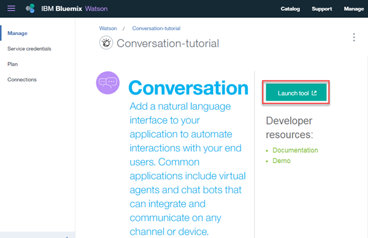
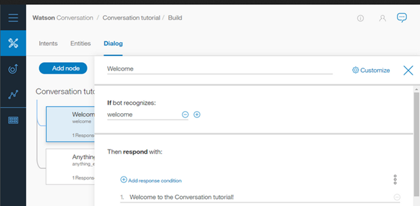
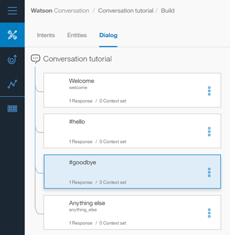

---

copyright:
  years: 2015, 2017
lastupdated: "2017-08-10"

---

{:shortdesc: .shortdesc}
{:new_window: target="_blank"}
{:tip: .tip}
{:pre: .pre}
{:codeblock: .codeblock}
{:screen: .screen}
{:javascript: .ph data-hd-programlang='javascript'}
{:java: .ph data-hd-programlang='java'}
{:python: .ph data-hd-programlang='python'}
{:swift: .ph data-hd-programlang='swift'}

# Lernprogramm 'Einführung'
{: #gettingstarted}

In diesem kurzen Lernprogramm stellen wir Ihnen das {{site.data.keyword.conversationshort}}-Tool vor und führen Sie durch die Erstellung Ihres ersten Dialogs.
{: shortdesc}

## Vorbemerkungen
{: #prerequisites}

Falls Sie bereits eine Serviceinstanz erstellt haben, sind alle Voraussetzungen vorhanden. Fahren Sie mit Schritt 1 fort.
{: tip}

1.  Rufen Sie den Service [{{site.data.keyword.conversationshort}} ](https://console.{DomainName}/catalog/services/conversation/){: new_window} auf und registrieren Sie sich für ein kostenloses {{site.data.keyword.Bluemix_notm}}-Konto oder melden Sie sich an.
1.  Geben Sie nach der Anmeldung `conversation-tutorial` im Feld **Servicename** der Seite '{{site.data.keyword.conversationshort}}' ein und klicken Sie auf **Erstellen**.

## Schritt 1: Tool starten
{: #launch-tool}

Nachdem Sie die Serviceinstanz erstellt haben, wird das Dashboard für die Instanz aufgerufen. Starten Sie von dort aus das {{site.data.keyword.conversationshort}}-Tool.

Klicken Sie auf **Verwalten** und danach auf **Starttool**.

Sie werden eventuell aufgefordert, sich gesondert beim Tool anzumelden. Geben Sie in diesem Fall zur Anmeldung Ihre IBM Bluemix-Berechtigungsnachweise an.

## Schritt 2: Arbeitsbereich erstellen
{: #create-workspace}

Ihr erster Schritt mit dem {{site.data.keyword.conversationshort}}-Tool ist die Erstellung eines Arbeitsbereichs.

Ein [*Arbeitsbereich*](configure-workspace.html) ist ein Container für die Artefakte, die den Dialogablauf definieren.

1.  Klicken Sie im {{site.data.keyword.conversationshort}}-Tool auf **Erstellen**.
1.  Benennen Sie Ihren Arbeitsbereich mit `Conversation tutorial` und klicken Sie auf **Erstellen**. Anschließend wird die Registerkarte **Absichten** Ihres neuen Arbeitsbereichs angezeigt.

## Schritt 3: Absichten erstellen
{: #create-intents}

Eine [Absicht](intents.html) gibt den Zweck für die Eingabe eines Benutzers an. Absichten sind in etwa mit den Aktionen vergleichbar, die Benutzer mit einer Anwendung ausführen.

In diesem Beispiel werden der Einfachheit halber nur zwei Absichten definiert, eine für die Begrüßung und eine für die Verabschiedung.

1.  Vergewissern Sie sich, dass die Registerkarte 'Absichten' angezeigt wird. (Falls Sie den Arbeitsbereich gerade erstellt haben, sollte dies schon der Fall sein.)
1.  Klicken Sie auf **Neue erstellen**.
1.  Benennen Sie die Absicht mit `hello`.
1.  Geben Sie `hello` als **Benutzerbeispiel** ein und drücken Sie die Eingabetaste.

   *Beispiele* teilen dem Service '{{site.data.keyword.conversationshort}}' mit, welche Arten von Benutzereingaben mit der Absicht übereinstimmen sollen. Je mehr Beispiele Sie angeben, desto genauer kann der Service die Benutzerabsichten erkennen.
1.  Fügen Sie vier weitere Beispiele hinzu und klicken Sie auf **Fertig**, um die Erstellung der Absicht '#hello' abzuschließen:
    - `good morning`
    - `greetings`
    - `hi`
    - `howdy`

   

1.  Erstellen Sie eine weitere Absicht namens '#goodbye' mit diesen fünf Beispielen:
    - `bye`
    - `farewell`
    - `goodbye`
    - `I'm done`
    - `see you later`

Sie haben zwei Absichten ('#hello' und '#goodbye') erstellt und Beispiele für Benutzereingaben angegeben, um {{site.data.keyword.watson}} für die Erkennung dieser Absichten in der Eingabe Ihrer Benutzer zu trainieren.

## Schritt 4: Dialogmodul erstellen
{: #build-dialog}

Ein [Dialogmodul](dialog-build.html) definiert den Ablauf des Dialogs in Form einer logischen Baumstruktur. Für jeden Knoten der Baumstruktur gibt es eine Bedingung, die ihn auf Basis der Benutzereingabe auslöst.

Sie erstellen jetzt ein einfaches Dialogmodul, das die Absichten '#hello' und '#goodbye' jeweils mit einem einzigen Knoten abwickelt. 

### Startknoten hinzufügen

1.  Klicken Sie im {{site.data.keyword.conversationshort}}-Tool auf die Registerkarte **Dialogmodul**.
1.  Klicken Sie auf **Erstellen**. Es werden zwei Knoten angezeigt:
    - **Welcome**: Enthält eine Begrüßung, die für Ihre Benutzer angezeigt wird, wenn sie den Bot aktivieren.
    - **Anything else**: Enthält Ausdrücke, die als Antworten für die Benutzer ausgegeben werden, wenn ihre Eingabe nicht erkannt wird.

    
1.  Klicken Sie auf den Knoten **Welcome**, um ihn in der Editoransicht zu öffnen. 
1.  Ersetzen Sie die Standardantwort durch den Text `Welcome to the Conversation tutorial!`

    
1.  Klicken Sie auf , um die Bearbeitungsansicht zu schließen.

Sie haben jetzt einen Dialogmodulknoten erstellt, der durch die Bedingung `welcome` ausgelöst wird. Dies ist eine Sonderbedingung, die angibt, dass ein Benutzer einen neuen Dialog gestartet hat. Ihr Knoten gibt an, dass das System beim Beginn eines neuen Dialogs mit der Willkommensnachricht antworten soll.

### Startknoten testen

Sie können Ihr Dialogmodul jederzeit testen, um es zu überprüfen. Diesen Test führen Sie jetzt aus.

- Klicken Sie auf das Symbol , um das Fenster 'Ausprobieren' zu öffnen. Daraufhin sollte Ihre Willkommensnachricht angezeigt werden.

    

### Knoten zur Verarbeitung von Absichten hinzufügen

Als Nächstes fügen Sie zwischen dem Knoten `Welcome` und dem Knoten `Anything else` weitere Knoten zur Verarbeitung von Absichten hinzu.

1.  Klicken Sie auf das Symbol 'Mehr'  im Knoten **Welcome** und wählen Sie dann die Option **Knoten darunter hinzufügen** aus.
1.  Geben Sie die Zeichenfolge `#hello` im Feld **Bedingung eingeben** für diesen Knoten ein. Wählen Sie anschließend die Option **#hello** aus.
1.  Fügen Sie die Antwort `Good day to you.` hinzu.
1.  Klicken Sie auf , um die Bearbeitungsansicht zu schließen.

   
1.  Klicken Sie auf das Symbol 'Mehr'  in diesem Knoten und wählen Sie dann die Option **Knoten darunter hinzufügen** aus. Geben Sie beim Peerknoten die Bedingung `#goodbye` an und als Antwort `OK. See you later!` ein.

    

### Erkennung der Absicht testen

Sie haben ein einfaches Dialogmodul erstellt, um Eingaben für die Begrüßung und die Verabschiedung zu erkennen und darauf zu antworten. Nun ermitteln Sie, wie gut es funktioniert.

1.  Klicken Sie auf das Symbol , um das Fenster 'Ausprobieren' zu öffnen. Dort wird Ihre Willkommensnachricht angezeigt.
1.  Geben Sie unten im Fenster das Wort `Hello` ein und drücken Sie die Eingabetaste. Die Ausgabe macht deutlich, dass die Absicht '#hello' erkannt wurde, und die passende Antwort (`Good day to you.`) wird angezeigt.
1.  Testen Sie die folgenden Eingaben:
    - `bye`
    - `howdy`
    - `see ya`
    - `good morning`
    - `sayonara`

   

{{site.data.keyword.watson}} kann Ihre Absichten sogar dann erkennen, wenn die Eingabe nicht exakt mit den von Ihnen aufgenommenen Beispielen übereinstimmt. Das Dialogmodul ermittelt anhand von Absichten den Zweck der Benutzereingabe unabhängig vom eigentlichen Wortlaut und antwortet dann auf die von Ihnen vorgegebene Weise.

### Ergebnis der Dialogmodulerstellung

Das war's schon. Sie haben einen einfachen Dialog mit zwei Absichten und ein Dialogmodul zu ihrer Erkennung erstellt.

## Schritt 5: Beispielarbeitsbereich prüfen
{: #review-sample-workspace}

Im Beispielarbeitsbereich können Sie sich ähnliche wie die gerade von Ihnen erstellten Absichten und viele weitere Absichten sowie ihre Verwendung in einem komplexen Dialogmodul ansehen.

1.  Rufen Sie wieder die Seite 'Arbeitsbereiche' auf.
   Hierzu können Sie im Navigationsmenü auf die Schaltfläche  klicken.
1.  Klicken Sie auf der Kachel mit dem Arbeitsbereich **Car Dashboard - Sample** auf die Schaltfläche **Beispiel bearbeiten**.

    

## Nächste Schritte
{: #next-steps}

Dieses Lernprogramm hat ein einfaches Beispiel behandelt. Für eine echte Anwendung müssen Sie einige weitere relevante Absichten, einige Entitäten und ein komplexeres Dialogmodul erstellen.

- Probieren Sie das [Lernprogramm](tutorial.html) für Fortgeschrittene aus. Dort erfahren Sie, wie Sie Entitäten hinzufügen und den Zweck eines Benutzers abklären.
- Führen Sie die [Bereitstellung](deploy.html) Ihres Arbeitsbereichs durch, indem Sie ihn mit einer Front-End-Benutzerschnittstelle, einer Social-Media-Plattform oder einem Nachrichtenkanal verbinden.
- Probieren Sie die [Beispielapps](sample-applications.html) aus.
