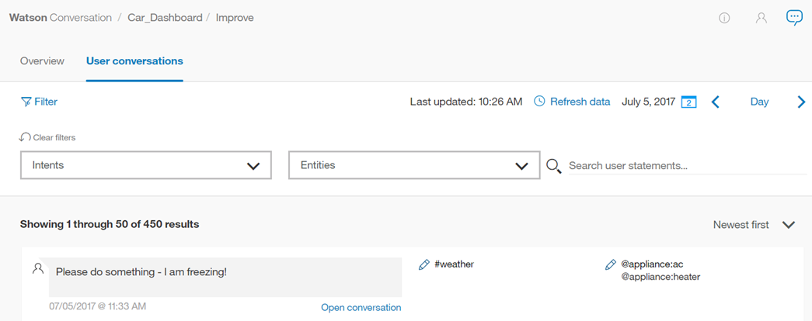
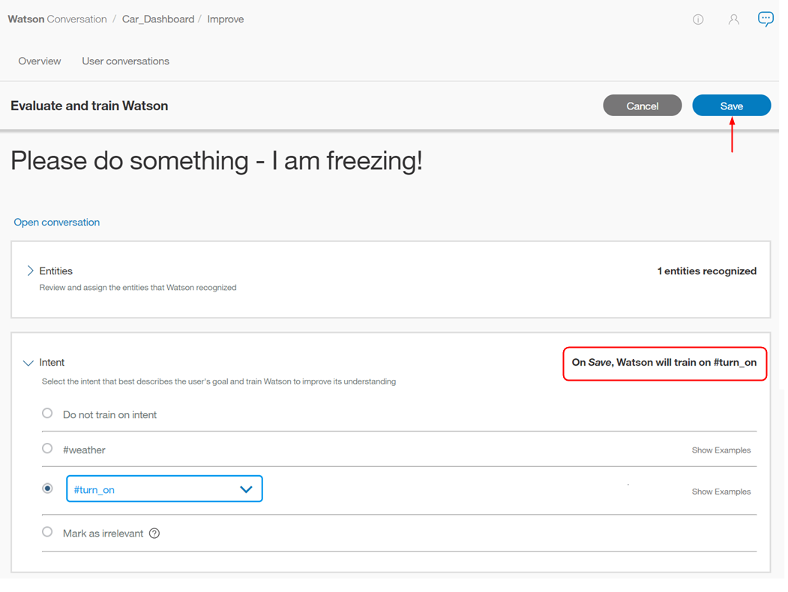
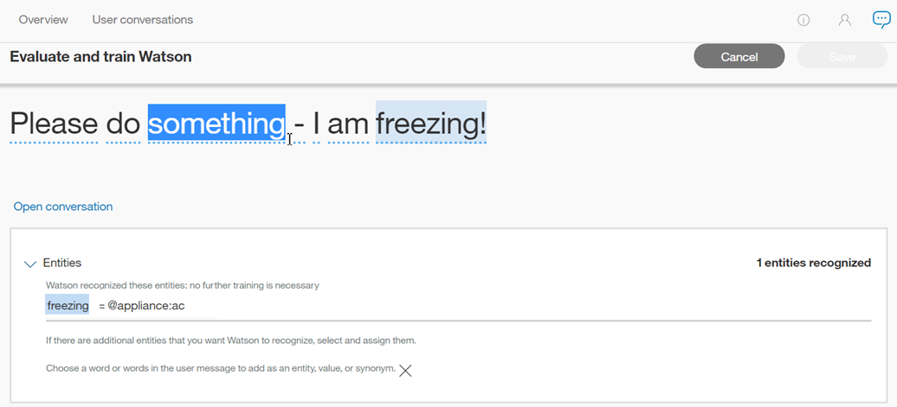

---

copyright:
  years: 2015, 2017
lastupdated: "2017-08-30"

---

{:shortdesc: .shortdesc}
{:new_window: target="_blank"}
{:tip: .tip}
{:pre: .pre}
{:codeblock: .codeblock}
{:screen: .screen}
{:javascript: .ph data-hd-programlang='javascript'}
{:java: .ph data-hd-programlang='java'}
{:python: .ph data-hd-programlang='python'}
{:swift: .ph data-hd-programlang='swift'}

# Mit Dialogen arbeiten
{: #logs_convo}

Um eine Liste der Interaktionen zwischen Benutzern und Ihrem Bot zu öffnen, wählen Sie in der Navigationsleiste die Option **Benutzerdialoge** aus. Falls die Option **Benutzerdialoge** nicht angezeigt wird, öffnen Sie die Seite über das Menü .
{: shortdesc}

Wenn Sie die Seite **Benutzerdialoge** öffnen, wird standardmäßig die Ansicht mit der Ergebnisliste für den letzten  Tag angezeigt; an erster Position befinden sich hierbei die neuesten Ergebnisse. Verfügbar sind die häufigsten Absichten (#intent), alle erkannten Entitätswerte (@entity), die in der Nachricht verwendet wurden, und der Nachrichtentext. Für nicht erkannte Absichten wird der Wert *Irrelevant* angezeigt. Falls eine Entität nicht erkannt oder nicht angegeben wurde, wird der Wert *Keine Entitäten gefunden* angezeigt.

## Begrenzungen für Protokolle
{: #log-limits}

Die Dauer des Zeitraums, für den Chatnachrichten aufbewahrt werden, richtet sich nach Ihrem {{site.data.keyword.conversationshort}}-Serviceplan:

  Serviceplan                          | Chatprotokollspeicherung
  ------------------------------------ | ------------------------------------
  Premium                              | Letzte 90 Tage
  Standard                             | Letzte 30 Tage
  Free                                 | Letzte 7 Tage

## Verbale Äußerungen filtern

Wichtig: Auf der Seite **Benutzerdialoge** wird die Gesamtzahl der *verbalen Äußerungen* zwischen Benutzern und Ihrem Bot angezeigt. Eine verbale Äußerung ist eine einzelne Nachricht, die ein Benutzer an den Bot sendet. Jeder Dialog kann aus vielen verbalen Äußerungen bestehen. Daher weicht die Zahl der Ergebnisse auf dieser Seite **Benutzerdialoge** von der Anzahl der Dialoge ab, die auf der Seite [Übersicht](logs_oview.html)  angezeigt wird.

Sie können verbale Äußerungen mithilfe der Optionen *Benutzeranweisungen suchen*, *Absichten*, *Entitäten* und *Letzte* n *Tage* filtern:

*Benutzeranweisungen suchen*: Geben Sie in der Suchleiste ein Wort ein. Dies durchsucht die Eingaben der Benutzer, jedoch nicht die Antworten des Bots.

*Absichten*: Wählen Sie das Dropdown-Menü aus und geben Sie im Eingabefeld eine Absicht ein oder treffen Sie eine Auswahl in der gefüllten Liste. Sie können mehrere Absichten auswählen, wodurch die Ergebnisse unter Verwendung aller ausgewählten Absichten gefiltert werden; die Auswahl von *Irrelevant* ist ebenfalls möglich.

*Entitäten*: Wählen Sie das Dropdown-Menü aus und geben Sie im Eingabefeld einen Entitätsnamen ein oder treffen Sie eine Auswahl in der gefüllten Liste. Sie können mehrere Entitäten auswählen, wodurch die Ergebnisse unter Verwendung aller ausgewählten Entitäten gefiltert werden. Falls Sie nach Absicht *und* Entität filtern, enthalten die Ergebnisse diejenigen Nachrichten, die beide Werte aufweisen. Sie können die Ergebnisse auch durch Auswahl von *Keine Entitäten gefunden* filtern.

Möglicherweise dauert es etwas, bis verbale Äußerungen aktualisiert werden. Warten Sie nach einer Benutzerinteraktion mit Ihrem Bot mindestens 30 Minuten, bevor Sie versuchen, eine Filterung für diesen Inhalt vorzunehmen.

## Einzelne verbale Äußerung anzeigen
Sie können jeden Eintrag für eine verbale Äußerung einblenden, um festzustellen, was der Benutzer im Dialog geäußert und wie der Bot geantwortet hat. Wählen Sie hierzu die Option **Dialog öffnen** aus. Sie werden in diesem Dialog automatisch zu der verbalen Äußerung geführt, die Sie ausgewählt haben.

Anschließend können Sie die Klassifizierung(en) für die ausgewählte verbale Äußerung anzeigen.

## Absicht korrigieren

1.  Um eine Absicht zu korrigieren, wählen Sie das Bearbeitungssymbol  neben der ausgewählten Absicht (#abc) aus.
1.  Wählen Sie in der angezeigten Liste die korrekte Absicht für diese Eingabe aus.
    - Beginnen Sie mit der Eingabe im Eingabefeld. Daraufhin wird die Liste der Absichten gefiltert.
    - In diesem Menü können Sie auch die Option **Als irrelevant markieren** auswählen. (Weitere Informationen enthält der Abschnitt [Als irrelevant markieren](intents.html#mark-irrelevant).) Sie können auch die Option **Nicht für Absicht trainieren** auswählen; in diesem Fall wird diese verbale Äußerung nicht als Beispiel für das Training gespeichert.

    
1.  Wählen Sie **Speichern** aus.

    

## Entitätswert oder Synonym hinzufügen

1.  Um einen Entitätswert oder ein Synonym hinzuzufügen, wählen Sie das Bearbeitungssymbol  neben der ausgewählten Entität (@xyz) aus.
1.  Wählen Sie **Entität hinzufügen** aus.

    
1.  Wählen Sie nun in der unterstrichenen Benutzereingabe ein Wort oder einen Ausdruck aus.

    
1.  Wählen Sie eine Entität aus, zu der der hervorgehobene Ausdruck als Wert hinzugefügt werden soll. 
    - Beginnen Sie mit der Eingabe im Eingabefeld. Daraufhin wird die Liste der Entitäten und Werte gefiltert.
    - Um den hervorgehobenen Ausdruck als Synonym für einen vorhandenen Wert hinzuzufügen, wählen Sie den Eintrag mit dem Format '@entität:wert' in der Dropdown-Liste aus.

    
1.  Wählen Sie **Speichern** aus.

    
