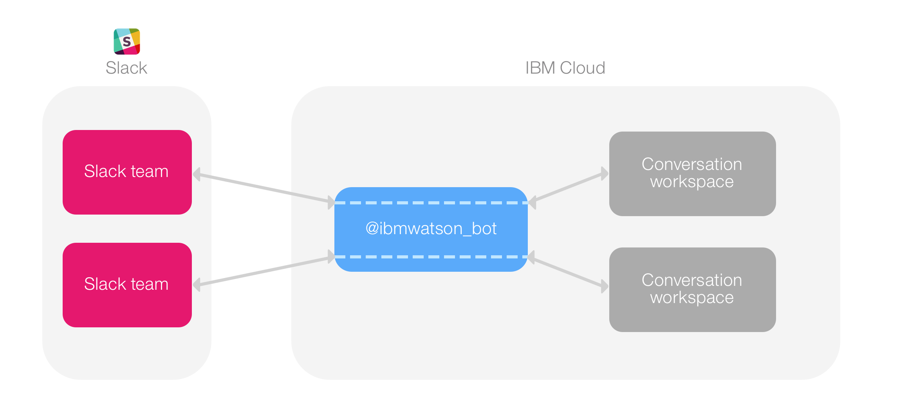

---

copyright:
  years: 2015, 2017
lastupdated: "2017-10-17"

---

{:shortdesc: .shortdesc}
{:new_window: target="_blank"}
{:tip: .tip}
{:pre: .pre}
{:codeblock: .codeblock}
{:screen: .screen}
{:javascript: .ph data-hd-programlang='javascript'}
{:java: .ph data-hd-programlang='java'}
{:python: .ph data-hd-programlang='python'}
{:swift: .ph data-hd-programlang='swift'}

# In Slack testen

Sie können das Testbereitstellungstool verwenden, um Ihren {{site.data.keyword.conversationshort}}-Arbeitsbereich als Botbenutzer in einem Slack-Team zu integrieren. Dieses Verfahren ist geeignet, wenn Sie einen Slack-Bot als Benutzerschnittstelle für Ihren Arbeitsbereich testen wollen.

Das Testbereitstellungstool verwendet den Service '{{site.data.keyword.openwhisk}}', um eine vordefinierte Slack-Anwendung als Botbenutzer für Ihr Team bereitzustellen. Diese Anwendung verarbeitet die Kommunikation mit Ihren Conversation-Arbeitsbereichen.



Das Testbereitstellungstool ist jedoch mit einigen Einschränkungen verbunden:

- Sie können dieses Tool nicht verwenden, um eine Anwendung zur Verwendung durch andere Teams zu veröffentlichen.
- Falls Sie mit diesem Verfahren mehrere Arbeitsbereiche für dasselbe Team bereitstellen, reagieren alle Arbeitsbereiche auf den Benutzernamen `@ibmwatson_bot`. Es empfiehlt sich, mit diesem Tool jeweils nur einen einzigen Arbeitsbereich für ein bestimmtes Slack-Team bereitzustellen.
- Sie müssen berechtigt sein, Apps für Ihr Slack-Team zu installieren. Erkundigen Sie sich bei Ihrem Slack-Administrator, wenn Sie nicht sicher sind, ob Sie diese Berechtigung besitzen.
- Die vordefinierte Slack-Anwendung dient ausschließlich zu Testzwecken und ist möglicherweise nicht jederzeit verfügbar.
- Aufgrund von Einschränkungen für {{site.data.keyword.openwhisk_short}} ist dieses Tool gegenwärtig nur für die {{site.data.keyword.Bluemix_notm}}-Region 'US South' verfügbar.

So installieren Sie Ihre Anwendung als Botbenutzer:

1. Öffnen Sie den Arbeitsbereich, den Sie in Slack testen wollen, im {{site.data.keyword.conversationshort}}-Tool.
1. Klicken Sie auf das Menüsymbol in der linken oberen Ecke und wählen Sie die Option **Bereitstellen** aus. Daraufhin wird die Seite 'Bereitstellungsoptionen' geöffnet.

   

1. Klicken Sie unter **Mit Cloud Functions bereitstellen** auf **In Slack testen** und befolgen Sie die Anweisungen.

   

## Mit dem Bot chatten

Nachdem Sie den Bereitstellungsprozess abgeschlossen haben, können Sie unter dem Benutzernamen `@ibmwatson_bot` mit Ihrem {{site.data.keyword.conversationshort}}-Arbeitsbereich wie mit jedem anderen Slack-Bot interagieren.

Denken Sie daran, dass der Bot, den Sie für Ihr Team bereitgestellt haben, den Status für jeden Benutzer in einem bestimmten Kanal beibehält. Dies bedeutet, dass alle Variablen, die Sie im Dialogmodulkontext speichern, unbegrenzt erhalten bleiben, bis sie von Ihrem Dialogmodul gelöscht werden.

Falls Sie in der Lage sein müssen, den Dialog auf einen bekannten Anfangsstatus zurückzusetzen, müssen Sie innerhalb des Dialogmoduls dafür sorgen. Achten Sie darauf, dass Ihr Dialogmodul einen Knoten enthält, der am Ende des Dialogs bzw. zu einem anderen Zeitpunkt ausgeführt wird, an dem Sie von vorne beginnen wollen. Aktualisieren Sie die JSON-Daten für diesen Knoten so, dass alle Kontextvariablen auf die entsprechenden Anfangswerte zurückgesetzt werden. (Bei Bedarf können Sie diesen Knoten mit Aktionen **Springen zu** oder einer speziellen Absicht 'dialog_beenden' ausführen.)

Beispiel: Ihr Arbeitsbereich verwendet eine Kontextvariable namens `drink_order`, um die Getränkeauswahl eines Benutzers zu speichern. Mit der Methode `context.remove` können Sie diese Variable löschen, wenn der Dialog beendet wird:

```json
"context": {
   "reset_drink_order": "<?context.remove('drink_order')?>"
 }
```
{: codeblock}

Weitere Informationen zum Ändern von Werten für Kontextvariablen finden Sie unter [Wert einer Kontextvariablen aktualisieren](dialog-build.html#updating-a-context-variable-value).

**Hinweis:** Nachdem Sie den Test Ihres Arbeitsbereichs beendet haben, können Sie die Testbereitstellung löschen, indem Sie erneut das Testbereitstellungstool aufrufen und dort auf **Test löschen** klicken. Denken Sie daran, dass Sie die Berechtigung für die Botanwendung in Ihrem Slack-Team gesondert widerrufen müssen.
