---

copyright:
  years: 2015, 2017
lastupdated: "2017-10-19"

---

{:shortdesc: .shortdesc}
{:new_window: target="_blank"}
{:tip: .tip}
{:pre: .pre}
{:codeblock: .codeblock}
{:screen: .screen}
{:javascript: .ph data-hd-programlang='javascript'}
{:java: .ph data-hd-programlang='java'}
{:python: .ph data-hd-programlang='python'}
{:swift: .ph data-hd-programlang='swift'}

# Creación de un diálogo
{: #dialog-build}

El diálogo utiliza las intenciones y entidades que se identifican en la entrada del usuario, además del contexto de la aplicación, para interactuar con el usuario y finalmente proporcionar una respuesta útil.
{: shortdesc}

La respuesta puede ser la respuesta a una pregunta como `¿Dónde puedo poner gasolina?` o la ejecución de un mandato, como encender la radio. La intención y la entidad podrían ser suficiente información para determinar la respuesta correcta, o puede que el diálogo solicite al usuario para más información que necesita para responder correctamente. Por ejemplo, si un usuario pregunta "¿Dónde puedo comprar comida?" es posible que desee aclarar si busca un restaurante o una tienda de comestibles, para cenar o para llevar, etc. Puede pedir más detalles en una respuesta de texto y crear uno o varios nodos hijo para procesar la nueva entrada.

<iframe class="embed-responsive-item" id="youtubeplayer" type="text/html" width="640" height="390" src="https://www.youtube.com/embed/oQUpejt6d84?rel=0" frameborder="0" webkitallowfullscreen mozallowfullscreen allowfullscreen> </iframe>

## Visión general del diálogo
{: #overview}

El diálogo se representa gráficamente en la herramienta como un árbol. Cree una rama para procesar cada intención que desea que maneje la conversación. Una rama se compone de varios nodos.

### Nodos del diálogo

Cada nodo del diálogo contiene, como mínimo, una condición y una respuesta.

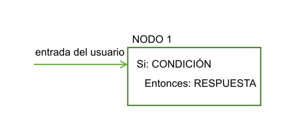

- Condición: Especifica la información que debe aparecer en la entrada del usuario para este nodo en el diálogo que se va a activar. La información puede ser una intención específica, un valor de entidad o un valor de variable de contexto. Consulte [Condiciones](#conditions) para obtener más información.
- Respuesta: La expresión que el servicio utiliza para responder al usuario. La respuesta también puede configurarse para que active acciones programáticas. Consulte [Respuestas](#responses) para obtener más información.

Puede pensar en el nodo como si tuviera una construcción de tipo si/entonces (if/then): si esta condición se cumple, entonces devolver esta respuesta.

Por ejemplo, el siguiente nodo se activa si la función de proceso de lenguaje natural del servicio determina que la entrada de usuario contiene la intención `#cupcake-menu`. Como consecuencia de que se active el nodo, el servicio responde con una respuesta adecuada.

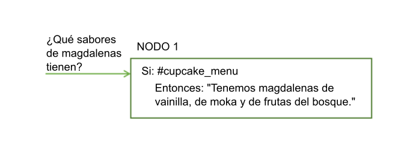

Un solo nodo con una condición y respuesta puede gestionar solicitudes sencillas de usuario. Pero generalmente los usuarios tienen preguntas más sofisticadas o desean ayuda con tareas más complejas. Puede añadir nodos hijo que soliciten al usuario que proporcione cualquier información adicional que necesita el servicio.

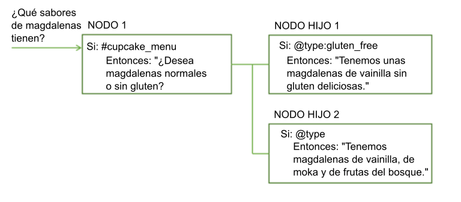

### Flujo del diálogo

El servicio procesa el diálogo que cree de arriba a abajo.

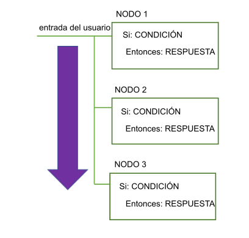

A medida que baja por el árbol, si el servicio encuentra una condición que se cumple, activa dicho nodo. Luego se mueve de izquierda a derecha en el nodo activado para comparar la entrada del usuario con las condiciones de los nodos hijo. Cuando consulta los nodos hijo, se mueve de nuevo de arriba a abajo.

Los servicios siguen funcionando de esta forma a lo largo del árbol del diálogo de arriba a abajo, de izquierda a derecha y luego de arriba a abajo y de izquierda a derecha hasta alcanzar el último nodo de la rama que se está siguiendo.

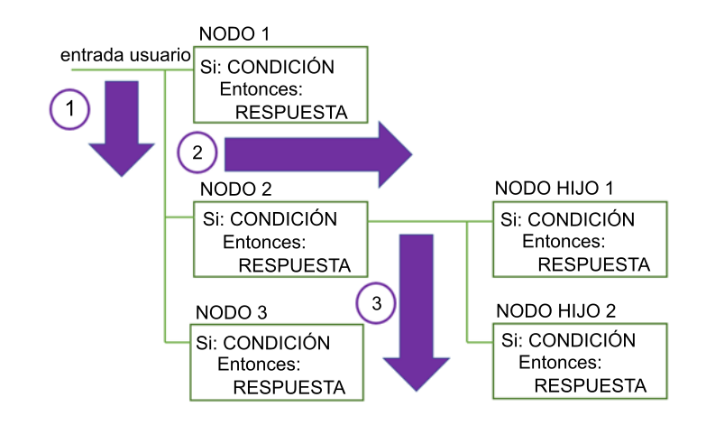

Cuando empiece a crear el diálogo, debe determinar las ramas para desea incluir y dónde colocarlas. El orden de las ramas es importante porque los nodos se evalúan de arriba a abajo. Se utiliza el primer nodo base cuya condición coincida con la entrada; los nodos que hay por debajo del árbol no se activan.

## Condiciones
{: #conditions}

Una condición de nodo determina si el nodo se utiliza en la conversación. Las condiciones de respuesta determinan qué respuesta se debe mostrar al usuario.
Puede utilizar uno o varios de los siguientes artefactos en cualquier combinación para definir una condición:

- **Variable de contexto**: El nodo se utiliza si la expresión de la variable de contexto que especifique es verdadera. Utilice la sintaxis `$variable_name:value` o `$variable_name == 'value'`. Consulte [Variables de contexto](#context).

  No defina un nodo o condición de respuesta en función del valor de una variable de contexto en el mismo nodo del diálogo en el que ha establecido el valor de la variable de contexto.
  {: tip}

- **Entidad**: El nodo se utiliza cuando cualquier valor o sinónimo de la entidad se reconoce en la entrada de usuario. Utilice la sintaxis `@entity_name`. Por ejemplo, `@city`.

  Asegúrese de crear un nodo igual para manejar los casos en los que no se reconoce ninguno de los valores o sinónimos de la entidad.
  {: tip}

- **Valor de entidad**: El nodo se utiliza si se detecta el valor de entidad en la entrada de usuario. Utilice la sintaxis `@entity_name:value`. Por ejemplo: `@city:Boston`. Especifique un valor definido para la entidad, no un sinónimo.

  Si comprueba la presencia de la entidad, sin especificar un valor en particular para la misma, en un nodo igual, asegúrese de colocar por encima el nodo que comprueba este valor de entidad en particular.
{: tip}

- **Intención**: La condición más sencilla es una sola intención. El nodo se utiliza si la entrada del usuario se correlaciona con dicha intención. Utilice la sintaxis `#intent-name`. Por ejemplo, `#weather` comprueba si la intención detectada en la entrada de usuario es `weather`. Si es así, el nodo se procesa.

- **Condición especial**: Condiciones que se proporcionan con el servicio y que puede utilizar para realizar funciones comunes de diálogo.

  <table>
  <tr>
    <td>Nombre de condición</td>
    <td>Descripción</td>
  </tr>
  <tr>
    <td>anything_else</td>
    <td>Puede utilizar esta condición al final de un diálogo para que se procese cuando la entrada de usuario no coincida con ningún otro nodo del diálogo. Esta condición activa el nodo **Anything else**.</td>
  </tr>
  <tr>
    <td>conversation_start</td>
    <td>Al igual que **welcome**, esta condición se evalúa como verdadera durante la primera ronda del diálogo. A diferencia de **welcome**, es verdadera tanto si la solicitud inicial de la aplicación contiene la entrada de usuario como si no. Se puede utilizar un nodo con la condición **conversation_start** para inicializar variables de contexto o para realizar otras tareas al principio del diálogo.</td>
  </tr>
  <tr>
    <td>false</td>
    <td>Esta condición siempre se evalúa como falsa. Puede utilizarla al principio de una rama que esté en proceso de desarrollo para impedir que se utilice, o como condición para un nodo que proporciona una función común y solo se utiliza como destino de una acción **Ir a**.</td>
  </tr>
  <tr>
    <td>irrelevant</td>
    <td>Esta condición se evaluará como verdadera si el servicio Conversation determina que la entrada del usuario es irrelevante.</td>
  </tr>
  <tr>
    <td>true</td>
    <td>Esta condición siempre se evalúa como verdadera. Puede utilizarla al final de una lista de nodos o respuestas para detectar las respuestas que no coincide con ninguna de las condiciones anteriores.</td>
  </tr>
  <tr>
    <td>welcome</td>
    <td>Esta condición se evalúa como verdadera durante la primera vuelta del diálogo (cuando se inicia la conversación), solo si la solicitud inicial procedente de la aplicación no contiene ninguna entrada de usuario. Se evalúa como falsa en todas las demás rondas del diálogo. Esta condición activa el nodo **Welcome**. Normalmente se utiliza un nodo con esta condición para saludar al usuario, por ejemplo para mostrar un mensaje como "Bienvenido a nuestra app para pedir pizzas".</td>
  </tr>
  </table>

### Sintaxis de la condición

Utilice una de estas opciones sintaxis para crear expresiones válidas en condiciones:

- Lenguaje Spring Expression (SpEL), que es un lenguaje de expresión que da soporte a la consulta y manipulación de un gráfico de objetos en el momento de la ejecución. Consulte [Lenguaje Spring Expression Language (SpEL) ](http://docs.spring.io/spring/docs/current/spring-framework-reference/html/expressions.html){: new_window} para obtener más información.

- Claves de notaciones para hacer referencia a intenciones, entidades y variables de contexto. Consulte [Acceso y evaluación de objetos](expression-language.html).

Utilice expresiones regulares para comprobar los valores con los que comparar la condición.  Para encontrar una serie coincidente, por ejemplo, puede utilizar el método `String.find`. Consulte [Métodos](dialog-methods.html) para obtener más detalles.

### Sugerencias sobre el uso de condiciones

- Si solo desea evaluar el valor de la primera instancia detectada de un tipo de entidad, puede utilizar la sintaxis `@entity == 'specific-value'` en lugar del formato `@entity:(specific-value)`. Por ejemplo, si utiliza `@appliance == 'air conditioner'`, se evalúa solo el valor de la primera entidad `@appliance` detectada. Pero, si utiliza `@appliance:(air conditioner)`, se expande a `entity['appliance'].contains('air conditioner')`, que coincide siempre que se detecta al menos una entidad `@appliance` con el valor 'air conditioner' en la entrada de usuario.
- Cuando utilice variables numéricas, asegúrese de que las variables tengan valores. Si una variable no tiene un valor, se trata como si tuviera un valor nulo (0) en una comparación numérica. Por ejemplo, si comprueba el valor de una variable con la condición `@price < 100`, y la entidad @price es nula, la condición se evalúa como `true` porque 0 es menor que 100, aunque nunca se haya definido el precio. Para evitar la comprobación de variables nulas, utilice una condición como `@price AND @price < 100`. Si @price no tiene ningún valor, esta condición devuelve correctamente false.
- Si utiliza una entidad como condición y la coincidencia aproximada está habilitada, `@entity_name` se evalúa como true solo si la confianza de la coincidencia es mayor que 30%. Es decir, solo si `@entity_name.confidence > .3`.

## Respuestas
{: #responses}

La respuesta del diálogo define cómo responder al usuario.

Puede responder con uno de estos tipos de respuesta:

- [Respuesta de texto simple](#simple-text)
- [Varias respuestas condicionadas](#multiple)
- [Respuesta compleja](#complex)

### Respuesta de texto simple
{: #simple-text}

Si desea proporcionar una respuesta de texto, simplemente especifique el texto que desea que el servicio muestre al usuario.


#### Adición de una variedad
{: #variety}

Si los usuarios vuelven con frecuencia a su servicio de conversación, es posible que se cansen de escuchar siempre el mismo saludo y las mismas respuestas.  Puede añadir *variaciones* a las respuestas para que la conversación puede responder a la misma condición de diferentes maneras.

<iframe class="embed-responsive-item" id="youtubeplayer" type="text/html" width="640" height="390" src="https://www.youtube.com/embed/nAlIW3YPrAs?rel=0" frameborder="0" webkitallowfullscreen mozallowfullscreen allowfullscreen> </iframe>

En este ejemplo, la respuesta que proporciona el servicio en respuesta a las preguntas sobre las ubicaciones de las tiendas difiere entre una interacción y la siguiente:

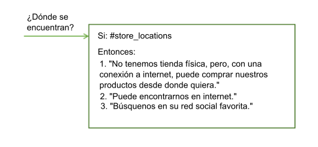

Puede optar por rotar entre las variaciones de respuestas secuencialmente o en orden aleatorio. De forma predeterminada, las respuestas se rotan secuencialmente, como si fueran seleccionadas en una lista ordenada.

### Respuestas condicionadas
{: #multiple}

Un solo nodo de diálogo puede proporcionar distintas respuestas, cada uno activada por una condición diferente.  Utilice este enfoque para abordar varios escenarios en un solo nodo.

<iframe class="embed-responsive-item" id="youtubeplayer" type="text/html" width="640" height="390" src="https://www.youtube.com/embed/KcvVQAsnhLM?rel=0" frameborder="0" webkitallowfullscreen mozallowfullscreen allowfullscreen> </iframe>

El nodo sigue teniendo una condición principal, que es la condición para utilizar el nodo y procesar las condiciones y respuestas que contiene.

En este ejemplo, el servicio utiliza la información recopilada anteriormente sobre la ubicación del usuario para adaptar su respuesta y proporcionar información sobre la tienda más cercana al usuario. Consulte [Variables de contexto](#context) para obtener más información sobre cómo almacenar la información recopilada por el usuario.


Este nodo único ahora proporciona la función equivalente de cuatro nodos separados.

Las condiciones de un nodo se evalúan en orden, como lo hacen los nodos.  Asegúrese de que sus condiciones y las respuestas aparecen listadas en el orden correcto.  Si necesita cambiar el orden, seleccione una condición y súbala o bájela en la lista utilizando las flechas que aparecen. Si desea actualizar el contexto, debe hacerlo en cada respuesta individual.  No hay una sección de respuesta común. La acción **Ir a** se procesa después de que se seleccione y se distribuya una respuesta. Si añade una acción **Ir a**, esta se ejecuta después de cualquier respuesta que devuelva el nodo.
{: tip}

### Una respuesta compleja
{: #complex}

Para especificar una respuesta más compleja, puede utilizar el editor de JSON para especificar la respuesta en la propiedad `"output":{}`.

Para incluir un valor de variable de contexto en la respuesta, utilice la sintaxis `$variable-name` para especificarlo. Consulte [Variables de contexto](#context) para obtener más información.

```json
{
  "output": {
    "text": "Hello $user"
  }
}
```
{: codeblock}

Para especificar más de una sentencia que desea visualizar en líneas separadas, defina la salida como una matriz JSON.

```json
{
  "output": {
    "text": ["Hello there.", "How are you?"]
  }
}
```
{: codeblock}

La primera frase se muestra en una línea, y la segunda frase se muestra como una línea nueva debajo de la anterior.

Para implementar un comportamiento más complejo, puede definir el texto de salida como un objeto JSON complejo. Por ejemplo, puede utilizar un objeto complejo en la salida de JSON para imitar el comportamiento de añadir variaciones respuesta al nodo. Puede incluir las siguientes propiedades en el objeto complejo:

- **values**: Una matriz JSON de series que contiene varias versiones de texto de salida que puede devolver este nodo de diálogo. El orden en el que se devuelven los valores de la matriz depende del atributo `selection_policy`.

- **selection_policy**: Se aceptan los siguientes valores:

    - **ramdom**: El sistema selecciona aleatoriamente texto de salida de la matriz `values` y no los repite consecutivamente. Por ejemplo, supongamos que output.text contiene tres valores. Las tres primeras veces se selecciona un valor aleatorio, pero no se repite otra vez. Una vez suministrados todos los valores de salida, el sistema selecciona aleatoriamente otro valor y repite el proceso.

        ```json
        {
            "output":{
                "text":{
                    "values":["Hello.","Hi.","Howdy!"],
                    "selection_policy":"random"
                }
            }
        }
        ```
        {: codeblock}

    El sistema devuelve un saludo de entre estas tres opciones, que escoge al azar. La siguiente vez que se activa la respuesta, se muestra otro saludo de la lista. El saludo se elige de nuevo de manera aleatoria, excepto en que el saludo utilizado anteriormente no se repite intencionadamente.

    - **sequential**: El sistema devuelve el primer texto de salida la primera vez que se activa el nodo del diálogo, el segundo texto de salida la segunda vez que se activa el nodo, y así sucesivamente.

        ```json
        {
            "output":{
                "text":{
                    "values":["Hello.", "Hi.", "Howdy!"],
                    "selection_policy":"sequential"
                }
            }
        }
        ```
        {: codeblock}

- **append**: Especifica si se debe añadir un valor a una matriz o se deben sobrescribir los valores de la matriz con el nuevo valor o valores. Cuando se establece en false, la salida recopilada en los nodos de diálogo ejecutados anteriormente se sobrescribe con el valor de texto especificado en este nodo particular.

    ```json
    {
        "output":{
            "text":{
                "values": ["Hello."],
                "append":false
            }
        }
    }
    ```
    {: codeblock}

    En este caso, el resto del texto de salida se sobrescribe con este texto de salida.

El comportamiento predeterminado es aceptar `selection_policy = random` y `append = true`. Cuando la matriz de valores contiene más de un elemento, el texto de salida se selecciona aleatoriamente entre sus elementos.

### Definición de lo que hay que hacer a continuación
{: #jump-to}

Después de ofrecer la respuesta especificada, puede indicar al servicio para haga una de estas cosas:

- **Esperar una entrada de usuario**: El servicio espera a que el usuario especifique una nueva entrada que obtiene la respuesta. Por ejemplo, la respuesta puede realizar al usuario una pregunta de tipo sí o no. El diálogo no avanzará hasta que el usuario proporcione más información.
- **Ir a otro nodo del diálogo**: Utilice esta opción cuando desee omitir la espera de información del usuario y desee que la conversación vaya directamente a los nodos hijo o un nodo de diálogo totalmente diferente. Puede utilizar una acción Ir apara dirigir el flujo a un nodo de diálogo común, por ejemplo desde varias ubicaciones del árbol.
  >Nota: El nodo de destino al que desea ir debe existir para configurar la opción Ir a para que lo utilice.

#### Configuración de la acción Ir a

Si elige ir a otro nodo, debe especificar si el destino de la acción es la **respuesta** o la **condición** del nodo de diálogo seleccionado

- **Respuesta**: Si el destino de la sentencia es la parte de respuesta del nodo de diálogo seleccionado, se ejecuta inmediatamente. Es decir, el sistema no evalúa la parte de la condición del nodo de diálogo seleccionado y ejecuta la parte de respuesta del nodo de diálogo seleccionado inmediatamente.

  Elegir la respuesta como destino resulta útil para encadenar varios nodos del diálogo. La parte de la respuesta del nodo de diálogo seleccionado se procesa como si la condición de este nodo de diálogo fuera true. Si el nodo del diálogo seleccionado tiene otra acción **Ir a**, dicha acción también se ejecuta inmediatamente.
- **Condición**: Si el destino de la sentencia es la parte de condición del nodo de diálogo seleccionado, el servicio comprueba primero si la condición del nodo de destino se evalúa como true.
    - Si la condición se evalúa como true, el sistema procesa este nodo inmediatamente actualizando el contexto con el contexto del nodo del diálogo y la salida con la salida del nodo del diálogo.
    - Si la condición no evalúa como true, el sistema continúa el proceso de evaluación de una condición del siguiente nodo hermano del nodo del diálogo de destino y así sucesivamente, hasta que encuentra un nodo del diálogo con una condición que se evalúa como true.
    - Si el sistema procesa todos los hermanos y ninguna condición se evalúa como true, se utiliza la estrategia básica de reserva y el diálogo evalúa también los nodos del nivel superior.

    Elegir la condición como destino resulta útil para encadenar las condiciones de los nodos del diálogo. Por ejemplo, supongamos que desea comprobar primero si la entrada contiene una intención, como por ejemplo `#turn_on`, y, si es así, es posible que desee comprobar si la entrada contiene entidades, como `@lights`, `@radio` o `@wipers`. El encadenamiento de condiciones ayuda a estructurar los árboles del diálogo.

**Nota**: El proceso de acciones **Ir a** ha cambiado con el release del 3 de febrero de 2017. Consulte [Actualización de su espacio de trabajo ](upgrading.html){: new_window} para obtener más detalles.

#### Más información

Para obtener información sobre el lenguaje de expresión que utiliza el diálogo, más métodos, entidades del sistema y otros detalles útiles, consulte la sección de referencia del panel de navegación.

## Variables de contexto
{: #context}

El diálogo no tiene estado, lo que significa que no retiene información entre un intercambio con el usuario y el siguiente. La aplicación es la responsable de mantener y dar continuidad a la información que necesita. Sin embargo, la aplicación puede pasar información al diálogo, y el diálogo puede actualizar esta información y pasarla a la aplicación. Lo hace mediante variables de contexto.

Una variable de contexto es una variable que el usuario define en un nodo y para la que puede especificar un valor predeterminado. Otros nodos o lógica de aplicación pueden establecer o cambiar posteriormente el valor de la variable de contexto. 

Puede definir una condición sobre valores de variables de contexto haciendo referencia a una variable de contexto desde una condición de nodo de diálogo para determinar si se debe ejecutar un nodo. Y puede hacer referencia a una variable de contexto desde condiciones de respuesta del nodo del diálogo para mostrar distintas respuestas, en función de un valor especificado por un servicio externo o por el usuario.

### Cómo pasar contexto desde la aplicación

Para pasar información de la aplicación al diálogo, defina una variable de contexto y pase la variable de contexto al diálogo.

Por ejemplo, la aplicación puede definir una variable de contexto $time_of_day y pasarla al diálogo, el cual puede utilizar la información para adaptar el saludo que muestra al usuario.

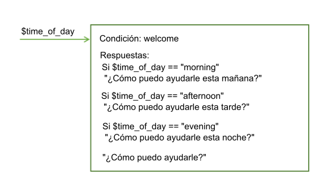

En este ejemplo, el diálogo sabe que la aplicación establece la variable a uno de estos valores: *morning*, *afternoon* o *evening*. Puede comprobar para cada valor, y, dependiendo del valor que encuentre, devolver el saludo adecuado. Si la variable no se pasa o tiene un valor que no coincide con ninguno de los valores esperados, se muestra al usuario un saludo más genérico.

### Cómo pasar contexto de nodo a nodo

El diálogo también puede añadir variables de contexto para pasar información de un nodo a otro o para actualizar los valores de las variables de contexto. Cuando el diálogo solicita y obtiene información del usuario, puede realizar un seguimiento de la información y hacer referencia a la misma más adelante en la conversación.

Por ejemplo, en un nodo puede preguntar a los usuarios cómo se llaman y en un nodo posterior dirigirse a ellos por su nombre.

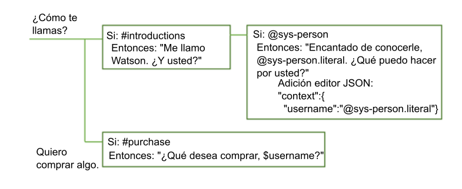

En este ejemplo, se utiliza la entidad del sistema @sys-person para extraer el nombre del usuario de la entrada si el usuario lo especifica. En el editor JSON, la variable de contexto username se define y se establece en el valor @sys-person. En un nodo posterior, se incluye la variable de contexto $username en la respuesta para dirigirse al usuario por su nombre.

### Definición de una variable de contexto

Para definir una variable de contexto, añada un par de `nombre` y `valor` a la sección `{context}` de la definición del nodo del diálogo JSON. El par debe cumplir estos requisitos:

- El `nombre` puede contener cualquier carácter alfabético en mayúsculas o minúsculas, caracteres numéricos (0-9) y signos de subrayado.

  **Nota**: Puede incluir otros caracteres en el nombre, como puntos y guiones. Sin embargo, si lo hace, debe utilizar uno de los siguientes métodos para hacer referencia a la variable:
  - context['variable-name']: The sintaxis completa de la expresión SpEL.
  - $(variable-name): sintaxis abreviada con el nombre de la variable especificado entre paréntesis.

  Consulte [Acceso y evaluación de objetos](expression-language.html#shorthand-syntax-for-context-variables) para ver más detalles.

- El `valor` puede ser cualquier tipo JSON soportado, como por ejemplo una variable de serie simple, un número, una matriz JSON o un objeto JSON.

En el siguiente ejemplo de JSON se definen valores para las variables de contexto de cadena $dessert, de matriz $toppings_array y de número $age:

```json
{
  "context": {
    "dessert": "ice-cream",
    "toppings_array": ["onion", "olives"],
    "age": 18
  }
}
```
{: codeblock}

Para definir una variable de contexto, siga estos pasos:

1.  En la vista de edición del nodo, abra el editor JSON pulsando el icono  y seleccionando **JSON**.

1.  Antes del bloque `"output":{}`, añada un bloque `"context":{}` si no hay ya uno.

    ```json
    {
      "context":{},
      "output":{}
    }
    ```
    {: codeblock}

1.  En el bloque de contexto, añada un par de nombre y valor para cada variable que desee definir.

    ```json
    {
      "context":{
        "name": "value"
    },
    ...
    }
    ```
    {: codeblock}

  Para hacer referencia posteriormente a la variable de contexto, utilice la sintaxis `$name`, donde *name* es el nombre de la variable de contexto que ha definido.

Otras tareas comunes son las siguientes:

- Para almacenar la serie completa que ha especificado el usuario, utilice `input.text`:

    ```json
    {
      "context": {
        "repeat": "<?input.text?>"
      }
    }
    ```
    {: codeblock}

- Para almacenar el valor de una entidad en una variable de contexto, utilice esta sintaxis:

    ```json
    {
      "context": {
        "place": "@place"
      }
    }
    ```
    {: codeblock}

- Para almacenar en una variable de contexto el valor de una serie que ha extraído de la entrada del usuario utilizando una expresión regular, utilice esta sintaxis:

    ```json
    {
      "context": {
         "number": "<?input.text.extract('^[^\\d]*[\\d]{11}[^\\d]*$',0)?>"
      }
    }
    ```
    {: codeblock}

- Para almacenar el valor de una entidad de patrón en una variable de contexto, añada .literal al nombre de la entidad. Con esta sintaxis se asegura de que en la variable se almacena el texto exacto de la entrada del usuario que coincide con el patrón especificado.

    ```json
    {
      "context": {
        "email": "@email.literal"
      }
    }
    ```
    {: codeblock}

### Orden de operación
{: #order-of-context-var-ops}

El orden en el que se definen las variables de contexto no determina el orden en el que las evalúa el servicio. El servicio evalúa las variables, que se definen como pares de nombre y valor de JSON, en orden aleatorio. No establezca un valor en la primera variable de contexto y espere poderlo utilizar en la segunda, ya que no hay ninguna garantía de que la primera variable de contexto de la lista se ejecute antes que la segunda de la lista. Por ejemplo, no utilice dos variables de contexto para implementar lógica que devuelva un número aleatorio comprendido entre cero y un valor superior que se pasa al nodo.

```json
"context": {
    "upper": "<? @sys-number.numeric_value + 1?>",
    "answer": "<? new Random().nextInt($upper) ?>"
}
```
{: codeblock}

Utilice una expresión ligeramente más compleja para no tener que depender de que el valor de la variable de contexto $upper se evalúe antes que la variable de contexto $answer.

```json
"context": {
    "answer": "<? new Random().nextInt(@sys-number.numeric_value + 1) ?>"
}
```
{: codeblock}

### Actualización de un valor de variable de contexto
{: #updating-a-context-variable-value}

Si un nodo establece el valor de una variable de contexto que ya está establecido, el valor anterior se sobrescribe.

#### Actualización de un objeto JSON complejo

Los valores anteriores se sobrescribe para todos los tipos de JSON, excepto para un objeto JSON. Si la variable de contexto es un tipo complejo como un objeto JSON, se utiliza un procedimiento de fusión de JSON para actualizar la variable. La operación de fusión añade las propiedades recién definidas y sobrescribe las propiedades existentes del objeto.

En este ejemplo, se define una variable de contexto de nombre como un objeto complejo.

```json
{
  "context": {
    ...
    "complex_object": {
      "user_firstname" : "Paul",
      "user_lastname" : "Pan"
      "has_card" : false
    }
  }
}
```
{: codeblock}

Un nodo de diálogo actualiza el objeto JSON de la variable de contexto con los valores siguientes:

```json
{
  "complex_object": {
    "user_firstname": "Peter",
    "has_card": true
  }
}
```
{: codeblock}

El resultado es este contexto:

```json
{
  "complex_object": {
    "user_firstname": "Peter",
    "user_lastname": "Pan",
    "has_card": true
  }
}
```
{: codeblock}

#### Actualización de matrices

Si los datos de contexto del diálogo contienen una matriz de valores, puede actualizar la matriz añadiendo valores, eliminando un valor o sustituyendo todos los valores.

Elija una de estas acciones para actualizar la matriz. En cada caso, vemos la matriz antes de la acción, la acción y la matriz después de que se haya aplicado la acción.

- **Append**: Para añadir valores al final de una matriz, utilice el método `append`.

    Para este contexto de tiempo de ejecución del diálogo:

    ```json
    {
      "context": {
        "toppings_array": ["onion", "olives"]
      }
    }
    ```
    {: codeblock}

    Realice esta actualización:

    ```json
    {
      "context": {
        "toppings_array": "<? $toppings_array.append('ketchup', 'tomatoes') ?>"
      }
    }
    ```
    {: codeblock}

    Resultado:

    ```json
    {
      "context": {
        "toppings_array": ["onion", "olives", "ketchup", "tomatoes"]
      }
    }
    ```
    {: codeblock}

- **Remove**: Para eliminar un elemento, utilice el método `remove` y especifique su valor o posición en la matriz.

    - **Remove by value** elimina un elemento de una matriz por su valor.

        Para este contexto de tiempo de ejecución del diálogo:

        ```json
        {
          "context": {
            "toppings_array": ["onion", "olives"]
          }
        }
        ```
        {: codeblock}

        Realice esta actualización:

        ```json
        {
          "context": {
            "toppings_array": "<? $toppings_array.removeValue('onion') ?>"
          }
        }
        ```
        {: codeblock}

        Resultado:

        ```json
        {
          "context": {
            "toppings_array": ["olives"]
          }
        }
        ```
        {: codeblock}

    - **Remove by position**: Eliminación de un elemento de la matriz por su posición de índice:

        Para este contexto de tiempo de ejecución del diálogo:

        ```json
        {
          "context": {
            "toppings_array": ["onion", "olives"]
          }
        }
        ```
        {: codeblock}

        Realice esta actualización:

        ```json
        {
          "context": {
            "toppings_array": "<? $toppings_array.remove(0) ?>"
          }
        }
        ```
        {: codeblock}

        Resultado:

        ```json
        {
          "context": {
            "toppings_array": ["olives"]
          }
        }
        ```
        {: codeblock}

- **Overwrite**: Para sobrescribir los valores de una matriz, simplemente establezca para la matriz los nuevos valores:

    Para este contexto de tiempo de ejecución del diálogo:

        ```json
        {
          "context": {
            "toppings_array": ["onion", "olives"]
          }
        }
        ```
        {: codeblock}

    Realice esta actualización:

        ```json
        {
          "context": {
            "toppings_array": ["ketchup", "tomatoes"]
          }
        }
        ```
        {: codeblock}

    Resultado:

        ```json
        {
          "context": {
            "toppings_array": ["ketchup", "tomatoes"]
          }
        }
        ```
        {: codeblock}

**Atención**: Si guarda la matriz como parte de una serie, se convierte en un objeto String en lugar de una matriz. Por ejemplo, la siguiente variable de contexto $array es una matriz, pero la variable de contexto $string_array es una serie (string).

```json
{
  "context": {
    "array": [
      "one",
      "two"
    ],
    "array_in_string": "this is my array: $array"
  }
}
```
{: codeblock}

Si selecciona los valores de estas variables de contexto en el panel Pruébelo, verá sus valores especificados de la siguiente manera:

**$array** : `["one","two"]`

**$array_in_string** : `"this is my array: [\"one\",\"two\"]"`

Luego puede ejecutar métodos de matriz sobre la variable $array, como `<? $array.removeValue('two') ?>` pero no sobre la variable $array_in_string.

## Creación de un diálogo
{: #create}

Utilice la herramienta {{site.data.keyword.conversationshort}} para crear un diálogo.

### Límites del nodo del diálogo
{: #dialog-node-limits}

El número de nodos de diálogo que puede crear depende de su plan de servicio.

| Plan de servicio     | Nodos de diálogo por espacio de trabajo |
|------------------|---------------------------:|
| Estándar/Premium |                    100.000 |
| Lite             |                     25.000 |

Límite de profundidad de árbol: El servicio da soporte a 2.000 nodos de diálogo descendientes; las herramientas funcionan mejor con 20 o menos.

### Procedimiento

Para crear un diálogo, siga estos pasos:

1.  Abra la página **Compilar** en la barra de navegación, pulse el separador **Diálogo** y pulse **Crear**.

    Cuando se abra el creador de diálogos por primera vez, se crean automáticamente los nodos siguientes:
    - **Welcome**: El primer nodo. Contiene un saludo que se muestra a los usuarios la primera vez que interactúan con el servicio. Puede editar el mensaje.
    - **Anything else**: El nodo final. Contiene frases que se utilizan para responder a los usuarios cuando no se reconoce la información que especifican. Puede sustituir las respuestas que se proporcionan o añadir más respuestas con un significado similar a añadir variedad a la conversación. También puede elegir si desea que el servicio para devuelva cada respuesta definida por orden o si desea devolverlas en orden aleatorio.
1.  Para añadir más nodos al árbol de diálogo, pulse **Más**  en el nodo **Welcome** y seleccione **Añadir nodo debajo**.
1.  Especifique una condición que, si se cumple, active el servicio para que procese el nodo.

    Cuando empieza a definir una condición, se muestra un recuadro que muestra sus opciones. Puede especificar uno de los siguientes caracteres, y luego seleccionar un valor de la lista de opciones que se visualiza.

    <table>
    <tr>
      <td>Carácter</td>
      <td>Muestra una lista de los valores definidos para estos tipos de artefacto</td>
    </tr>
    <tr>
      <td>`#`</td>
      <td>intenciones</td>
    </tr>
    <tr>
      <td>`@`</td>
      <td>entidades</td>
    </tr>
    <tr>
      <td>`@{entity-name}:`</td>
      <td>valores de {entity-name}</td>
    </tr>
    <tr>
      <td>`$`</td>
      <td>Variables de contexto que ha definido o a las que ha hecho referencia en algún otro lugar del diálogo</td>
    </tr>
    </table>

    Puede crear una nueva intención, entidad, valor de entidad o variables de contexto definiendo una nueva condición que lo utilice. Si crea un artefacto de este modo, asegúrese de retroceder y completar cualquier otro paso necesario para crear el artefacto, como por ejemplo definir expresiones de ejemplo para una intención.

    Para definir un nodo que se active en función de más de una condición, especifique una condición y pulse el icono de signo más (+) situado junto a la misma. Si desea aplicar un operador `OR` a varias condiciones en lugar de `AND`, pulse `and` que se visualiza entre los campos para cambiar el tipo de operador. Las operaciones AND se ejecutan antes que las operaciones OR, pero puede cambiar el orden utilizando paréntesis. Por ejemplo:
    `$isMember:true AND ($memberlevel:silver OR $memberlevel:gold)`

    La condición que defina debe tener menos de 500 caracteres de longitud.

    Para obtener más información sobre cómo probar valores en condiciones, consulte [Condiciones](#conditions).
1.  **Opcional**: Si desea recopilar varios fragmentos información del usuario en este nodo, pulse **Personalizar** y habilite **Ranuras**. Consulte [Obtención de información con ranuras](#slots) para ver más detalles.
1.  Escriba una respuesta.
    - Añada el texto que desea que el servicio muestre al usuario como respuesta.
    - Para obtener información sobre las respuestas condicionales, cómo añadir variedad de respuestas o cómo especificar lo que debe ocurrir después de que se active el nodo, consulte [Respuestas](#responses).
1.  **Opcional**: Asigne un nombre al nodo.

    El nombre del nodo del diálogo puede contener letras (en Unicode), números, espacios, signos de subrayado, guiones y puntos.

    La asignación de un nombre al nodo le permite recordar su finalidad y localizar el nodo cuando está minimizado. Si no especifica ningún nombre, se utiliza la condición como nombre.

1.  Para añadir más nodos, seleccione un nodo del árbol y pulse el icono **Más** .
    - Para crear un nodo igual que se compruebe a continuación si no se cumple la condición correspondiente al nodo existente, seleccione **Añadir nodo debajo**.
    - Para crear un nodo igual que se compruebe antes que la condición correspondiente al nodo existente, seleccione **Añadir nodo encima**.
    - Para crear un nodo hijo del nodo seleccionado, seleccione **Añadir nodo hijo**. Un nodo hijo se procesa después que su nodo padre.

    Para obtener más información sobre el orden en que se procesan los nodos del diálogo, consulte [Visión general del diálogo](#overview).
1.  Pruebe el diálogo a medida que lo crea.
   Consulte [Prueba del diálogo](#test) para obtener más información.

## Obtención de información con ranuras
{: #slots}

Añada ranuras a un nodo de diálogo para obtener varios fragmentos de información de un usuario dentro de ese nodo. Las ranuras recopilan información al ritmo de los usuarios. Los detalles que proporciona el usuario se guardan, y el servicio solo pide los detalles que los usuarios no han guardado.

<iframe class="embed-responsive-item" id="youtubeplayer" type="text/html" width="640" height="390" src="https://www.youtube.com/embed/ES4GHcDsSCI?rel=0" frameborder="0" webkitallowfullscreen mozallowfullscreen allowfullscreen> </iframe>

### ¿Por qué añadir ranuras?
{: #why-add-slots}

Utilice ranuras para obtener la información que necesita para poder responder con precisión al usuario. Por ejemplo, si los usuarios hacen preguntas sobre las horas de funcionamiento, pero el horario difiere según ubicación de la tienda, puede hacer una pregunta complementaria sobre la ubicación de la tienda que tienen previsto visitar antes de responder. Luego puede añadir condiciones de respuesta que tengan en cuenta la información sobre ubicación proporcionada.

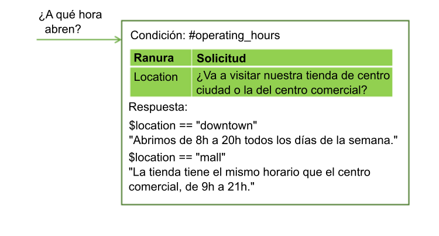

Las ranuras le pueden ayudar a recopilar varios fragmentos de información que necesita para completar una tarea compleja para un usuario, como hacer una reserva para cenar.

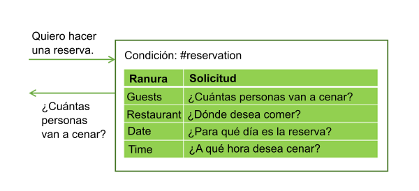

El usuario puede proporcionar valores para varias ranuras a la vez. Por ejemplo, la entrada puede incluir la información "There will be 6 of us dining at 7 PM". Esta entrada contiene dos valores necesarios que faltaban: el número de comensales y la hora de la reserva. El servicio reconoce y guarda ambos, cada uno en su ranura correspondiente. Luego muestra la solicitud que está asociada a la siguiente ranura vacía.

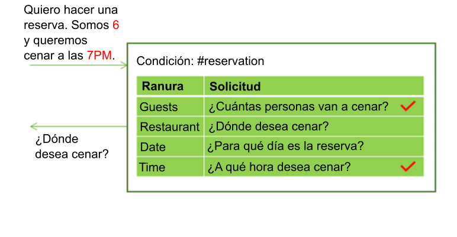

Las ranuras permiten al servicio responder a preguntas complementarias sin tener que volver a restablecer el objetivo del usuario. Por ejemplo, un usuario puede solicitar una previsión meteorológica, y luego realizar una pregunta complementaria sobre el tiempo en otra ubicación o de otra manera. Si guarda las variables de previsión necesarias, como ubicación y día, en ranuras, si un usuario realiza una pregunta complementaria con nuevos valores de variables, puede sobrescribir los valores de la ranura con los nuevos valores proporcionados y ofrecer una respuesta que refleja la nueva información.

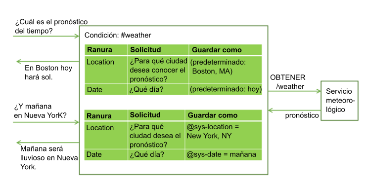

La utilización de ranuras genera un flujo de diálogo más natural entre el usuario y el servicio, y es más fácil para gestionar que la recopilación de información utilizando muchos nodos separados.

#### Adición de ranuras
{: #add-slots}

1.  Identifique las unidades de información que desea recopilar. Por ejemplo, para pedir una pizza, probablemente deseará recopilar la información siguiente:

    - Hora de entrega
    - Tamaño

1.  En la vista de edición del nodo del diálogo, pulse **Personalizar** y marque el recuadro de selección **Ranuras**.

    **Nota**: Para obtener más información sobre el campo **Solicitud de todo**, consulte [Solicitud de todo a la vez](dialog-build.html#slots-prompt-for-everything).

1.  **Añada una ranura para cada unidad de información necesaria**.

    Para cada ranura, especifique estos detalles:

    - **Comprobar**: Identifique el tipo de información que desea extraer de la respuesta del usuario en la solicitud de la ranura. En la mayoría de los casos, se comprueban valores de entidad, pero también se puede comprobar en una intención. Aquí puede utilizar los operadores AND y OR para definir condiciones más complejas.

      **Nota**: Si la entidad tiene patrones definidos, después de añadir el nombre de entidad, añada `.literal`. Por ejemplo, si selecciona `@email` en la lista de entidades definidas, edite el campo *Comprobar* para que contenga `@email.literal`. Al añadir la propiedad `.literal`, puede indicar que desea capturar el texto exacto que ha especificado el usuario, y que se ha identificado como una dirección de correo electrónico en función de su patrón.

      Evite comprobar valores de variables de contexto. El valor de *Comprobar* se utiliza en primer lugar como condición, pero luego se convierte en el valor de la variable de contexto que ha nombrado en el campo *Guardar como*. Si utiliza una variable de contexto en la condición, se puede producir un comportamiento inesperado si se utiliza en el contexto.
      {: tip}

    - **Guardar como**: Especifique un nombre para la variable de contexto en la que va a guardar el valor que le interesa de la respuesta del usuario en la solicitud de la ranura. No especifique una variable de contexto que se haya utilizado anteriormente en el diálogo, por lo que podría tener un valor. Solo se muestra la solicitud correspondiente a la ranura cuando la variable de contexto para la ranura es nula.

    - **Solicitud**: Escriba una sentencia que obtenga el fragmento de información que necesita del usuario. Después de que se muestre esta solicitud, la conversación se detiene y el servicio espera a que el usuario responda.

    - Si edita la ranura, también puede definir las respuestas que se deben mostrar después de que el usuario responda a la solicitud de la ranura.
      - **Encontrado**: Se ejecuta después de que el usuario proporcione la información esperada.
      - **No encontrado**: Se ejecuta si la información proporcionada por el usuario no se entiende, o no se proporciona en el formato esperado. El texto que especifique aquí puede indicar más explícitamente el tipo de información que desea que proporcione el usuario. Si la ranura se rellena correctamente, o si se comprende la entrada de usuario y la gestiona un manejador de nivel de nodo, esta condición nunca se activa.

    En esta tabla se muestran los valores de ranura de ejemplo para un nodo que permiten a los usuarios pedir una pizza.

    <table>
    <tr>
      <td>Información</td>
      <td>Comprobar</td>
      <td>Guardar como</td>
      <td>Solicitud</td>
      <td>Pregunta complementaria si se encuentra</td>
      <td>Pregunta complementaria si no se encuentra</td>
    </tr>
    <tr>
      <td>Size (Tamaño)</td>
      <td>@size</td>
      <td>$size</td>
      <td>"What size pizza would you like?" (¿De qué tamaño desea la pizza?)</td>
      <td>"$size it is." ($size será)</td>
      <td>"What size did you want? We have small, medium, and large." (¿Qué tamaño quería? Tenemos pequeña, mediana y grande)</td>
    </tr>
    <tr>
      <td>DeliverBy</td>
      <td>@sys-time</td>
      <td>$time</td>
      <td>"When do you need the pizza by?" (¿A qué hora quiere la pizza?)</td>
      <td>"For delivery by $time" (Entregarla a las $time)</td>
      <td>"What time did you want it delivered? We need at least a half hour to prepare it." (¿A qué hora quería la pizza? Necesitamos al menos media hora para prepararla)</td>
    </tr>
    </table>

    **Ranuras opcionales**: Si desea añadir una ranura que capture información pero que sea opcional, no especifique una solicitud para la misma.

    Por ejemplo, supongamos que desea añadir una ranura que capture información sobre restricciones alimentarias en caso de que el usuario especifique una. Sin embargo, no desea solicitar a todos los usuarios esta información alimentaria, ya que en la mayoría de los casos es irrelevante.

    <table>
    <tr>
      <td>Información</td>
      <td>Comprobar</td>
      <td>Guardar como</td>
    </tr>
    <tr>
      <td>Wheat restriction (Sin gluten)</td>
      <td>@dietary</td>
      <td>$dietary</td>
    </tr>
    </table>

    Si añade una ranura sin una solicitud, el servicio trata la ranura como opcional.

    Si una ranura es opcional, solo haga referencia a su variable de contexto en el texto de la respuesta de nivel de nodo si lo puede expresar de modo que tenga sentido aunque no se especifique ningún valor para la ranura. Por ejemplo, supongamos que desea expresar una sentencia como la siguiente: "I am ordering a $size $dietary pizza for delivery at $time" (Voy a pedir una pizza $size $dietary para las $time). El texto resultante sigue teniendo sentido si no se especifica la información sobre restricción alimentaria, como por ejemplo `gluten-free` o `dairy-free`, "I am ordering a large pizza for delivery at 3:00PM" (Voy a pedir una pizza grande para las 3:00PM).
    {: tip}
1.  **Mantener seguimiento de los usuarios**.
    También puede definir manejadores de nivel de nodo que proporcionan respuestas a preguntas que pueden efectuar los usuarios durante la interacción y quesean tangenciales a la finalidad del nodo.

    Por ejemplo, el usuario puede preguntar sobre la receta de la salsa de tomate o sobre dónde adquiere los ingredientes. Para manejar esas digresiones, pulse el enlace **Gestionar manejadores** y añada una condición y una respuesta para cada pregunta prevista.

    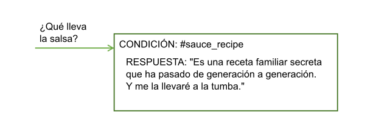

    Después de responder a la digresión, se muestra la solicitud asociada a la ranura vacía actual.

    Esta condición se activa si el usuario proporciona una entrada que coincide con las condiciones del manejador en cualquier momento durante el flujo de nodos del diálogo hasta que se muestra la respuesta de nivel de nodo.
1.  **Añadir una respuesta de nivel de nodo**.
    Esta respuesta de nivel de nodo no se ejecuta hasta que se rellenen todas las ranuras necesarios. Puede añadir una respuesta que resuma la información que ha recopilado. Por ejemplo, "A `$size` pizza is scheduled for delivery at `$time`. Enjoy!" (Tenemos una pizza `$size` para entregar a las `$time`. ¡Disfrútela!)

1.  **Añada lógica que restablezca las variables de contexto de la ranura**.
    A medida que recopila respuestas del usuario por ranura, se van guardando en variables de contexto. Puede utilizar las variables de contexto para pasar la información a otro nodo o a una aplicación o servicio externo para que las utilicen. Sin embargo, después de pasar la información, debe establecer las variables de contexto como nulas para restablecer el nodo de modo que pueda volver a recopilar información. No puede anular las variables de contexto dentro del nodo actual porque el servicio no saldrá del nodo hasta que se hayan rellenado las ranuras necesarias. Considere la posibilidad de utilizar uno de los siguientes métodos:
    - Añadir proceso a la aplicación externa que anula las variables.
    - Añadir un nodo hijo que anule las variables.
    - Insertar un nodo padre que anule las variables y que luego salte al nodo con ranuras.

Tenga en cuenta los siguientes enfoques recomendados para manejar tareas comunes.

#### Solicitud de todo a la vez
{: #slots-prompt-for-everything}

Incluya una solicitud inicial para todo el nodo que indique claramente a los usuarios las unidades de información que desea que proporcionen. Si se muestra en primer lugar esta solicitud, se proporciona a los usuarios la oportunidad de ofrecer todos los detalles a la vez en lugar de tener que esperar a que se les solicite cada fragmento de información.

Por ejemplo, cuando el nodo se activa porque un cliente quiere pedir una pizza, puede responder con una solicitud preliminar de tipo "I can take your pizza order. Tell me what size pizza you want and the time that you want it delivered" (Anoto su pedido. Dígame qué pizza quiere y a qué hora la desea).

Si el usuario ofrece un fragmento de esta información en su solicitud inicial, no se muestra la solicitud. Por ejemplo, supongamos que la entrada inicial es "I want to order a large pizza" (Quiero pedir una pizza grande). Cuando el servicio analiza la entrada, reconoce "large" (grande) como el tamaño de la pizza y rellena la ranura **Size** (Tamaño) con el valor especificado. Puesto que una de las ranuras contiene información, se salta la visualización de la solicitud inicial para evitar el tener que volver a solicitar información sobre el tamaño de la pizza. En lugar de ello, muestra la solicitud correspondiente a las ranura restantes en las que falta información.

En el panel Personalizar en el que ha habilitado la característica Ranuras, marque el recuadro de selección **Solicitar todo** para habilitar la solicitud inicial. Este valor añade el campo **Si no hay ranuras con información, preguntar esto primero** al nodo, donde puede especificar el texto que solicita toda la información al usuario.

#### Captura de varios valores
{: #slots-multiple-entity-values}

Puede pedir una lista de artículos y guardarlos en una ranura.

Por ejemplo, supongamos que desea preguntar a los usuarios si desean ingredientes adicionales en su pizza. Para ello, defina una entidad (@toppings), y los valores aceptados para la misma (pepperoni, cheese, mushroom, etc.). Añada una ranura que solicite al usuario ingredientes adicionales. Utilice la propiedad values del tipo de entidad para capturar varios valores, si se especifican.

<table>
<tr>
  <td>Información</td>
  <td>Comprobar</td>
  <td>Guardar como</td>
  <td>Solicitud</td>
  <td>Pregunta complementaria si se encuentra</td>
  <td>Pregunta complementaria si no se encuentra</td>
</tr>
<tr>
  <td>Toppings (Ingredientes adicionales)</td>
  <td>@toppings.values</td>
  <td>$toppings</td>
  <td>Any toppings on that? ¿Desea algún ingrediente adicional?</td>
  <td>"Great addition" (Buena elección)</td>
  <td>"What toppings would you like? We offer ..." (¿Qué ingrediente desea añadir? Le ofrecemos...)</td>
</tr>
</table>

Para hacer referencia posteriormente a ingredientes adicionales especificados por el usuario, utilice la sintaxis `<? $entity-name.join(',') ?>` para obtener una lista de cada artículo de la matriz de ingredientes y sepárelos con una coma. Por ejemplo, "I am ordering
you a $size pizza with `<? $toppings.join(',') ?>` that is scheduled for delivery by $time" (Voy a pedir una pizza $size con `<? $toppings.join(',') ?>` para las $time).

#### Reformateo de valores
{: #slots-reformat-values}

Puesto que está pidiendo información al usuario y tiene que hacer referencia a su entrada en las respuestas, considere la posibilidad de reformatear los valores de modo que los pueda mostrar en un formato más adecuado.

Por ejemplo, los valores de hora se guardan en el formato `hh:mm:ss`. Puede utilizar el editor de JSON para la ranura para reformatear el valor de hora cuando lo guarde para que utilice el formato `horas:minutos AM/PM`:

```json
{
  "context":{
    "time": "<? @sys-time.reformatDateTime('h:mm a') ?>"
  }
}
```
{: codeblock}

Consulte [Métodos para procesar valores](dialog-methods.html) para ver otras ideas de reformateo.

#### Obtención de confirmación
{: #slots-get-confirmation}

Añada una ranura bajo las otras que solicite al usuario que confirme que la información que ha recopilado es precisa y completa. Esta ranura puede buscar respuestas que coincidan con la intención #yes.

<table>
<tr>
  <td>Información</td>
  <td>Comprobar</td>
  <td>Guardar como</td>
  <td>Solicitud</td>
  <td>Pregunta complementaria si se encuentra</td>
  <td>Pregunta complementaria si no se encuentra</td>
</tr>
<tr>
  <td>Confirmation (Confirmación)</td>
  <td>#yes</td>
  <td>$confirmation</td>
  <td>"I'm going to order you a `$size` pizza for delivery at `$time`. Should I go ahead?" (Voy a pedirle una pizza `$size` para las `$time`. ¿Continúo?)</td>
  <td>"Your pizza is on its way!" (Su pizza está de camino)</td>
  <td>see below (consulte a continuación)</td>
</tr>
</table>

Dado que los usuarios pueden incluir declaraciones afirmativas en otro momento del diálogo (*Oh yes, we want the pizza delivered at 5pm* (Sí, queremos la pizza para las 5pm)), utilice la propiedad `slot_in_focus` para dejar claro en la condición de la ranura que espera una respuesta afirmativa únicamente a la solicitud de esta ranura.

```json
#yes && slot_in_focus
```
La propiedad `slot_in_focus` siempre se evalúa como un valor booleano (true o false). Incluya esta propiedad únicamente en una condición para la que desea un resultado booleano. No la utilice, por ejemplo, en condiciones de ranura que comprueben el tipo de entidad y luego guarden el valor de la entidad.
{: tip}

En la solicitud **No encontrado**, vuelva a solicitar de nuevo toda la información y restaure las variables de contexto que ha guardado anteriormente.

```json
{
  "output":{
    "text": {
      "values": [
        "Let's try this again. Tell me what size pizza you want and the time..."
      ]
    }
  },
  "context":{
    "size": null,
    "time": null
  }
}
```
{: codeblock}

#### Sustitución de un valor de variable de contexto de ranura
{: #slots-found-handler-event-properties}

Si, en cualquier momento antes de que el usuario salga de un nodo con ranuras, el usuario proporciona un nuevo valor para una ranura, el nuevo valor se guarda en la variable de contexto de ranura, sustituyendo el valor especificado previamente. El diálogo puede reconocer de forma explícita que se ha producido esta sustitución utilizando propiedades especiales definidas para el manejador de sucesos de la condición Found:

- `event.previous_value`: Valor anterior de la variable de contexto correspondiente a esta ranura.
- `event.current_value`: Valor actual de la variable de contexto correspondiente a esta ranura.

Por ejemplo, supongamos que el diálogo pregunta por una ciudad de destino para una reserva de vuelo. El usuario especifica `Paris`. Define la variable de contexto de la ranura $destination como *Paris*. A continuación, el usuario, dice `Oh wait. I want to fly to Madrid instead (Un momento; quiero ir a Madrid)` Si configura la condición Found del siguiente modo, el diálogo puede manejar correctamente este tipo de cambio.

```json
When user responds, if @destination is found:
Condition: event.previous_value != null
    Response: Ok, updating destination from <? event.previous_value ?> to <? event.current_value ?>.
Response: Ok, destination is $destination.literal.
```

Esta configuración de ranura permite al diálogo reaccionar ante un cambio de destino del usuario con la respuesta `Ok, updating the destination from Paris to Madrid` (De acuerdo, cambio el destino París por Madrid).

#### Cómo evitar confusiones con números
{: #slots-avoid-number-confusion}

Algunos valores que proporcionan los usuarios se pueden identificarse como más de un tipo de entidad.

Es posible que tenga dos ranuras que almacenen el mismo tipo de valor, como por ejemplo una fecha de llegada y una de salida. Incorpore lógica en las condiciones de la ranura que distinga entre sí valores similares.

Además, el servicio puede reconocer varios tipos de entidad en una sola entrada de usuario. Por ejemplo, si un usuario especifica una moneda, se reconoce como el tipo de entidad @sys-currency y @sys-number. Realice algunas pruebas en el panel "Pruébelo" para comprender la forma en que el sistema interpreta distintas entradas de usuario e incorpore en las condiciones lógica que evite posibles interpretaciones erróneas.

En la lógica exclusiva de la característica de ranuras, cuando dos entidades se reconocen como una sola entrada de usuario, se utiliza la que tiene el intervalo más largo. Por ejemplo, si el usuario especifica *May 2*, aunque el servicio Conversation reconoce las entidades @sys-date (05022017) y @sys-number (2) en el texto, solo se registra y se aplica a una ranura, si procede, la entidad con el intervalo más largo (@sys-date).
{: tip}

#### Cómo evitar que se muestre una respuesta de la condición Found cuando no es necesario
{: #slots-stifle-found-responses}

Si especifica respuestas de la condición Found para varias ranuras, si un usuario especifica valores para varias ranuras a la vez, se muestra la respuesta de la condición Found para al menos una de las ranuras. Es probable que desee que se devuelva la respuesta de la condición Found para todas ellas o para ninguna de ellas.

Para evitar que se muestran respuestas de Found, puede hacer una de estas cosas para cada respuesta de la condición Found:

- Añada una condición a la respuesta que impida que se muestre si determinadas ranuras contienen información. Por ejemplo, puede añadir una condición como `!($size && $time)`, que evita que se muestre la respuesta si se especifican las variables de contexto $size y $time.
- Añada la condición `!all_slots_filled` a la respuesta. Este valor impide que se muestre la respuesta si todas las ranuras contienen información. No utilice este método si va a incluir una ranura de confirmación. La ranura de confirmación también es una ranura, y generalmente deseará evitar que se muestren las respuestas de la condición Found antes de que se rellene la propia ranura de confirmación.

#### Manejo de solicitudes para salir del proceso
{: #slots-node-level-handler}

Añada al menos un manejador de nivel de nodo que pueda reconocer cuándo un usuario desea salir del nodo.

Por ejemplo, en un nodo que recopile información para una cita en una peluquería para mascotas, puede añadir un manejador de nivel de nodo que condicione la intención #cancel, que reconozca expresiones como "Forget it. I changed my mind (Lo cancelamos. He cambiado de opinión)."

1.  En el editor de JSON del manejador, rellene todas las variables de contexto de la ranura con valores ficticios para evitar que el nodo continúe solicitando la información que falta. Y, en la respuesta del manejador, añada un mensaje como por ejemplo "Ok, we'll stop there. No appointment will be scheduled (Lo dejamos aquí. No se planificará ninguna cita)."
1.  En la respuesta de nivel de nodo, añada una condición que comprueba si hay un valor ficticio en una de las variables de contexto de la ranura. Si se encuentra, se muestra un último mensaje como el siguiente: "If you decide to make an appointment later, I'm here to help" (Si más adelante quiere planificar una cita, aquí estaremos para ayudarle). Si no se encuentra, muestra el mensaje de resumen estándar del nodo, como por ejemplo "I am making a grooming appointment for your $animal at $time on $date" (Estoy planificando una cita para su $animal a las $time el día $date).
1.  Tenga en cuenta la lógica utilizada en las condiciones que se evalúan antes que este manejador de nivel de nodo para poder crear condiciones distintas. Cuando se recibe una entrada de usuario, las condiciones se evalúan en este orden:

    - Condiciones If Found de nivel de ranura actual.
    - Manejadores de nivel de nodo en el orden en el que aparecen listados.
    - Condiciones If Not Found de nivel de ranura actual.

Tenga cuidado al añadir condiciones que siempre se evalúan como true (como las condiciones especiales, `true` o `anything_else`) como manejadores de nivel de nodo. Por ranura, si el manejador de nivel de nodo se evalúa como true, la condición If Not Found se omite por completo. Por lo tanto, el uso de un manejador de nivel de nodo que siempre se evalúe como true evita de forma efectiva la evaluación de la condición If Not Found para cada ranura.
{: tip}

Por ejemplo, supongamos que se ofrecen servicios de peluquería para todos los animales excepto para gatos. Para la ranura Animal, es probable que se le ocurra utilizar la siguiente condición de ranura para evitar que el valor `cat` se guarde en la ranura Animal:

```json
Check for @animal && !@animal:cat, then save it as $animal.
```
{: codeblock}

Y, para comunicar a los usuarios que no acepta gatos, podría especificar el siguiente valor en la condición Not Found de la ranura Animal:

```json
If @animal && !@animal:cat then, "I'm sorry. We do not groom cats."
```
{: codeblock}

Aunque parece lógico, si también define un manejador de salida de nivel de nodo, entonces (dado el orden de evaluación de condiciones) esta condición Not Found probablemente nunca se active. Puede utilizar en su lugar esta condición de ranura:

```json
Check for @animal, then save it as $animal.
```
{: codeblock}

Y, para gestionar una posible respuesta `cat`, añada este valor a la condición Found:

```josn
If @animal:cat then, "I'm sorry. We do not groom cats."
```
{: codeblock}

En el editor de JSON de la condición Found, restablezca el valor de la variable de contexto $animal porque actualmente está establecida en cat y no debería ser así.

```json
{
  "output":{
    "text": {
      "values": [
        "I'm sorry. We do not groom cats."
      ]
    }
  },
  "context":{
    "animal": null
  }
}
```
{: codeblock}

Aquí una muestra de JSON que define un manejador de nivel de nodo para el ejemplo de la pizza:

```json
{
"conditions": "#cancel",
 "output": {
   "text": {
     "values": [
       "Ok, we'll stop there. No pizza delivery will be scheduled."
     ],
    "selection_policy": "sequential"
    }
  },
"context": {
   "time": "12:00:00",
   "size": "dummy",
   "confirmation":"true"
}
}
```

#### Ejemplos de ranuras

Para acceder a archivos JSON que implementen distintos escenarios de uso común de ranuras, vaya al [repositorio de conversaciones ](https://github.com/watson-developer-cloud/community/tree/master/conversation){: new_window} comunitario en GitHub.

Para revisar un ejemplo, descargue uno de los archivos JSON de ejemplo y luego impórtelo como un nuevo espacio de trabajo. En el separador Diálogo, puede revisar los nodos del diálogo para ver cómo se han implementado las ranuras para responder ante distintos casos de uso.

## Prueba del diálogo
{: #test}

A medida que realiza cambios en el diálogo, puede probarlo en cualquier momento para ver cómo responde ante una entrada.

1.  En el separador Diálogo, pulse el icono .
1.  En el panel de la conversación, escriba el texto que desee y pulse Intro.

    Asegúrese de que el sistema haya terminado de formarse con los cambios más recientes antes de empezar a probar el diálogo. Si el sistema continúa formándose, aparecerá un mensaje en la parte superior del panel de la conversación:
    {: tip}

    
1.  Compruebe la respuesta para ver si el diálogo ha interpretado correctamente la entrada y ha elegido la respuesta correcta.

    La ventana de la conversación indica las intenciones y entidades que se han reconocido en la entrada:

    

    En el panel del editor del diálogo, el nodo activo actualmente aparece resaltado.
1.  Para comprobar o establecer el valor de una variable de contexto, pulse el enlace **Gestionar contexto**.

    Se muestran las variables de contexto que ha definido en el diálogo.

    Además, se muestra una variable de contexto `$timezone`. La interfaz de usuario del panel "Pruébelo" obtiene la información sobre el entorno local del usuario del navegador web y la utiliza para establecer la variable de contexto `$timezone`. Esta variable de contexto facilita el manejo de las referencias de tiempo en los intercambios del diálogo de prueba. Considere la posibilidad de hacer algo similar en la aplicación de usuario. Si no se especifica, se utiliza la hora media de Greenwich (GMT).

    Puede añadir una variable y establecer su valor para ver cómo responde el diálogo en la siguiente ronda del diálogo de prueba. Esta función es útil si, por ejemplo, el diálogo está configurado para mostrar diferentes respuestas en función de un valor de variable de contexto que proporciona el usuario.

    1.  Para añadir una variable de contexto, especifique el nombre de la variable y pulse **Intro**.
    1.  Para definir un valor predeterminado para la variable de contexto, busque la variable de contexto que ha añadido en la lista y especifique un valor para la misma.

    Consulte [Variables de contexto](#context) para obtener más información.

1.  Continúe interactuando con el diálogo para ver cómo fluye la conversación.
    - Para encontrar y volver a enviar una expresión de prueba, puede pulsar la tecla Subir para recorrer las entradas recientes.
    - Para eliminar expresiones de prueba anteriores del panel de la conversación y volver a empezar, pulse el enlace **Borrar**. No solo se eliminan las expresiones de prueba y las respuestas; esta acción también elimina los valores de las variables de contexto establecidas como resultado de sus interacciones con el diálogo. Los valores de las variables de contexto que ha establecido o modificado de forma explícita no se borran.

### Qué hacer a continuación

Si determina que se están reconociendo intenciones o entidades erróneas, es posible que tenga que modificar las definiciones de las intenciones o entidades.

Si se están reconociendo las intenciones y entidades correctas, pero se activan los nodos erróneos en el diálogo, asegúrese de que las condiciones se han escrito correctamente.

## Cómo mover un nodo del diálogo
{: #move-node}

Cada nodo que cree se puede moverse en el árbol del diálogo.

Es posible que desee mover un nodo creado anteriormente a otra área del flujo para cambiar la conversación. Puede mover nodos para convertirlos en hermanos o iguales en otra rama.

1.  En el nodo que desea mover, pulse el icono **Más**  y luego seleccione **Mover**.
1.  Seleccione un nodo de destino que se encuentre en el árbol próximo a donde desea mover este nodo. Elija si desea colocar este nodo por encima o por debajo del nodo de destino, o si desea convertirlo en hijo del nodo de destino.

## Búsqueda de un nodo del diálogo por su ID de nodo
{: #get-node-id}

Es posible que desee buscar el nodo del diálogo que está asociado a un ID de nodo conocido por uno de estos motivos:

- Está revisando registros y el registro hace referencia a una sección del diálogo por su ID de nodo.
- Desea correlacionar los ID de nodo que aparecen en la lista de la propiedad `nodes_visited` de la salida del mensaje de la API con nodos que pueda ver en el árbol del diálogo.
- Un mensaje de error en tiempo de ejecución del diálogo le informa sobre un error de sintaxis y utiliza un ID de nodo para identificar el nodo que tiene que corregir.

Para descubrir un nodo basándose en su ID de nodo, siga estos pasos:

1.  En el separador Diálogo de la herramienta, seleccione cualquier nodo del árbol del diálogo.
1.  Cierre la vista de edición si está abierta para el nodo actual.
1.  En el campo de ubicación del navegador web, debería mostrarse un URL con la siguiente sintaxis:

    ```json
    https://watson-conversation.ng.bluemix.net/space/instance-id/workspaces/workspace-id/build/dialog#node=node-id
    ```

1.  Edite el URL y sustituya el valor `node-id` actual por el ID del nodo que desea encontrar y envíe el nuevo URL.
1.  Si es necesario, vuelva a resaltar el URL editado y envíelo de nuevo.

La herramienta se renueva y el foco pasa a estar en el nodo del diálogo con el ID de nodo que ha especificado.

**Nota**: Actualmente no puede utilizar este método para buscar una ranura, un manejador de ranuras o un manejador de nivel de nodo. Para buscar un nodo de estos tipos por su ID, debe exportar el espacio de trabajo, utilizar un editor de JSON para buscar el valor de node-id en el JSON y anotar su título (si se ha especificado) o su condición. En el separador Diálogo de la herramienta, utilice la función de búsqueda del navegador para buscar el nodo del diálogo con dicho título o condición.
