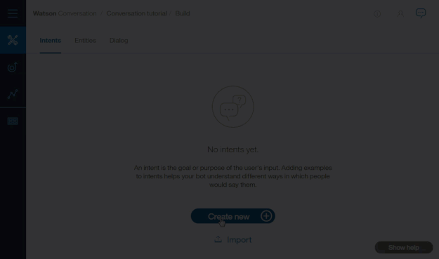
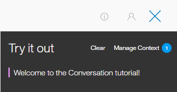
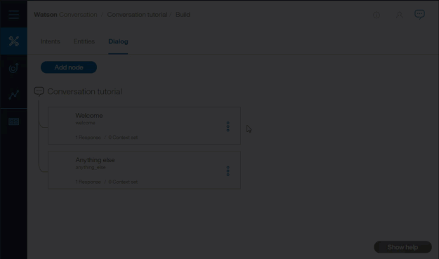
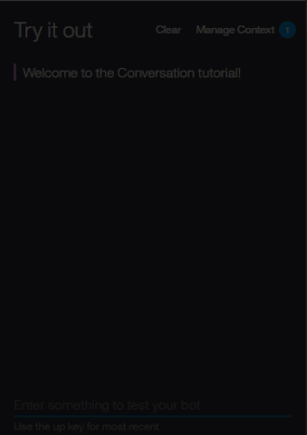

---

copyright:
  years: 2015, 2017
lastupdated: "2017-08-10"

---

{:shortdesc: .shortdesc}
{:new_window: target="_blank"}
{:tip: .tip}
{:pre: .pre}
{:codeblock: .codeblock}
{:screen: .screen}
{:javascript: .ph data-hd-programlang='javascript'}
{:java: .ph data-hd-programlang='java'}
{:python: .ph data-hd-programlang='python'}
{:swift: .ph data-hd-programlang='swift'}

# Tutoriel d'initiation
{: #gettingstarted}

Ce tutoriel rapide vous présente l'outil {{site.data.keyword.conversationshort}} et vous accompagne dans le processus de création de votre première conversation.
{: shortdesc}

## Avant de commencer
{: #prerequisites}

Si vous avez déjà créé une instance de service, vous n'avez rien d'autre à faire. Passez à l'étape 1.
{: tip}

1.  Accédez au service [{{site.data.keyword.conversationshort}} ](https://console.{DomainName}/catalog/services/conversation/){: new_window} et inscrivez-vous pour recevoir un compte {{site.data.keyword.Bluemix_notm}} gratuit ou connectez-vous. 
1.  Une fois connecté, tapez `conversation-tutorial` dans la zone **Service name** sur la page {{site.data.keyword.conversationshort}} et cliquez sur **Create**.

## Etape 1 : Lancement de l'outil
{: #launch-tool}

Une fois l'instance de service créée, le tableau de bord de l'instance apparaît. Lancez l'outil {{site.data.keyword.conversationshort}} à partir d'ici. 

Cliquez sur **Manage**, puis sur **Launch tool**.

Vous serez peut-être invité à vous connecter à l'outil séparément. Si tel est le cas, indiquez vos données d'identification IBM Bluemix pour vous connecter. 

## Etape 2 : Création d'un espace de travail
{: #create-workspace}

Votre première étape dans l'outil {{site.data.keyword.conversationshort}} consiste à créer un espace de travail. 

Un [*espace de travail*](configure-workspace.html) est le conteneur des artefacts qui définissent le flux de conversation. 

1.  Dans l'outil {{site.data.keyword.conversationshort}}, cliquez sur **Create**.
1.  Nommez votre espace de travail `Conversation tutorial` et cliquez sur **Create**. L'onglet **Intents** de votre nouvel espace de travail s'affiche.

## Etape 3 : Création d'intentions
{: #create-intents}

Une [intention](intents.html) représente l'objectif d'une entrée utilisateur. Vous pouvez considérer les intentions comme des actions que vos utilisateurs peuvent vouloir effectuer dans votre application. 

Dans le cadre de cet exemple, nous allons définir deux intentions seulement : l'une pour dire hello et l'autre pour dire goodbye. 

1.  Vérifiez que vous êtes sur l'onglet Intents. (Cela devrait être le cas si vous venez de créer l'espace de travail.)
1.  Cliquez sur **Create new**.
1.  Nommez l'intention `hello`.
1.  Tapez `hello` comme **exemple utilisateur** et appuyez sur Entrée. 

   Les *exemples* indiquent au service {{site.data.keyword.conversationshort}} quels types d'entrée utilisateur doivent correspondre à l'intention. Plus vous fournirez d'exemples, plus la reconnaissance des intentions utilisateur par le service sera précise. 
1.  Ajoutez quatre exemples et cliquez sur **Done** pour terminer la création de l'intention #hello :
    - `good morning`
    - `greetings`
    - `hi`
    - `howdy`

   

1.  Créez une autre intention nommée #goodbye avec les cinq exemples suivants :
    - `bye`
    - `farewell`
    - `goodbye`
    - `I'm done`
    - `see you later`

Vous avez créé deux intentions, #hello et #goodbye, et fourni des exemples d'entrée utilisateur pour entraîner {{site.data.keyword.watson}} à reconnaître ces intentions dans les entrées utilisateur. 

## Etape 4 : Création d'un dialogue
{: #build-dialog}

Un [dialogue](dialog-build.html) définit le flux de votre conversation sous la forme d'une arborescence logique. Chaque noeud de l'arborescence comporte une condition qui le déclenche, en fonction d'une entrée utilisateur. 

Nous allons créer un dialogue simple qui gère nos intentions #hello et #goodbye, chacune d'elles ayant un seul noeud. 

### Ajout d'un noeud de début

1.  Dans l'outil {{site.data.keyword.conversationshort}}, cliquez sur l'onglet **Dialog**. 
1.  Cliquez sur **Create**. Deux noeuds s'affichent :
    - **Welcome** : contient un message d'accueil qui s'affiche lorsque vos utilisateurs interagissent pour la première fois avec le bot. 
    - **Anything else** : contient les phrases qui sont utilisées pour répondre aux utilisateurs lorsque leur entrée n'est pas reconnue. 

    
1.  Cliquez sur le noeud **Welcome** pour l'ouvrir dans la vue d'édition. 
1.  Remplacez la réponse par défaut par le texte `Welcome to the Conversation tutorial!`.

    
1.  Cliquez sur  pour fermer la vue d'édition. 

Vous avez créé un noeud de dialogue qui est déclenché par la condition `welcome` ; cette condition spéciale indique que l'utilisateur a démarré une nouvelle conversation. Votre noeud spécifie que lorsqu'une nouvelle conversation démarre, le système doit répondre avec le message d’accueil : 

### Test du noeud de début

Vous pouvez tester votre dialogue à tout moment afin de le vérifier. Nous allons le tester maintenant. 

- Cliquez sur l'icône  pour ouvrir le panneau "Try it out". Vous devriez voir votre message d’accueil apparaître. 

    

### Ajout de noeuds pour gérer des intentions

A présent, nous allons ajouter des noeuds afin de gérer vos intentions entre le noeud `Welcome` et le noeud `Anything else`. 

1.  Cliquez sur l'icône Autres options  sur le noeud **Welcome**, puis sélectionnez **Add node below**.
1.  Tapez `#hello` dans la zone **Enter a condition** de ce noeud. Ensuite, sélectionnez l'option **#hello**. 
1.  Ajoutez la réponse, `Good day to you.`
1.  Cliquez sur  pour fermer la vue d'édition. 

   
1.  Cliquez sur l'icône Autres options  sur le noeud hello, puis sélectionnez **Add node below** pour créer un noeud homologue. Dans le noeud homologue, spécifiez `#goodbye` comme condition, et `OK. See you later!` comme réponse. 

    

### Test de la reconnaissance des intentions

Vous avez créé un dialogue simple pour reconnaître et répondre aux entrées hello et goodbye. Voyons comment il fonctionne. 

1.  Cliquez sur l'icône  pour ouvrir le panneau "Try it out". Le rassurant message d'accueil s'affiche. 
1.  Au bas du panneau, tapez `Hello` et appuyez sur Entrée. La sortie indique que l'intention #hello a été reconnue, et la réponse appropriée (`Good day to you.`) apparaît.
1.  Essayez les entrées suivantes :
    - `bye`
    - `howdy`
    - `see ya`
    - `good morning`
    - `sayonara`

   

{{site.data.keyword.watson}} reconnaît vos intentions même lorsque vos entrées ne correspondent pas exactement aux exemples que vous avez ajoutés. Le dialogue utilise des intentions pour identifier l'objectif des entrées utilisateur, quelle que soit la formulation précise utilisée, puis il répond de la manière que vous avez définie. 

### Résultat de la création d'un dialogue

C'est terminé. Vous avez créé une conversation simple avec deux intentions et un dialogue afin de les reconnaître. 

## Etape 5 : Examen de l'exemple d'espace de travail
{: #review-sample-workspace}

Ouvrez l'exemple d'espace de travail pour visualiser des intentions qui ressemblent à celles que vous venez de créer, ainsi que beaucoup d'autres, et voyons comment elles sont utilisées dans un dialogue complexe. 

1.  Revenez à la page Workspaces.
   Vous pouvez cliquer sur le bouton  dans le menu de navigation. 
1.  Sur la vignette de l'espace de travail **Car Dashboard - Sample**, cliquez sur le bouton **Edit sample**.

    

## Etape suivante
{: #next-steps}

Ce tutoriel s'appuie sur un exemple simple. Dans le cas d'une application réelle, vous devrez définir des intentions plus intéressantes, quelques entités et un dialogue plus complexe. 

- Essayez le [tutoriel](tutorial.html) avancé pour ajouter des entités et préciser l'objectif d'un utilisateur. 
- [Déployez](deploy.html) votre espace de travail en le connectant à une interface utilisateur frontale, à des médias sociaux ou à un canal de transmission de messages. 
- Examinez les [exemples d'application](sample-applications.html).
