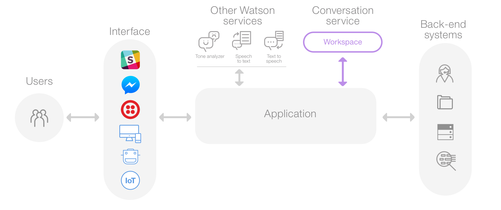

---

copyright:
  years: 2015, 2017
lastupdated: "2017-07-27"

---

{:shortdesc: .shortdesc}
{:new_window: target="_blank"}
{:tip: .tip}
{:pre: .pre}
{:codeblock: .codeblock}
{:screen: .screen}
{:javascript: .ph data-hd-programlang='javascript'}
{:java: .ph data-hd-programlang='java'}
{:python: .ph data-hd-programlang='python'}
{:swift: .ph data-hd-programlang='swift'}

# A propos de

Le service {{site.data.keyword.conversationfull}} vous permet de créer une solution qui comprend les entrées en langage naturel et utilise l'apprentissage automatique pour répondre aux clients en simulant une conversion entre des humains.
{: shortdesc}

## Comment utiliser le service

Ce diagramme représente l'ensemble de l'architecture d'une solution complète : 

- Les utilisateurs interagissent avec votre application via l'**interface** utilisateur que vous implémentez. Par exemple, une fenêtre de discussion ou une application mobile simple, ou même un robot avec une interface vocale. 

- L'**application** envoie l'entrée utilisateur au service {{site.data.keyword.conversationshort}}. 
    - L'application se connecte à un *espace de travail*, qui est le conteneur de votre flux de dialogue et de vos données d'apprentissage. 
    - Le service interprète l'entrée utilisateur, dirige le flux de la conversation et rassemble les informations dont il a besoin. 
    - Vous pouvez connecter des services {{site.data.keyword.watson}} supplémentaires pour analyser une entrée utilisateur, par exemple, {{site.data.keyword.toneanalyzershort}} ou {{site.data.keyword.speechtotextshort}}.

- L'application peut interagir avec vos **systèmes de back end** en fonction de l'intention de l'utilisateur et des renseignements supplémentaires. Par exemple, répondre à une question, ouvrir des tickets, mettre à jour des informations relatives à un compte ou passer des commandes. Les actions que vous pouvez exécuter sont illimitées.

## Implémentation

Voici comment vous allez implémenter votre conversation :

- **Configurez un espace de travail.** A l'aide de l'environnement graphique facile à utiliser, configurez les données d'apprentissage et le dialogue pour votre conversation. 

    Les données d'apprentissage comprennent les artefacts suivants :
    - **Intentions** : objectifs que vous prévoyez pour vos utilisateurs lorsqu'ils interagiront avec le service. Définissez une intention pour chaque objectif qui peut être identifié dans une entrée d'utilisateur. Par exemple, vous pouvez définir une intention nommée *store_hours* qui répond aux questions relatives aux heures d'ouverture d'un magasin. Pour chaque intention, vous ajoutez des énoncés qui reflètent l'entrée que les clients sont susceptibles d'utiliser pour demander les informations dont ils ont besoin, par exemple, "What time do you open?"
    - **Entités** : une entité représente un terme ou un objet qui fournit le contexte d'une intention. Par exemple, une entité peut être un nom de ville qui permet à votre dialogue de distinguer le magasin pour lequel l'utilisateur souhaite obtenir les horaires d'ouverture. 

      A mesure que vous ajoutez des données d'apprentissage, un classificateur de langage naturel est ajouté automatiquement à l'espace de travail et s'entraîne à comprendre les types des demandes que vous avez indiquées et que le service doit écouter et auxquelles il doit répondre. 

    Utilisez l'outil de dialogue pour créer un flux de dialogue qui intègre vos intentions et vos entités. Le flux de dialogue est représenté graphiquement dans l'outil sous la forme d'une arborescence. Vous pouvez ajouter une branche pour traiter chacune des intentions que le service doit gérer. Vous pouvez ensuite ajouter des noeuds de branche qui gèrent toutes les nombreuses permutations possibles d'une demande en fonction d'autres facteurs, tels que les entités trouvées dans l'entrée utilisateur ou les informations qui sont transmises au service à partir de votre application ou d'un autre service externe. 

- **Déployez votre espace de travail.** Déployez l'espace de travail configuré pour les utilisateurs en le connectant à une interface utilisateur frontale, à des médias sociaux ou à un canal de transmission de messages. 

Cliquez sur les liens suivants pour en savoir plus :

- [Planification de vos intentions et entités](intents-entities.html#planning-your-entities)
- [Présentation du dialogue](dialog-build.html#overview)
- [Présentation du déploiement](deploy.html)

## Support de langue

Le support de langue par fonction est décrit en détail dans la rubrique [Langues prises en charge](lang-support.html). 

## Etapes suivantes

- [Initiez-vous](getting-started.html) au service
- Essayez certaines [démonstrations](sample-applications.html).
- Regardez la liste de [logiciels SDK ](https://www.ibm.com/watson/developercloud/developer-tools.html){: new_window}.
