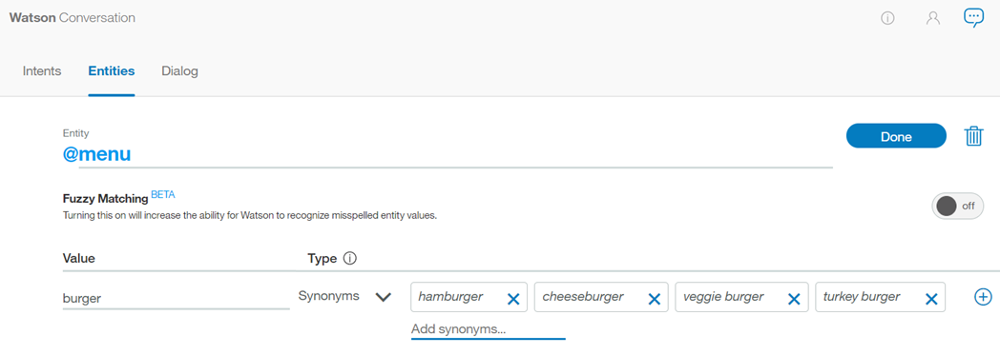
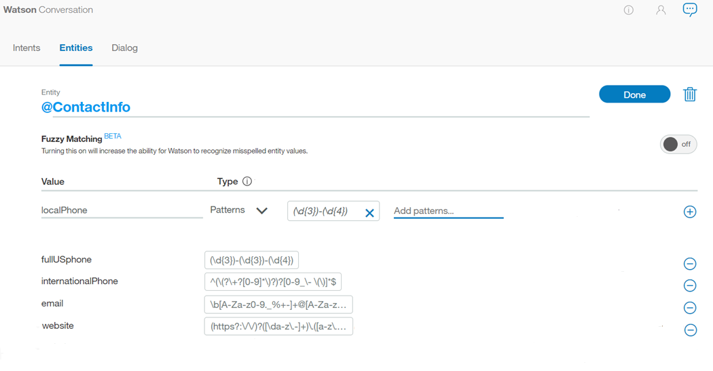

---

copyright:
  years: 2015, 2017
lastupdated: "2017-10-16"

---

{:shortdesc: .shortdesc}
{:new_window: target="_blank"}
{:tip: .tip}
{:pre: .pre}
{:codeblock: .codeblock}
{:screen: .screen}
{:javascript: .ph data-hd-programlang='javascript'}
{:java: .ph data-hd-programlang='java'}
{:python: .ph data-hd-programlang='python'}
{:swift: .ph data-hd-programlang='swift'}

# Definizione di entità

Le ***Entità*** rappresentano una classe di oggetto o di un tipo di dati rilevante per uno scopo dell'utente. Riconoscendo le entità che sono indicate nell'input dell'utente, il servizio {{site.data.keyword.conversationshort}} può scegliere le azioni specifiche da intraprendere per soddisfare un intento.

<iframe class="embed-responsive-item" id="youtubeplayer" type="text/html" width="640" height="390" src="https://www.youtube.com/embed/oSNF-QCbuDc?rel=0" frameborder="0" webkitallowfullscreen mozallowfullscreen allowfullscreen> </iframe>

## Limiti di entità
{: #entity-limits}

Il numero di entità, valori di entità e sinonimi che puoi creare dipende dal tuo piano di servizio {{site.data.keyword.conversationshort}}:

| Piano di servizio    | Entità per spazio di lavoro | Valori di entità per spazio di lavoro | Sinonimi di entità per spazio di lavoro |
|-------------------|-----------------------:|----------------------------:|--------------------------------:|
| Standard/ Premium |                          1000 |                            100.000 |                              100.000 |
| Lite              |                            25 |                            100.000 |                              100.000 |

Le entità di sistema che abiliti per l'uso vengono conteggiate nei totali di utilizzo del piano.

## Creazione di entità
{: #creating-entities}

Utilizza lo strumento {{site.data.keyword.conversationshort}} per creare le entità.

1.  Nello strumento {{site.data.keyword.conversationshort}}, apri il tuo spazio di lavoro e fai clic sulla scheda **Entità**. Se **Entità** non è visibile, utilizza il menu  per aprire la pagina.
1.  Fai clic su **Crea nuovo**.

    Puoi anche fare clic su **Utilizza entità di sistema** per effettuare una selezione da un elenco di entità comuni, fornite da {{site.data.keyword.IBM_notm}}, che possono essere applicate a qualsiasi caso di utilizzo. Per ulteriori dettagli, vedi [Abilitazione delle entità di sistema](#enable_system_entities).
1.  Nel campo **Aggiungi nome entità**, immetti un nome descrittivo per l'entità.

    Il nome dell'entità può contenere lettere (in Unicode), numeri, caratteri di sottolineatura e trattini. Ad esempio:
    - `@location`
    - `@menu_item`
    - `@product`

    Non includere il carattere `@` nei nomi delle entità che crei nello strumento {{site.data.keyword.conversationshort}}. I nomi entità non possono contenere spazi o avere più di 64 caratteri. Inoltre, i nomi entità non possono iniziare con la stringa `sys-`, che è riservata alle entità di sistema.
    {: tip}

1.  Per **Corrispondenza fuzzy**, fai clic sul pulsante per scegliere se attivarla o disattivarla; la corrispondenza fuzzy è disattivata per impostazione predefinita.  Questa funzione è disponibile per le lingue indicate nell'argomento [Lingue supportate](lang-support.html).
 {: #fuzzy-matching}

    Puoi attivare la corrispondenza fuzzy per migliorare la capacità del servizio di riconoscere i termini dell'input utente con una sintassi simile all'entità, ma senza richiedere una corrispondenza esatta. Per la corrispondenza fuzzy ci sono tre componenti, ossia stemming, errore di ortografia e corrispondenza parziale:
    - *Stemming* - La funzione riconosce la forma della radice dei valori di entità che hanno varie forme grammaticali. Ad esempio, la radice di 'bananas' è 'banana', mentre la radice di 'running' è 'run'.
    - *Errore di ortografia* - La funzione è in grado di associare l'input utente all'entità corrispondente adeguata nonostante la presenza di errori di ortografia o lievi differenze sintattiche. Ad esempio, se definisci "giraffe" come sinonimo di un'entità animale e l'input utente contiene i termini "giraffes" o "girafe", la corrispondenza fuzzy è in grado di associare correttamente il termine all'entità animale.
    - *Corrispondenza parziale* - Con la corrispondenza parziale, la funzione suggerisce automaticamente dei sinonimi basati sulla sottostringa presenti nelle entità definite dall'utente e assegna un punteggio di affidabilità inferiore rispetto alla corrispondenza esatta dell'entità.

    **Nota** - Per l'inglese, la corrispondenza fuzzy impedisce l'acquisizione di alcune parole comuni valide in inglese come corrispondenze fuzzy per una determinata entità. Attualmente, questa funzione utilizza solo parole del dizionario inglese standard e non utilizza sinonimi definiti dall'utente.
1.  Nel campo **Valore**, immetti il testo di un possibile valore per l'entità. Un valore di entità può essere qualsiasi stringa composta da un massimo di 64 caratteri.

    > **Importante:** non includere informazioni sensibili o personali nei nomi o valori di entità. I nomi e i valori possono essere esposti negli URL in un'applicazione.

    Una volta immesso un valore di entità, puoi aggiungere dei sinonimi o definire modelli specifici per tale valore selezionando `Sinonimi` o `Modelli` dal menu a discesa *Tipo*.

    

    > **Note:** per un singolo valore di entità puoi aggiungere i sinonimi *oppure* i modelli, non puoi aggiungere entrambi.

1.  Nel campo **Sinonimi**, immetti qualsiasi sinonimo per il valore di entità. Un sinonimo può essere qualsiasi stringa composta da un massimo di 64 caratteri.

    
1.  Il campo **Modelli** consente di definire specifici modelli per un valore di entità. Un modello **deve** essere immesso nel campo come espressione regolare.
  {: #pattern-entities}

    

    Come in questo esempio, per l'entità "ContactInfo", i modelli per i valori di telefono, email e sito web possono essere definiti come segue:
    - Telefono
      - `localPhone`: `(\d{3})-(\d{4})`, ad esempio 426-4968
      - `fullUSphone`: `(\d{3})-(\d{3})-(\d{4})`, ad esempio 800-426-4968
      - `internationalPhone`: `^(\(?\+?[0-9]*\)?)?[0-9_\- \(\)]*$`, ad esempio +44 1962 815000
    - `email`: `\b[A-Za-z0-9._%+-]+@[A-Za-z0-9.-]+\.[A-Za-z]{2,}\b`, ad esempio name@ibm.com
    - `website`: `(https?:\/\/)?([\da-z\.-]+)\.([a-z\.]{2,6})([\/\w \.-]*)*\/?$`, ad esempio https://www.ibm.com

    Spesso quando si utilizzano entità modello, sarà necessario memorizzare il testo che corrisponde al modello in una variabile di contesto (o variabile di azione), dall'interno della tua struttura ad albero di dialogo.

    Immagina un caso in cui chiedi a un utente il suo indirizzo email. La condizione del nodo di dialogo conterrà una condizione simile a `@contactInfo.email`. Per assegnare l'email immessa dall'utente come variabile di contesto, è possibile utilizzare la seguente sintassi per acquisire la corrispondenza di modello all'interno della sezione di risposta del nodo di dialogo:

    ```
    {
        "context" : {
            "email": "@contactInfo.literal"
        }
    }
    ```
    {: screen}

    Il motore di corrispondenze di modello utilizzato dal servizio {{site.data.keyword.conversationshort}} ha alcune limitazioni di sintassi, che sono necessarie per evitare problemi di prestazione che possono verificarsi quando si utilizzano altri motori di espressioni regolari. In particolare, i modelli di entità non possono contenere:
      - Ripetizioni positive (ad esempio, `x*+`)
      - Riferimenti posteriori (ad esempio, `\g1`)
      - Rami condizionali (ad esempio, `(?(cond)true))`

    Il motore di espressioni regolari si basa approssimativamente sul motore di espressioni regolari Java. Il servizio {{site.data.keyword.conversationshort}} produrrà un errore se tenti di caricare un modello non supportato, tramite l'API o dall'IU degli strumenti del servizio {{site.data.keyword.conversationshort}}.

1.  Fai clic su **+** e ripeti il processo per aggiungere altri valori di entità.
1.  Quando hai finito di aggiungere i valori di entità, fai clic su **Fatto**.

### Risultati

L'entità creata viene aggiunta alla scheda **Entità** e il sistema comincia ad addestrarsi sui nuovi dati.

## Modifica delle entità

Puoi fare clic su qualsiasi entità nell'elenco per aprirla per la modifica. Puoi rinominare o eliminare le entità e puoi aggiungere, modificare o eliminare valori, sinonimi o modelli.

## Importazione di entità

Se hai un numero elevato di entità, è più facile importarle da un file CSV (comma-separated value) anziché definirle una ad una nello strumento {{site.data.keyword.conversationshort}}.

**Nota:** l'importazione di un file CSV attualmente non supporta i modelli.

1.  Raccogli le entità in un file CSV o esportale da un foglio di calcolo in un file CSV. Il formato richiesto per ogni riga nel file è il seguente:

    ```
    <entity>,<value>,<synonyms>
    ```
    {: screen}

    dove &lt;entity&gt; è il nome di un'entità, &lt;value&gt; è il valore dell'entità e &lt;synonyms&gt; è un elenco di sinonimi separati da virgole per questo valore.

    ```
    weekday,Monday,Mon
    weekday,Tuesday,Tue,Tues
    weekday,Wednesday,Wed
    weekday,Thursday,Thur,Thu,Thurs
    weekday,Friday,Fri
    weekday,Saturday,Sat
    weekday,Sunday,Sun
    month,January,Jan
    month,February,Feb
    month,March,Mar
    month,April,Apr
    month,May
    ```
    {: screen}

    Salva il file CSV con la codifica UTF-8 e nessun contrassegno di ordine di byte (BOM). La dimensione massima del file CSV è 10 MB. Se il tuo file CSV è più grande, potresti suddividerlo in più file e importarli separatamente.  Nello strumento {{site.data.keyword.conversationshort}}, apri il tuo spazio di lavoro e fai clic sulla scheda **Entità**.
    {: tip}
1.  Fai clic su  e trascina un file oppure seleziona un file dal tuo computer. Il file viene convalidato e importato e il sistema comincia ad addestrarsi sui nuovi dati.

### Risultati

Puoi visualizzare le entità importate sulla scheda Entità. Per vedere le nuove entità potresti dover aggiornare la pagina.

## Esportazione di entità
{: #export_entities}

Puoi esportare una serie di entità in un file CSV in modo da poterle importare e riutilizzare in un'altra applicazione di conversazione.

**Nota:** l'esportazione di un file CSV attualmente non supporta i modelli.

1.  Nella scheda Entità, seleziona 

    

1.  Seleziona le entità desiderate e fai clic sul pulsante **Esporta**.

    

## Eliminazione di entità
{: #delete_entities}

Puoi selezionare una serie di entità da eliminare.

**IMPORTANTE**: eliminando le entità elimini anche i valori, i sinonimi e i modelli associati e questi elementi non potranno più essere recuperati. Tutti i nodi di dialogo che fanno riferimento a queste entità o a questi valori devono essere aggiornati manualmente per non fare più riferimento al contenuto eliminato.

1.  Nella scheda Entità, seleziona 

    

1.  Seleziona le entità che vuoi eliminare e fai clic sul pulsante **Elimina**. **Nota**: la funzione di eliminazione supporta l'eliminazione in massa di entità.

## Abilitazione delle entità di sistema
{: #enable_system_entities}

Il servizio {{site.data.keyword.conversationshort}} fornisce una serie di *entità di sistema*, che sono delle entità comuni che puoi utilizzare per qualsiasi applicazione. L'abilitazione di un'entità di sistema consente di popolare rapidamente il proprio spazio di lavoro con i dati di addestramento comuni a molti casi di utilizzo.

Le entità di sistema possono essere utilizzate per riconoscere un'ampia gamma di valori per i tipi di oggetti che rappresentano. Ad esempio, l'entità di sistema `@sys-number` corrisponde a qualsiasi valore numerico, compresi numeri interi, frazioni decimali o anche numeri scritti come parole.

Le entità di sistema vengono mantenute centralmente, per cui gli aggiornamenti sono disponibili automaticamente. Non puoi modificare le entità di sistema.

1.  Nella scheda entità, fai clic su **Entità di sistema**.

    

    Se non hai creato alcuna entità, fai clic su **Utilizza entità di sistema**.

    

1.  Scorri l'elenco delle entità di sistema per scegliere quelle che sono utili per la tua applicazione.
    - Per visualizzare ulteriori informazioni su un'entità di sistema, inclusi esempi di input corrispondente, fai clic sull'entità nell'elenco.
    - Per i dettagli sulle entità di sistema disponibili, vedi [Entità di sistema](system-entities.html).
1.  Fai clic sull'interruttore di attivazione accanto all'entità di sistema per abilitarla o disabilitarla. Puoi anche abilitare o disabilitare tutte le entità di sistema facendo clic sull'interruttore **Attiva tutto** in cima all'elenco.

### Risultati

Dopo aver abilitato le entità di sistema, il servizio {{site.data.keyword.conversationshort}} inizia di nuovo l'addestramento. Al termine dell'addestramento, puoi utilizzare le entità.
