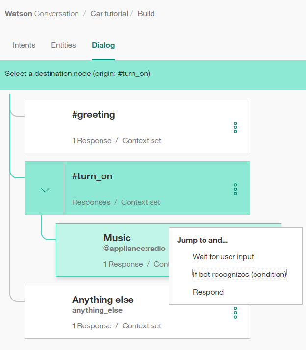
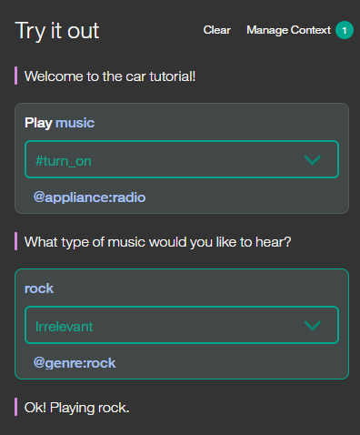
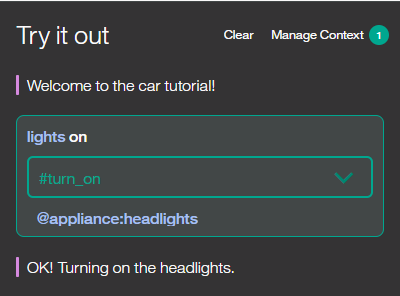
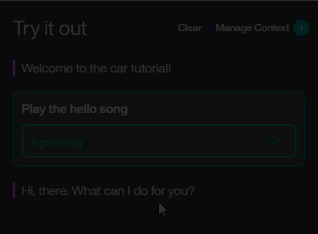

---

copyright:
  years: 2015, 2017
lastupdated: "2017-10-27"

---

{:shortdesc: .shortdesc}
{:new_window: target="_blank"}
{:tip: .tip}
{:pre: .pre}
{:codeblock: .codeblock}
{:screen: .screen}
{:javascript: .ph data-hd-programlang='javascript'}
{:java: .ph data-hd-programlang='java'}
{:python: .ph data-hd-programlang='python'}
{:swift: .ph data-hd-programlang='swift'}

# Esercitazione: creazione di un dialogo complesso
{: #tutorial}

In questa esercitazione, utilizzerai il servizio {{site.data.keyword.conversationshort}} per creare un dialogo che aiuti gli utenti a interagire con un dashboard di automobile cognitiva.
{: shortdesc}

## Obiettivi di apprendimento

Al termine dell'esercitazione, imparerai a:

- Definire le entità
- Pianificare un dialogo
- Utilizzare le condizioni di nodo e risposta in un dialogo

### Durata
Il completamento di questa esercitazione richiede circa 2 o 3 ore.

### Prerequisito

Prima di iniziare, completa l'[Esercitazione introduttiva](getting-started.html). 

Utilizzerai lo spazio di lavoro Esercitazione di conversazione che hai creato e aggiungerai dei nodi al semplice dialogo che hai costruito come parte dell'esercitazione iniziale.

## Passo 1: aggiungi intenti ed esempi
{: #intents}

Aggiungi un intento alla scheda Intenti. Un intento è lo scopo o l'obiettivo espresso nell'input utente.

1.  Nella pagina Intenti dello spazio di lavoro Esercitazione di conversazione, fai clic su **Crea nuovo**.
1.  Aggiungi il seguente nome intento e premi Invio.

    ```
    turn_on
    ```
    {: codeblock}

    Un simbolo `#` viene anteposto al nome dell'intento specificato. L'intento `#turn_on` indica che l'utente desidera attivare un dispositivo come la radio, i tergicristalli o i fari.
1.  Nel campo **Esempio utente**, immetti la seguente espressioni e premi Invio:

    ```
    I need lights
    ```
    {: codeblock}

1.  Aggiungi questi altri 5 esempi per aiutare Watson a riconoscere l'intento `#turn_on`.

    ```
    Play some tunes
    Turn on the radio
    turn on
    Air on please
    Crank up the AC
    Turn on the headlights
    ```
    {: codeblock}

1.  Fai clic su **Fatto** per aggiungere l'intento.

Adesso hai tre intenti, `#turn_on`, `#greeting` e `#goodbye`, ognuno con istruzioni di esempio. Questi esempi aiutano ad addestrare Watson a riconoscere gli intenti nell'input utente.

## Passo 2: aggiungi le entità
{: #entities}

Una definizione di entità include un insieme di *valori* di entità che possono essere utilizzati per attivare risposte diverse. Ogni valore di entità può avere più *sinonimi*, che definiscono i diversi modi in cui lo stesso valore può essere specificato nell'input utente.

Crea le entità che potrebbero verificarsi nell'input utente che ha l'intento #turn_on per rappresentare ciò che l'utente desidera attivare.

1.  Fai clic sulla scheda **Entità** per aprire la pagina Entità.
1.  Fai clic su **Crea nuovo**.
1.  Aggiungi il seguente nome entità e premi Invio.

    ```
    appliance
    ```
    {: codeblock}

    Un simbolo `@` viene anteposto al nome dell'entità specificato. L'entità `@appliance` rappresenta un dispositivo nell'automobile che un utente potrebbe voler attivare.
1.  Fai clic sull'interruttore per **attivare** la corrispondenza fuzzy.
    Questa impostazione aiuta il servizio a riconoscere i riferimenti alle entità nell'input utente anche quando l'entità viene specificata in un modo che non corrisponde esattamente alla sintassi che usi qui.
1.  Aggiungi il seguente valore al campo **Valore**, ma non premere Invio:

    ```
    radio
    ```
    {: codeblock}

    Il valore rappresenta uno specifico dispositivo che gli utenti potrebbero voler attivare.
1.  Aggiungi altri modi per specificare l'entità del dispositivo radio nel campo **Sinonimi**. Premi il tasto Tab per attivare il campo e immetti quindi i seguenti sinonimi. Premi Invio dopo ogni sinonimo.

    ```
    music
    tunes
    ```
    {: codeblock}

1.  Fai clic sull'icona **Aggiungi un nuovo valore**  per aggiungere altri tipi di dispositivi.
    - Valore: `headlights`. Sinonimo: `lights`.
    - Valore: `air conditioning`. Sinonimi: `air` e `AC`.
1.  Fai clic su **Fatto** per aggiungere l'entità **@appliance**.
1.  Ripeti i passi 2-8 per creare l'entità @`genre` con la corrispondenza fuzzy attivata e i seguenti valori e sinonimi:
    - Valore: `classical`. Sinonimo: `symphonic`.
    - Valore: `rhythm and blues` Sinonimo: `r&b`.
    - Valore: `rock`. Sinonimo: `rock & roll`, `rock and roll` e `pop`.

Hai definito due entità: `@appliance` (che rappresenta un dispositivo che il bot può attivare) e `@genre` (che rappresenta un genere di musica che l'utente può scegliere di ascoltare).

Quando l'input dell'utente viene ricevuto, il servizio {{site.data.keyword.conversationshort}} identifica sia gli intenti che le entità. Puoi ora definire un dialogo che utilizza intenti ed entità per scegliere la risposta corretta.

## Passo 3: crea un dialogo complesso
{: #complex-dialog}

In questo dialogo complesso, creerai dei rami di dialogo che gestiscono l'intento #turn_on definito in precedenza.

### Aggiungi un nodo di base per #turn_on
Crea un ramo di dialogo per rispondere all'intento #turn_on. Inizia creando il nodo di base:

1.  Fai clic sull'icona Altro  sul nodo **#greeting** e seleziona **Aggiungi nodo in basso**.
1.  Inizia a immettere `#turn_on` nel campo di condizione e quindi selezionala dall'elenco.
    Questa condizione viene attivata da qualsiasi input che corrisponde all'intento  #turn_on.
1.  Non immettere una risposta in questo nodo. Fai clic su  per chiudere la vista di modifica del nodo.

### Scenari
Il dialogo deve determinare quale dispositivo l'utente desidera attivare. Per gestire ciò, crea più risposte in base a condizioni aggiuntive.

Ci sono tre possibili scenari, basati sugli intenti e le entità che hai definito:

**Scenario 1**: l'utente vuole attivare la musica, nel qual caso il bot deve chiedere il genere.

**Scenario 2**: l'utente vuole attivare qualsiasi altro dispositivo valido, nel qual caso il bot ripete il nome del dispositivo richiesto in un messaggio che indica che verrà attivato.

**Scenario 3**: l'utente non specifica un nome dispositivo riconoscibile, nel qual caso il bot deve chiedere un chiarimento. 

Aggiungi i nodi che verificano queste condizioni di scenario in quest'ordine in modo che il dialogo valuti prima la condizione più specifica.

### Risolvi lo scenario 1

Aggiungi i nodi che risolvono lo scenario 1, che è quello in cui l'utente desidera attivare la musica. In risposta, il bot deve chiedere il genere musicale.

#### Aggiungi un nodo figlio che controlla se il tipo di dispositivo è musica

1.  Fai clic sull'icona Altro  sul nodo **#turn_on** e seleziona **Aggiungi nodo figlio**.
1.  Nel campo di condizione, immetti `@appliance:radio`.
    Questa condizione è true se il valore dell'entità @appliance è `radio` o uno dei suoi sinonimi, come definito nella scheda Entità.
1.  Nel campo di risposta, immetti `What kind of music would you like to hear?`
1.  Denomina il nodo `Music`.
1.  Fai clic su  per chiudere la vista di modifica del nodo.

#### Aggiungi un passaggio dal nodo #turn_on al nodo Music

Passa direttamente dal nodo `#turn on` al nodo `Music` senza chiedere ulteriori input utente. Per farlo, puoi utilizzare un'azione **Passa a**.

1.  Fai clic sull'icona Altro  sul nodo **#turn_on** e seleziona **Passa a**.
1.  Seleziona il nodo figlio **Music** e seleziona quindi **If bot recognizes (condition)** per indicare che vuoi elaborare la condizione del nodo Music.



Nota che devi creare il nodo di destinazione (il nodo a cui vuoi passare) prima di aggiungere l'azione **Passa a**.

Dopo aver creato la relazione Passa a, vedi una nuova voce nella struttura ad albero:


#### Aggiungi un nodo figlio che controlla il genere musicale

Adesso aggiungi un nodo per elaborare il tipo di musica richiesto dall'utente.

1.  Fai clic sull'icona Altro  sul nodo **Music** e seleziona **Aggiungi nodo figlio**.
    Questo nodo figlio viene valutato solo dopo che l'utente ha risposto alla domanda sul tipo di musica che vuole ascoltare. Poiché abbiamo bisogno di un input utente prima di questo nodo, non è necessario utilizzare un'azione **Passa a**.
1.  Aggiungi `@genre` nel campo di condizione.  Questa condizione è true ogni volta che viene rilevato un valore valido per l'entità @genre.
1.  Immetti `OK! Playing @genre.` come risposta. Questa risposta reitera il valore di genere fornito dall'utente.

#### Aggiungi un nodo che gestisce i tipi di genere non riconosciuti nelle risposte dell'utente

Aggiungi un nodo per rispondere quando l'utente non specifica un valore riconosciuto per @genre.

1.  Fai clic sull'icona Altro  sul nodo *@genre* e seleziona **Aggiungi nodo in basso** per creare un nodo peer.
1.  Immetti `true` nel campo di condizione.
    La condizione true è una condizione speciale. Specifica che se il flusso di dialogo raggiunge questo nodo, deve sempre essere valutato come true. (Se l'utente specifica un valore @genre valido, questo nodo non verrà mai raggiunto.)
1.  Immetti `I'm sorry, I don't understand. I can play classical, rhythm and blues, or rock music.` come risposta.

Questo riguarda tutti i casi in cui l'utente chiede di attivare la musica.

#### Verifica il dialogo per la musica

1.  Seleziona l'icona  per aprire il riquadro di chat.
1.  Immetti `Play music`.
    Il bot riconosce l'intento #turn_on e l'entità @appliance:music e risponde chiedendo un genere musicale.

1.  Immetti un valore @genre valido (ad esempio, `rock`).
    Il bot riconosce l'entità @genre e risponde nel modo appropriato.

    

1.  Immetti di nuovo `Play music`, ma questa volta specifica una risposta non valida per il genere. Il bot risponde che non ha capito.

### Risolvi lo scenario 2

Aggiungeremo i nodi che risolvono lo scenario 2, che è quello in cui l'utente desidera attivare un altro dispositivo valido. In questo caso, il bot ripete il nome del dispositivo richiesto in un messaggio che indica che verrà attivato.

#### Aggiungi un nodo figlio che controlla un qualsiasi dispositivo

Aggiungi un nodo che viene attivato quando l'utente fornisce un qualsiasi altro valore valido per @appliance.
Per gli altri valori di @appliance, il bot non ha bisogno di chiedere ulteriori input. Restituisce solo una risposta positiva.

1.  Fai clic sull'icona Altro  sul nodo **Music** e seleziona **Aggiungi nodo in basso** per creare un nodo peer che viene valutato dopo la valutazione della condizione @appliance:music.
1.  Immetti `@appliance` come condizione del nodo.
    Questa condizione viene attivata se l'input utente include qualsiasi valore riconosciuto per l'entità @appliance oltre alla musica.
1.  Immetti `OK! Turning on the @appliance.` come risposta.
    Questa risposta reitera il valore di dispositivo fornito dall'utente.

#### Verifica il dialogo con altri dispositivi

1.  Seleziona l'icona  per aprire il riquadro di chat.
1.  Immetti `lights on`.

    Il bot riconosce l'intento #turn_on e l'entità @appliance:headlights e risponde con `OK, turning on the headlights`.

    

1.  Immetti `turn on the air`.

    Il bot riconosce l'intento #turn_on e l'entità @appliance:(air conditioning) e risponde con `OK, turning on the air conditioning.`

1.  Prova le varianti su tutti i comandi supportati in base alle espressioni di esempio e ai sinonimi di entità che hai definito.

### Risolvi lo scenario 3

Ora aggiungi un nodo peer che viene attivato se l'utente non specifica un tipo di dispositivo valido.

1.  Fai clic sull'icona Altro sul nodo **@appliance** e seleziona **Aggiungi nodo in basso** per creare un nodo peer che viene valutato dopo la valutazione della condizione @appliance.
1.  Immetti `true` nel campo di condizione.
    (Se l'utente specifica un valore @appliance valido, questo nodo non verrà mai raggiunto.)
1.  Immetti `I'm sorry, I'm not sure I understood you. I can turn on music, headlights, or air conditioning.` come risposta.

#### Verifica ancora

1.  Prova più varianti di espressioni per verificare il dialogo.

    Se il bot non riesce a riconoscere l'intento corretto, puoi riaddestrarlo direttamente dalla finestra di chat. Seleziona la freccia accanto all'intento errato e scegli quello corretto dall'elenco.

    

#### Operazioni successive

Facoltativamente, riesamina lo spazio di lavoro **Dashboard automobile - Esempio** per vedere questo stesso caso di utilizzo arricchito ancora di più con un dialogo più lungo e ulteriori funzionalità.

1.  Fai clic sul pulsante **Torna a spazi di lavoro**  dal menu di navigazione.

1.  Nel tile **Dashboard automobile - Esempio**, fai clic su **Modifica esempio**.

## Passo 4: distribuisci lo spazio di lavoro dell'esercitazione
{: #deploy}

Ora che hai creato e testato il tuo spazio di lavoro, puoi distribuirlo collegandolo a un'interfaccia utente. Ci sono diversi modi per farlo.

### Test in Slack

Puoi utilizzare lo strumento di distribuzione di test per [distribuire il tuo spazio di lavoro](test-deploy.html) come chatbot in un canale Slack in pochi passi. Questa opzione è il modo più veloce e semplice per distribuire il tuo spazio di lavoro per il test, ma ha delle limitazioni.

### Crea la tua applicazione di front-end

Puoi utilizzare gli SDK Watson per [creare la tua propria](develop-app.html) applicazione di front-end che si connette al tuo spazio di lavoro utilizzando l'API REST Conversation.

### Distribuisci a canali di social media e di messaggistica

Puoi utilizzare il [framework Botkit](integrations.html) per creare un'applicazione bot che puoi integrare con i canali di social media e di messaggistica come Slack, Facebook e Twilio.
