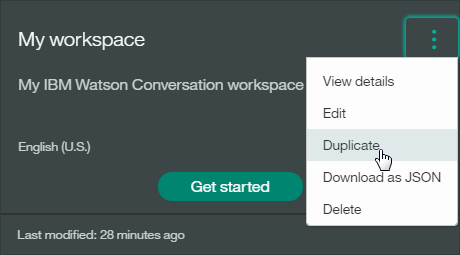

---

copyright:
  years: 2015, 2017
lastupdated: "2017-10-17"

---

{:shortdesc: .shortdesc}
{:new_window: target="_blank"}
{:tip: .tip}
{:pre: .pre}
{:codeblock: .codeblock}
{:screen: .screen}
{:javascript: .ph data-hd-programlang='javascript'}
{:java: .ph data-hd-programlang='java'}
{:python: .ph data-hd-programlang='python'}
{:swift: .ph data-hd-programlang='swift'}

# Conversation ワークスペースの構成

{{site.data.keyword.conversationshort}} サービスの自然言語処理は*ワークスペース* 内で行われます。ワークスペースはアプリケーションの会話フローを定義するすべての成果物のコンテナーです。
{: shortdesc}

1 つの {{site.data.keyword.conversationshort}} サービス・インスタンスに複数のワークスペースを含めることができます。ワークスペースには次のタイプの成果物が格納されます。

- [**インテント**](intents.html): *インテント* はユーザー入力の目的 (事業場所の問い合わせや請求書の支払いなど) を表します。インテントの定義は、アプリケーションがサポートするユーザー要求の各タイプに対して行います。ツールでは、インテントの名前には常に `#` 文字が接頭部として付けられます。ワークスペースがインテントを認識できるようにトレーニングするには、多数のユーザー入力サンプルを用意し、入力サンプルがどのインテントにマップされるかを示します。
- [**エンティティー**](entities.html): *エンティティー* は、インテントに関連していて、かつ、インテントのための特定のコンテキストを提供する用語またはオブジェクトを表します。例えば、エンティティーは、ユーザーが事業場所を探している都市、または請求支払いの金額を表すことがあります。ツールでは、エンティティーの名前には常に `@` 文字が接頭部として付けられます。ワークスペースがエンティティーを認識できるようにトレーニングするには、各エンティティーの値と、ユーザーが入力する可能性がある同義語をリストします。
- [**ダイアログ**](dialog-build.html): *ダイアログ* は、定義済みのインテントとエンティティーを認識したときに、アプリケーションがどのように応答するかを定義する会話フロー・ブランチです。ツールのダイアログ・ビルダーを使用して、ユーザー入力内で認識されるインテントとエンティティーに基づいて応答を提供するユーザーとの会話を作成します。

情報を追加するにつれてワークスペースはそれ自体をトレーニングするので、ユーザーはトレーニングを開始するために何かを実行する必要はありません。

## ワークスペースの制限
{: #workspace-limits}

1 つのサービス・インスタンスで作成できるワークスペースの数は、ご利用の {{site.data.keyword.conversationshort}} サービス・プランによって異なります。サンプル・ワークスペースは、ユーザーが編集したり複製したりしない限り、ワークスペースの制限の計算には加算されません。

| サービス・プラン| サービス・インスタンスごとのワークスペース数|
|------------------|--------------------------------:|
| 標準/プレミアム |                              20 |
| ライト*            |                               5 |

*30 日間操作がないと、スペースを解放するため未使用の「ライト」のワークスペースは削除される場合があります。

## ワークスペースの作成
{: #creating-workspaces}

ワークスペースは、初めから作成することも、提供されているサンプル・ワークスペースを使用することも、JSON ファイルからワークインポートすることもできます。同じサービス・インスタンス内で既存のワークスペースを複製することも可能です。

{{site.data.keyword.conversationshort}} ツールを使用してワークスペースを作成します。ワークスペースを作成するには、次の手順に従ってください。

1.  「サービス詳細情報 (Service Details)」ページをまだ開いていない場合は、コンソールの {{site.data.keyword.conversationshort}} サービス・インスタンスをクリックします。(サービス・インスタンスを作成すると、「サービス詳細情報 (Service Details)」ページが表示されます。)

1.  「サービス詳細情報 (Service Details)」ページで「**会話ツール (Conversation tooling)**」までスクロールし、「**ツールの起動 (Launch tool)**」をクリックします。

1.  以下のいずれかを実行します。
    - ワークスペースを初めから作成するには、「**作成 (Create)**」をクリックします。
    - サンプルを使用して独自のワークスペースを作成するには、サンプル・ワークスペースを編集します。サンプル・ワークスペースを使用して複数のワークスペースを作成する場合は、複製します。
    - JSON ファイルからワークスペースをインポートするには、 アイコンをクリックし、インポート元の JSON ファイルを選択します。

        **重要:**

        - インポートする JSON ファイルは UTF-8 エンコード方式を使用している必要があります。
        - ワークスペースの JSON ファイルの最大サイズは 10MB です。これよりも大きなワークスペースをインポートする必要がある場合は、ワークスペースをインポートした後にインテントとエンティティーを別々にインポートする方法を検討してください。(サイズの大きなワークスペースは、REST API を使用してインポートすることもできます。詳しくは、『[API リファレンス ](https://www.ibm.com/watson/developercloud/conversation/api/v1/#create_workspace){: new_window}』を参照してください。)
        - JSON にはタブ、改行、復帰を含めることができません。

        含めるデータを指定します。

        - ダイアログも含め、エクスポートされたワークスペースの完全なコピーをインポートする場合は、「**すべて (インテント、エンティティー、およびダイアログ) (Everything (Intents, Entities, and Dialog))**」を選択します。
        - エクスポートしたワークスペースのインテントとエンティティーは使用するが、ダイアログは新しいものを作成する予定の場合は、「**インテントとエンティティー (Intents and Entities)**」を選択します。

1.  新規ワークスペースの詳細を指定します。
    - **名前 (Name)**: 長さ 64 文字以下の名前です。この値は必須です。
    - **説明 (Description)**: 長さ 128 文字以下の説明です。
    - **言語 (Language)**: トレーニングの対象となるワークスペースのユーザー入力の言語です。

ワークスペースを作成すると、それは「ワークスペース (Workspaces)」ページのタイルとして表示されます。

## ワークスペースのエクスポートおよびコピー
{: #exporting-and-copying-workspaces}

「ワークスペース (Workspaces)」ページを使用して、ワークスペースをエクスポートしたり、ワークスペースを新しいワークスペースにコピーできます。

ワークスペースをエクスポートすると、ワークスペースのすべてのデータのコピーが JSON ファイルに保存されます。ワークスペースを別のサービス・インスタンスにインポートしたり、ワークスペースのデータのコピーをオフラインで保存する場合は、このオプションを使用します。ワークスペースをインポートする場合に、インテントとエンティティーのみをインポートするように選択できます。これは、同じトレーニング・データを使用して新しいダイアログを作成する場合に有用です。

ワークスペースをコピーすることにより、同じサービス・インスタンス内にワークスペースの完全なコピーが作成されます。元のワークスペースを保存しつつ、既存のワークスペースを調整する場合は、このオプションを選択します。

- 既存のワークスペースを JSON ファイルにエクスポートするには、ワークスペース・タイルのメニュー・アイコンをクリックし、「**JSON としてダウンロード (Download as JSON)**」を選択します。

    
- 既存のワークスペースのコピーを同じサービス・インスタンス内に作成するには、ワークスペース・タイルのメニュー・アイコンをクリックし、「 **複製 (Duplicate)**」を選択します。

    

    新しいワークスペースの名前、説明、および言語を指定します。すべてのデータ (インテント、エンティティー、ダイアログを含む) がコピーに含まれます。

