---

copyright:
  years: 2015, 2017
lastupdated: "2017-10-19"

---

{:shortdesc: .shortdesc}
{:new_window: target="_blank"}
{:tip: .tip}
{:pre: .pre}
{:codeblock: .codeblock}
{:screen: .screen}
{:javascript: .ph data-hd-programlang='javascript'}
{:java: .ph data-hd-programlang='java'}
{:python: .ph data-hd-programlang='python'}
{:swift: .ph data-hd-programlang='swift'}

# ダイアログの作成
{: #dialog-build}

ダイアログでは、ユーザー入力から検出されたインテントとエンティティーに加えてアプリケーションのコンテキストを使用してユーザーと対話し、最終的に有用な応答を返します。
{: shortdesc}

応答は、例えば「`ガソリンスタンドはどこ?`」のような質問に対する回答であったり、ラジオをオンにするなどのコマンドの実行であったりします。検出されたインテントとエンティティーだけで正しい応答を導出できる場合もあれば、正しく応答するためにダイアログでユーザーに追加入力を求めなければならない場合もあります。例えば、ユーザーが「食べ物はどこにある?」と質問した場合は、レストランに行きたいのかそれとも食料品店に行きたいのか、食事をしたいのかそれともテイクアウトしたいのかを明確にする必要があります。テキストによる応答で詳細を尋ね、新たな入力を処理するための子ノードを 1 つ以上作成することができます。

<iframe class="embed-responsive-item" id="youtubeplayer" type="text/html" width="640" height="390" src="https://www.youtube.com/embed/oQUpejt6d84?rel=0" frameborder="0" webkitallowfullscreen mozallowfullscreen allowfullscreen> </iframe>

## ダイアログの概要
{: #overview}

ツールではダイアログはツリーとしてグラフィック表示されます。会話で扱うインテントごとに、インテントを処理するブランチを作成します。1 つのブランチは複数のノードで構成されます。

### ダイアログ・ノード

各ダイアログ・ノードには、少なくとも 1 つの条件と 1 つの応答が含まれます。


- 条件: ダイアログのこのノードをトリガーするためにユーザー入力に含まれている必要がある情報を指定します。特定のインテント、エンティティー値、コンテキスト変数値などの情報です。詳しくは、[条件](#conditions)を参照してください。
- 応答: サービスがユーザーに応答するために使用する発話。プログラムによるアクションをトリガーするように応答を構成することもできます。詳しくは、[応答](#responses)を参照してください。

ノードは if/then 構造を持つものと見なすことができます。その条件が true であれば、その応答が返されます。

例えば、サービスの自然言語処理機能が、ユーザー入力に `#cupcake-menu` インテントが含まれていることを検出した場合は、次のノードがトリガーされます。ノードがトリガーされた結果として、サービスは適切な回答を返します。

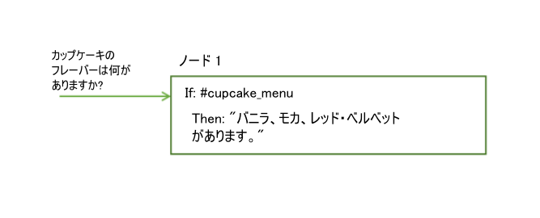

単純なユーザー要求であれば、条件と応答を 1 つずつ含む 1 つのノードで処理できます。しかし、多くの場合、ユーザーはより高度な質問をしたり、より複雑な作業のヘルプを求めたりします。その場合は、サービスに必要な追加情報を提供するようにユーザーに求める子ノードを追加します。

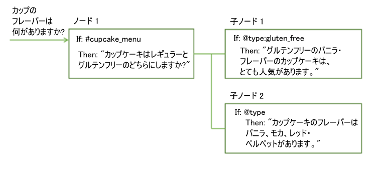

### ダイアログのフロー

作成したダイアログは、サービスによって上から下に処理されます。

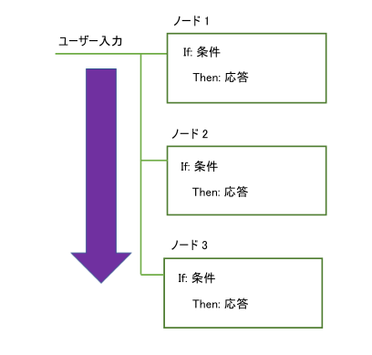

サービスはツリーを上から下に処理し、満たされている条件を検出すると、そのノードをトリガーします。その次は、トリガーしたノードの右に移動して、子ノードの条件とユーザー入力を照合します。子ノードをチェックするときにも、上から下へ行います。

サービスは、ブランチの最後のノードに到達するまで、ダイアログ・ツリーを上から下、左から右、さらに上から下、左から右と処理します。

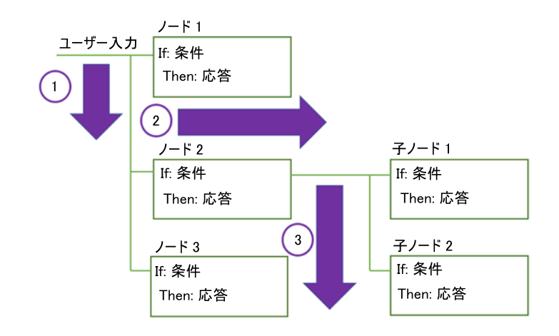

ダイアログの作成を始めるには、ツリーに含めるブランチとその配置場所を決める必要があります。ノードは上から下に評価されるので、ブランチの順序が重要です。入力と条件が一致した最初のベース・ノードが使用されます。つまり、それより下位にあるツリー内のノードはトリガーされません。

## 条件
{: #conditions}

ノード条件により、そのノードを会話で使用するかどうかが決まります。応答条件により、ユーザーに表示する応答が決まります。
条件を定義するには、次の成果物を 1 つ以上組み合わせて使用します。

- **コンテキスト変数**: ノードは、指定したコンテキスト変数式が true の場合に使用されます。`$variable_name:value` または `$variable_name == 'value'` という構文を使用します。[コンテキスト変数](#context)を参照してください。

  コンテキスト変数値を設定するダイアログ・ノードと同じノードに、そのコンテキスト変数値に基づくノード条件または応答条件を定義しないでください。{: tip}

- **エンティティー**: ノードは、ユーザー入力でエンティティー値またはシノニムが認識された場合に使用されます。`@entity_name` という構文を使用します (例: `@city`)。

  必ず、エンティティー値もシノニムも認識されないケースを処理するピア・ノードを作成してください。{: tip}

- **エンティティー値**: ノードは、ユーザー入力でエンティティー値が検出された場合に使用されます。`@entity_name:value` という構文を使用します (例: `@city:Boston`)。シノニムではなく、エンティティーの定義済みの値を指定します。

  ピア・ノードで、特定の値を指定せずにエンティティーが存在するかどうかを確認する場合は、この特定のエンティティー値をチェックするノードを、そのピア・ノードより上に配置してください。
{: tip}

- **インテント**: 最も単純な条件は単一のインテントです。ノードは、ユーザー入力がそのインテントに対応する場合に使用されます。`#intent-name` という構文を使用します。例えば、`#weather` は、ユーザー入力で検出されたインテントが `weather` であるかどうかをチェックします。そうであれば、ノードは処理されます。

- **特殊条件**: 一般的なダイアログ機能を実行できるようにサービスに用意されている条件。

  <table>
  <tr>
    <td>条件名</td>
    <td>説明</td>
  </tr>
  <tr>
    <td>anything_else</td>
    <td>この条件をダイアログの最後で使用して、ユーザー入力が他のどのダイアログ・ノードとも一致しない場合の処理を実行できます。この条件により、**anything_else** ノードがトリガーされます。</td>
  </tr>
  <tr>
    <td>conversation_start</td>
    <td>**welcome** と同じく、この条件はダイアログの最初のターンで true と評価されます。**welcome** とは異なり、アプリケーションからの最初の要求にユーザー入力が含まれているかどうかにかかわらず、true になります。**conversation_start** 条件を指定したノードを使用して、ダイアログの開始時にコンテキスト変数を初期化したり他のタスクを実行したりできます。</td>
  </tr>
  <tr>
    <td>false</td>
    <td>この条件は常に false と評価されます。開発中の最上部で使用してそのブランチが使用されないようにしたり、**Jump to** アクションのターゲットとしてのみ使用される、一般的な機能を提供するノードの条件として使用したりできます。</td>
  </tr>
  <tr>
    <td>irrelevant</td>
    <td>Conversation サービスがユーザー入力を不適当と判断した場合に、この条件は true と評価されます。</td>
  </tr>
  <tr>
    <td>true</td>
    <td>この条件は常に true と評価されます。ノードまたは応答のリストの最後でこれを使用して、それまでの条件と一致しなかったすべての応答をキャッチできます。</td>
  </tr>
  <tr>
    <td>welcome</td>
    <td>この条件は、アプリケーションからの最初の要求にユーザー入力が含まれていない場合にのみ、ダイアログの最初のターン (ダイアログの開始時) に true と評価されます。2 ターン目以降では false と評価されます。この条件により、**Welcome** ノードがトリガーされます。一般的に、この条件のノードはユーザーへのあいさつ文 (例えば、「ピザ注文アプリへようこそ」のようなメッセージ) を表示するために使用します。</td>
  </tr>
  </table>

### 条件の構文

条件で有効な式を作成するには、次のいずれかの構文オプションを使用します。

- Spring Expression (SpEL) 言語。実行時のオブジェクト・グラフの照会と操作をサポートする式言語です。詳しくは、[Spring Expression Language (SpEL) 言語](http://docs.spring.io/spring/docs/current/spring-framework-reference/html/expressions.html){: new_window}を参照してください。

- インテント、エンティティー、コンテキスト変数を参照する省略表現。[オブジェクトへのアクセスと評価](expression-language.html)を参照してください。

正規表現により、条件として使用する値がないかチェックできます。例えば、`String.find` メソッドを使用して、一致する文字列を検索できます。詳しくは、[メソッド](dialog-methods.html)を参照してください。

### 条件の使用上のヒント

- 特定のエンティティー・タイプの最初に検出されたインスタンスの値のみを評価するには、`@entity:(specific-value)` ではなく `@entity == 'specific-value'` という構文を使用します。例えば、`@appliance == 'エアコン'` を使用すると、最初に検出された `@appliance` エンティティーの値のみが評価されます。しかし、`@appliance:(エアコン)` を使用すると、`entity['appliance'].contains('エアコン')` に展開されます。これは、ユーザー入力に「エアコン」という値の `@appliance` エンティティーが 1 つ以上検出されたときに必ず一致します。
- 数値変数を使用する場合は、変数に値があることを確認してください。値がない変数は、数値比較でヌル値 (0) として扱われます。例えば、`@price < 100` という条件で変数の値をチェックし、@price エンティティーがヌルである場合、 0 は 100 未満であるため、価格が設定されていなかったにもかかわらず、条件が `true` と評価されます。ヌル変数のチェックを回避するには、`@price AND @price < 100` のような条件を使用します。@price に値がなければ、この条件は正しく false という結果を返します。
- 条件としてエンティティーを使用し、ファジー・マッチングが有効であるときには、一致信頼度が 30% を超える場合にのみ、`@entity_name` は true に評価されます。つまり、`@entity_name.confidence > .3` である場合のみです。

## 応答
{: #responses}

ダイアログの応答は、ユーザーへの応答方法を定義するものです。

次のいずれかの応答タイプを使用できます。

- [単純なテキスト応答](#simple-text)
- [複数の条件付き応答](#multiple)
- [複雑な応答](#complex)

### 単純なテキスト応答
{: #simple-text}

テキスト応答を提供する場合は、単に、サービスでユーザーに表示するテキストを入力します。

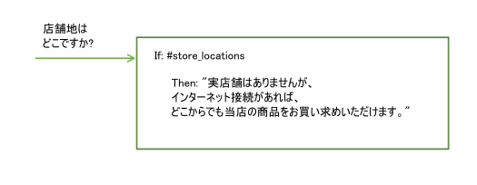

#### バリエーションの追加
{: #variety}

常に同じあいさつと応答を聞かされては、ダイアログ・サービスをよく利用するユーザーがうんざりする可能性があります。*バリエーション*を応答に追加すると、Conversation が同じ条件に対してさまざまな方法で応答できるようになります。

<iframe class="embed-responsive-item" id="youtubeplayer" type="text/html" width="640" height="390" src="https://www.youtube.com/embed/nAlIW3YPrAs?rel=0" frameborder="0" webkitallowfullscreen mozallowfullscreen allowfullscreen> </iframe>

次の例では、店舗地についての質問に対する応答として、サービスが対話ごとに異なる回答を返します。

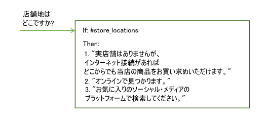

応答のバリエーションを順番に選択するか、ランダムな順序で選択するかを選択できます。デフォルトでは、順序付きリストから選択されたかのように、応答は順番に選択されます。

### 条件付き応答
{: #multiple}

1 つのダイアログ・ノードで、条件に応じてさまざまな応答をトリガーすることができます。このアプローチを使用すると、単一ノードで複数のシナリオに対処できます。

<iframe class="embed-responsive-item" id="youtubeplayer" type="text/html" width="640" height="390" src="https://www.youtube.com/embed/KcvVQAsnhLM?rel=0" frameborder="0" webkitallowfullscreen mozallowfullscreen allowfullscreen> </iframe>

このようなノードにもメインの条件があります。それは、そのノードを使用して、ノードに含まれている条件と応答を処理するための条件です。

この例では、サービスは前に収集したユーザーの現在地についての情報を基に応答を調整し、ユーザーの最寄りの店舗に関する情報を提供しています。ユーザーから収集した情報の保管方法について詳しくは、[コンテキスト変数](#context)を参照してください。

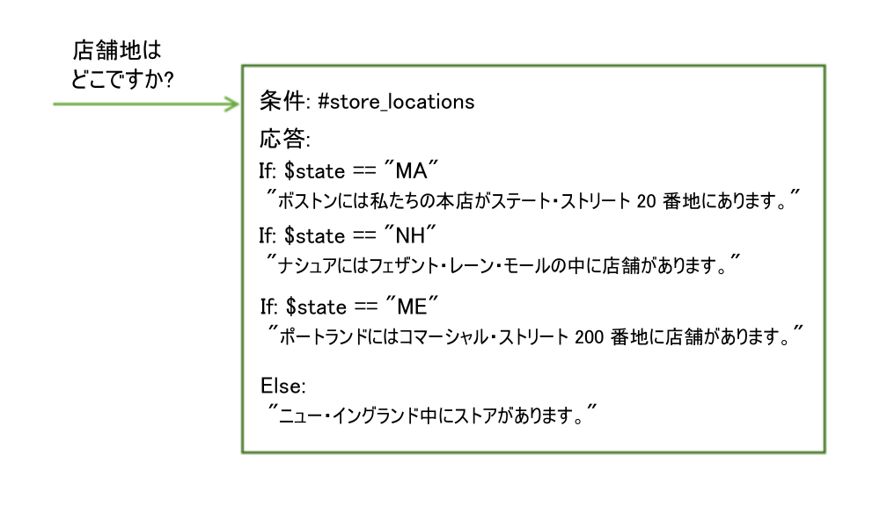

この単一のノードは、ノード 4 つ分に相当する機能を備えています。

ノード内の条件は、ノードと同様に順序どおりに評価されます。必ず、条件と応答を正しい順序でリストしてください。順序を変更する必要がある場合は、条件を選択し、表示される矢印を使用してリスト内で条件を上下に移動します。コンテキストを更新するには、応答ごとに更新する必要があります。共通の応答セクションはありません。**Jump to** アクションは、応答が選択され、提供された後で処理されます。追加した **Jump to** アクションは、ノードから応答が返された後に実行されます。
{: tip}

### 複雑な応答
{: #complex}

より複雑な応答を指定するには、JSON エディターを使用して、`"output":{}` プロパティーで応答を指定します。

応答にコンテキスト変数の値を含めるには、`$variable-name` という構文を使用して指定します。詳しくは、[コンテキスト変数](#context)を参照してください。

```json
{
  "output": {
    "text": "Hello $user"
  }
}
```
{: codeblock}

複数の文を別々の行に表示するには、出力を JSON 配列として定義します。

```json
{
  "output": {
    "text": ["Hello there.", "How are you?"]
  }
}
```
{: codeblock}

最初の文が表示された行の下に、2 番目の文が別の行として表示されます。

より複雑な動作を実装するには、出力テキストを複合 JSON オブジェクトとして定義します。例えば、JSON 出力で複合オブジェクトを使用して、ノードに応答のバリエーションを追加する動作を模倣できます。この複合オブジェクトには、次のプロパティーを指定できます。

- **values**: このダイアログ・ノードから返せる複数のバージョンの出力テキストを保持する文字列の JSON 配列。配列内の値が返される順序は、属性 `selection_policy` に応じて異なります。

- **selection_policy**: 以下の値が有効です。

    - **random**: `values` 配列から出力テキストがランダムに選択されます。同じ値が連続で選択されることはありません。例えば、output.text に 3 つの値が含まれているとします。最初の 3 回はランダム値が選択されますが、同じ値が連続することはありません。すべての出力値が選択された後、新たな値がランダムに選択され、プロセスが繰り返されます。

        ```json
        {
            "output":{
                "text":{
                    "values":["Hello.","Hi.","Howdy!"],
                    "selection_policy":"random"
                }
            }
        }
        ```
        {: codeblock}

    システムは、この 3 つのあいさつから 1 つをランダムに選択して返します。次に応答がトリガーされたときには、リストの別のあいさつが表示されます。使用したあいさつを意図的に繰り返さない場合を除き、あいさつはもう一度ランダムに選択されます。

    - **sequential**: システムは、ダイアログ・ノードが最初にトリガーされたときには最初の出力テキストを返し、2 回目にトリガーされたときには 2 番目の出力テキストを返す、というように処理します。

        ```json
        {
            "output":{
                "text":{
                    "values":["Hello.","Hi.","Howdy!"],
                    "selection_policy":"sequential"
                }
            }
        }
        ```
        {: codeblock}

- **append**: 配列に値を追加するか、配列の値を新しい値で上書きするかを指定します。false に設定すると、前に実行されたダイアログ・ノードで収集された出力が、この特定のノードのテキストで上書きされます。

    ```json
    {
        "output":{
                "text":{
                    "values": ["Hello."],
                "append":false
            }
        }
    }
    ```
    {: codeblock}

    この場合、他のすべての出力テキストが、この出力テキストで上書きされます。

デフォルトの動作は、`selection_policy = random` と `append = true` が前提です。values 配列に複数の項目が含まれている場合、出力テキストはそれらの要素からランダムに選択されます。

### 次の処理の定義
{: #jump-to}

指定された応答を返した後に、次のいずれかの処理を行うようにサービスに命令できます。

- **ユーザー入力を待機する**: サービスが、応答に対するユーザーからの新しい入力を待機します。例えば、応答でユーザーに「はい」または「いいえ」で回答する質問をしたとします。このダイアログは、ユーザーが回答を入力するまで進行しません。
- **別のダイアログ・ノードにジャンプする**: ユーザーの入力を待たずに、ダイアログを子ノードやまったく別のダイアログ・ノードに直接移動させるには、このオプションを使用します。例えば、Jump to アクションを使用して、ツリー内の複数の場所から共通のダイアログ・ノードにフローを向かわせることができます。
  >注: ジャンプ先のノードを使用するように Jump to アクションを構成する前に、そのターゲット・ノードが存在している必要があります。

#### Jump to アクションの構成

別のノードにジャンプする場合は、そのアクションのターゲットが、選択したダイアログ・ノードの**応答**であるのか、それとも**条件**であるのかを指定する必要があります。

- **応答**: ステートメントのターゲットが、選択したダイアログ・ノードの応答部分である場合は、即時に実行されます。つまり、システムは選択したダイアログ・ノードの条件部分を評価せず、選択したダイアログ・ノードの応答部分を即時に実行します。

  複数のダイアログ・ノードをチェーニングする場合は、応答をターゲットにすると便利です。選択したダイアログ・ノードの応答部分が、そのダイアログ・ノードの条件が true であったかのように処理されます。選択したダイアログ・ノードに **Jump to** アクションがもう 1 つ含まれている場合は、そのアクションも即時に実行されます。
- **条件**: ステートメントのターゲットが、選択したダイアログ・ノードの条件部分である場合、サービスはまず、ジャンプ先ノードの条件が true と評価されるかどうかをチェックします。
    - 条件が true と評価された場合、システムは、コンテキストをダイアログ・ノードのコンテキストで更新し、出力をダイアログ・ノードの出力で更新して、このノードを即時に処理します。
    - 条件が true と評価されなかった場合、システムは、ジャンプ先のダイアログ・ノードの次の兄弟ノードの条件の評価プロセスを開始し、条件が true と評価されるダイアログ・ノードが検出されるまで続けます。
    - すべての兄弟が処理され、true と評価される条件がなかった場合は、基本フォールバック戦略が使用され、ダイアログは最上位のノードも評価します。

    ダイアログ・ノードの条件をチェーニングする場合は、条件をターゲットにすると便利です。例えば、最初に入力に `#turn_on` などのインテントが含まれているかどうかをチェックし、含まれている場合は、入力に `@lights`、`@radio`、`@wipers` などのエンティティーが含まれているかどうかをチェックします。条件をチェーニングすることで、大規模なダイアログ・ツリーを構成できます。

**注**: 2017 年 2 月 3 日のリリースで **Jump to** アクションの処理が変更されました。詳しくは、[ワークスペースのアップグレード](upgrading.html){: new_window}を参照してください。

#### 詳細情報

ダイアログで使用する式言語、メソッド、システム・エンティティー、およびその他の役立つ詳細情報については、ナビゲーション・ペインの「リファレンス」セクションを参照してください。

## コンテキスト変数
{: #context}

ダイアログはステートレスです。つまり、ユーザーとの対話情報は、次回の対話まで保持されません。継続的な情報が必要な場合には、アプリケーション側で保持する必要があります。ただし、アプリケーションからダイアログに情報を渡し、ダイアログでその情報を更新してアプリケーションに戻すことはできます。これは、コンテキスト変数を使用して行います。

コンテキスト変数は、ノード内で定義する変数であり、必要な場合にはデフォルト値を指定することもできます。コンテキスト変数の値は、後から他のノードまたはアプリケーション・ロジックで設定したり変更したりできます。 

ダイアログ・ノード条件でコンテキスト変数を参照してノードを実行するかどうかを決定することで、コンテキスト変数値を条件として使用できます。さらに、ダイアログ・ノードの応答条件からコンテキスト変数を参照し、外部サービスまたはユーザーから提供された値に応じて応答を変えることができます。

### アプリケーションからコンテキストを渡す

アプリケーションからダイアログに情報を渡すには、コンテキスト変数を設定し、コンテキスト変数をダイアログに渡します。

例えば、アプリケーションが設定してダイアログに渡した $time_of_day コンテキスト変数を基に、ダイアログがユーザーに表示するあいさつを決定することができます。

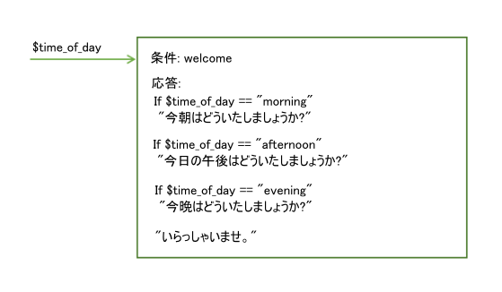

この例では、アプリケーションが変数を *morning*、*afternoon*、*evening* のどの値に設定したかを、ダイアログが認識します。ダイアログは各値をチェックし、設定された値に応じて適切なあいさつを返します。変数が渡されないか、変数値がどの期待値とも一致しない場合は、より一般的なあいさつがユーザーに表示されます。

### ノードからノードへコンテキストを渡す

ダイアログではコンテキスト変数を追加して、あるノードから別のノードに情報を渡したり、コンテキスト変数の値を更新したりすることもできます。ダイアログでユーザーに質問して情報を取得したら、その情報を記録し、後でダイアログで参照することができます。

例えば、あるノードでユーザーに名前を尋ね、後から別のノードでユーザーを名前で呼ぶことができます。

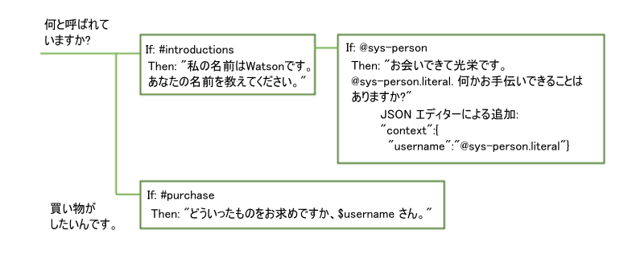

この例では、システム・エンティティー @sys-person を使用して、ユーザー入力からユーザー名を抽出します。JSON エディターで、username コンテキスト変数を定義し、@sys-person 値に設定します。それ以降のノードでは、$username コンテキスト変数を応答に指定して、ユーザーを名前で呼んでいます。

### コンテキスト変数の定義

コンテキスト変数を定義するには、JSON ダイアログ・ノード定義の `{context}` セクションに `name` と `value` のペアを追加します。ペアは以下の要件を満たす必要があります。

- `name` には、英字の大小文字、数字 (0 から 9 まで)、下線を使用できます。

  **注**: 名前にはピリオドやハイフンなど、その他の文字も使用できます。ただしこれらの文字を使用する場合は、次のいずれかの方法で変数を参照する必要があります。
  - context['variable-name']: The 完全な SpEL 式構文。
  - $(variable-name): 変数名を括弧で囲んだ省略構文。

  詳しくは、[オブジェクトへのアクセスと評価](expression-language.html#shorthand-syntax-for-context-variables)を参照してください。

- `value` には、単純な文字列変数、数値、JSON 配列、JSON オブジェクトなど、サポートされている任意の JSON 型を使用できます。

次の JSON のサンプルでは、$dessert 文字列、$toppings_array 配列、$age 数値のコンテキスト変数の値を定義しています。

```json
{
  "context": {
    "dessert": "ice-cream",
    "toppings_array": ["onion", "olives"],
    "age": 18
  }
}
```
{: codeblock}

コンテキスト変数を定義するには、以下の手順を実行します。

1.  ノードの編集ビューで  アイコンをクリックし、「**JSON**」を選択して JSON エディターを開きます。

1.  `"output":{}` ブロックの前に `"context":{}` ブロックがない場合は追加します。

    ```json
    {
      "context":{},
      "output":{}
    }
    ```
    {: codeblock}

1.  コンテキスト・ブロックに、定義する各コンテキスト変数の名前と値のペアを追加します。

    ```json
    {
      "context": {
    "name": "value"
    },
    ...
    }
    ```
    {: codeblock}

  コンテキスト変数を後から参照するには、`$name` という構文を使用します。ここで、*name* は定義したコンテキスト変数の名前です。

その他の一般的なタスクは次のとおりです。

- ユーザーが入力した文字列全体を格納するには、`input.text` を使用します。

    ```json
    {
      "context": {
    "repeat": "<?input.text?>"
      }
    }
    ```
    {: codeblock}

- エンティティーの値をコンテキスト変数に格納するには、次の構文を使用します。

    ```json
    {
      "context": {
    "place": "@place"
      }
    }
    ```
    {: codeblock}

- 正規表現を使用してユーザー入力から抽出した文字列の値をコンテキスト変数に格納するには、次の構文を使用します。

    ```json
    {
      "context": {
    "number": "<?input.text.extract('^[^\\d]*[\\d]{11}[^\\d]*$',0)?>"
      }
    }
    ```
    {: codeblock}

- パターン・エンティティーの値をコンテキスト変数に格納するには、エンティティー名に .literal を追加します。この構文を使用すると、ユーザー入力のうち、指定したパターンと一致する正確な範囲のテキストが変数に格納されます。

    ```json
    {
      "context": {
    "email": "@email.literal"
      }
    }
    ```
    {: codeblock}

### 処理の順序
{: #order-of-context-var-ops}

コンテキスト変数は、定義した順序どおりにサービスで評価されるわけではありません。サービスは、JSON の名前と値のペアとして定義されている変数をランダムな順序で評価します。リスト内の最初のコンテキスト変数がリスト内の 2 番目のコンテキスト変数の前に実行される保証はないため、最初のコンテキスト変数に設定した値を 2 番目のコンテキスト変数で使用できると想定しないでください。例えば、2 つのコンテキスト変数を使用して、ゼロからそれより大きい値までの範囲内の乱数を返し、それをノードに渡すロジックを実装しないでください。

```json
"context": {
    "upper": "<? @sys-number.numeric_value + 1?>",
    "answer": "<? new Random().nextInt($upper) ?>"
}
```
{: codeblock}

$upper コンテキスト変数の値が $answer コンテキスト変数より先に評価されることに依存しなくても済むように、少し複雑な式を使用します。

```json
"context": {
    "answer": "<? new Random().nextInt(@sys-number.numeric_value + 1) ?>"
}
```
{: codeblock}

### コンテキスト変数値の更新
{: #updating-a-context-variable-value}

既に設定されていたコンテキスト変数の値をノードが設定すると、前の値は上書きされます。

#### 複雑な JSON オブジェクトの更新

JSON オブジェクト以外の JSON タイプでは、前の値が上書きされます。コンテキスト変数が JSON オブジェクトなどの複合タイプである場合は、JSON のマージ処理を使用して変数が更新されます。マージ処理によって、新しく定義したプロパティーが追加され、オブジェクトの既存のプロパティーが上書きされます。

次の例では、名前のコンテキスト変数が複合オブジェクトとして定義されています。

```json
{
  "context": {
    ...
    "complex_object": {
      "user_firstname" : "Paul",
      "user_lastname" : "Pan"
      "has_card" : false
    }
  }
}
```
{: codeblock}

このコンテキスト変数の JSON オブジェクトを、ダイアログ・ノードで次の値に更新します。

```json
{
  "complex_object": {
      "user_firstname": "Peter",
    "has_card": true
  }
}
```
{: codeblock}

結果のコンテキストは次のようになります。

```json
{
  "complex_object": {
      "user_firstname": "Peter",
    "user_lastname": "Pan",
    "has_card": true
  }
}
```
{: codeblock}

#### 配列の更新

ダイアログのコンテキスト・データに値の配列が含まれている場合は、値を追加したり、削除したり、すべての値を置換したりして配列を更新できます。

以下のいずれかのアクションを選択して配列を更新できます。すべてのケースについて、アクションの前の配列、アクション、アクションが適用された後の配列を示しています。

- **追加**: 配列の最後に値を追加するには、`append` メソッドを使用します。

    このダイアログ実行時のコンテキスト:

    ```json
    {
      "context": {
    "toppings_array": ["onion", "olives"]
      }
    }
    ```
    {: codeblock}

    適用する更新:

    ```json
    {
      "context": {
    "toppings_array": "<? $toppings_array.append('ketchup', 'tomatoes') ?>"
      }
    }
    ```
    {: codeblock}

    結果:

    ```json
    {
      "context": {
    "toppings_array": ["onion", "olives", "ketchup", "tomatoes"]
      }
    }
    ```
    {: codeblock}

- **削除**: 要素を削除するには、`remove` メソッドを使用し、配列内の値または位置を指定します。

    - **値で削除**: 要素の値を指定して、配列から要素を削除します。

        このダイアログ実行時のコンテキスト:

        ```json
        {
          "context": {
    "toppings_array": ["onion", "olives"]
      }
    }
        ```
        {: codeblock}

        適用する更新:

        ```json
        {
          "context": {
    "toppings_array": "<? $toppings_array.removeValue('onion') ?>"
          }
        }
        ```
        {: codeblock}

        結果:

        ```json
        {
          "context": {
    "toppings_array": ["olives"]
          }
        }
        ```
        {: codeblock}

    - **位置で削除**: 要素のインデックス位置を指定して、配列から要素を削除します。

        このダイアログ実行時のコンテキスト:

        ```json
        {
          "context": {
    "toppings_array": ["onion", "olives"]
      }
    }
        ```
        {: codeblock}

        適用する更新:

        ```json
        {
          "context": {
    "toppings_array": "<? $toppings_array.remove(0) ?>"
          }
        }
        ```
        {: codeblock}

        結果:

        ```json
        {
          "context": {
    "toppings_array": ["olives"]
          }
        }
        ```
        {: codeblock}

- **上書き**: 配列内の値を上書きするには、単に配列に新しい値を設定します。

    このダイアログ実行時のコンテキスト:

        ```json
        {
          "context": {
    "toppings_array": ["onion", "olives"]
      }
    }
        ```
        {: codeblock}

    適用する更新:

        ```json
        {
          "context": {
    "toppings_array": ["ketchup", "tomatoes"]
          }
        }
        ```
        {: codeblock}

    結果:

        ```json
        {
          "context": {
    "toppings_array": ["ketchup", "tomatoes"]
          }
        }
        ```
        {: codeblock}

**注意**: 文字列の一部として保存した配列は、配列ではなく文字列オブジェクトになります。例えば、次の $array コンテキスト変数は配列ですが、$array_in_string コンテキスト変数は文字列です。

```json
{
  "context": {
    "array": [
      "one",
      "two"
    ],
    "array_in_string": "this is my array: $array"
  }
}
```
{: codeblock}

「Try it out」ペインでこれらのコンテキスト変数の値をチェックすると、次のように値が指定されていることを確認できます。

**$array** : `["one","two"]`

**$array_in_string** : `"this is my array: [\"one\",\"two\"]"`

$array 変数に対しては、これより後に `<? $array.removeValue('two') ?>` などの配列メソッドを実行できますが、$array_in_string 変数に対しては実行できません。

## ダイアログの作成
{: #create}

ダイアログを作成するには、{{site.data.keyword.conversationshort}} ツールを使用します。

### ダイアログ・ノードの制限
{: #dialog-node-limits}

作成できるダイアログ・ノードの数は、サービス・プランによって異なります。

| サービス・プラン | ワークスペースごとのダイアログ・ノード数 |
|------------------|---------------------------:|
| 標準/プレミアム  |                    100,000                       |
| ライト           |                     25,000                        |

ツリーの深さの制限: サービスはダイアログ・ノードの子孫を 2,000 個までサポートします。ツールのパフォーマンスが最も良いのはノードが 20 個以下の場合です。

### 手順

ダイアログを作成するには、以下の手順を実行します。

1.  ナビゲーション・バーの「**ビルド**」ページを開き、「**ダイアログ (Dialog)**」タブをクリックし、「**作成**」をクリックします。

    ダイアログ・ビルダーを初めて開いたときに、次のノードが自動で作成されます。
    - **Welcome**: 最初のノード。初めてサービスを使用したユーザーに表示されるあいさつが含まれています。あいさつは編集できます。
    - **Anything else**: 最終ノード。ユーザー入力が認識されないときにユーザーへの応答に使用されるフレーズが含まれています。用意されている応答を置き換えたり、同じような意味の応答を追加してダイアログにバリエーションを追加したりできます。また、サービスから各応答を定義順序どおりに返すか、ランダムな順序で返すかを選択することもできます。
1.  ダイアログ・ツリーにノードを追加するには、**Welcome** ノードの「**その他**」アイコン  をクリックして、「**ノードを下に追加**」を選択します。
1.  満たされたときにサービスをトリガーしてノードを処理する条件を入力します。

    条件の定義を開始すると、ボックスが表示され、オプションが示されます。次のいずれかの文字を入力し、表示されたオプションのリストから値を選択できます。

    <table>
    <tr>
      <td>Character</td>
      <td>これらの成果物タイプの定義済みの値がリストされます。</td>
    </tr>
    <tr>
      <td>`#`</td>
      <td>インテント</td>
    </tr>
    <tr>
      <td>`@`</td>
      <td>エンティティー</td>
    </tr>
    <tr>
      <td>`@{entity-name}:`</td>
      <td>{entity-name} の値</td>
    </tr>
    <tr>
      <td>`$`</td>
      <td>ダイアログ内の他の場所で定義または参照したコンテキスト変数</td>
    </tr>
    </table>

    新しいインテント、エンティティー、エンティティー値、またはコンテキスト変数を作成するには、それを使用する新しい条件を定義します。この方法で成果物を作成する場合は、成果物を完全に作成するために必要なその他の手順 (インテントのサンプル発話の定義など) に戻り、確実に完了させてください。

    複数の条件に基づいてトリガーするノードを定義するには、条件を 1 つ入力した後に、その隣にある正符号 (+) アイコンをクリックします。複数の条件に `AND` 演算子の代わりに `OR` 演算子を適用する場合は、フィールドの間に表示される `and` をクリックして、演算子タイプを変更します。AND 演算は OR 演算より前に実行されますが、括弧を使用するとその順序を変更できます。例: `$isMember:true AND ($memberlevel:silver OR $memberlevel:gold)`

    定義する条件は、500 文字未満でなければなりません。

    条件の値をテストする方法について詳しくは、[条件](#conditions)を参照してください。
1.  **オプション**: このノードでユーザーから複数の情報を収集するには、「**カスタマイズ**」をクリックし、「**スロット**」を有効にします。詳しくは、[スロットを使用した情報の収集](#slots)を参照してください。
1.  応答を入力します。
    - サービスがユーザーに表示するテキストを応答として追加します。
    - 条件付き応答、応答にバリエーションを追加する方法、ノードがトリガーされた後に実行する処理の指定方法については、[応答](#responses)を参照してください。
1.  **オプション**: ノードに名前を付けます。

    ダイアログ・ノード名には、文字 (Unicode)、数字、スペース、下線、ハイフン、ピリオドを使用できます。

    ノードに名前を付けておくと、その用途がすぐにわかるため、最小化された状態のときにノードを簡単に見つけることができます。名前を指定しなかった場合は、ノード条件が名前として使用されます。

1.  ノードを追加するには、ツリー内のノードを選択し、「**その他**」アイコン  をクリックします。
    - 既存のノードの条件が満たされていない場合に次にチェックするピア・ノードを作成するには、「**ノードを下に追加**」を選択します。
    - 既存のノードの条件をチェックする前にチェックするピア・ノードを作成するには、「**ノードを上に追加**」を選択します。
    - 選択したノードの子ノードを作成するには、「**子ノードを追加**」を選択します。子ノードはその親ノードの後に処理されます。

    ダイアログ・ノードの処理順序については、[ダイアログの概要](#overview)を参照してください。
1.  ダイアログを作成したら、そのダイアログをテストします。詳しくは、[ダイアログのテスト](#test)を参照してください。

## スロットを使用した情報の収集
{: #slots}

ダイアログ・ノードにスロットを追加して、そのノード内でユーザーから複数の情報を収集できます。スロットはユーザーのペースで情報を収集します。ユーザーから最初に提供された詳細情報は保存されているので、サービスはまだ提供されていない詳細情報のみを求めます。

<iframe class="embed-responsive-item" id="youtubeplayer" type="text/html" width="640" height="390" src="https://www.youtube.com/embed/ES4GHcDsSCI?rel=0" frameborder="0" webkitallowfullscreen mozallowfullscreen allowfullscreen> </iframe>

### スロットを追加する理由
{: #why-add-slots}

スロットを使用すると、必要な情報を取得してから、ユーザーに正確に応答することができます。例えば、ユーザーから営業時間を尋ねられたが、店舗によって営業時間が異なる場合は、回答する前に目的の店舗の場所を尋ねる補足質問をすることができます。それから、提供された場所情報を考慮する応答条件を追加することができます。

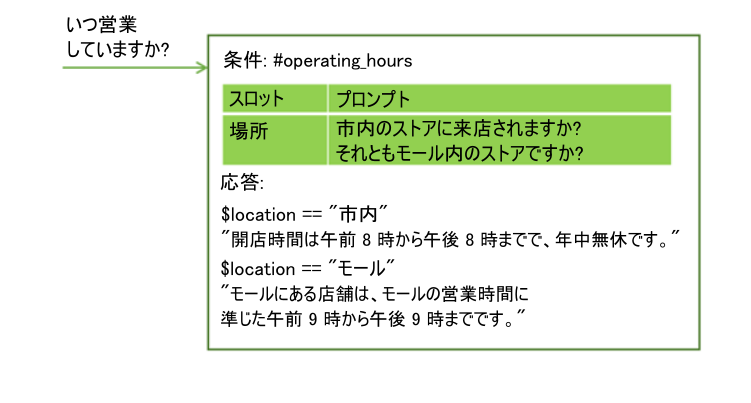

スロットを使用すると、ユーザーの複雑な作業 (ディナーの予約など) を実行するために必要な複数の情報を収集できます。

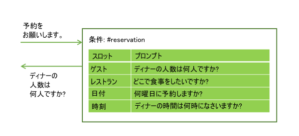

ユーザーは複数のスロットに対する値を一度に提供することがあります。例えば、入力に「午後 7 時に 6 名で食事」という情報が含まれていることがあります。この 1 つの入力には、欠落していた必要な値が 2 つ (人数と予約時刻) が含まれています。サービスは、その両方を認識し、それぞれを対応するスロットに格納します。続いて、次の空のスロットに関連付けられているプロンプトを出します。


スロットにより、サービスは、ユーザーの目的を再確立せずに補足質問に回答することができます。例えば、ユーザーが、天気予報について尋ねた後に、別の場所や別の日の予報を尋ねる補足質問をすることがあります。場所や日付などの必要な予測変数をスロットに保存した後に、ユーザーから新しい変数値を使用して補足質問をされた場合は、提供された新しい値でスロット値を上書きして、新しい情報を反映した応答を返すことができます。

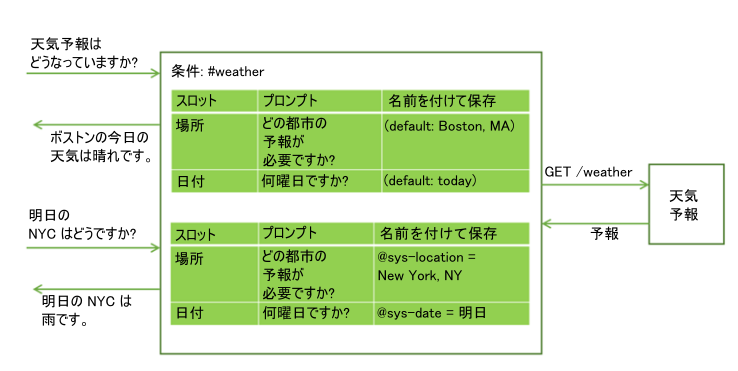

スロットを使用すると、ユーザーとサービスの間でより自然なダイアログ・フローが生成され、多くの個別ノードを使用して情報を収集するより、管理が容易になります。

#### スロットの追加
{: #add-slots}

1.  収集する情報の単位を決定します。例えば、ユーザーがピザを注文するときには、次の情報を収集する必要があります。

    - 配達時刻
    - サイズ

1.  ダイアログ・ノードの編集ビューで「**カスタマイズ**」をクリックし、「**スロット**」チェック・ボックスをオンにします。

    **注**: 「**すべての入力を求めるプロンプトを表示 (Prompt for everything)**」フィールドについて詳しくは、[すべてを一度に尋ねる](dialog-build.html#slots-prompt-for-everything)を参照してください。

1.  **必要な情報の単位ごとにスロットを追加**します。

    スロットごとに次の詳細を指定します。

    - **チェック対象 (Check for)**: スロットのプロンプトに対するユーザーの応答から抽出する情報のタイプを指定します。ほとんどの場合、エンティティー値をチェックしますが、インテントをチェックすることもできます。ここで AND 演算子または OR 演算子を使用すると、より複雑な条件を定義できます。

      **注**: エンティティーにパターンが定義されている場合は、エンティティー名を追加した後、`.literal` を付加します。例えば、定義済みのエンティティーのリストから `@email` を選択した後、「*チェック対象 (Check for)*」フィールドを `@email.literal` を含むように編集します。`.literal` プロパティーを追加することで、パターンに基づいて E メール・アドレスとして検出された、ユーザー入力の正確なテキストを取り込むように指定できます。

      コンテキスト変数の値はチェックしないでください。「*チェック対象 (Check for)*」の値は、最初は条件として使用されますが、その後、「*名前を付けて保存 (Save as)*」フィールドで名前を付けたコンテキスト変数の値になります。条件でコンテキスト変数を使用すると、コンテキストで使用されるときに予期しない動作につながる可能性があります。{: tip}

    - **名前を付けて保存 (Save as)**: スロットのプロンプトに対するユーザー応答に含まれている関係のある値を格納するコンテキスト変数の名前を指定します。ダイアログで先に使用するコンテキスト変数には値が設定されている可能性があるため、そのようなコンテキスト変数は指定しないでください。スロットのコンテキスト変数がヌルである場合にのみ、スロットのプロンプトが表示されます。

    - **プロンプト**: 必要な情報をユーザーから引き出す文を作成します。このプロンプトを表示した後、会話は一時停止し、サービスはユーザーの応答を待機します。

    - スロットを編集する場合は、スロットのプロンプトへのユーザー応答が行われた後に表示する応答を定義することもできます。
      - **Found (見つかりました)**: 予期されていた情報がユーザーから提供された場合に実行される応答。
      - **Not found (見つかりません)**: ユーザーから提供された情報が認識されない場合、または予期した形式で提供されなかった場合に実行される応答。ここでは、ユーザーに提供してもらう必要がある情報のタイプをより明確に示すテキストを指定できます。スロットに正常に情報が取り込まれた場合、またはユーザー入力がノード・レベルのハンドラーで認識され処理された場合、この条件はトリガーされません。

    次の表は、ピザを注文するためのノードのスロット値の例を示しています。

    <table>
    <tr>
      <td>情報</td>
      <td>チェック対象 (Check for)</td>
      <td>名前を付けて保存 (Save as)</td>
      <td>プロンプト</td>
      <td>見つかったときの補足質問</td>
      <td>見つからなかったときの補足質問</td>
    </tr>
    <tr>
      <td>サイズ</td>
      <td>@size</td>
      <td>$size</td>
      <td>「どのサイズのピザを注文しますか?」</td>
      <td>「$size サイズですね」</td>
      <td>「どのサイズのピザを注文しますか? S、M、L からお選びください」</td>
    </tr>
    <tr>
      <td>DeliverBy</td>
      <td>@sys-time</td>
      <td>$time</td>
      <td>「ご希望の配達時刻をお知らせください」</td>
      <td>「$time までの配達ですね」</td>
      <td>「ご希望の配達時刻をお知らせください。今から 30 分後以降の時刻をご指定いただけます」</td>
    </tr>
    </table>

    **オプションのスロット**: 情報を取り込むスロットをオプションとして追加する場合は、そのプロンプトを指定しないでください。

    例えば、ユーザーが食事制限情報を指定した場合に備えて、その情報を取り込むスロットを追加することができます。ただし、ほとんどの場合、食事制限情報は使用されないため、すべてのユーザーに尋ねることは望ましくありません。

    <table>
    <tr>
      <td>情報</td>
      <td>チェック対象 (Check for)</td>
      <td>名前を付けて保存 (Save as)</td>
    </tr>
    <tr>
      <td>小麦制限</td>
      <td>@dietary</td>
      <td>$dietary</td>
    </tr>
    </table>

    プロンプトなしでスロットを追加すると、サービスはそのスロットをオプションとして扱います。

    スロットをオプションにした場合は、スロットの値が提供されなくても意味を成す文になるのであれば、そのスロットのコンテキスト変数はノード・レベルの応答テキストでのみ参照してください。例えば、「$time 配達で $size サイズの $dietary$ ピザを注文します」のような要約文を作成します。この結果のテキストは、「`小麦粉不使用`」や「`乳製品不使用`」などの食事制限情報が提供されなくても意味が通ります (例: 「午後 3 時配達で L サイズのピザを注文します」)。{: tip}
1.  **ユーザーを脱線させないように**します。ユーザーから対話中にノードの目的とは関係のない質問をされた場合に備えて、そのような質問への応答を提供するノード・レベルのハンドラーをオプションで定義できます。

    例えば、ユーザーがトマト・ソースのレシピや食材を入手できる場所を尋ねる可能性があります。このように本題から外れた質問を処理するには、「**ハンドラーを管理 (Manage handlers)**」リンクをクリックして、予期される各質問の条件と応答を追加します。

    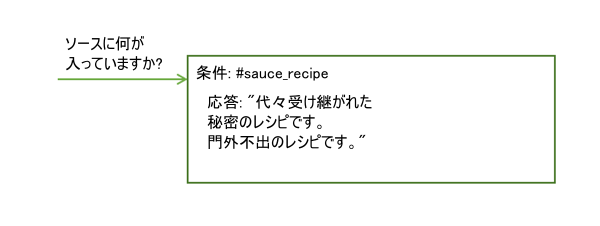

    問題から逸脱した質問に応答した後、現在の空きスロットに関連付けられているプロンプトが表示されます。

    この条件は、ノード・レベルの応答が表示されるまでのダイアログ・ノード・フローでハンドラー条件と一致するユーザー入力が得られたら、いつでもトリガーされます。
1.  **ノード・レベルの応答を追加**します。このノード・レベルの応答は、必要なすべてのスロットに情報が取り込まれるまで実行されません。収集した情報をまとめる応答を追加することができます。例: 「`$size` サイズのピザを `$time` にお届けします」

1.  **スロットのコンテキスト変数をリセットするロジックを追加**します。スロットごとに収集したユーザーからの回答は、コンテキスト変数に保存されます。コンテキスト変数を使用して、その情報を別のノードまたはアプリケーションや外部サービスに渡して使用することができます。ただし、情報を渡した後は、情報の収集を再開できるように、コンテキスト変数をヌルに設定してノードをリセットする必要があります。必要なスロットすべてに情報が取り込まれるまで、サービスはノードを終了しないため、現在のノード内でコンテキスト変数をヌルに設定することはできません。代わりに、次のいずれかの方法を使用することを検討してください。
    - 変数をヌルに設定する処理を外部アプリケーションに追加する。
    - 変数をヌルに設定する子ノードを追加する。
    - 変数をヌルに設定する親ノードを挿入し、スロットを持つノードにジャンプする。

一般的なタスクを処理する方法として推奨される以下の方法を検討してください。

#### すべてを一度に尋ねる
{: #slots-prompt-for-everything}

ノード全体の初期プロンプトとして、提供してもらう必要がある情報の単位をユーザーに明確に伝えるプロンプトを指定します。このプロンプトを最初に表示すれば、ユーザーは一度にすべての詳細情報を入力できるので、一度に 1 つずつ情報を求めるプロンプトを待つ必要がなくなります。

例えば、ユーザーがピザを注文しようとしてノードがトリガーされた場合、「ピザのご注文を受け付けます。ピザのサイズとご希望の配達時刻をご指定ください」のような導入プロンプトを使用して応答できます。

この最初の要求でユーザーから情報が 1 つでも提供された場合、このプロンプトは表示されません。例えば、最初の入力が「L サイズのピザを注文」だったとします。サービスが入力を分析し、ピザのサイズが「L」サイズであることを認識すると、入力された値を **Size** スロットに取り込みます。スロットの 1 つに情報が取り込まれたので、ピザのサイズ情報をもう一度尋ねることを避けるために、初期プロンプトの表示をスキップします。代わりに、情報が提供されていない残りのスロットのプロンプトを表示します。

スロット機能を有効にした「カスタマイズ」ペインで、「**すべての入力を求めるプロンプトを表示 (Prompt for everything)**」チェック・ボックスをオンにして、初期プロンプトを有効にします。この設定により、「**どのスロットにも情報が取り込まれていない場合は、これを最初に尋ねる (If no slots are pre-filled, ask this first)**」フィールドがノードに追加されるので、そこにユーザーにすべての情報の提供を求めるテキストを指定できます。

#### 複数の値を取り込む
{: #slots-multiple-entity-values}

一連の項目を入力するように求めて、それらを 1 つのスロットに保存することができます。

例えば、ピザにトッピングを追加するかどうかをユーザーに尋ねることができます。そのためには、エンティティー (@toppings) とその値として受け入れる値 (ペパロニ、チーズ、マッシュルームなど) を定義します。ユーザーにトッピングを尋ねるスロットを追加します。複数の値が提供された場合は、エンティティー・タイプの values プロパティーを使用して取り込みます。

<table>
<tr>
  <td>情報</td>
  <td>チェック対象 (Check for)</td>
  <td>名前を付けて保存 (Save as)</td>
  <td>プロンプト</td>
  <td>見つかったときの補足質問</td>
  <td>見つからなかったときの補足質問</td>
</tr>
<tr>
  <td>トッピング</td>
  <td>@toppings.values</td>
  <td>$toppings</td>
  <td>トッピングを追加しますか?</td>
  <td>「ありがとうございます」</td>
  <td>「どのトッピングを追加しますか? 当店でご用意しているトッピングは...」</td>
</tr>
</table>

ユーザーが指定したトッピングを後から参照するには、`<? $entity-name.join(',') ?>` という構文を使用して、トッピング配列の各項目をリストし、値をコンマで区切ります。例: 「$time 配達で $size サイズのピザを `<? $toppings.join(',') ?>` のトッピング付きで注文します」

#### 値の形式を再設定する
{: #slots-reformat-values}

ユーザーに情報の提供を求めて、入力された情報を応答で参照する必要があるので、わかりやすい形式で値を表示できるように値の形式を再設定することを検討してください。

例えば、時刻値は `hh:mm:ss` という形式で保存されます。スロットの JSON エディターを使用して、時刻値の保存時に `hour:minutes AM/PM` という形式を使用するように形式を再設定することができます。

```json
{
  "context": {
    "time": "<? @sys-time.reformatDateTime('h:mm a') ?>"
  }
}
```
{: codeblock}

形式を再設定するその他のアイデアについては、[値を処理するメソッド](dialog-methods.html)を参照してください。

#### 確認を取る
{: #slots-get-confirmation}

他のスロットの下に、収集した情報が正確かつ完全であることの確認をユーザーに求めるスロットを追加します。スロットは #yes インテントと一致する応答を探します。

<table>
<tr>
  <td>情報</td>
  <td>チェック対象 (Check for)</td>
  <td>名前を付けて保存 (Save as)</td>
  <td>プロンプト</td>
  <td>見つかったときの補足質問</td>
  <td>見つからなかったときの補足質問</td>
</tr>
<tr>
  <td>確認</td>
  <td>#yes</td>
  <td>$confirmation</td>
  <td>「`$time` 配達で `$size` サイズのピザを注文します。よろしいですか?」</td>
  <td>「間もなくお届けにあがります」</td>
  <td>下記を参照</td>
</tr>
</table>

このダイアログの別の場面でもユーザーが肯定文 (*はい、午後 5 時配達でピザを注文*) を入力する可能性があるので、`slot_in_focus` プロパティーを使用して、スロット条件で、このスロットのプロンプトに対する「はい」という応答のみを求めていることを明確にします。

```json
#yes && slot_in_focus
```
`slot_in_focus` プロパティーは常にブール値 (true または false) に評価されます。このプロパティーは、ブール値の結果が必要な条件でのみ使用してください。例えば、エンティティー・タイプをチェックしてからエンティティー値を保存するスロット条件では使用しないでください。
{: tip}

**Not Found** のプロンプトでは、情報の提供をもう一度求めて、これまで保存したコンテキスト変数をリセットします。

```json
{
  "output":{
                "text":{
                    "values": [
        "もう一度入力してください。注文するピザのサイズと配達時刻を指定してください..."
      ]
    }
  },
  "context":{
    "size": null,
    "time": null
  }
}
```
{: codeblock}

#### スロットのコンテキスト変数値を置換する
{: #slots-found-handler-event-properties}

スロットを持つノードを終了する前に、ユーザーがスロットの新しい値を入力した場合は、新しい値がスロットのコンテキスト変数に保存され、前に指定された値が置き換えられます。Found 条件のイベント・ハンドラーに定義されている特別なプロパティーを使用して、このような置換が発生したことをダイアログで明示的に確認することができます。

- `event.previous_value`: このスロットのコンテキスト変数の以前の値。
- `event.current_value`: このスロットのコンテキスト変数の現在の値。

例えば、フライトの予約のダイアログで行き先の都市を尋ねるとします。ユーザーが「`パリ`」と入力したとします。この場合、$destination スロット・コンテキスト変数を *パリ*に設定します。その後、ユーザーが「`ちょっと待って。目的地をマドリードに変えて`」と言ったとします。Found 条件を次のように設定すると、ダイアログでこのタイプの変更を正常に処理できます。

```json
ユーザーが応答し、@destination が見つかった場合:
条件: event.previous_value != null
    応答: 了解です。目的地を <? event.previous_value ?> から <? event.current_value ?> に変更します。
応答: 了解です。目的地は $destination.literal です。
```

このスロット構成により、「`了解です。目的地をパリからマドリードに変更します`」と応答してユーザーによる目的地の変更に対応できます。

#### 数値の混乱を回避する
{: #slots-avoid-number-confusion}

ユーザーから提供された値が、複数のエンティティー・タイプとして認識されることがあります。

例えば、到着日と出発日など、同じタイプの値を格納する 2 つのスロットが存在する場合などです。そのような類似した値を相互に区別するためのロジックをスロット条件に組み込んでください。

また、サービスが単一のユーザー入力で複数のエンティティー・タイプを認識することがあります。例えば、ユーザーが通貨を入力した場合は、@sys-currency と @sys-number の 2 つのエンティティー・タイプとして認識されます。「Try it out」ペインでテストを実施して、さまざまなユーザー入力をシステムがどのように解釈するかを理解し、誤った解釈を防ぐためのロジックを条件に組み込んでください。

スロット機能に固有のロジックでは、1 つのユーザー入力で 2 つのエンティティーが認識された場合は、長いほうのエンティティーが使用されます。例えば、ユーザーが *May 2* (英語) と入力した場合、ダイアログ・サービスはテキストとして @sys-date (05022017) と @sys-number (2) の 2 つのエンティティーを認識しますが、長いほうのエンティティー (@sys-date) が登録され、スロットに適用されます (ただし、適用可能な場合のみ)。
{: tip}

#### Found 応答が不要な場合は非表示にする
{: #slots-stifle-found-responses}

複数のスロットに Found 応答を指定した場合に、ユーザーが複数のスロットの値を一度に入力すると、1 つ以上のスロットの Found 応答が表示されます。すべてのスロットの Found 応答を返す必要がある場合もあれば、何も返す必要がない場合もあります。

Found 応答を非表示にするには、Found 応答ごとに次のいずれかを実行します。

- 特定のスロットに情報が取り込まれた場合に応答を表示しないようにする条件を、応答に追加します。例えば、`!($size && $time)` のような条件を追加すると、コンテキスト変数 $size と $time が両方とも提供された場合に応答を非表示にすることができます。
- `!all_slots_filled` 条件を応答に追加します。この設定により、すべてのスロットに情報が取り込まれると、応答が表示されなくなります。確認スロットを組み込む場合は、この方法を使用しないでください。確認スロットもスロットであるため、一般的には、確認のスロット自体に情報が取り込まれるまでは、Found 応答を非表示にする必要があります。

#### プロセスを終了する要求を処理する
{: #slots-node-level-handler}

ユーザーがノードを終了しようとしていることを認識できる 1 つ以上のノード・レベル・ハンドラーを追加します。

例えば、ペットのトリミングを予約するための情報を収集するノードでは、#cancel インテントを条件とするノード・レベル・ハンドラーを追加できます。このハンドラーは、「忘れて。気が変わった」などの発話を認識します。

1.  このハンドラーの JSON エディターで、すべてのスロット・コンテキスト変数にダミー値を入力して、欠落している情報をノードが尋ね続けるのを回避します。ハンドラーの応答に、「了解しました。中止します。予約は行いません」などのメッセージを追加します。
1.  ノード・レベルの応答で、スロット・コンテキスト変数のいずれかにダミー値が設定されていないかをチェックする条件を追加します。見つかった場合は、「またご予約が必要になった場合には、お知らせください」などの最終メッセージを表示します。見つからなかった場合は、「$date の $time に $animal のトリミングを予約します」のようなノードの標準的な要約メッセージを表示します。
1.  このノード・レベルのハンドラーより前に評価された条件で使用されているロジックを考慮して、異なる条件を組み込んでください。ユーザー入力を受け取ると、条件は次の順序で評価されます。

    - 現在のスロット・レベルの「If Found」条件。
    - リストされている順序で処理されるノード・レベル・ハンドラー。
    - 現在のスロット・レベルの「If Not Found」条件。

ノード・レベルのハンドラーとして常に真 (`true` や `anything_else` などの特殊な条件) と評価される条件を追加する場合は注意してください。スロットごとに、ノード・レベルのハンドラーが true と評価された場合は、「If Not Found」条件が完全にスキップされます。したがって、常に真と評価されるノード・レベルのハンドラーを使用すると、実質的にすべてのスロットの「If Not Found」条件が評価されなくなります。
{: tip}

例えば、ネコ以外の動物のトリミングを行うとします。Animal スロットで、`ネコ`を Animal スロットに保存しないようにする次のスロット条件を使用したくなるでしょう。

```json
Check for @animal && !@animal:cat, then save it as $animal.
```
{: codeblock}

また、ネコを受け付けないことをユーザーに知らせるために、Animal スロットの「Not Found」条件で次の値を指定するでしょう。

```json
If @animal && !@animal:cat then, "申し訳ありませんが、ネコのトリミングはお請けしていません。"
```
{: codeblock}

理にかなってはいますが、ノード・レベルの終了要求ハンドラーも定義した場合、条件評価の順序によって、この「Not Found」条件は決してトリガーされません。代わりに、次のスロット条件を使用することができます。

```json
Check for @animal, then save it as $animal.
```
{: codeblock}

`ネコ`という応答に対処するために、この値を Found 条件に追加します。

```josn
If @animal:cat then, "申し訳ありませんが、ネコのトリミングはお請けしていません。"
```
{: codeblock}

$animal コンテキスト変数の値は現在「ネコ」に設定されていますが、それは許可されないため、Found 条件の JSON エディターで値をリセットします。

```json
{
  "output":{
    "text":{
                    "values": [
        "申し訳ありませんが、ネコのトリミングはお請けしていません。"
      ]
    }
  },
  "context":{
    "animal": null
  }
}
```
{: codeblock}

次に、ピザの例でノード・レベル・ハンドラーを定義する JSON のサンプルを示します。

```json
{
"conditions": "#cancel",
 "output": {
   "text":{
                    "values": [
        "了解しました。ピザの配達時刻はまだ設定されていません。"
     ],
    "selection_policy": "sequential"
    }
  },
"context": {
   "time": "12:00:00",
   "size": "dummy",
   "confirmation":"true"
}
}
```

#### スロットの例

さまざまな一般的なスロット使用シナリオを実装した JSON ファイルを入手するには、GitHub の[conversation repo ](https://github.com/watson-developer-cloud/community/tree/master/conversation){: new_window}コミュニティーにアクセスしてください。

サンプルを調査するには、いずれかのサンプル JSON ファイルをダウンロードし、新しいワークスペースとしてインポートします。「ダイアログ」タブでダイアログ・ノードを参照して、さまざまなユース・ケースに対応するためのスロットの実装方法を理解できます。

## ダイアログのテスト
{: #test}

ダイアログに変更を加えたら、ダイアログが入力にどのように反応するかをいつでもテストして確認できます。

1.  「ダイアログ」タブで  アイコンをクリックします。
1.  チャット・ペインで、テキストを入力して Enter キーを押します。

    ダイアログのテストを開始する前に、最新の変更内容でシステムがトレーニングを完了していることを確認します。システムがまだトレーニング中の場合は、チャット・ペイン上部にメッセージが表示されます。{: tip}

    
1.  応答をチェックして、ダイアログが入力を正しく解釈して正しい応答を選択しているかどうかを確認します。

    チャット・ウィンドウに、入力で認識されたインテントとエンティティーが示されます。

    

    ダイアログ・エディター・ペインで、現在アクティブなノードが強調表示されています。
1.  コンテキスト変数の値を確認または設定するには、「**コンテキストを管理 (Manage context)**」リンクをクリックします。

    ダイアログに定義したコンテキスト変数がすべて表示されます。

    加えて、`$timezone` コンテキスト変数がリストされます。「Try it out」ペインのユーザー・インターフェースは、Web ブラウザーからユーザーのロケール情報を取得し、`$timezone` コンテキスト変数の設定に使用します。このコンテキスト変数により、ダイアログの対話テストでの時刻基準の処理が簡単になります。ユーザー・アプリケーションでも同様に処理することを検討してください。指定しなかった場合は、グリニッジ標準時 (GMT) が使用されます。

    変数を追加してその値を設定すると、テスト・ダイアログの次のターンでどのような応答が返されるかを確認できます。この機能は、例えば、ユーザーから提供されたコンテキスト変数の値に応じて異なる応答を表示するようにダイアログが設定されている場合に役立ちます。

    1.  コンテキスト変数を追加するには、変数名を指定し、**Enter** キーを押します。
    1.  コンテキスト変数のデフォルト値を定義するには、リストに追加したコンテキスト変数を見つけて、その値を指定します。

    詳しくは、[コンテキスト変数](#context)を参照してください。

1.  ダイアログとの対話を続けて、どのような会話のフローになるかを確認します。
    - テスト発話を検索して再送信する場合は、上矢印キーを押すと、最近の入力を順番に確認することができます。
    - チャット・ペインから過去のテスト発話を削除し、最初からやり直すには、「**クリア**」リンクをクリックします。この操作により、テストの発話と応答が削除されるだけでなく、ダイアログとの対話の結果として設定されたコンテキスト変数の値もクリアされます。明示的に設定または変更したコンテキスト変数の値はクリアされません。

### 次の作業

不適切なインテントまたはエンティティーが認識されていることがわかった場合は、インテントまたはエンティティーの定義を変更する必要があります。

インテントとエンティティーが正しく認識されているのに、ダイアログで正しくないノードがトリガーされる場合は、条件が正しく記述されていることを確認してください。

## ダイアログ・ノードの移動
{: #move-node}

作成した各ノードを、ダイアログ・ツリー内の他の場所に移動することができます。

以前に作成したノードをフローの別の領域に移動して、会話を変更しなければならない場合があります。ノードを移動して、別のブランチの兄弟またはピアにすることができます。

1.  移動するノードで「**その他**」アイコン  をクリックし、「**移動**」を選択します。
1.  ツリー内でこのノードの近くにある移動先ノードを選択します。このノードを移動先ノードの上または下に配置するか、移動先ノードの子ノードにするかを選択します。

## ノード ID によるダイアログ・ノードの検索
{: #get-node-id}

次のいずれかの理由から、既知のノード ID に関連付けられているダイアログ・ノードを見つけなければならない場合があります。

- ログを確認していたら、ダイアログのセクションがノード ID で示されている。
- API メッセージ出力の `nodes_visited` プロパティーにリストされているノード ID を、ダイアログ・ツリーに表示されるノードにマップする必要がある。
- ダイアログ実行時のエラー・メッセージで、構文エラーが通知され、修正が必要なノードがノード ID で示されている。

ノード ID に基づいてノードを見つけ出すには、次の手順を実行します。

1.  ツールの「ダイアログ」タブで、ダイアログ・ツリーの任意のノードを選択します。
1.  現在のノードで編集ビューが開いている場合は、編集ビューを閉じます。
1.  Web ブラウザーのロケーション・フィールドに、次の構文の URL が表示されます。

    ```json
    https://watson-conversation.ng.bluemix.net/space/instance-id/workspaces/workspace-id/build/dialog#node=node-id
    ```

1.  この URL を編集し、現在の `node-id` の値を、探しているノードの ID に置き換え、新しい URL を送信します。
1.  必要に応じて、編集した URL をもう一度強調表示して再送信します。

ツールが最新表示され、指定したノード ID のダイアログ・ノードがフォーカスされます。

**注**: 現在、この方法でスロット、スロット・ハンドラー、またはノード・レベル・ハンドラーを見つけることはできません。これらのタイプのノードを ID で見つけるには、ワークスペースをエクスポートし、JSON エディターを使用して JSON で node-id を検索し、タイトル (指定されている場合) またはその条件を書き留めます。ツールの「ダイアログ」タブで、ブラウザーの検索機能を使用して、タイトルまたは条件でダイアログ・ノードを検索します。
