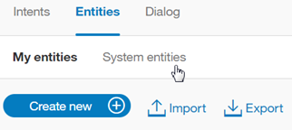

---

copyright:
  years: 2015, 2017
lastupdated: "2017-10-16"

---

{:shortdesc: .shortdesc}
{:new_window: target="_blank"}
{:tip: .tip}
{:pre: .pre}
{:codeblock: .codeblock}
{:screen: .screen}
{:javascript: .ph data-hd-programlang='javascript'}
{:java: .ph data-hd-programlang='java'}
{:python: .ph data-hd-programlang='python'}
{:swift: .ph data-hd-programlang='swift'}

# エンティティーの定義

***エンティティー***とは、ユーザーのある目的に関連した、オブジェクトのクラスまたはデータ・タイプを表しています。ユーザーの入力によって示されたエンティティーを認識することで、{{site.data.keyword.conversationshort}} サービスは、インテントを実行するのに必要な特定のアクションを選択できます。

<iframe class="embed-responsive-item" id="youtubeplayer" type="text/html" width="640" height="390" src="https://www.youtube.com/embed/oSNF-QCbuDc?rel=0" frameborder="0" webkitallowfullscreen mozallowfullscreen allowfullscreen> </iframe>

## エンティティーの制限
{: #entity-limits}

作成できるエンティティーの数、エンティティー値の数、同義語の数は、{{site.data.keyword.conversationshort}} のサービス・プランに応じて異なります。

| サービス・プラン      | 1 ワークスペースあたりのエンティティーの数 | 1 ワークスペースあたりのエンティティーの値 | 1 ワークスペースあたりのエンティティーの同義語の数 |
|-------------------|-----------------------:|----------------------------:|--------------------------------:|
| 標準/プレミアム |                          1000 |                            100,000 |                              100,000 |
| ライト              |                            25 |                            100,000 |                              100,000 |

使用可能にしたシステム・エンティティーは、プラン使用量合計に加算されます。

## エンティティーの作成
{: #creating-entities}

{{site.data.keyword.conversationshort}} ツールを使用してエンティティーを作成します。

1.  {{site.data.keyword.conversationshort}} ツールでワークスペースを開き、**「Entities」**タブをクリックします。**「Entities」**が表示されていない場合は、 メニューを使用してページを開きます。
1.  **「新規作成 (Create new)」**をクリックします。

または、**「Use System Entities」**をクリックして、{{site.data.keyword.IBM_notm}} 提供の共通エンティティーのリストから選択することもできます。それらのエンティティーは、どのようなユース・ケースにも適用可能です。詳しくは、[システム・エンティティーの有効化](#enable_system_entities)を参照してください。
1.  **「Add the entity name」**フィールドに、エンティティーの記述名を入力します。

    エンティティー名には、文字 (ユニコード)、数字、下線、ハイフンを使用できます。例えば次のようにします。
    - `@location`
    - `@menu_item`
    - `@product`

    {{site.data.keyword.conversationshort}} ツールでエンティティー名を作成するときには、エンティティー名に `@` 文字を含めないでください。エンティティー名は、スペースを含んではならず、64 文字を超えてはなりません。またエンティティー名の先頭にストリング `sys-` を付けることはできません。このストリングはシステム・エンティティー用に予約済みです。{: tip}

1.  **「Fuzzy Matching」**は、ボタンをクリックしてオンまたはオフのいずれかを選択します。ファジー・マッチングはデフォルトでオフです。この機能は、[サポートされる言語](lang-support.html)トピックに示された言語で使用可能です。{: #fuzzy-matching}

    ファジー・マッチングをオンにすると、完全一致していなくてもエンティティーに類似した構文のユーザー入力語を認識するようになり、サービスの能力が高まります。ファジー・マッチングは、ステミング、ミススペル、部分一致の 3 つの要素からなります。
    - *ステミング* - 文法的にさまざまな語形を取るエンティティー値の、語幹の形式を識別します。例えば、「bananas」の語幹は「banana」、「running」の語幹は「run」などとなります。
    - *ミススペル* - つづりの誤りや構文上の微妙な違いがあっても、対応する適切なエンティティーにユーザー入力をマップすることができます。例えば、「giraffe」を動物エンティティーの同義語として定義した場合に、ユーザー入力に「giraffes」または「girafe」という語が含まれるなら、ファジー・マッチでその語を動物エンティティーに正しくマップすることができます。
    - *部分一致* - 部分一致により、ユーザー定義エンティティーに存在する、サブストリングに基づいた同義語を自動的に提案します。そして、エンティティーの完全一致と比較して、それより低い信頼性スコアを割り当てます。

    **注** - 英語のファジー・マッチングでは、一般的で有効な英単語のいくつかは、特定のエンティティーのファジー・マッチとして取り込まれません。この機能では現時点で、標準的な英語の辞書に出てくる単語のみ使用し、ユーザーによって定義された同義語は使用しません。
1.  **「Value」**フィールドに、エンティティーの値となり得るテキストを入力します。エンティティー値には、最大で 64 文字までの任意のストリングを使用できます。

    > **重要:** エンティティーの名前と値には、機密情報や個人情報を含めないでください。それらの名前や値は、アプリの URL として露出する可能性があります。

    エンティティー値を入力したら、そのエンティティー値に対して、同義語を追加したり特定のパターンを定義したりできます。これを行うには、*「Type」*ドロップダウン・メニューから`「Synonyms」`または`「Patterns」`を選択します。

    

    > **注:** 1 つのエンティティー値に対して、同義語またはパターンの*どちらか一方*を追加できます。両方を追加することはできません。

1.  **「Synonyms」**フィールドに、エンティティー値の同義語を入力します。同義語として、最大で 64 文字までの任意のストリングを使用できます。

    
1.  **「Patterns」**フィールドでは、エンティティー値に対して特定のパターンを定義できます。パターンは**必ず**、正規表現としてフィールドに入力してください。{: #pattern-entities}

    

    この例で示されたエンティティー「ContactInfo」に対して、電話番号、E メール、Web サイトの値のパターンを以下のように定義できます。
    - 電話番号
      - `localPhone`: `(\d{3})-(\d{4})`。例: 426-4968
      - `fullUSphone`: `(\d{3})-(\d{3})-(\d{4})`。例: 800-426-4968
      - `internationalPhone`: `^(\(?\+?[0-9]*\)?)?[0-9_\- \(\)]*$`。例: +44 1962 815000
    - `email`: `\b[A-Za-z0-9._%+-]+@[A-Za-z0-9.-]+\.[A-Za-z]{2,}\b`。例: name@ibm.com
    - `website`: `(https?:\/\/)?([\da-z\.-]+)\.([a-z\.]{2,6})([\/\w \.-]*)*\/?$`。例: https://www.ibm.com

    パターン・エンティティーを使用する場合はたいてい、対話ツリー内から、コンテキスト変数 (またはアクション変数) に、パターンと一致するテキストを格納する必要があります。

    これから、ユーザーに E メール・アドレスを要求するケースを検討します。対話ノード条件には、`@contactInfo.email` のような条件が入ります。ユーザーが入力した E メールをコンテキスト変数として割り当てるには、以下の構文を使用して、対話ノードの応答セクション内でパターン・マッチを取り込むことができます。

    ```
    {
        "context" : {
            "email": "@contactInfo.literal"
        }
    }
    ```
    {: screen}

    {{site.data.keyword.conversationshort}} サービスで使用されるパターン・マッチング・エンジンには、構文上の制約がいくつかあります。これらの制約は、他の正規表現エンジンを使用するときに生じる可能性がある、パフォーマンス上の問題を回避するために必要です。特に、以下の内容をエンティティー・パターンに含めることができません。
      - 正の反復 (例: `x*+`)
      - 逆参照 (例: `\g1`)
      - 条件付きブランチ (例: `(?(cond)true))`

    正規表現エンジンは、Java 正規表現エンジンにおおまかに基づいています。サポートされないパターンを API によって、または {{site.data.keyword.conversationshort}} サービスのツール UI 内からアップロードしようとすると、{{site.data.keyword.conversationshort}} サービスはエラーを生成します。

1.  **「+」**をクリックしてプロセスを繰り返すことで、さらにエンティティー値を追加します。
1.  エンティティー値の追加が終了したら、**「Done」**をクリックします。

### 結果

作成したエンティティーが**「Entities」**タブに追加され、新規データについてのシステムのトレーニングが開始されます。

## エンティティーの編集

リスト内の任意のエンティティーをクリックして開き、編集することができます。エンティティーをリネームまたは削除したり、値、同義語、パターンを追加、編集、削除したりできます。

## エンティティーのインポート

多数のエンティティーがある場合、{{site.data.keyword.conversationshort}} ツールで 1 つずつ定義するよりも、コンマ区切り値 (CSV) ファイルからインポートする方が簡単です。

**注:** CSV ファイルのインポートは、現時点でパターンをサポートしていません。

1.  エンティティーを CSV ファイルにまとめるか、またはスプレッドシート内のエンティティーを CSV ファイルにエクスポートします。ファイルの各行のフォーマットは、以下のようにする必要があります。

    ```
    <entity>,<value>,<synonyms>
    ```
    {: screen}

    ここで、&lt;entity&gt; はエンティティーの名前で、&lt;value&gt; はエンティティーの値で、&lt;synonyms&gt; はその値の同義語からなるコンマ区切りリストです。

    ```
    weekday,Monday,Mon
    weekday,Tuesday,Tue,Tues
    weekday,Wednesday,Wed
    weekday,Thursday,Thur,Thu,Thurs
    weekday,Friday,Fri
    weekday,Saturday,Sat
    weekday,Sunday,Sun
    month,January,Jan
    month,February,Feb
    month,March,Mar
    month,April,Apr
    month,May
    ```
    {: screen}

CSV ファイルは、バイト・オーダー・マーク (BOM) を付加せず、UTF-8 エンコードで保存します。CSV ファイルの最大サイズは 10MB です。CSV ファイルがこれより大きい場合は、複数のファイルに分割し、別々にインポートすることを検討してください。{{site.data.keyword.conversationshort}} ツールでワークスペースを開き、**「Entities」**タブをクリックします。{: tip}
1.   をクリックしてから、ファイルをドラッグするか、またはコンピューターにあるファイルを参照して選択します。ファイルは検証されてインポートされます。そして、新規データについてのシステムのトレーニングが開始されます。

### 結果

「Entities」タブで、インポートされたエンティティーを表示できます。新しいエンティティーを表示するために、ページの最新表示が必要な場合もあります。

## エンティティーのエクスポート
{: #export_entities}

多数のエンティティーを CSV ファイルにエクスポートすることで、それらのエンティティーを別の Conversation アプリケーションにインポートして再使用できるようになります。

**注:** CSV ファイルのエクスポートは、現時点でパターンをサポートしていません。

1.  「Entities」タブで  を選択します。

    

1.  対象のエンティティーを選択し、**「Export」**ボタンをクリックします。

    

## エンティティーの削除
{: #delete_entities}

複数のエンティティーを選択して、削除することができます。

**重要**: エンティティーを削除すると、関連付けられたすべての値、同義語、またはパターンも削除され、それらの項目を後で取り出すことができなくなります。それらのエンティティーまたは値を参照しているすべての対話ノードについては、削除されたコンテンツを今後参照することがないように、手動で更新する必要があります。

1.  「Entities」タブで  を選択します。

    

1.  削除する対象のエンティティーを選択し、**「Delete」**ボタンをクリックします。**注**: この削除機能では、エンティティーの一括削除がサポートされています。

## システム・エンティティーの有効化
{: #enable_system_entities}

{{site.data.keyword.conversationshort}} サービスには、どのアプリケーションでも使用できる共通エンティティーである、*システム・エンティティー* が多数用意されています。システム・エンティティーを有効にすると、多くのユース・ケースに共通のトレーニング・データを、ワークスペースに迅速に取り込むことができます。

システム・エンティティーを使用すると、それらのエンティティーが表すオブジェクト・タイプの、広範囲の値を認識することができます。例えば、`@sys-number` システム・エンティティーは、単語として表記された数字も含め、整数、小数など、あらゆる数値と一致します。

システム・エンティティーは一元的に管理されているため、更新内容は自動的に使用できるようになります。システム・エンティティーを変更することはできません。

1.  「Entities」タブで**「System entities」**をクリックします。

    

    エンティティーをまだ作成したことがない場合は、**「Use system entities」**をクリックします。

    

1.  システム・エンティティーのリストを参照して、対象のアプリケーションで役立つものを選択します。
    - 一致する入力データの例を含め、システム・エンティティーに関する詳細情報を表示するには、リスト内のエンティティーをクリックします。
    - 使用できるシステム・エンティティーについて詳しくは、[システム・エンティティー](system-entities.html)を参照してください。
1.  各システム・エンティティーの横にある切り替えスイッチをクリックすると、有効または無効にできます。また、リストの上部にある**「All toggle」**スイッチをクリックして、すべてのシステム・エンティティーを有効または無効にすることもできます。

### 結果

システム・エンティティーを有効にした後、{{site.data.keyword.conversationshort}} サービスはリトレーニングを開始します。トレーニングが完了したら、エンティティーを使用できるようになります。
