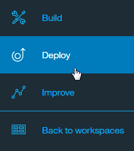

---

copyright:
  years: 2015, 2017
lastupdated: "2017-10-17"

---

{:shortdesc: .shortdesc}
{:new_window: target="_blank"}
{:tip: .tip}
{:pre: .pre}
{:codeblock: .codeblock}
{:screen: .screen}
{:javascript: .ph data-hd-programlang='javascript'}
{:java: .ph data-hd-programlang='java'}
{:python: .ph data-hd-programlang='python'}
{:swift: .ph data-hd-programlang='swift'}

# Slack でのテスト

テスト・デプロイメント用ツールを使用して、{{site.data.keyword.conversationshort}} ワークスペースを Slack チームにボット・ユーザーとして組み込むことができます。この方式は、Slack ボットをワークスペースのユーザー・インターフェースとして使用して素早くテストしたい場合に使用します。

テスト・デプロイメント用ツールでは、{{site.data.keyword.openwhisk}} サービスを使用して、事前にビルド済みの Slack アプリケーションを自分のチームにボット・ユーザーとしてデプロイします。このアプリケーションは Conversation ワークスペースとの通信を処理します。


テスト・デプロイメント用ツールには、次の制限事項があることに注意してください。

- このツールは、アプリケーションを公開して他のチームがそれを使えるようにするために使用することはできません。
- この方式を使用して同じチームに複数のワークスペースをデプロイした場合、すべてのワークスペースが `@ibmwatson_bot` というユーザー名に応答します。このツールを使用して各 Slack チームにワークスペースをデプロイする場合、一度に 1 つだけのワークスペースをデプロイすることをお勧めします。
- 自分の Slack チームにアプリをインストールするための権限を持っている必要があります。この権限を持っているかどうか分からない場合は、Slack 管理者に確認してください。
- 事前にビルド済みの Slack アプリケーションはテスト目的専用で、使用できない場合もあります。
- {{site.data.keyword.openwhisk_short}} の制約事項のために、このツールが現在使用できるのは {{site.data.keyword.Bluemix_notm}} の米国南部地域のみです。

アプリケーションをボット・ユーザーとしてインストールするには、次の手順に従ってください。

1. {{site.data.keyword.conversationshort}} ツールで、Slack でテストするワークスペースを開きます。
1. 左上隅にあるメニュー・アイコンをクリックして、**「デプロイ (Deploy)」**を選択します。「デプロイ・オプション (Deploy Options)」ページが開きます。

   

1. **「Cloud Functions を使用してデプロイ (Deploy with Cloud Functions)」**の下で、**「Slack でテスト (Test in Slack)」**をクリックし、表示される指示に従います。

   

## ボットとのチャット

デプロイメント・プロセスを完了すると、他のすべての Slack ボットと対話する場合と同様に、ユーザー名 `@ibmwatson_bot` を使用して {{site.data.keyword.conversationshort}} ワークスペースと対話することができます。

自分のチームにデプロイされたボットでは、特定のチャネル内のユーザーごとの状態が保持されることを覚えておいてください。つまり、ダイアログ・コンテキストに格納したすべての変数は、ダイアログでクリアされない限り、無期限に維持されます。

会話を既知の開始状態にリセットできるようにすることが必要な場合、ダイアログ内でリセットできるようにする必要があります。ダイアログには、会話の終わりまたは最初からやり直すことが必要な他の場合に実行されるノードが必要です。すべてのコンテキスト変数を適切な開始値にリセットするように、このノードの JSON を更新します。(必要な場合は、各**「ジャンプ先 (Jump to)」**アクション、またはこのノードを実行するための特別な「end conversation (会話の終了)」インテントを使用できます。)

例えば、ワークスペースで `drink_order` というコンテキスト変数を使用してユーザーの飲み物の選択を格納している場合、会話の終了時に次に示すように `context.remove` メソッドを使用してこの変数を削除できます。

```json
"context": {
   "reset_drink_order": "<?context.remove('drink_order')?>"
 }
```
{: codeblock}

コンテキスト変数値の変更について詳しくは、[コンテキスト変数値の更新](dialog-build.html#updating-a-context-variable-value)を参照してください。

**注:** ワークスペースのテストが完了したら、テスト・デプロイメント・ツールに戻って**「テストの削除 (Delete test)」**をクリックしてテスト・デプロイメントを削除することができます。また、自分の Slack チーム内のボット・アプリケーションの権限を別途取り消すことも必要です。
