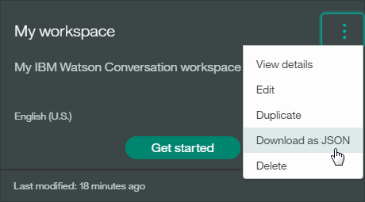

---

copyright:
  years: 2015, 2017
lastupdated: "2017-10-17"

---

{:shortdesc: .shortdesc}
{:new_window: target="_blank"}
{:tip: .tip}
{:pre: .pre}
{:codeblock: .codeblock}
{:screen: .screen}
{:javascript: .ph data-hd-programlang='javascript'}
{:java: .ph data-hd-programlang='java'}
{:python: .ph data-hd-programlang='python'}
{:swift: .ph data-hd-programlang='swift'}

# Conversation 작업공간 구성

{{site.data.keyword.conversationshort}} 서비스의 자연어 처리는 애플리케이션의 대화 플로우를 정의하는 모든 아티팩트에 대한 컨테이너인 *작업공간* 내에서 이루어집니다.
{: shortdesc}

단일 {{site.data.keyword.conversationshort}} 서비스 인스턴스에는 여러 작업공간이 포함될 수 있습니다. 작업공간에는 다음 유형의 아티팩트가 있습니다.

- [**인텐트**](intents.html): *인텐트*는 비즈니스 위치 또는 요금 지불에 대한 질문과 같은 사용자 입력의 목적을 나타냅니다. 애플리케이션에서 지원할 각 사용자 요청 유형에 대한 인텐트를 정의합니다. 도구에서 인텐트 이름의 앞에는 항상 `#` 문자가 옵니다. 작업공간이 인텐트를 인식하는 훈련을 할 수 있도록 사용자 입력의 예제를 많이 제공하고 이러한 예제가 맵핑되는 인텐트를 표시합니다.
- [**엔티티**](entities.html): *엔티티*는 인텐트와 관련되거나 인텐트에 대한 구체적 컨텍스트를 제공하는 용어 또는 오브젝트를 나타냅니다. 예를 들어, 엔티티는 사용자가 비즈니스 위치를 찾으려는 도시 또는 요금 지불 금액을 나타낼 수 있습니다. 도구에서 엔티티 이름의 앞에는 항상 `@` 문자가 옵니다. 작업공간이 엔티티를 인식하는 훈련을 할 수 있도록 연습하기 위해 사용자가 입력할 수 있는 각 엔티티 및 동의어에 대한 가능한 값을 나열합니다.
- [**대화 상자**](dialog-build.html): *대화 상자*는 정의된 인텐트 및 엔티티를 인식할 때 애플리케이션이 응답하는 방식을 정의하는 분기 대화 플로우입니다. 도구에서 대화 상자 빌더를 사용하여 사용자와의 대화를 작성하며, 사용자 입력에서 인식하는 인텐트와 엔티티에 따라 응답을 제공합니다.

정보를 추가하면 작업공간이 스스로 훈련하므로 훈련을 시작하도록 수행해야 할 작업은 없습니다.

## 작업공간 한계
{: #workspace-limits}

단일 서비스 인스턴스에서 작성할 수 있는 작업공간의 수는 {{site.data.keyword.conversationshort}} 서비스 플랜에 따라 다릅니다. 샘플을 편집하거나 복제하지 않는 한 샘플 작업공간은 작업공간 한계에 도달하지 않습니다.

| 서비스 플랜      | 서비스 인스턴스당 작업공간      |
|------------------|--------------------------------:|
| 표준/프리미엄    |                              20 |
| 라이트*          |                               5 |

*비활성 상태가 30일을 넘으면 사용하지 않은 라이트 작업공간을 삭제하여 여유 공간을 확보할 수 있습니다.

## 작업공간 작성
{: #creating-workspaces}

처음부터 작업공간을 작성하거나 제공된 샘플 작업공간을 사용하거나 JSON 파일에서 작업공간을 가져올 수 있습니다. 또한 동일한 서비스 인스턴스 내에서 기존 작업공간을 복제할 수 있습니다.

{{site.data.keyword.conversationshort}} 도구를 사용하여 작업공간을 작성합니다. 작업공간을 작성하려면 다음 단계를 수행하십시오.

1.  "서비스 세부사항" 페이지가 아직 열리지 않은 경우 콘솔에서 {{site.data.keyword.conversationshort}} 서비스 인스턴스를 클릭하십시오. (서비스 인스턴스를 작성하면 "서비스 세부사항" 페이지가 표시됩니다.)

1.  "서비스 세부사항" 페이지에서 **대화 도구**로 스크롤하고 **도구 시작**을 클릭하십시오.

1.  다음 중 하나를 수행하십시오.
    - 처음부터 작업공간을 작성하려면 **작성**을 클릭하십시오.
    - 샘플을 고유 작업공간의 시작점으로 사용하려면 샘플 작업공간을 편집하십시오. 샘플을 여러 작업공간에 사용하려면 복제하십시오.
    - JSON 파일에서 작업공간을 가져오려면  아이콘을 클릭하고 가져올 JSON 파일을 선택하십시오.

        **중요:**

        - 가져온 JSON 파일은 UTF-8 인코딩을 사용해야 합니다.
        - 작업공간 JSON 파일의 최대 크기는 10MB입니다. 큰 작업공간을 가져와야 하는 경우 작업공간을 가져온 후에 별도로 인텐트와 엔티티 가져오기를 고려하십시오. (또한 REST API를 사용하여 큰 작업공간을 가져올 수 있습니다.) 자세한 정보는 [API 참조()](https://www.ibm.com/watson/developercloud/conversation/api/v1/#create_workspace){: new_window}를 참조하십시오.
        - JSON에는 탭, 줄 바꾸기 또는 캐리지 리턴이 포함되지 않습니다.

        포함할 데이터를 지정하십시오.

        - 대화 상자를 포함해 내보낸 작업공간의 전체 사본을 가져오려면 **모두(인텐트, 엔티티 및 대화 상자)**를 선택하십시오.
        - 내보낸 작업공간의 인텐트와 엔티티를 사용하려고 하지만 새 대화 상자를 빌드하려는 경우 **인텐트 및 엔티티**를 선택하십시오.

1.  새 작업공간의 세부사항을 지정하십시오.
    - **이름**: 길이가 64자 이하인 이름입니다. 이 값은 필수입니다.
    - **설명**: 길이가 128자 이하인 설명입니다.
    - **언어**: 작업공간에서 이해를 위해 훈련하는 데 사용할 사용자 입력 언어입니다.

작업공간을 작성하면 작업공간 페이지에 타일로 표시됩니다.

## 작업공간 내보내기 및 복사
{: #exporting-and-copying-workspaces}

작업공간 페이지를 사용하여 작업공간을 내보내고 새 작업공간에 작업공간을 복사할 수 있습니다.

작업공간을 내보내면 JSON 파일에 모든 작업공간 데이터의 사본이 저장됩니다. 작업공간을 다른 서비스 인스턴스로 가져오거나 작업공간 데이터 사본을 오프라인으로 저장하려면 이 옵션을 사용하십시오. 작업공간을 가져올 때 인텐트와 엔티티만 가져오도록 선택할 수 있으며, 이는 동일한 훈련 데이터를 사용하여 새 대화 상자를 빌드하려는 경우에 유용할 수 있습니다.

작업공간을 복사하면 동일한 서비스 인스턴스 내에서 작업공간의 전체 사본이 작성됩니다. 원래 버전을 유지하면서 기존 작업공간을 적용하려면 이 옵션을 사용하십시오.

- 기존 작업공간을 JSON 파일로 내보내려면 작업공간 타일에서 메뉴 아이콘을 클릭한 다음 **JSON으로 다운로드**를 선택하십시오.

    
- 동일한 서비스 인스턴스 내에서 기존 작업공간의 사본을 작성하려면 작업공간 타일에서 메뉴 아이콘을 클릭한 다음 **복제**를 선택하십시오.

    

    새 작업공간의 이름, 설명 및 언어를 지정하십시오. 모든 데이터(인텐트, 엔티티 및 대화 상자 포함)가 사본에 포함됩니다.

