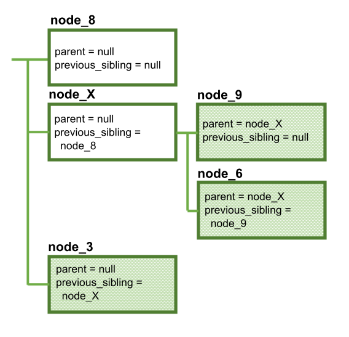

---

copyright:
  years: 2015, 2017
lastupdated: "2017-09-21"

---

{:shortdesc: .shortdesc}
{:new_window: target="_blank"}
{:tip: .tip}
{:pre: .pre}
{:codeblock: .codeblock}
{:screen: .screen}
{:javascript: .ph data-hd-programlang='javascript'}
{:java: .ph data-hd-programlang='java'}
{:python: .ph data-hd-programlang='python'}
{:swift: .ph data-hd-programlang='swift'}

# API를 사용하여 대화 상자 수정

{{site.data.keyword.conversationshort}} REST API는 {{site.data.keyword.conversationshort}} 도구를 사용하지 않고 프로그래밍 방식의 대화 상자 수정을 지원합니다. /dialog_nodes API를 사용하여 대화 상자 노드를 작성하거나 삭제하거나 수정할 수 있습니다.

대화 상자는 서로 연결된 노드의 트리이며 올바른 순서로 특정 규칙에 따라야 합니다. 즉, 대화 상자 노드의 변경사항은 다른 노드 또는 대화 상자의 구조에 연쇄 효과를 줄 수 있습니다. /dialog_nodes API를 사용하여 대화 상자를 수정하기 전에 변경사항이 대화 상자의 나머지 부분에 미치는 영향을 파악해야 합니다.

올바른 대화 상자는 항상 다음 기준을 충족시킵니다.

- 각 대화 상자 노드에는 고유 ID가 있습니다(`dialog_node` 특성).
- 하위 노드는 상위 노드를 인식합니다(`parent` 특성). 하지만 상위 노드는 하위를 인식하지 못합니다.
- 노드는 바로 이전 동위(있는 경우)를 인식합니다(`previous_sibling` 특성). 즉, 지정된 상위의 모든 동위는 연결된 목록을 구성하며, 각 노드는 이전 노드를 가리킵니다.
- 지정된 상위의 하나의 하위만 첫 번째 동위일 수 있습니다(즉, `previous_sibling`이 널임).
- 노드는 다른 상위의 하위인 이전 동위를 가리킬 수 없습니다.
- 두 노드는 동일한 이전 동위를 가리킬 수 없습니다.
- 노드는 다음에 실행할 다른 노드를 지정할 수 있습니다(`next_step` 특성).
- 노드는 자신의 상위 또는 동위가 될 수 없습니다.
- `response_condition` 유형의 노드에 하위가 있으면 안됩니다.

다음 예제에서는 여러 수정으로 인해 연쇄 변경이 일어나는 방식을 보여줍니다.

## 노드 작성
{: #create-node}

다음 단순 대화 상자 트리를 고려하십시오.


다음 본문으로 /dialog_nodes에 대한 POST 요청을 작성하여 노드를 새로 작성할 수 있습니다.

```json
{
  "dialog_node": "node_8"
}
```

이제 대화 상자는 다음과 같습니다.


`parent` 또는 `previous_sibling`의 값을 지정하지 않고 **node_8**을 작성했으므로 이제 이 노드는 대화 상자의 첫 번째 노드입니다. 서비스는 **node_8**을 작성한 것 외에, 해당 `previous_sibling`이 올바르게 새 노드를 가리키도록 **node_1**을 수정했습니다.

상위 및 이전 동위를 지정하여 대화 상자의 다른 위치에 노드를 작성할 수 있습니다.

```json
{
  "dialog_node": "node_9",
  "parent": "node_2",
  "previous_sibling": "node_5"
}
```

`parent` 및 `previous_node`에 지정한 값은 올바른 값이어야 합니다.

- 두 값 모두 기존 노드를 참조해야 합니다.
- 지정된 상위가 이전 동위의 상위(이전 동위에 상위가 없는 경우 `null`)와 동일해야 합니다.
- 상위가 `response_condition` 유형의 노드이면 안됩니다.

결과 대화 상자는 다음과 같습니다.


서비스는 **node_9**을 작성하는 것 외에, 새 노드를 가리키도록 *node_6*의 `previous_sibling` 특성을 자동으로 업데이트합니다.

## 노드를 다른 상위로 이동
{: #change-parent}

POST /dialog_nodes/node_5 메소드를 다음 본문과 함께 사용하여 **node_5**를 다른 상위로 이동합니다.

```json
{
  "parent": "node_1"
}
```

`parent`에 지정된 값이 올바른 값이어야 합니다.
- 기존 노드를 참조해야 합니다.
- 수정된 노드를 참조하면 안됩니다(노드가 자신의 상위가 될 수 없음).
- 수정된 노드의 하위를 참조하면 안됩니다.
- `response_condition` 유형의 노드를 참조하면 안됩니다.

이 결과 다음과 같이 변경된 구조가 나타납니다.


다음과 같은 몇 가지 상황이 발생합니다.
- **node_5**가 새 상위로 이동할 때 **node_7**도 함께 이동했습니다(**node_7**의 `parent` 값이 변경되지 않았음). 노드를 이동하면 해당 노드의 모든 하위도 함께 이동하게 됩니다.
- **node_5**의 `previous_sibling` 값을 지정하지 않았으므로 이제 이 노드는 **node_1** 아래에서 첫 번째 동위가 됩니다.
- **node_4**의 `previous_sibling` 특성이 `node_5`로 업데이트되었습니다.
- **node_9**이 이제 **node_2** 아래에서 첫 번째 동위가 되므로 이 노드의 `previous_sibling` 특성이 `null`로 업데이트되었습니다.

## 동위 재시퀀싱
{: #change-sibling}

이제 **node_5**를 첫 번째가 아닌 두 번째 동위로 만듭니다. POST /dialog_nodes/node_5 메소드를 다음 본문과 함께 사용하여 이를 수행할 수 있습니다.

```json
{
  "previous_sibling": "node_4"
}
```

`previous_sibling`을 수정할 때 새 값이 올바른 값이어야 합니다.
- 기존 노드를 참조해야 합니다.
- 수정된 노드를 참조하면 안됩니다(노드가 자신의 동위가 될 수 없음).
- 동일한 상위의 하위를 참조해야 합니다(모든 동위에 동일한 상위가 있어야 함).

구조는 다음과 같이 변경됩니다.


다시 한 번 **node_7**이 상위와 함께 남습니다. 또한 이제 **node_4**가 첫 번째 동위이므로 해당 `previous_sibling`이 `null`이 되도록 수정됩니다.

## 노드 삭제
{: #delete-node}

DELETE /dialog_nodes/node_1 메소드를 사용하여 **node_1**을 삭제합니다.

결과는 다음과 같습니다.


**node_1**, **node_4**, **node_5** 및 **node_7**이 모두 삭제되었습니다. 노드를 삭제하면 해당 노드의 모든 하위도 삭제됩니다. 따라서 기본 노드를 삭제하면 실제로 대화 상자 트리의 전체 분기를 삭제하게 됩니다. 삭제된 노드에 대한 다른 모든 참조(예: `next_step` 참조)가 `null`로 변경됩니다.

또한 **node_2**가 **node_8**을 새 이전 동위로 가리키도록 업데이트됩니다.

## 노드 이름 바꾸기
{: #rename-node}

마지막으로 POST /dialog_nodes/node_2 메소드를 다음 본문과 함께 사용하여 **node_2**의 이름을 바꿉니다.

```json
{
  "dialog_node": "node_X"
}
```



대화 상자의 구조는 변경되지 않았지만 다중 노드가 변경된 이름을 반영하도록 다시 한 번 수정되었습니다.

- **node_9** 및 **node_6**의 `parent` 특성
- **node_3**의 `previous_sibling` 특성

삭제된 노드에 대한 다른 모든 참조(예: `next_step` 참조)도 변경됩니다.
