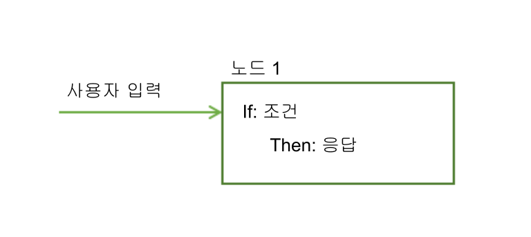
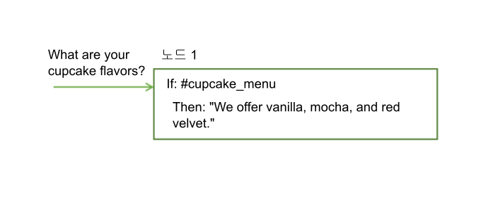
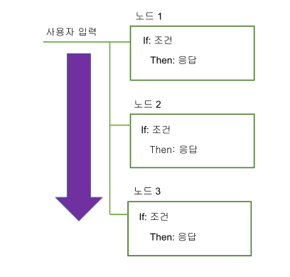
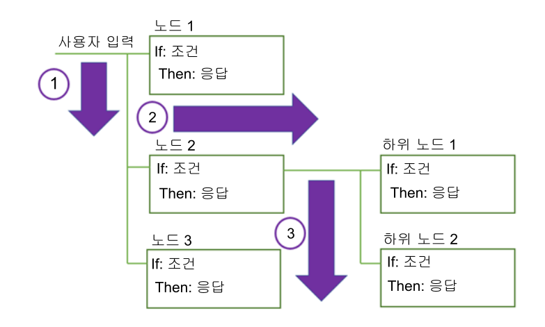
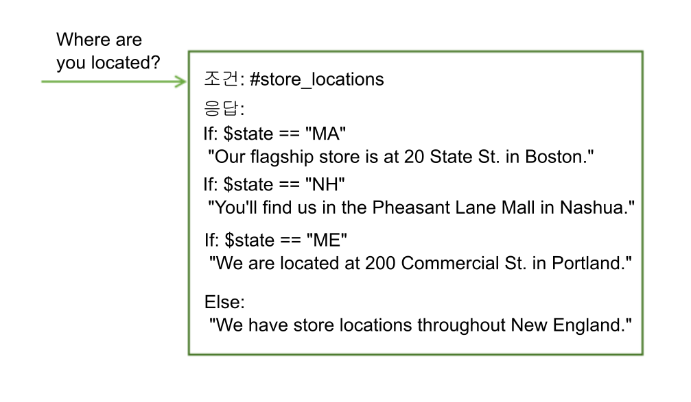
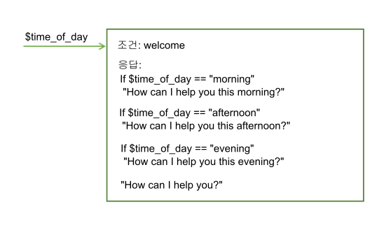
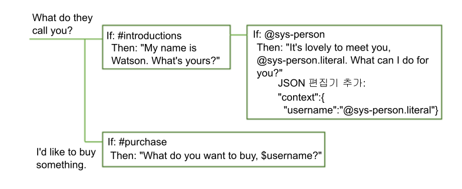
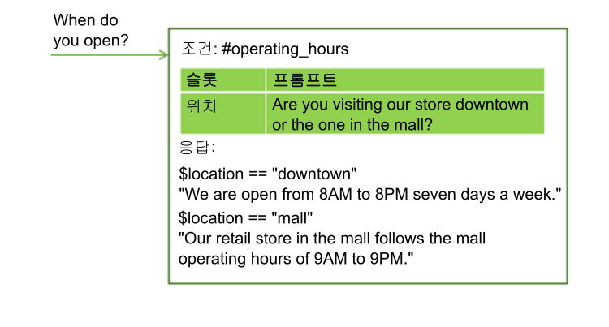
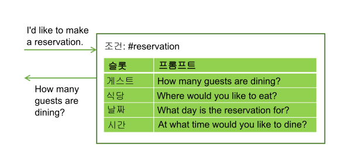
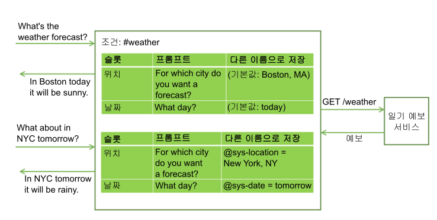

---

copyright:
  years: 2015, 2017
lastupdated: "2017-10-19"

---

{:shortdesc: .shortdesc}
{:new_window: target="_blank"}
{:tip: .tip}
{:pre: .pre}
{:codeblock: .codeblock}
{:screen: .screen}
{:javascript: .ph data-hd-programlang='javascript'}
{:java: .ph data-hd-programlang='java'}
{:python: .ph data-hd-programlang='python'}
{:swift: .ph data-hd-programlang='swift'}

# 대화 상자 빌드
{: #dialog-build}

대화 상자는 사용자 입력에서 식별되는 인텐트와 엔티티 및 애플리케이션의 컨텍스트를 사용하여 사용자와 상호작용하고 궁극적으로 유용한 응답을 제공합니다.
{: shortdesc}

응답은 `Where can I get some gas?`와 같은 질문에 대한 응답 또는 명령 실행(예: 라디오 켜기)일 수 있습니다. 인텐트와 엔티티가 올바른 응답을 식별하기에 충분한 정보가 될 수도 있고, 대화 상자가 올바르게 응답하는 데 필요한 추가 입력을 사용자에게 요청할 수도 있습니다. 예를 들어, 사용자가 "Where can I get some food?"라고 질문하는 경우, 식당을 갈지 아니면 식료품점을 갈지, 먹고 갈지 아니면 포장해 갈지 등을 분명하게 하길 원할 수 있습니다. 텍스트 응답에서 세부사항을 질문하고 하나 이상의 하위 노드를 작성하여 새 입력을 처리할 수 있습니다.

<iframe class="embed-responsive-item" id="youtubeplayer" type="text/html" width="640" height="390" src="https://www.youtube.com/embed/oQUpejt6d84?rel=0" frameborder="0" webkitallowfullscreen mozallowfullscreen allowfullscreen> </iframe>

## 대화 상자 개요
{: #overview}

대화 상자는 그래픽으로 도구에 트리로 표시됩니다. 분기를 작성하여 대화에서 다룰 각 인텐트를 처리하십시오. 분기는 여러 노드로 구성됩니다.

### 대화 상자 노드

각 대화 상자 노드에는 최소한 조건과 응답이 포함됩니다.



- 조건: 대화 상자의 해당 노드를 트리거하기 위해 사용자 입력에 있어야 하는 정보를 지정합니다. 정보는 특정 인텐트, 엔티티 값 또는 컨텍스트 변수값입니다. 자세한 정보는 [조건](#conditions)을 참조하십시오.
- 응답: 서비스가 사용자에게 응답하는 데 사용하는 표현입니다. 또한 프로그래밍 방식의 조치를 트리거하도록 응답을 구성할 수 있습니다. 자세한 정보는 [응답](#responses)을 참조하십시오.

노드가 if/then 구현/구축(Construction)을 가진 것으로 간주할 수 잇습니다. 이 조건이 true이면 이 응답을 리턴합니다.

예를 들어, 서비스의 자연어 처리 기능이 사용자 입력에 `#cupcake-menu` 인텐트가 포함되어 있다고 판별하는 경우 다음 노드가 트리거됩니다. 노드가 트리거되면 서비스가 적절하게 응답합니다.



하나의 조건과 응답이 있는 단일 노드는 단순 사용자 요청을 처리할 수 있습니다. 하지만 대개 사용자는 복잡한 질문을 하거나 복잡한 태스크에 대한 도움을 원합니다. 사용자에게 서비스에 필요한 추가 정보를 제공하도록 요청하는 하위 노드를 추가할 수 있습니다.


### 대화 상자 플로우

작성한 대화 상자는 서비스를 통해 위에서 아래로 처리됩니다.



트리에서 아래로 이동하면서 서비스가 충족되는 조건을 찾으면 해당 노드를 트리거합니다. 그런 다음 트리거된 노드의 왼쪽에서 오른쪽으로 이동하여 하위 노드 조건에 대해 사용자 입력을 검사합니다. 하위 노드를 검사할 때 위에서 아래로 다시 이동합니다.

서비스는 대화 상자 트리의 위에서 아래로, 왼쪽에서 오른쪽으로, 그리고 다음 분기의 마지막 노드에 도달할 때까지 위에서 아래로, 왼쪽에서 오른쪽으로 계속 진행됩니다.



대화 상자를 빌드하기 시작할 때, 포함할 분기 및 위치를 판별해야 합니다. 노드가 위에서 아래로 평가되므로 분기의 순서가 중요합니다. 조건이 입력과 일치하는 첫 번째 기본 노드가 사용됩니다. 트리에서 더 아래에 있는 노드는 트리거되지 않습니다.

## 조건
{: #conditions}

노드 조건은 해당 노드가 대화에서 사용되는지 여부를 판별합니다. 응답 조건은 사용자에게 표시할 응답을 판별합니다.
다음 아티팩트 중 하나 이상을 임의 조합으로 사용하여 조건을 정의할 수 있습니다.

- **컨텍스트 변수**: 지정한 컨텍스트 변수 표현식이 true인 경우 노드가 사용됩니다. 구문 `$variable_name:value` 또는 `$variable_name == 'value'`를 사용하십시오. [컨텍스트 변수](#context)를 참조하십시오.

  컨텍스트 변수값을 설정하는 동일한 대화 상자 노드에서 컨텍스트 변수의 값에 따라 노드 또는 응답 조건을 정의하지 마십시오.
  {: tip}

- **엔티티**: 엔티티의 값이나 동의어가 사용자 입력에서 인식될 때 노드가 사용됩니다. 구문 `@entity_name`을 사용하십시오. 예를 들어, `@city`입니다.

  엔티티의 값 또는 동의어가 인식되지 않는 경우를 처리하는 피어 노드를 작성하십시오.
  {: tip}

- **엔티티 값**: 엔티티 값이 사용자 입력에서 발견되는 경우 노드가 사용됩니다. 구문 `@entity_name:value`를 사용하십시오. 예를 들어, `@city:Boston`입니다. 동의어가 아닌 엔티티의 정의된 값을 지정하십시오.

  엔티티에 대한 특정 값을 지정하지 않은 채 피어 노드에서 엔티티의 존재를 검사하는 경우, 피어 노드 위에 이 특정 엔티티 값을 검사하는 노드를 배치해야 합니다.
{: tip}

- **인텐트**: 가장 단순한 조건은 단일 인텐트입니다. 사용자 입력이 해당 인텐트에 맵핑되는 경우에 노드가 사용됩니다. `#intent-name` 구문을 사용하십시오. 예를 들어, `#weather`는 사용자 입력에서 발견된 인텐트가 `weather`인지 검사합니다. 해당 인텐트가 맞으면 노드가 처리됩니다.

- **특수 조건**: 공통 대화 상자 기능을 수행하는 데 사용할 수 있는 서비스가 제공되는 조건입니다.

  <table>
  <tr>
    <td>조건 이름</td>
    <td>설명</td>
  </tr>
  <tr>
    <td>anything_else</td>
    <td>사용자 입력이 다른 대화 상자 노드와 일치하지 않는 경우에 처리하도록 대화 상자의 끝에 이 조건을 사용할 수 있습니다. 이 조건을 통해 **Anything else** 노드가 트리거됩니다.</td>
  </tr>
  <tr>
    <td>conversation_start</td>
    <td>**welcome**과 같이 이 조건은 첫 번째 대화 상자 턴 중에 true로 평가됩니다. **welcome**과 다른 점은 애플리케이션의 초기 요청이 사용자 입력을 포함하는지 여부에 관계없이 true라는 것입니다. **conversation_start** 조건이 있는 노드는 컨텍스트 변수를 초기화하거나 대화 상자의 처음에 다른 태스크를 수행하는 데 사용할 수 있습니다.</td>
  </tr>
  <tr>
    <td>false</td>
    <td>이 조건은 항상 false로 평가됩니다. 개발 중인 분기의 맨 위에 이 조건을 사용하여 분기 사용을 방지하거나, 공통 기능을 제공하고 **점프** 조치의 대상으로만 사용되는 노드의 조건으로 이 조건을 사용할 수 있습니다.</td>
  </tr>
  <tr>
    <td>irrelevant</td>
    <td>이 조건은 사용자 입력이 Conversation 서비스에서 적절하지 않음으로 판별되는 경우 true로 평가됩니다.</td>
  </tr>
  <tr>
    <td>true</td>
    <td>이 조건은 항상 true로 평가됩니다. 노드 또는 응답 목록의 끝에 이 조건을 사용하여 이전 조건과 일치하지 않은 응답을 발견할 수 있습니다.</td>
  </tr>
  <tr>
    <td>welcome</td>
    <td>애플리케이션의 초기 요청에 사용자 입력이 없는 경우에만 이 조건이 첫 번째 대화 턴 중에(대화가 시작될 때) true로 평가됩니다. 모든 후속 대화 턴에서는 false로 평가됩니다. 이 조건을 통해 **Welcome** 노드가 트리거됩니다. 일반적으로 이 조건의 노드는 사용자에게 인사를 할 때(예: "Welcome to our Pizza ordering app."과 같은 메시지 표시) 사용됩니다.</td>
  </tr>
  </table>

### 조건 구문

다음 구문 옵션 중 하나를 사용하여 조건에 올바른 표현식을 작성하십시오.

- SpEL(Spring Expression) 언어. 런타임에서 오브젝트 그래프 조회 및 조작을 지원하는 표현식 언어입니다. 자세한 정보는 [SpEL(Spring Expression Language) 언어()](http://docs.spring.io/spring/docs/current/spring-framework-reference/html/expressions.html){: new_window}를 참조하십시오.

- 인텐트, 엔티티 및 컨텍스트 변수를 참조하는 단축 표기. [오브젝트 액세스 및 평가](expression-language.html)를 참조하십시오.

조건에 대한 값을 검사하려면 정규식을 사용하십시오. 예를 들어, 일치하는 문자열을 찾기 위해 `String.find` 메소드를 사용할 수 있습니다. 세부사항은 [메소드](dialog-methods.html)를 참조하십시오.

### 조건 사용 팁

- 엔티티 유형에 대한 첫 번째 발견된 인스턴스의 값만 평가하려는 경우, `@entity:(specific-value)` 형식 대신 구문 `@entity == 'specific-value'`를 사용할 수 있습니다. 예를 들어, `@appliance == 'air conditioner'`를 사용하면 첫 번째 발견된 `@appliance` 엔티티의 값만 평가합니다. 하지만 `@appliance:(air conditioner)` 사용이 `entity['appliance'].contains('air conditioner')`로 확장되며, 이는 사용자 입력에 하나 이상의 `@appliance` 엔티티 값 'air conditioner'가 발견될 때마다 일치합니다.
- 숫자 변수를 사용할 때 변수에 값이 있는지 확인하십시오. 변수에 값이 없는 경우 숫자 비교 시 널값(0)으로 간주됩니다. 예를 들어, 조건이 `@price < 100`인 변수값을 검사하고 @price 엔티티가 널인 경우, 가격이 설정되지 않았어도 0이 100보다 작으므로 조건은 `true`로 평가됩니다. 널 변수 검사를 방지하려면 `@price AND @price < 100`과 같은 조건을 사용하십시오. @price에 값이 없으면 이 조건은 올바르게 false를 리턴합니다.
- 엔티티를 조건으로 사용하고 유사 일치가 사용되면, 일치 신뢰도가 30%보다 높은 경우(즉, `@entity_name.confidence > .3`인 경우) `@entity_name`이 true로 평가됩니다.

## 응답
{: #responses}

대화 상자 응답은 사용자에게 응답하는 방법을 정의합니다.

다음 응답 유형 중 하나로 응답할 수 있습니다.

- [단순 텍스트 응답](#simple-text)
- [다중 조건 응답](#multiple)
- [복잡한 응답](#complex)

### 단순 텍스트 응답
{: #simple-text}

텍스트 응답을 제공하려면 서비스에서 사용자에게 표시할 텍스트를 입력하십시오.


#### 다양성 추가
{: #variety}

사용자가 자주 대화 서비스로 돌아가는 경우 매번 반복되는 동일한 인사와 응답을 원치 않을 수 있습니다. 대화 시 동일한 조건에서 여러 방식으로 응답할 수 있도록 응답의 *변형*을 추가할 수 있습니다.

<iframe class="embed-responsive-item" id="youtubeplayer" type="text/html" width="640" height="390" src="https://www.youtube.com/embed/nAlIW3YPrAs?rel=0" frameborder="0" webkitallowfullscreen mozallowfullscreen allowfullscreen> </iframe>

이 예제에서 서비스가 상점 위치에 대한 질문에 응답하는 내용이 하나의 상호작용과 다음 상호작용에서 다릅니다.


순차적으로 또는 임의 순서로 응답 변형을 교체하도록 선택할 수 있습니다. 기본적으로 순서가 지정된 목록에서 선택되는 것처럼 응답이 순차적으로 교체됩니다.

### 조건 응답
{: #multiple}

단일 대화 상자 노드는 여러 응답을 제공할 수 있으며, 각각 다른 조건에 의해 트리거됩니다. 단일 노드에서 여러 시나리오를 처리하려면 이러한 방식을 사용하십시오.

<iframe class="embed-responsive-item" id="youtubeplayer" type="text/html" width="640" height="390" src="https://www.youtube.com/embed/KcvVQAsnhLM?rel=0" frameborder="0" webkitallowfullscreen mozallowfullscreen allowfullscreen> </iframe>

노드에는 여전히 기본 조건이 있으며, 이 조건은 노드 사용 및 이 노드에 포함된 조건과 응답 처리를 위한 조건입니다.

이 예제에서 서비스는 사용자 위치에 대해 이전에 수집된 정보를 사용하여 해당 응답을 사용자 조정하고 사용자로부터 가장 가까운 상점에 대한 정보를 제공합니다. 사용자로부터 수집된 정보를 저장하는 방법에 대한 자세한 정보는 [컨텍스트 변수](#context)를 참조하십시오.



이 단일 노드는 이제 4개의 개별 노드에 해당하는 기능을 제공합니다.

노드 내 조건은 노드처럼 순서대로 평가됩니다. 조건 및 응답이 올바른 순서로 나열되어 있는지 확인하십시오. 순서를 변경해야 하는 경우 조건을 선택하고 표시된 화살표를 사용하여 목록에서 위아래로 이동하십시오. 컨텍스트를 업데이트하려면 개별 응답에서 이를 수행해야 합니다. 공통 응답 섹션은 없습니다. **점프** 조치는 응답이 선택되어 전달된 후에 처리됩니다. **점프** 조치를 추가한 경우 노드에서 리턴된 응답 다음에 실행됩니다.
{: tip}

### 복잡한 응답
{: #complex}

복잡한 응답을 지정하기 위해 JSON 편집기를 사용하여 `"output":{}` 특성에 응답을 지정할 수 있습니다.

응답에 컨텍스트 변수값을 포함하려면 구문 `$variable-name`을 사용하여 지정하십시오. 자세한 정보는 [컨텍스트 변수](#context)를 참조하십시오.

```json
{
  "output": {
    "text": "Hello $user"
  }
}
```
{: codeblock}

개별 행으로 표시할 둘 이상의 문장을 지정하려면 출력을 JSON 배열로 정의하십시오.

```json
{
  "output": {
    "text": ["Hello there.", "How are you?"]
  }
}
```
{: codeblock}

첫 번째 문장이 하나의 행에 표시되고 두 번째 문장이 그 아래에 줄 바꾸기로 표시됩니다.

복잡한 동작을 구현하려면 출력 텍스트를 복합 JSON 오브젝트로 정의할 수 있습니다. 예를 들어, JSON 출력에 복합 오브젝트를 사용하여 노드에 응답 변형을 추가하는 동작을 모방할 수 있습니다. 복합 오브젝트에 다음 특성을 포함할 수 있습니다.

- **values**: 이 대화 상자 노드가 리턴할 수 있는 여러 버전의 출력 텍스트를 보유하는 문자열의 JSON 배열입니다. 배열의 값이 리턴되는 순서는 `selection_policy` 속성에 따라 다릅니다.

- **selection_policy**: 올바른 값은 다음과 같습니다.

    - **random**: 시스템이 `values` 배열에서 임의로 출력 텍스트를 선택하지만 연속하여 반복하지 않습니다. 예를 들어, 세 개의 값이 포함된 output.text를 고려하십시오. 처음 3번은 랜덤 값이 선택되지만 다음에는 반복되지 않습니다. 모든 출력 값이 지정되면 시스템이 임의로 다른 값을 선택하고 프로세스를 반복합니다.

        ```json
        {
            "output":{
                "text":{
                    "values":["Hello.","Hi.","Howdy!"],
                    "selection_policy":"random"
                }
            }
        }
        ```
        {: codeblock}

    시스템은 임의로 선택하는 세 옵션에서 하나의 인사를 리턴합니다. 다음에 응답이 트리거될 때는 목록에서 다른 인사가 표시됩니다. 이전에 사용된 인사를 의도적으로 반복하지 않는 경우를 제외하고 인사가 다시 임의로 선택됩니다.

    - **sequential**: 처음 대화 상자 노드가 트리거되면 시스템이 첫 번째 출력 텍스트를 리턴하고 두 번째로 노드가 트리거되면 두 번째 출력 텍스트를 리턴하는 식으로 계속됩니다.

        ```json
        {
            "output":{
                "text":{
                    "values":["Hello.", "Hi.", "Howdy!"],
                    "selection_policy":"sequential"
                }
            }
        }
        ```
        {: codeblock}

- **append**: 값을 배열에 추가할지 아니면 배열의 값을 새 값으로 겹쳐쓸지를 지정합니다. false로 설정되면, 이전에 실행된 대화 상자 노드에 수집된 출력을 이 특정 노드에 지정된 텍스트 값으로 겹쳐씁니다.

    ```json
    {
        "output":{
            "text":{
                "values": ["Hello."],
                "append":false
            }
        }
    }
    ```
    {: codeblock}

    이 경우 다른 모든 출력 텍스트를 이 출력 텍스트로 겹쳐씁니다.

기본 동작은 `selection_policy = random` 및 `append = true`라고 추정합니다. 값 배열에 둘 이상의 항목이 포함되면 출력 텍스트가 해당 요소에서 임의로 선택됩니다.

### 다음 수행할 작업 정의
{: #jump-to}

지정된 응답을 작성한 후 서비스가 다음 중 하나를 수행하도록 지시할 수 있습니다.

- **사용자 입력 대기**: 사용자가 응답이 유도하는 새 입력을 제공하기를 서비스가 기다립니다. 예를 들어, 응답이 사용자에게 예 또는 아니오로 답하는 질문을 할 수 있습니다. 대화 상자는 사용자가 추가 입력을 제공할 때까지 진행되지 않습니다.
- **다른 대화 상자 노드로 점프**: 사용자 입력을 기다리지 않고 대화에서 하위 노드 또는 완전히 다른 대화 상자 노드로 직접 이동하려는 경우에 이 옵션을 사용하십시오. 예를 들어, 점프 조치를 사용하여 트리의 여러 위치에서 공통 대화 상자 노드로 플로우를 라우팅할 수 있습니다.
  >참고: 대상 노드를 사용하도록 점프 조치를 구성하려면 먼저 점프할 대상 노드가 있어야 합니다.

#### 점프 조치 구성

다른 노드로 점프하도록 선택하는 경우 조치가 선택한 대화 상자 노드의 **응답** 또는 **조건**을 대상으로 지정하는지 여부를 지정해야 합니다.

- **응답**: 명령문이 선택한 대화 상자 노드의 응답 파트를 대상으로 지정하는 경우 즉시 실행됩니다. 즉, 시스템은 선택한 대화 상자 노드의 조건 파트를 평가하지 않으며 선택한 대화 상자 노드의 응답 파트를 즉시 실행합니다.

  응답을 대상으로 지정하면 여러 대화 상자 노드를 함께 연결하는 데 유용합니다. 선택한 대화 상자 노드의 응답 파트는 이 대화 상자 노드의 조건이 true인 경우에 처리됩니다. 선택한 대화 상자 노드에 다른 **점프** 조치가 있는 경우에도 해당 조치가 즉시 실행됩니다.
- **조건**: 명령문이 선택한 대화 상자 노드의 조건 파트를 대상으로 지정하면 서비스가 먼저 대상으로 지정된 노드의 조건이 true로 평가되는지 여부를 검사합니다.
    - 조건이 true로 평가되면, 시스템이 대화 상자 노드 컨텍스트로 컨텍스트를 업데이트하고 대화 상자 노드 출력으로 출력을 업데이트하여 즉시 이 노드를 처리합니다.
    - 조건이 true로 평가되지 않으면, 시스템은 true로 평가되는 조건을 가진 대화 상자 노드를 찾을 때까지 대상 대화 상자 노드의 다음 동위 노드의 조건에 대한 평가 프로세스 등을 계속합니다.
    - 시스템이 모든 동위를 처리하고 조건이 true로 평가되지 않으면, 기본 대비 전략이 사용되고 대화 상자가 맨 위 레벨에서도 노드를 평가합니다.

    조건을 대상으로 지정하면 대화 상자 노드의 조건을 연결하는 데 유용합니다. 예를 들어, 입력에 `#turn_on`과 같은 인텐트가 있는지 여부를 먼저 검사하고, 인텐트가 있으면 입력에 `@lights`, `@radio` 또는 `@wipers` 등의 엔티티가 있는지 여부를 검사할 수 있습니다. 조건을 연결하면 큰 대화 상자 트리를 구조화하는 데 도움이 됩니다.

**참고**: **점프** 조치 처리가 2017년 2월 3일 릴리스에서 변경되었습니다. 세부사항은 [작업공간 업그레이드()](upgrading.html){: new_window}를 참조하십시오.

#### 자세한 정보

대화 상자에서 사용되는 표현식 언어, 메소드, 시스템 엔티티 및 기타 유용한 세부사항에 대한 정보는 탐색 분할창에서 참조 섹션을 참조하십시오.

## 컨텍스트 변수
{: #context}

대화 상자는 Stateless이므로 사용자와의 하나의 교환에서 다음 교환까지 정보를 유지하지 않습니다. 애플리케이션은 필요한 지속적 정보를 유지해야 합니다. 하지만 애플리케이션은 대화 상자로 정보를 전달할 수 있으며 대화 상자는 이 정보를 업데이트하고 애플리케이션으로 다시 전달할 수 있습니다. 컨텍스트 변수를 사용하여 수행합니다.

컨텍스트 변수는 노드에서 정의하고 선택적으로 기본값을 지정하는 변수입니다. 기타 노드 또는 애플리케이션 로직은 나중에 컨텍스트 변수의 값을 설정하거나 변경할 수 있습니다. 

노드 실행 여부를 판별하기 위해 대화 상자 노드 조건에서 컨텍스트 변수를 참조하여 컨텍스트 변수값에 대해 조건을 지정할 수 있습니다. 그리고 대화 상자 노드 응답 조건에서 컨텍스트 변수를 참조하여 외부 서비스 또는 사용자가 제공하는 값에 따라 서로 다른 응답을 표시할 수 있습니다.

### 애플리케이션에서 컨텍스트 전달

컨텍스트 변수를 설정하고 대화 상자에 컨텍스트 변수를 전달하여 애플리케이션에서 대화 상자로 정보를 전달하십시오.

예를 들어, 애플리케이션은 $time_of_day 컨텍스트 변수를 설정하고, 정보를 사용하여 사용자에게 표시되는 인사를 사용자 조정할 수 있는 대화 상자에 이 변수를 전달할 수 있습니다.



이 예제에서 대화 상자는 애플리케이션이 변수를 다음 값 중 하나로 설정한다고 인식합니다. *morning*, *afternoon* 또는 *evening*. 또한 각 값을 검사하고 존재하는 값에 따라 적절한 인사를 리턴할 수 있습니다. 변수가 전달되지 않거나 예상 값 중 하나와 일치하지 않는 값을 포함하는 경우, 보다 일반적인 인사가 사용자에게 표시됩니다.

### 노드 간 컨텍스트 전달

대화 상자는 컨텍스트 변수를 추가하여 하나의 노드에서 다른 노드로 정보를 전달하거나 컨텍스트 변수값을 업데이트할 수 있습니다. 대화 상자가 사용자로부터 정보를 요청하여 가져오는 경우 정보를 추적하고 나중에 대화에서 참조할 수 있습니다.

예를 들어, 하나의 노드에서 사용자에게 이름을 묻고 후속 노드에서 이름별로 주소를 지정할 수 있습니다.



이 예제에서 시스템 엔티티 @sys-person은 입력에서 사용자 이름(사용자가 제공하는 경우)을 추출하는 데 사용됩니다. JSON 편집기에서 username 컨텍스트 변수가 정의되고 @sys-person 값으로 설정됩니다. 후속 노드에서 $username 컨텍스트 변수는 이름별로 사용자 주소를 지정하도록 응답에 포함됩니다.

### 컨텍스트 변수 정의

`name`과 `value` 쌍을 JSON 대화 상자 노드 정의의 `{context}` 섹션에 추가하여 컨텍스트 변수를 정의하십시오. 쌍은 다음 요구사항을 충족해야 합니다.

- `name`에는 대소문자 영문자, 숫자 문자(0 - 9) 및 밑줄이 포함될 수 있습니다.

  **참고**: 마침표 및 하이픈과 같은 기타 문자를 이름에 포함할 수 있습니다. 하지만 이렇게 하면 다음 방법 중 하나를 사용하여 변수를 참조해야 합니다.
  - 컨텍스트['variable-name']: The 전체 SpEL 표현식 구문.
  - $(variable-name): 소괄호로 변수 이름을 묶은 단축 구문.

  세부사항은 [오브젝트 액세스 및 평가](expression-language.html#shorthand-syntax-for-context-variables)를 참조하십시오.

- `value`는 지원되는 JSON 유형일 수 있습니다(예: 단순 문자열 변수, 숫자, JSON 배열 또는 JSON 오브젝트).

다음 JSON 샘플은 $dessert 문자열, $toppings_array 배열 및 $age number 컨텍스트 변수의 값을 정의합니다.

```json
{
  "context": {
    "dessert": "ice-cream",
    "toppings_array": ["onion", "olives"],
    "age": 18
  }
}
```
{: codeblock}

컨텍스트 변수를 정의하려면 다음 단계를 완료하십시오.

1.  노드의 편집 보기에서  아이콘을 클릭한 다음 **JSON**을 선택하여 JSON 편집기를 여십시오.

1.  `"output":{}` 블록 앞에 `"context":{}` 블록을 추가하십시오(없는 경우).

    ```json
    {
      "context":{},
      "output":{}
    }
    ```
    {: codeblock}

1.  컨텍스트 블록에서 정의할 각 컨텍스트 변수의 이름과 값 쌍을 추가하십시오.

    ```json
    {
      "context":{
        "name": "value"
    },
    ...
    }
    ```
    {: codeblock}

  나중에 컨텍스트 변수를 참조하려면 *name*이 정의된 컨텍스트 변수의 이름인 `$name` 구문을 사용하십시오.

기타 공통 태스크는 다음과 같습니다.

- 사용자가 입력한 전체 문자열을 저장하려면 `input.text`를 사용하십시오.

    ```json
    {
      "context": {
        "repeat": "<?input.text?>"
      }
    }
    ```
    {: codeblock}

- 컨텍스트 변수에 엔티티 값을 저장하려면 다음 구문을 사용하십시오.

    ```json
    {
      "context": {
        "place": "@place"
      }
    }
    ```
    {: codeblock}

- 정규식을 사용하여 사용자 입력에서 추출한 문자열 값을 컨텍스트 변수에 저장하려면 다음 구문을 사용하십시오.

    ```json
    {
      "context": {
         "number": "<?input.text.extract('^[^\\d]*[\\d]{11}[^\\d]*$',0)?>"
      }
    }
    ```
    {: codeblock}

- 컨텍스트 변수에 패턴 엔티티 값을 저장하려면 엔티티 이름에 .literal을 추가하십시오. 이 구문을 사용하면 지정된 패턴과 일치한 사용자 입력의 정확한 범위의 텍스트가 변수에 저장됩니다.

    ```json
    {
      "context": {
        "email": "@email.literal"
      }
    }
    ```
    {: codeblock}

### 연산 순서
{: #order-of-context-var-ops}

컨텍스트 변수를 정의한 순서로 서비스에서 평가되는 순서를 판별할 수 없습니다. 서비스는 JSON 이름과 값 쌍으로 정의된 변수를 임의 순서로 평가합니다. 목록의 첫 번째 컨텍스트 변수가 목록의 두 번째 변수 앞에서 실행되지 않으므로 첫 번째 컨텍스트 변수에 값을 설정하지 말고 두 번째에서 사용할 수 있도록 요청하십시오. 예를 들어, 0과 노드에 전달된 몇 가지 높은 값 사이의 난수를 리턴하는 로직을 구현하는 데 두 개의 컨텍스트 변수를 사용하지 마십시오.

```json
"context": {
    "upper": "<? @sys-number.numeric_value + 1?>",
    "answer": "<? new Random().nextInt($upper) ?>"
}
```
{: codeblock}

$answer 컨텍스트 변수가 평가되기 전에 평가되는 $upper 컨텍스트 변수의 값에 의존하지 않도록 복잡한 표현식을 사용하십시오.

```json
"context": {
    "answer": "<? new Random().nextInt(@sys-number.numeric_value + 1) ?>"
}
```
{: codeblock}

### 컨텍스트 변수값 업데이트
{: #updating-a-context-variable-value}

노드가 이미 설정된 컨텍스트 변수값을 설정하면 이 변수값이 이전 값을 겹쳐씁니다.

#### 복합 JSON 오브젝트 업데이트

JSON 오브젝트를 제외한 모든 JSON 유형에 대해 이전 값을 겹쳐씁니다. 컨텍스트 변수가 JSON 오브젝트와 같은 복합 유형인 경우 JSON 병합 프로시저가 변수 업데이트에 사용됩니다. 병합 오퍼레이션은 새로 정의된 특성을 추가하고 오브젝트의 기존 특성을 겹쳐씁니다.

이 예제에서 이름 컨텍스트 변수는 복합 오브젝트로 정의됩니다.

```json
{
  "context": {
    ...
    "complex_object": {
      "user_firstname" : "Paul",
      "user_lastname" : "Pan"
      "has_card" : false
    }
  }
}
```
{: codeblock}

대화 상자 노드는 다음 값으로 컨텍스트 변수 JSON 오브젝트를 업데이트합니다.

```json
{
  "complex_object": {
    "user_firstname": "Peter",
    "has_card": true
  }
}
```
{: codeblock}

결과는 다음 컨텍스트입니다.

```json
{
  "complex_object": {
    "user_firstname": "Peter",
    "user_lastname": "Pan",
    "has_card": true
  }
}
```
{: codeblock}

#### 배열 업데이트

대화 상자 컨텍스트 데이터에 값 배열이 있는 경우, 값을 추가하거나 값을 제거하거나 값을 모두 바꿔 배열을 업데이트할 수 있습니다.

이러한 조치 중 하나를 선택하여 배열을 업데이트하십시오. 각각의 경우에 조치가 적용되기 전 배열, 조치, 그리고 조치가 적용된 후 배열이 표시됩니다.

- **추가**: 배열의 끝에 값을 추가하려면 `append` 메소드를 사용하십시오.

    다음 대화 상자 런타임 컨텍스트의 경우:

    ```json
    {
      "context": {
        "toppings_array": ["onion", "olives"]
      }
    }
    ```
    {: codeblock}

    다음 업데이트를 작성하십시오.

    ```json
    {
      "context": {
        "toppings_array": "<? $toppings_array.append('ketchup', 'tomatoes') ?>"
      }
    }
    ```
    {: codeblock}

    결과:

    ```json
    {
      "context": {
        "toppings_array": ["onion", "olives", "ketchup", "tomatoes"]
      }
    }
    ```
    {: codeblock}

- **제거**: 요소를 제거하려면 `remove` 메소드를 사용하고 배열에 해당 값 또는 위치를 지정하십시오.

    - **값을 기준으로 제거**는 값을 기준으로 배열에서 요소를 제거합니다.

        다음 대화 상자 런타임 컨텍스트의 경우:

        ```json
        {
          "context": {
            "toppings_array": ["onion", "olives"]
          }
        }
        ```
        {: codeblock}

        다음 업데이트를 작성하십시오.

        ```json
        {
          "context": {
            "toppings_array": "<? $toppings_array.removeValue('onion') ?>"
          }
        }
        ```
        {: codeblock}

        결과:

        ```json
        {
          "context": {
            "toppings_array": ["olives"]
          }
        }
        ```
        {: codeblock}

    - **위치를 기준으로 제거**: 인덱스 위치를 기준으로 배열에서 요소 제거:

        다음 대화 상자 런타임 컨텍스트의 경우:

        ```json
        {
          "context": {
            "toppings_array": ["onion", "olives"]
          }
        }
        ```
        {: codeblock}

        다음 업데이트를 작성하십시오.

        ```json
        {
          "context": {
            "toppings_array": "<? $toppings_array.remove(0) ?>"
          }
        }
        ```
        {: codeblock}

        결과:

        ```json
        {
          "context": {
            "toppings_array": ["olives"]
          }
        }
        ```
        {: codeblock}

- **겹쳐쓰기**: 배열에서 값을 겹쳐쓰려면 배열을 새 값으로 설정하십시오.

    다음 대화 상자 런타임 컨텍스트의 경우:

        ```json
        {
          "context": {
            "toppings_array": ["onion", "olives"]
          }
        }
        ```
        {: codeblock}

    다음 업데이트를 작성하십시오.

        ```json
        {
          "context": {
            "toppings_array": ["ketchup", "tomatoes"]
          }
        }
        ```
        {: codeblock}

    결과:

        ```json
        {
          "context": {
            "toppings_array": ["ketchup", "tomatoes"]
          }
        }
        ```
        {: codeblock}

**주의**: 문자열의 일부로 배열을 저장하는 경우 배열 대신 문자열 오브젝트가 됩니다. 예를 들어, 다음 $array 컨텍스트 변수는 배열이지만 $string_array 컨텍스트 변수는 문자열입니다.

```json
{
  "context": {
    "array": [
      "one",
      "two"
    ],
    "array_in_string": "this is my array: $array"
  }
}
```
{: codeblock}

연습 분할창에서 다음 컨텍스트 변수값을 검사하는 경우 다음과 같이 지정된 값이 표시됩니다.

**$array** : `["one","two"]`

**$array_in_string** : `"this is my array: [\"one\",\"two\"]"`

나중에 $array_in_string 변수가 아닌 $array 변수에서 배열 메소드를 수행할 수 있습니다(예: `<? $array.removeValue('two') ?>`).

## 대화 상자 작성
{: #create}

대화 상자를 작성하려면 {{site.data.keyword.conversationshort}} 도구를 사용하십시오.

### 대화 상자 노드 한계
{: #dialog-node-limits}

작성할 수 있는 대화 상자 노드의 수는 서비스 플랜에 따라 다릅니다.

| 서비스 플랜      | 작업공간당 대화 상자 노드  |
|------------------|---------------------------:|
| 표준/프리미엄    |                    100,000 |
| 라이트           |                     25,000 |

트리 깊이 한계: 서비스가 2,000개의 대화 상자 노드 하위를 지원합니다. 도구는 20개 이하에서 가장 잘 작동합니다.

### 프로시저

대화 상자를 작성하려면 다음 단계를 완료하십시오.

1.  탐색줄에서 **빌드** 페이지를 열고 **대화 상자** 탭을 클릭한 다음 **작성**을 클릭하십시오.

    처음에 대화 상자 빌더를 열 때 다음 노드가 작성됩니다.
    - **Welcome**: 첫 번째 노드입니다. 처음 서비스를 사용할 때 사용자에게 표시되는 인사가 포함됩니다. 인사를 편집할 수 있습니다.
    - **Anything else**: 최종 노드입니다. 입력이 인식되지 않을 때 사용자에게 응답하는 데 사용되는 구가 포함됩니다. 제공된 응답을 바꾸거나 유사한 의미의 응답을 추가하여 대화에 다양성을 추가할 수 있습니다. 또한 서비스가 정의된 각 응답을 차례로 리턴할지 아니면 임의 순서로 리턴할지를 선택할 수 있습니다.
1.  대화 상자 트리에 노드를 추가하려면 **Welcome** 노드에서 **추가**() 아이콘을 클릭한 다음 **아래에 노드 추가**를 선택하십시오.
1.  충족될 때 서비스를 트리거하여 노드를 처리하는 조건을 입력하십시오.

    조건 정의를 시작하면 옵션을 표시하는 상자가 표시됩니다. 다음 문자 중 하나를 입력한 다음 표시되는 옵션 목록에서 값을 선택할 수 있습니다.

    <table>
    <tr>
      <td>문자</td>
      <td>이러한 아티팩트 유형에 정의된 값 나열</td>
    </tr>
    <tr>
      <td>`#`</td>
      <td>인텐트</td>
    </tr>
    <tr>
      <td>`@`</td>
      <td>엔티티</td>
    </tr>
    <tr>
      <td>`@{entity-name}:`</td>
      <td>{entity-name} 값</td>
    </tr>
    <tr>
      <td>`$`</td>
      <td>대화 상자의 다른 위치에서 정의하거나 참조한 컨텍스트 변수</td>
    </tr>
    </table>

    이러한 옵션을 사용하는 새 조건을 정의하여 인텐트, 엔티티, 엔티티 값 또는 컨텍스트 변수를 새로 작성할 수 있습니다. 이러한 방식으로 아티팩트를 작성하는 경우 아티팩트를 완전하게 작성하는 데 필요한 다른 단계로 돌아가 이를 완료해야 합니다(예: 인텐트를 위한 샘플 표현 정의).

    둘 이상의 조건에 따라 트리거되는 노드를 정의하려면 하나의 조건을 입력한 다음 그 옆에 있는 더하기 부호(+) 아이콘을 클릭하십시오. 다중 조건에 `AND` 대신 `OR` 연산자를 적용하려면 필드 사이에 표시되는 `and`를 클릭하여 연산자 유형을 변경하십시오. AND 연산은 OR 연산 앞에서 실행되지만 소괄호를 사용하여 순서를 변경할 수 있습니다. 예를 들어,
    `$isMember:true AND ($memberlevel:silver OR $memberlevel:gold)`입니다.

    정의하는 조건의 길이는 500자 미만이어야 합니다.

    조건에서 값을 테스트하는 방법에 대한 자세한 정보는 [조건](#conditions)을 참조하십시오.
1.  **선택사항**: 이 노드에서 사용자로부터 여러 정보를 수집하려면 **사용자 정의**를 클릭하고 **슬롯**을 사용하십시오. 세부사항은 [슬롯을 사용하여 정보 수집](#slots)을 참조하십시오.
1.  응답을 입력하십시오.
    - 서비스가 사용자에게 응답으로 표시할 텍스트를 추가하십시오.
    - 조건부 응답, 응답에 다양성을 추가하는 방법 또는 노드가 트리거된 후 발생하는 상황을 지정하는 방법에 대한 정보는 [응답](#responses)을 참조하십시오.
1.  **선택사항**: 노드의 이름을 지정하십시오.

    대화 상자 노드 이름에는 문자(유니코드), 숫자, 공백, 밑줄, 하이픈 및 마침표가 포함될 수 있습니다.

    노드 이름을 지정하면 쉽게 용도를 기억할 수 있고 최소화되었을 때도 노드를 찾을 수 있습니다. 이름을 제공하지 않으면 노드 조건이 이름으로 사용됩니다.

1.  노드를 추가하려면 트리에서 노드를 선택한 다음 **추가**() 아이콘을 클릭하십시오.
    - 기존 노드의 조건이 충족되지 않는 경우 다음에 검사하는 피어 노드를 작성하려면 **아래에 노드 추가**를 선택하십시오.
    - 기존 노드의 조건을 검사하기 전에 검사하는 피어 노드를 작성하려면 **위에 노드 추가**를 선택하십시오.
    - 선택한 노드에 하위 노드를 작성하려면 **하위 노드 추가**를 선택하십시오. 하위 노드는 상위 노드 다음에 처리됩니다.

    대화 상자 노드가 처리되는 순서에 대한 자세한 정보는 [대화 상자 개요](#overview)를 참조하십시오.
1.  빌드할 때 대화 상자를 테스트하십시오.
   자세한 정보는 [대화 상자 테스트](#test)를 참조하십시오.

## 슬롯을 사용하여 정보 수집
{: #slots}

대화 상자 노드에 슬롯을 추가하여 해당 노드 내에서 사용자로부터 여러 정보를 수집하십시오. 슬롯은 사용자의 속도에 맞춰 정보를 수집합니다. 사용자가 미리 제공하는 세부사항이 저장되고 서비스는 제공되지 않은 세부사항만 요청합니다.

<iframe class="embed-responsive-item" id="youtubeplayer" type="text/html" width="640" height="390" src="https://www.youtube.com/embed/ES4GHcDsSCI?rel=0" frameborder="0" webkitallowfullscreen mozallowfullscreen allowfullscreen> </iframe>

### 슬롯 추가 이유
{: #why-add-slots}

사용자에게 정확하게 응답하기 위해 필요한 정보를 가져오려면 슬롯을 사용하십시오. 예를 들어, 사용자가 운영 시간을 묻지만 상점 위치에 따라 시간이 다른 경우, 대답하기 전에 방문할 상점 위치에 대한 후속 질문을 할 수 있습니다. 그런 다음 제공된 위치 정보를 고려하는 응답 조건을 추가할 수 있습니다.



슬롯을 사용하면 사용자를 위해 복잡한 태스크(예: 저녁 식사 예약)를 완료하는 데 필요한 여러 정보를 수집할 수 있습니다.



사용자가 한 번에 여러 개의 슬롯 값을 제공할 수 있습니다. 예를 들어, 입력에 "There will be 6 of us dining at 7 PM."이라는 정보가 포함될 수 있습니다. 하나의 입력에 두 개의 누락된 필수 값(예약 손님 수와 시간)이 있습니다. 서비스가 두 값을 모두 인식하고 해당 슬롯에 하나씩 저장합니다. 그리고 다음 빈 슬롯과 연관된 프롬프트를 표시합니다.


슬롯을 사용하면 서비스가 사용자 목적을 다시 설정하지 않고도 후속 질문에 응답할 수 있습니다. 예를 들어, 사용자는 일기 예보에 대해 물은 다음 다른 위치나 다른 날짜의 날씨에 대한 후속 질문을 할 수 있습니다. 필수 예보 변수(예: 위치 및 날짜)를 슬롯에 저장한 다음 사용자가 새 변수값에 대해 후속 질문을 하는 경우, 슬롯 값을 제공된 새 값으로 겹쳐쓰고 새 정보를 반영하는 응답을 제공할 수 있습니다.



슬롯을 사용하면 사용자와 서비스 간에 자연스러운 대화 상자 플로우를 생성할 수 있으며, 많은 개별 노드를 사용하여 정보를 수집할 때보다 쉽게 관리할 수 있습니다.

#### 슬롯 추가
{: #add-slots}

1.  수집할 정보 단위를 식별하십시오. 예를 들어, 사용자를 위해 피자를 주문하기 위해 다음 정보를 수집할 수 있습니다.

    - 배달 시간
    - 크기

1.  대화 상자 노드 편집 보기에서 **사용자 정의**를 클릭한 다음 **슬롯** 선택란을 선택하십시오.

    **참고**: **모든 정보를 요청하는 프롬프트** 필드에 대한 자세한 정보는 [한 번에 모든 정보 요청](dialog-build.html#slots-prompt-for-everything)을 참조하십시오.

1.  **필수 정보의 각 단위를 위한 슬롯을 추가하십시오**.

    각 슬롯에 다음 세부사항을 지정하십시오.

    - **검사 대상**: 사용자 응답에서 슬롯 프롬프트로 추출할 정보 유형을 식별하십시오. 대부분 엔티티 값을 검사하지만 인텐트를 검사할 수도 있습니다. 여기에 AND 및 OR 연산자를 사용하여 복잡한 조건을 정의할 수 있습니다.

      **참고**: 엔티티에 패턴이 정의되어 있는 경우 엔티티 이름을 추가한 후 여기에 `.literal`을 추가하십시오. 예를 들어, 정의된 엔티티 목록에서 `@email`을 선택한 후 `@email.literal`을 포함하도록 *검사 대상* 필드를 편집하십시오. `.literal` 특성을 추가하여, 사용자가 입력했고 해당 패턴에 따라 이메일 주소로 식별한 정확한 텍스트를 캡처하려 함을 표시합니다.

      컨텍스트 변수값을 검사하지 마십시오. *검사 대상* 값은 먼저 조건으로 사용되지만, 그런 다음 *다른 이름으로 저장* 필드에서 이름을 지정한 컨텍스트 변수값이 됩니다. 조건에 컨텍스트 변수를 사용하는 경우 컨텍스트에 사용되면 예기치 못한 동작이 나타날 수 있습니다.
      {: tip}

    - **다른 이름으로 저장**: 슬롯 프롬프트에 대한 사용자 응답의 관심 값을 저장할 컨텍스트 변수의 이름을 제공하십시오. 대화 상자에 이전에 사용된 컨텍스트 변수를 지정하지 마십시오. 대신 값을 포함할 수 있습니다. 슬롯에 대한 컨텍스트 변수가 널인 경우에만 슬롯에 대한 프롬프트가 표시됩니다.

    - **프롬프트**: 사용자로부터 필요한 정보를 유도하는 문장을 작성하십시오. 이 프롬프트를 표시한 후 대화가 일시정지되고 서비스는 사용자가 응답하기를 기다립니다.

    - 슬롯을 편집하는 경우 사용자가 슬롯 프롬프트에 응답한 후 표시할 응답을 정의할 수도 있습니다.
      - **Found**: 사용자가 요청된 정보를 제공한 후 실행됩니다.
      - **Not found**: 사용자가 제공한 정보가 파악되지 않았거나 요청된 형식으로 제공되지 않은 경우 실행됩니다. 여기에 지정한 텍스트는 사용자가 제공해야 하는 정보 유형을 명시할 수 있습니다. 슬롯이 채워지거나 사용자 입력이 노드 레벨 핸들러에서 파악되거나 처리되는 경우 이 조건은 결코 트리거되지 않습니다.

    이 표에서는 사용자가 피자를 주문하는 데 도움이 되는 노드에 대한 예제 슬롯 값을 표시합니다.

    <table>
    <tr>
      <td>정보</td>
      <td>검사 대상</td>
      <td>다른 이름으로 저장</td>
      <td>프롬프트</td>
      <td>발견한 경우 후속 문장</td>
      <td>찾을 수 없는 경우 후속 문장</td>
    </tr>
    <tr>
      <td>Size</td>
      <td>@size</td>
      <td>$size</td>
      <td>"What size pizza would you like?"</td>
      <td>"$size it is."</td>
      <td>"What size did you want? We have small, medium, and large."</td>
    </tr>
    <tr>
      <td>DeliverBy</td>
      <td>@sys-time</td>
      <td>$time</td>
      <td>"When do you need the pizza by?"</td>
      <td>"For delivery by $time."</td>
      <td>"What time did you want it delivered? We need at least a half hour to prepare it."</td>
    </tr>
    </table>

    **선택적 슬롯**: 정보를 캡처하지만 선택사항인 슬롯을 추가하려면 정보를 요청하는 프롬프트를 지정하지 마십시오.

    예를 들어, 사용자가 지정하는 경우 식이 제한 정보를 캡처하는 슬롯을 추가할 수 있습니다. 하지만 대부분의 경우 관련이 없으므로 모든 사용자에게 식이 제한 정보를 요청하지는 않으려고 합니다.

    <table>
    <tr>
      <td>정보</td>
      <td>검사 대상</td>
      <td>다른 이름으로 저장</td>
    </tr>
    <tr>
      <td>Wheat restriction</td>
      <td>@dietary</td>
      <td>$dietary</td>
    </tr>
    </table>

    프롬프트 없이 슬롯을 추가하는 경우 서비스가 슬롯을 선택사항으로 처리합니다.

    슬롯을 선택사항으로 설정하는 경우, 슬롯에 값이 제공되지 않은 경우에도 의미가 통하도록 말할 수 있으면 노드 레벨 응답 텍스트에서 해당 컨텍스트 변수만 참조하십시오. 예를 들어, "I am ordering a $size $dietary pizza for delivery at $time"과 같은 요약문을 말할 수 있습니다. `gluten-free` 또는 `dairy-free`와 같은 식이 제한 정보가 제공되지 않는 경우에도 결과 텍스트 "I am ordering a $size $dietary pizza for delivery at $time"은 여전히 의미가 통합니다.
    {: tip}
1.  **사용자를 추적하십시오**.
    상호작용 중에 사용자가 노드 목적과 관계없는 질문을 할 때 응답을 제공하는 노드 레벨 핸들러를 선택적으로 정의할 수 있습니다.

    예를 들어, 사용자가 토마토 소스 레시피 또는 성분을 볼 수 있는 곳에 대해 물을 수 있습니다. 이와 같이 관계없는 질문을 처리하려면 **핸들러 관리** 링크를 클릭하고 각 예상 질문에 대한 조건과 응답을 추가하십시오.

    

    관계없는 질문에 응답하면 현재 빈 슬롯과 연관된 프롬프트가 표시됩니다.

    사용자가 노드 레벨 응답이 표시될 때까지 대화 상자 노드 플로우 중에 언제든 핸들러 조건과 일치하는 입력을 제공하는 경우에 이 조건이 트리거됩니다.
1.  **노드 레벨 응답을 추가하십시오**.
    모든 필수 슬롯이 채워져야 이 노드 레벨 응답이 실행됩니다. 수집한 정보를 요약하는 응답을 추가할 수 있습니다. 예를 들어, "A `$size` pizza is scheduled for delivery at `$time`. Enjoy!"입니다.

1.  **슬롯 컨텍스트 변수를 재설정하는 로직을 추가하십시오**.
    슬롯마다 사용자의 응답을 수집하므로 이 응답이 컨텍스트 변수에 저장됩니다. 컨텍스트 변수를 사용하여 다른 노드로 또는 사용할 애플리케이션이나 외부 서비스로 정보를 전달할 수 있습니다. 하지만 정보를 전달한 후 정보 수집을 다시 시작하려면 컨텍스트 변수를 널로 설정하여 노드를 재설정해야 합니다. 필수 슬롯이 채워질 때까지 서비스가 노드를 종료하지 않으므로 현재 노드 내에서 컨텍스트 변수를 널로 설정할 수 없습니다. 대신 다음 방법 중 하나를 사용할 것을 고려하십시오.
    - 변수를 널로 설정하는 외부 애플리케이션에 처리를 추가하십시오.
    - 변수를 널로 설정하는 하위 노드를 추가하십시오.
    - 변수를 널로 설정하는 상위 노드를 삽입한 다음 슬롯이 있는 노드로 점프하십시오.

공통 태스크 처리를 위해 제안된 방식을 고려하십시오.

#### 한 번에 모든 정보 요청
{: #slots-prompt-for-everything}

전체 노드에서 사용자가 제공할 정보의 단위를 사용자에게 분명하게 알리는 초기 프롬프트를 포함하십시오. 이 프롬프트를 처음에 표시하면 사용자가 한 번에 모든 세부사항을 제공할 수 있으며 한 번에 하나씩 정보를 요청하는 프롬프트가 표시되기를 기다리지 않아도 됩니다.

예를 들어, 고객이 피자를 주문하려고 하여 노드가 트리거되면 예비 프롬프트 "I can take your pizza order. Tell me what size pizza you want and the time that you want it delivered."로 응답할 수 있습니다.

사용자가 초기 요청에서 이 정보의 한 부분이라도 제공하면 프롬프트가 표시되지 않습니다. 예를 들어, 초기 입력이 "I want to order a large pizza."일 수 있습니다. 서비스가 입력을 분석할 때 "large"를 피자 크기로 인식하고 **크기** 슬롯을 제공된 값으로 채웁니다. 슬롯 중 하나가 채워지므로 피자 크기 정보를 다시 요청하지 않도록 초기 프롬프트 표시를 건너뜁니다. 대신 정보가 누락된 나머지 슬롯에 대한 프롬프트를 표시합니다.

슬롯 기능을 사용한 사용자 정의 분할창에서 **모든 정보를 요청하는 프롬프트** 선택란을 선택하여 초기 프롬프트를 사용으로 설정하십시오. 이 설정은 **미리 채워진 슬롯이 없으면 먼저 이를 요청** 필드를 노드에 추가하고 여기서 사용자에게 모든 정보를 입력하라는 프롬프트를 표시하는 텍스트를 지정할 수 있습니다.

#### 다중 값 캡처
{: #slots-multiple-entity-values}

항목 목록을 요청하고 하나의 슬롯에 저장할 수 있습니다.

예를 들어, 피자에 토핑을 원하는지 여부를 사용자에게 물을 수 있습니다. 이렇게 하려면 엔티티(@toppings) 및 이 엔티티에 허용된 값(pepperoni, cheese, mushroom 등)을 정의하십시오. 사용자에게 토핑에 대해 묻는 슬롯을 추가하십시오. 엔티티 유형의 값 특성을 사용하여 여러 값을 캡처하십시오(제공되는 경우).

<table>
<tr>
  <td>정보</td>
  <td>검사 대상</td>
  <td>다른 이름으로 저장</td>
  <td>프롬프트</td>
  <td>발견한 경우 후속 문장</td>
  <td>찾을 수 없는 경우 후속 문장</td>
</tr>
<tr>
  <td>Toppings</td>
  <td>@toppings.values</td>
  <td>$toppings</td>
  <td>Any toppings on that?</td>
  <td>"Great addition."</td>
  <td>"What toppings would you like? We offer ..."</td>
</tr>
</table>

사용자 지정 토핑을 나중에 참조하려면 `<? $entity-name.join(',') ?>` 구문을 사용하여 토핑 배열에 각 항목을 나열하고 쉼표로 값을 구분하십시오. 예를 들어, "I am ordering you a $size pizza with `<? $toppings.join(',') ?>` that is scheduled for delivery by $time."입니다.

#### 값 재형식화
{: #slots-reformat-values}

사용자에게 정보를 묻고 응답의 사용자 입력을 참조해야 하므로 익숙한 형식으로 표시할 수 있도록 값 재형식화를 고려하십시오.

예를 들어, 시간 값이 `hh:mm:ss` 형식으로 저장됩니다. `hour:minutes AM/PM` 형식을 사용하도록 시간 값을 저장할 때 슬롯에 JSON 편집기를 사용하여 이 시간 값을 재형식화할 수 있습니다.

```json
{
  "context":{
    "time": "<? @sys-time.reformatDateTime('h:mm a') ?>"
  }
}
```
{: codeblock}

다른 재형식화 아이디어는 [값을 처리하는 방법](dialog-methods.html)을 참조하십시오.

#### 확인
{: #slots-get-confirmation}

사용자에게 수집한 정보가 정확하고 완전한지 확인하도록 요청하는 슬롯을 다른 슬롯 아래에 추가하십시오. 슬롯은 #yes 인텐트와 일치하는 응답을 검색할 수 있습니다.

<table>
<tr>
  <td>정보</td>
  <td>검사 대상</td>
  <td>다른 이름으로 저장</td>
  <td>프롬프트</td>
  <td>발견한 경우 후속 문장</td>
  <td>찾을 수 없는 경우 후속 문장</td>
</tr>
<tr>
  <td>Confirmation</td>
  <td>#yes</td>
  <td>$confirmation</td>
  <td>"I'm going to order you a `$size` pizza for delivery at `$time`. Should I go ahead?"</td>
  <td>"Your pizza is on its way!"</td>
  <td>아래 참조</td>
</tr>
</table>

사용자가 평소에 대화 중에 긍정문을 포함할 수 있으므로(*Oh yes, we want the pizza delivered at 5pm*), `slot_in_focus` 특성을 사용하여 슬롯 조건에서 이 슬롯에 대한 프롬프트의 경우에만 Yes 응답을 검색하게 하십시오.

```json
#yes && slot_in_focus
```
`slot_in_focus` 특성은 항상 부울(true 또는 false) 값으로 평가됩니다. 부울 결과를 원하는 조건에만 이 특성을 포함하십시오. 예를 들어, 엔티티 유형을 검사하는 슬롯 조건에는 사용하지 마십시오. 그런 다음 엔티티 값을 저장하십시오.
{: tip}

**Not Found** 프롬프트에서 처음부터 다시 정보를 묻고 이전에 저장한 컨텍스트 변수를 재설정하십시오.

```json
{
  "output":{
    "text": {
      "values": [
        "Let's try this again. Tell me what size pizza you want and the time..."
      ]
    }
  },
  "context":{
    "size": null,
    "time": null
  }
}
```
{: codeblock}

#### 슬롯 컨텍스트 변수값 바꾸기
{: #slots-found-handler-event-properties}

사용자가 슬롯이 있는 노드를 종료하기 전에 언제든 슬롯에 새 값을 제공하면, 새 값이 슬롯 컨텍스트 변수에 저장되며 이전에 지정된 값을 바꿉니다. 대화 상자는 Found 조건 이벤트 핸들러에 정의된 특수 특성을 사용하여 이러한 바꾸기가 이루어졌음을 분명하게 확인할 수 있습니다.

- `event.previous_value`: 이 슬롯에 대한 컨텍스트 변수의 이전 값입니다.
- `event.current_value`: 이 슬롯에 대한 컨텍스트 변수의 현재 값입니다.

예를 들어, 대화 상자는 항공편 예약을 위해 목적지 도시를 묻습니다. 사용자는 `Paris`를 제공합니다. $destination 슬롯 컨텍스트 변수를 *Paris*로 설정합니다. 그런 다음 사용자는 `Oh wait. I want to fly to Madrid instead.`라고 대답합니다. Found 조건을 다음과 같이 설정하면 대화 상자가 이 유형의 변경을 처리할 수 있습니다.

```json
When user responds, if @destination is found:
Condition: event.previous_value != null
    Response: Ok, updating destination from <? event.previous_value ?> to <? event.current_value ?>.
Response: Ok, destination is $destination.literal.
```

이 슬롯 구성을 사용하면 대화 상자가 `Ok, updating the destination from Paris to Madrid.`라고 대답하여 사용자의 목적지 변경에 반응할 수 있습니다.

#### 숫자 혼동 방지
{: #slots-avoid-number-confusion}

사용자가 제공하는 일부 값이 둘 이상의 엔티티 유형으로 식별될 수 있습니다.

예를 들어, 도착일과 출발일이라는 동일한 유형의 값을 저장하는 두 가지 슬롯이 있습니다. 로직을 슬롯 조건에 빌드하여 이와 같이 유사한 값을 구분하십시오.

또한 서비스는 단일 사용자 입력에서 여러 엔티티 유형을 인식할 수 있습니다. 예를 들어, 사용자가 통화를 제공하면 @sys-currency와 @sys-number 엔티티 유형 두 가지로 인식됩니다. "연습" 분할창에서 몇 가지 테스트를 수행하여 시스템이 여러 사용자 입력을 해석하는 방법을 파악하고, 로직을 조건에 빌드하여 해석이 잘못되지 않도록 하십시오.

슬롯 기능에 고유한 로직의 경우 단일 사용자 입력에서 두 개의 엔티티가 인식되면 범위가 더 큰 엔티티가 사용됩니다. 예를 들어, 사용자가 *May 2*를 입력하면 Conversation 서비스가 텍스트에서 @sys-date (05022017) 및 @sys-number (2) 엔티티를 둘 다 인식하더라도 범위가 더 큰 엔티티(@sys-date)만 등록되어 슬롯에 적용됩니다(해당하는 경우).
{: tip}

#### 필요하지 않으면 Found 응답이 표시되지 않도록 함
{: #slots-stifle-found-responses}

여러 슬롯에 Found 응답을 지정하면 사용자가 한 번에 여러 슬롯의 값을 제공하는 경우 하나 이상의 슬롯에 대한 Found 응답이 표시됩니다. 리턴할 모든 슬롯에 대한 Found 응답을 원하거나 어떤 슬롯에 대해서도 Found 응답을 원하지 않을 수 있습니다.

Found 응답을 표시하지 않기 위해 각 Found 응답에 대해 다음 중 하나를 수행할 수 있습니다.

- 특정 슬롯이 채워지면 표시되지 않도록 하는 조건을 응답에 추가하십시오. 예를 들어, $size 및 $time 컨텍스트 변수가 둘 다 제공되는 경우 응답이 표시되지 않도록 하는 조건(예: `!($size && $time)`)을 추가할 수 있습니다.
- 응답에 `!all_slots_filled` 조건을 추가하십시오. 이 설정은 모든 슬롯이 채워지면 응답이 표시되지 않도록 합니다. 확인 슬롯을 포함하는 경우에는 이 방식을 사용하지 마십시오. 확인 슬롯도 슬롯이며, 일반적으로 확인 슬롯 자체가 채워지기 전에 Found 응답이 표시되지 않도록 할 수 있습니다.

#### 요청을 처리하여 프로세스 종료
{: #slots-node-level-handler}

사용자가 노드를 종료하려는 경우 인식할 수 있는 하나 이상의 노드 레벨 핸들러를 추가하십시오.

예를 들어, 애완동물 미용 약속을 스케줄하기 위해 정보를 수집하는 노드에서 #cancel 인텐트에 대한 조건을 지정하는 노드 레벨 핸들러를 추가할 수 있으며, 이는 "Forget it. I changed my mind."와 같은 표현을 인식합니다.

1.  핸들러의 JSON 편집기에서 모든 슬롯 컨텍스트 변수를 더미 값으로 채워 노드가 누락된 슬롯을 요청하지 않도록 하십시오. 핸들러 응답에서 "Ok, we'll stop there. No appointment will be scheduled."와 같은 메시지를 추가하십시오.
1.  노드 레벨 응답의 경우 슬롯 컨텍스트 변수 중 하나에서 더미 값을 검사하는 조건을 추가하십시오. 발견되면 최종 메시지 "If you decide to make an appointment later, I'm here to help."를 표시합니다. 찾을 수 없으면 노드의 표준 요약 메시지 "I am making a grooming appointment for your $animal at $time on $date."를 표시합니다.
1.  개별 조건을 빌드할 수 있도록 이 노드 레벨 핸들러 앞에 평가되는 조건에 사용되는 로직을 고려하십시오. 사용자 입력이 수신되면 조건은 다음 순서로 평가됩니다.

    - 현재 슬롯 레벨 If Found 조건.
    - 나열된 순서의 노드 레벨 핸들러.
    - 현재 슬롯 레벨 If Not Found 조건.

항상 true로 평가되는 조건(예: `true` 또는 `anything_else`)을 노드 레벨 핸들러로 추가할 때 주의하십시오. 슬롯마다 노드 레벨 핸들러가 true로 평가되면 If Not Found 조건을 완전히 건너뜁니다. 따라서 항상 true로 평가되는 노드 레벨 핸들러를 사용하면 모든 슬롯에 대한 If Not Found 조건이 평가되지 않도록 효과적으로 방지할 수 있습니다.
{: tip}

예를 들어, 고양이를 제외한 모든 동물을 미용합니다. 동물 슬롯의 경우 다음 슬롯 조건을 사용하여 `cat`이 동물 슬롯에 저장되지 않도록 할 수 있습니다.

```json
Check for @animal && !@animal:cat, then save it as $animal.
```
{: codeblock}

사용자가 고양이가 허용되지 않음을 알게 하려면 동물 슬롯의 Not Found 조건에 다음 값을 지정할 수 있습니다.

```json
If @animal && !@animal:cat then, "I'm sorry. We do not groom cats."
```
{: codeblock}

논리적인 상태이면 노드 레벨 종료 요청 핸들러를 정의하는 경우에도 조건 평가 순서를 고려할 때 이 Not Found 조건이 트리거되지 않습니다. 대신 다음 슬롯 조건을 사용할 수 있습니다.

```json
Check for @animal, then save it as $animal.
```
{: codeblock}

가능한 `cat` 응답을 처리하려면 이 값을 Found 조건에 추가하십시오.

```josn
If @animal:cat then, "I'm sorry. We do not groom cats."
```
{: codeblock}

현재 고양이로 설정되어 있는 값은 설정되면 안되므로 Found 조건의 JSON 편집기에서 $animal 컨텍스트 변수값을 재설정하십시오.

```json
{
  "output":{
    "text": {
      "values": [
        "I'm sorry. We do not groom cats."
      ]
    }
  },
  "context":{
    "animal": null
  }
}
```
{: codeblock}

다음은 피자 예제의 노드 레벨 핸들러를 정의하는 JSON 샘플입니다.

```json
{
"conditions": "#cancel",
 "output": {
   "text": {
     "values": [
       "Ok, we'll stop there. No pizza delivery will be scheduled."
     ],
    "selection_policy": "sequential"
    }
  },
"context": {
   "time": "12:00:00",
   "size": "dummy",
   "confirmation":"true"
}
}
```

#### 슬롯 예제

서로 다른 공통 슬롯 사용 시나리오를 구현하는 JSON 파일에 액세스하려면 GitHub의 커뮤니티 [대화 저장소()](https://github.com/watson-developer-cloud/community/tree/master/conversation){: new_window}로 이동하십시오.

예제를 탐색하려면 예제 JSON 파일 중 하나를 다운로드한 다음 새 작업공간으로 가져오십시오. 대화 상자 탭에서 대화 상자 노드를 검토하여 여러 유스 케이스를 처리하도록 슬롯을 구현한 방법을 볼 수 있습니다.

## 대화 상자 테스트
{: #test}

대화 상자를 변경하면 언제든 이 대화 상자를 테스트하여 입력에 응답하는 방식을 볼 수 있습니다.

1.  대화 상자 탭에서  아이콘을 클릭하십시오.
1.  대화 분할창에서 몇 가지 텍스트를 입력한 다음 Enter를 누르십시오.

    시스템이 대화 상자 테스트를 시작하기 전에 최신 변경사항에 대한 훈련을 완료했는지 확인하십시오. 시스템이 여전히 훈련 중인 경우 다음 메시지가 대화 분할창의 맨 위에 나타납니다.
    {: tip}

    
1.  대화 상자가 올바르게 입력을 해석했고 올바른 응답을 선택했는지 보려면 응답을 확인하십시오.

    대화 창은 입력에서 인식된 인텐트와 엔티티를 표시합니다.

    

    대화 상자 편집기 분할창에 현재 활성인 노드가 강조표시됩니다.
1.  컨텍스트 변수값을 검사하거나 설정하려면 **컨텍스트 관리** 링크를 클릭하십시오.

    대화 상자에서 정의한 컨텍스트 변수가 표시됩니다.

    또한 `$timezone` 컨텍스트 변수가 나열됩니다. "연습" 분할창 사용자 인터페이스는 웹 브라우저에서 사용자 로케일 정보를 가져오고 이 정보를 사용하여 `$timezone` 컨텍스트 변수를 설정합니다. 이 컨텍스트 변수를 사용하면 테스트 대화 상자 교환에서 시간 참조를 쉽게 처리할 수 있습니다. 사용자 애플리케이션에서 유사한 작업을 고려하십시오. 지정되지 않은 경우 그리니치 평균시(GMT)가 사용됩니다.

    변수를 추가하고 해당 값을 설정하여 다음 테스트 대화 상자 턴에서 대화 상자가 응답하는 방식을 볼 수 있습니다. 이 기능은 예를 들어, 사용자가 제공한 컨텍스트 변수값에 따라 다른 응답을 표시하도록 대화 상자를 설정하는 경우에 유용합니다.

    1.  컨텍스트 변수를 추가하려면 변수 이름을 지정하고 **Enter**를 누르십시오.
    1.  컨텍스트 변수의 기본값을 정의하려면 목록에 추가한 컨텍스트 변수를 찾은 다음 이 변수에 맞는 값을 지정하십시오.

    자세한 정보는 [컨텍스트 변수](#context)를 참조하십시오.

1.  대화 상자와 계속 상호작용하여 대화가 이를 통해 플로우되는 방법을 확인하십시오.
    - 테스트 표현을 찾아 다시 제출하기 위해 위로 키를 눌러 최근 입력을 모두 볼 수 있습니다.
    - 대화 분할창에서 이전 테스트 표현을 제거하고 다시 시작하려면 **지우기** 링크를 클릭하십시오. 테스트 표현 및 응답이 제거될 뿐만 아니라 이 조치가 대화 상자와 상호작용의 결과로 설정된 컨텍스트 변수값을 모두 지웁니다. 명시적으로 설정하거나 변경하는 컨텍스트 변수값은 지워지지 않습니다.

### 다음에 수행할 작업

잘못된 인텐트 또는 엔티티를 인식하고 있는지 판별하는 경우 인텐트 또는 엔티티 정의를 수정해야 합니다.

올바른 인텐트와 엔티티가 인식되지만 대화 상자에서 잘못된 노드가 트리거되는 경우 조건이 올바르게 작성되었는지 확인하십시오.

## 대화 상자 노드 이동
{: #move-node}

작성하는 각 노드를 대화 상자 트리의 다른 위치로 이동할 수 있습니다.

이전에 작성된 노드를 플로우의 다른 영역으로 이동하여 대화를 변경할 수 있습니다. 다른 분기의 동위 또는 피어가 되도록 노드를 이동할 수 있습니다.

1.  이동할 노드에서 **추가**() 아이콘을 클릭한 다음 **이동**을 선택하십시오.
1.  이 노드를 이동할 위치에서 가까운 트리에 있는 대상 노드를 선택하십시오. 대상 노드의 위나 아래에 이 노드를 배치할지 아니면 대상 노드의 하위가 되도록 할지를 선택하십시오.

## 해당 노드 ID로 대화 상자 노드 찾기
{: #get-node-id}

다음 이유로 알려진 노드 ID와 연관된 대화 상자 노드를 찾을 수 있습니다.

- 로그를 검토하며, 로그는 해당 노드 ID로 대화 상자 섹션을 참조합니다.
- 대화 상자 트리에서 볼 수 있는 노드에 API 메시지 출력의 `nodes_visited` 특성에 나열된 노드 ID를 맵핑하려고 합니다.
- 대화 상자 런타임 오류 메시지가 구문 오류에 대해 알리며, 노드 ID를 사용하여 수정해야 하는 노드를 식별합니다.

노드 ID를 기준으로 노드를 검색하려면 다음 단계를 완료하십시오.

1.  도구의 대화 상자 탭을 사용하여 대화 상자 트리에서 노드를 선택하십시오.
1.  현재 노드에 대해 열려 있는 경우 편집 보기를 닫으십시오.
1.  웹 브라우저의 위치 필드에 다음 구문이 있는 URL이 표시됩니다.

    ```json
    https://watson-conversation.ng.bluemix.net/space/instance-id/workspaces/workspace-id/build/dialog#node=node-id
    ```

1.  현재 `node-id` 값을 찾으려는 노드의 ID로 바꿔 URL을 편집한 다음 새 URL을 제출하십시오.
1.  필요한 경우 편집된 URL을 다시 강조표시하고 다시 제출하십시오.

도구가 새로 고쳐지고 대화 상자 노드에 대한 초점을 지정한 노드 ID로 바꿉니다.

**참고**: 현재 슬롯, 슬롯 핸들러 또는 노드 레벨 핸들러를 찾는 데 이 방법을 사용할 수 없습니다. ID로 이러한 유형의 노드를 찾으려면 작업공간을 내보내고 JSON 편집기를 사용하여 JSON에서 노드 ID를 찾고 해당 제목(지정된 경우) 또는 조건을 기록해야 합니다. 도구의 대화 상자 탭에서 브라우저 검색 기능을 사용하여 해당 제목 또는 조건의 대화 상자 노드를 검색하십시오.
