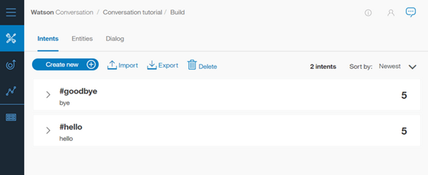
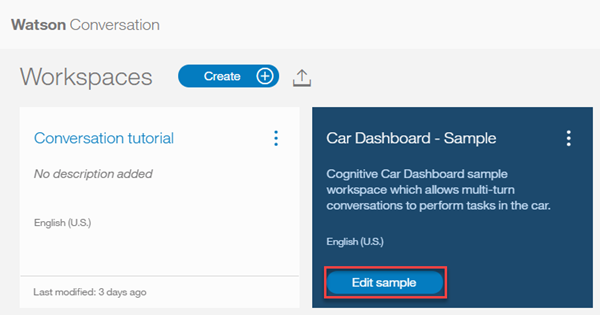

---

copyright:
  years: 2015, 2017
lastupdated: "2017-08-10"

---

{:shortdesc: .shortdesc}
{:new_window: target="_blank"}
{:tip: .tip}
{:pre: .pre}
{:codeblock: .codeblock}
{:screen: .screen}
{:javascript: .ph data-hd-programlang='javascript'}
{:java: .ph data-hd-programlang='java'}
{:python: .ph data-hd-programlang='python'}
{:swift: .ph data-hd-programlang='swift'}

# 튜토리얼 시작하기
{: #gettingstarted}

이 짧은 튜토리얼에서 {{site.data.keyword.conversationshort}} 도구를 소개하고 첫 번째 대화 작성 프로세스를 살펴봅니다.
{: shortdesc}

## 시작하기 전에
{: #prerequisites}

서비스 인스턴스를 이미 작성한 경우 다음 전제조건을 사용하여 모두 설정됩니다. 1 단계로 이동하십시오.
{: tip}

1.  [{{site.data.keyword.conversationshort}} 서비스()](https://console.{DomainName}/catalog/services/conversation/){: new_window}로 이동하고 무료 {{site.data.keyword.Bluemix_notm}} 계정에 등록하거나 로그인하십시오.
1.  로그인한 후 {{site.data.keyword.conversationshort}} 페이지의 **서비스 이름** 필드에 `conversation-tutorial`을 입력하고 **작성**을 클릭하십시오.

## 1단계: 도구 실행
{: #launch-tool}

서비스 인스턴스를 작성한 후 인스턴스의 대시보드를 시작합니다. 여기에서 {{site.data.keyword.conversationshort}} 도구를 실행하십시오.

**관리**를 클릭한 다음 **도구 실행**을 수행하십시오.

따로 도구에 로그인하라는 프롬프트가 표시될 수 있습니다. 로그인하려면 IBM Bluemix 신임 정보를 제공하십시오.

## 2단계: 작업공간 작성
{: #create-workspace}

{{site.data.keyword.conversationshort}} 도구의 첫 번째 단계는 작업공간을 작성하는 것입니다.

[*작업공간*](configure-workspace.html)은 대화 플로우를 정의하는 아티팩트의 컨테이너입니다.

1.  {{site.data.keyword.conversationshort}} 도구에서 **작성**을 클릭하십시오.
1.  작업공간에 `Conversation tutorial`이라는 이름을 지정하고 **작성**을 클릭하십시오. 새 작업공간의 **인텐트** 탭에서 시작합니다.

## 3단계: 인텐트 작성
{: #create-intents}

[인텐트](intents.html)는 사용자 입력의 목적을 나타냅니다. 인텐트를 사용자가 애플리케이션에서 수행할 수 있는 조치로 간주할 수 있습니다.

이 예제에서는 단순하게 두 개의 인텐트(환영 인사에 대한 인텐트와 작별 인사에 대한 인텐트)만 정의합니다.

1.  현재 인텐트 탭에 있는지 확인하십시오. (작업공간을 막 작성한 경우 이미 이 탭에 있습니다.)
1.  **새로 작성**을 클릭하십시오.
1.  인텐트의 이름을 `hello`로 지정하십시오.
1.  `hello`를 **사용자 예제**로 입력하고 Enter를 누르십시오.

   *예제*는 {{site.data.keyword.conversationshort}} 서비스에 인텐트와 일치시킬 사용자 입력 유형을 알립니다. 제공하는 예제가 많을수록 서비스가 사용자 인텐트를 더 정확하게 인식할 수 있습니다.
1.  네 개의 예제를 추가하고 **완료**를 클릭하여 #hello 인텐트 작성을 완료하십시오.
    - `good morning`
    - `greetings`
    - `hi`
    - `howdy`

   

1.  다음 다섯 가지 예제를 사용하여 또 다른 인텐트 #goodbye를 작성하십시오.
    - `bye`
    - `farewell`
    - `goodbye`
    - `I'm done`
    - `see you later`

두 개의 인텐트 #hello와 #goodbye를 작성했고 사용자 입력 예제를 제공하여 사용자 입력에서 이러한 인텐트를 인식하도록 {{site.data.keyword.watson}}을 훈련했습니다.

## 4 단계: 대화 상자 빌드
{: #build-dialog}

[대화 상자](dialog-build.html)는 로직 트리 양식으로 대화의 플로우를 정의합니다. 트리의 각 노드에는 사용자 입력에 따라 트리거하는 조건이 있습니다.

각각 단일 노드를 사용하는 #hello와 #goodbye 인텐트를 처리하는 단순 대화 상자를 작성합니다.

### 시작 노드 추가

1.  {{site.data.keyword.conversationshort}} 도구에서 **대화 상자** 탭을 클릭하십시오.
1.  **작성**을 클릭하십시오. 다음 두 가지 노드가 표시됩니다.
    - **Welcome**: 처음 봇을 사용할 때 사용자에게 표시되는 인사가 포함됩니다.
    - **Anything else**: 입력이 인식되지 않을 때 사용자에게 응답하는 데 사용되는 구가 포함됩니다.

    
1.  **Welcome** 노드를 클릭하여 편집 보기에서 여십시오.
1.  기본 응답을 텍스트 `Welcome to the Conversation tutorial!`로 바꾸십시오.

    
1.  를 클릭하여 편집 보기를 닫으십시오.

`welcome` 조건에 의해 트리거되는 대화 상자 노드를 작성했으며, 이 조건은 사용자가 새 대화를 시작했음을 표시하는 특수 조건입니다. 노드는 새 대화가 시작될 때 시스템이 환영 메시지로 응답하도록 지정합니다.

### 시작 노드 테스트

언제든 대화 상자를 테스트하여 대화 상자를 확인할 수 있습니다. 이제 상자를 테스트합니다.

-  아이콘을 클릭하여 "연습" 분할창을 여십시오. 환영 메시지가 표시됩니다.

    

### 노드를 추가하여 인텐트 처리

이제 노드를 추가하여 `Welcome` 노드와 `Anything else` 노드 간 인텐트를 처리합니다.

1.  **Welcome** 노드에서 추가 아이콘 을 클릭한 다음 **아래에 노드 추가**를 선택하십시오.
1.  이 노드의 **조건 입력** 필드에 `#hello`를 입력하십시오. 그런 다음 **#hello** 옵션을 선택하십시오.
1.  응답 `Good day to you.`를 추가하십시오.
1.  를 클릭하여 편집 보기를 닫으십시오.

   
1.  이 노드에서 추가 아이콘()을 클릭한 다음 **아래에 노드 추가**를 선택하여 피어 노드를 작성하십시오. 피어 노드에서 `#goodbye`를 조건으로 지정하고 `OK. See you later!`를 응답으로 지정하십시오.

    

### 인텐트 인식 테스트

hello와 goodbye 입력 둘 다 인식하고 이에 응답하는 단순 대화 상자를 빌드했습니다. 작동 방식을 확인합니다.

1.   아이콘을 클릭하여 "연습" 분할창을 여십시오. 환영 메시지가 있습니다.
1.  분할창의 맨 아래에 `Hello`를 입력하고 Enter를 누르십시오. 출력은 #hello 인텐트가 인식되었음을 표시하며 적절한 응답(`Good day to you.`)이 나타납니다.
1.  다음 입력을 시도하십시오.
    - `bye`
    - `howdy`
    - `see ya`
    - `good morning`
    - `sayonara`

   

{{site.data.keyword.watson}}은 포함된 예제와 입력이 정확하게 일치하지 않는 경우에도 인텐트를 인식할 수 있습니다. 대화 상자는 인텐트를 사용하여 사용된 정확한 표현과 관계없이 사용자 입력의 목적을 식별한 다음, 지정된 방식으로 응답합니다.

### 대화 상자 빌드 결과

완료되었습니다. 두 개의 인텐트와 이를 인식하는 대화 상자가 포함된 단순 대화를 작성했습니다.

## 5단계: 샘플 작업공간 검토
{: #review-sample-workspace}

샘플 작업공간을 열어 작성한 인텐트와 유사한 인텐트 및 더 많은 인텐트를 확인하고 복잡한 대화 상자에서 이러한 인텐트를 사용하는 방법을 확인하십시오.

1.  작업공간 페이지로 돌아가십시오.
   탐색 메뉴에서  단추를 클릭할 수 있습니다.
1.  **자동차 대시보드 - 샘플** 작업공간 타일에서 **샘플 편집** 단추를 클릭하십시오.

    

## 다음에 수행할 작업
{: #next-steps}

이 튜토리얼은 단순 예제를 중심으로 빌드되었습니다. 실제 애플리케이션의 경우 관심 있는 인텐트, 몇 가지 엔티티 및 복잡한 대화 상자를 정의해야 합니다.

- 고급 [튜토리얼](tutorial.html)을 시도하여 엔티티를 추가하고 사용자의 목적을 분명하게 하십시오.
- 프론트 엔드 사용자 인터페이스, 소셜 미디어 또는 메시징 채널에 연결하여 작업공간을 [배치](deploy.html)하십시오.
- [샘플 앱](sample-applications.html)을 체크아웃하십시오.
