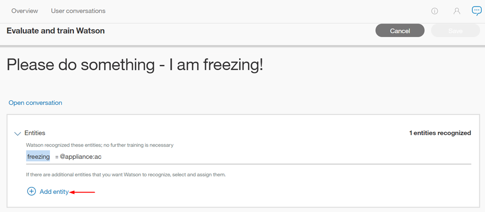

---

copyright:
  years: 2015, 2017
lastupdated: "2017-08-30"

---

{:shortdesc: .shortdesc}
{:new_window: target="_blank"}
{:tip: .tip}
{:pre: .pre}
{:codeblock: .codeblock}
{:screen: .screen}
{:javascript: .ph data-hd-programlang='javascript'}
{:java: .ph data-hd-programlang='java'}
{:python: .ph data-hd-programlang='python'}
{:swift: .ph data-hd-programlang='swift'}

# 대화에 대한 작업
{: #logs_convo}

사용자와 봇 간 상호작용 목록을 열려면 탐색줄에서 **사용자 대화**를 선택하십시오. **사용자 대화**가 표시되지 않으면  메뉴를 사용하여 페이지를 여십시오.
{: shortdesc}

**사용자 대화** 페이지를 열면 기본 보기에 마지막 날의 결과가 나열되며, 최근 결과가 먼저 표시됩니다. 메시지에 사용되는 상위 인텐트(#intent)와 인식되는 모든 엔티티(@entity) 값 및 메시지 텍스트가 사용 가능합니다. 인식되지 않는 인텐트의 경우 표시되는 값은 *관련 없음*입니다. 엔티티가 인식되지 않거나 제공되지 않은 경우 표시되는 값은 *엔티티를 찾을 수 없음*입니다.

## 로그 한계
{: #log-limits}

대화 메시지를 보유하는 시간은 {{site.data.keyword.conversationshort}} 서비스 플랜에 따라 다릅니다.

  서비스 플랜                          | 대화 로그 보유
  ------------------------------------ | ------------------------------------
  프리미엄                             | 지난 90일
  표준                                 | 지난 30일
  무료                                 | 지난 7일

## 표현 필터링

**사용자 대화** 페이지에 사용자와 봇 간 총 *표현* 수가 표시됩니다. 표현은 사용자가 봇으로 보내는 단일 메시지입니다. 각 대화는 여러 표현으로 구성될 수 있습니다. 따라서 이 **사용자 대화** 페이지의 결과 수는 [개요](logs_oview.html) 페이지에 표시된 대화 수와 다릅니다.

*사용자 문장 검색*, *인텐트*, *엔티티* 및 *지난* n*일*을 기준으로 표현을 필터링할 수 있습니다.

*사용자 문장 검색* - 검색줄에 단어를 입력하십시오. 이렇게 하면 사용자 입력이 검색되지만 봇의 응답은 검색되지 않습니다.

*인텐트* - 드롭 다운 메뉴를 선택하고 입력 필드에 인텐트를 입력하거나 채워진 목록에서 선택하십시오. 둘 이상의 인텐트를 선택할 수 있으며, 선택한 인텐트를 사용하여 결과를 필터링할 수 있습니다(*관련 없음* 포함).

*엔티티* - 드롭 다운 메뉴를 선택하고 입력 필드에 엔티티 이름을 입력하거나 채워진 목록에서 선택하십시오. 둘 이상의 엔티티를 선택할 수 있으며, 선택한 엔티티를 기준으로 결과를 필터링할 수 있습니다. 인텐트 *및* 엔티티를 기준으로 필터링하는 경우 결과에 두 값을 모두 가진 메시지가 포함됩니다. 또한 *엔티티를 찾을 수 없음*으로 결과를 필터링할 수 있습니다.

표현 업데이트에는 시간이 다소 걸릴 수 있습니다. 컨텐츠를 필터링하려면 봇과 사용자의 상호작용 후 30분이 지나야 합니다.

## 개별 표현 보기
각 표현 항목을 펼쳐 전체 대화에서 사용자가 말한 내용과 봇의 응답을 볼 수 있습니다. 이렇게 하려면 **대화 열기**를 선택하십시오. 해당 대화 내에서 선택한 표현으로 자동으로 이동합니다.

그런 다음 선택한 표현의 분류를 표시하도록 선택할 수 있습니다.

## 인텐트 정정

1.  인텐트를 정정하려면 선택한 #intent 옆에 있는  편집 아이콘을 선택하십시오.
1.  제공된 목록에서 이 입력에 대한 올바른 인텐트를 선택하십시오.
    - 입력 필드에 입력을 시작하면 인텐트 목록이 필터링됩니다.
    - 또한 이 메뉴에서 **관련 없음으로 표시**를 선택할 수 있습니다. (자세한 정보는 "[관련 없음으로 표시](intents.html#mark-irrelevant)"를 참조하십시오.) 또는 **인텐트에 대해 훈련하지 않음**을 선택할 수 있습니다. 이 경우 이 표현을 훈련의 예제로 저장하지 않습니다.

    
1.  **저장**을 선택하십시오.

    

## 엔티티 값 또는 동의어 추가

1.  엔티티 값이나 동의어를 추가하려면 선택한 @entity 옆에 있는  편집 아이콘을 선택하십시오.
1.  **엔티티 추가**를 선택하십시오.

    
1.  이제 밑줄이 있는 사용자 입력에서 단어나 구를 선택하십시오.

    
1.  강조표시된 구를 값으로 추가할 엔티티를 선택하십시오.
    - 입력 필드에 입력을 시작하면 엔티티 및 값 목록이 필터링됩니다.
    - 기존 값에 대한 동의어로 강조표시된 구를 추가하려면 드롭 다운 목록에서 "@entity:value"를 선택하십시오.

    
1.  **저장**을 선택하십시오.

    
