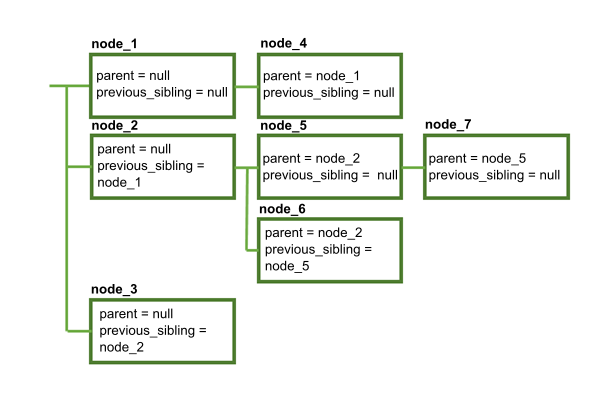
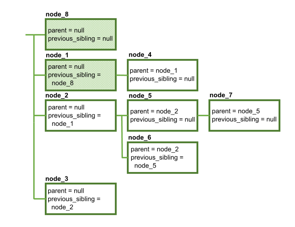
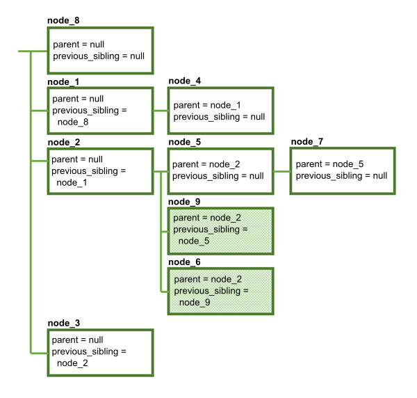
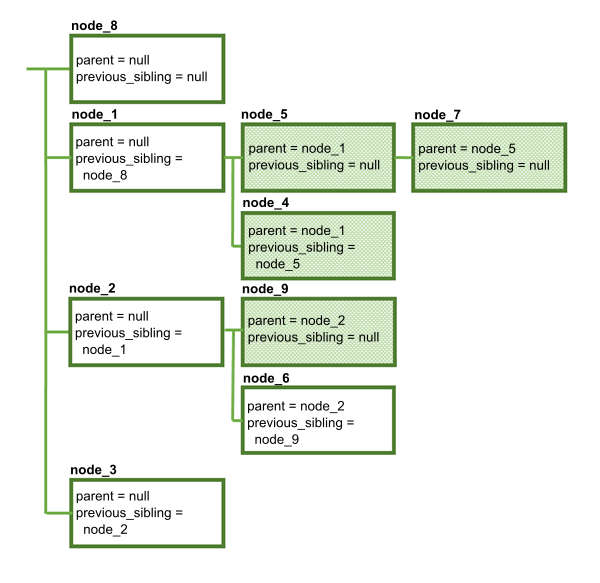
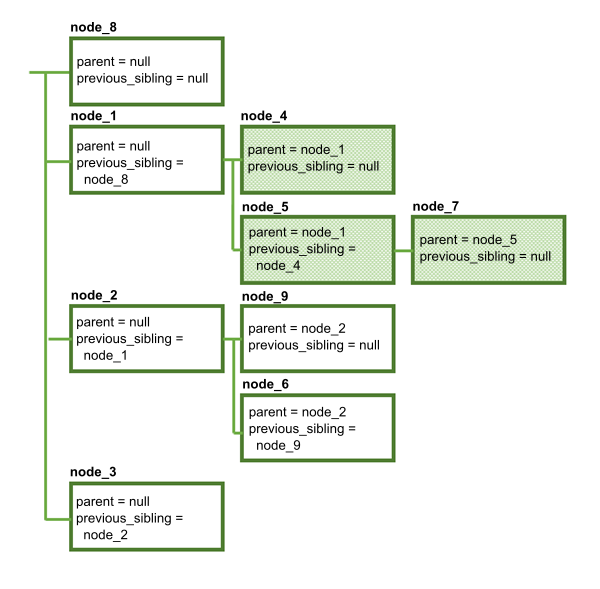
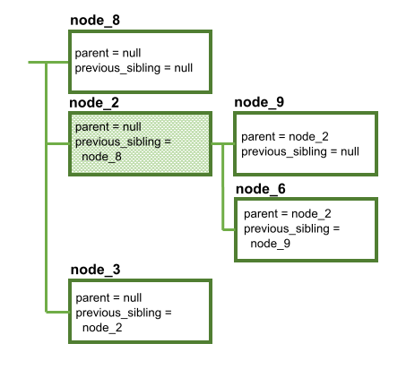
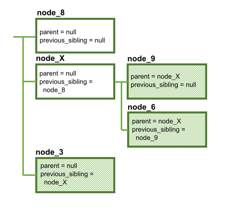

---

copyright:
  years: 2015, 2017
lastupdated: "2017-09-21"

---

{:shortdesc: .shortdesc}
{:new_window: target="_blank"}
{:tip: .tip}
{:pre: .pre}
{:codeblock: .codeblock}
{:screen: .screen}
{:javascript: .ph data-hd-programlang='javascript'}
{:java: .ph data-hd-programlang='java'}
{:python: .ph data-hd-programlang='python'}
{:swift: .ph data-hd-programlang='swift'}

# Modificando um diálogo utilizando a API

A API de REST do {{site.data.keyword.conversationshort}} suporta a modificação de seu diálogo de maneira programática, sem o uso da ferramenta {{site.data.keyword.conversationshort}}. É possível usar a API /dialog_nodes para criar, excluir ou modificar nós de diálogo.

Lembre-se de que o diálogo é uma árvore de nós interconectados e que deve estar em conformidade com certas regras para ser válido. Isso significa que qualquer mudança feita em um nó de diálogo pode ter efeitos em cascata em outros nós ou na estrutura do diálogo. Antes de usar a API /dialog_nodes para modificar o diálogo, certifique-se de entender como suas mudanças afetarão o resto do diálogo.

Um diálogo válido sempre satisfaz os critérios a seguir:

- Cada nó do diálogo possui um ID exclusivo (a propriedade `dialog_node`).
- Um nó-filho está ciente de seu nó pai (a propriedade `parent`). No entanto, um nó pai não está ciente de seus filhos.
- Um nó está ciente de seu irmão anterior imediato, se houver (a propriedade `previous_sibling`). Isso significa que todos os irmãos de um pai fornecido formam uma lista vinculada, com cada nó apontando para o nó anterior.
- Somente um filho de um pai fornecido pode ser o primeiro irmão (significando que seu `previous_sibling` é nulo).
- Um nó não pode apontar para um irmão anterior que seja um filho de um pai diferente.
- Dois nós não podem apontar para o mesmo irmão anterior.
- Um nó pode especificar outro nó que deve ser executado em seguida (a propriedade `next_step`).
- Um nó não pode ser seu próprio pai ou seu próprio irmão.
- Um nó do tipo `response_condition` não pode ter filhos.

Os exemplos a seguir mostram como várias modificações podem causar mudanças em cascata.

## Criando um nó
{: #create-node}

Considere a árvore de diálogo simples a seguir:



Podemos criar um novo nó ao fazer uma solicitação POST para /dialog_nodes com o corpo a seguir:

```json
{
  "Dialog_node": "node_8"
}
```

O diálogo agora é semelhante a este:



Como o **node_8** foi criado sem especificar um valor para `parent` ou `previous_sibling`, ele agora é o primeiro nó no diálogo. Observe que além de criar o **node_8**, o serviço também modificou **node_1** para que sua propriedade `previous_sibling` aponte para o novo nó.

É possível criar um nó em outro lugar no diálogo especificando o pai e irmão anteriores:

```json
{
  "dialog_node": "node_9",
  "parent": "node_2",
  "previous_sibling": "node_5"
}
```

Os valores especificados para `parent` e `previous_node` devem ser válidos:

- Ambos os valores devem referir-se a nós existentes.
- O pai especificado deve ser o mesmo que o pai do irmão anterior (ou `null` se o irmão anterior não tiver pai).
- O pai não pode ser um nó do tipo `response_condition`.

O diálogo resultante é semelhante a este:



Além de criar o **node_9**, o serviço atualiza automaticamente a propriedade `previous_sibling` de *node_6* para que aponte para o novo nó.

## Movendo um nó para um pai diferente
{: #change-parent}

Vamos mover **node_5** para um pai diferente usando o método POST /dialog_nodes/node_5 com o corpo a seguir:

```json
{
  "parent": "node_1"
}
```

O valor especificado para `parent` deve ser válido:
- Ele deve referir-se a um nó existente.
- Ele não deve referir-se ao nó que está sendo modificado (um nó não pode ser seu próprio pai).
- Ele não deve referir-se a um descendente do nó que está sendo modificado.
- Ele não deve referir-se a um nó do tipo `response_condition`.

Isso resulta na estrutura mudada a seguir:



Muitas coisas aconteceram aqui:
- Quando **node_5** mudou para seu novo pai, **node_7** foi com ele (porque o valor de `parent` para **node_7** não mudou). Quando você move um nó, todos os descendentes desse nó permanecem com ele.
- Como nós não especificamos um valor `previous_sibling` para **node_5**, agora ele é o primeiro irmão sob **node_1**.
- A propriedade `previous_sibling` de **node_4** foi atualizada para `node_5`.
- A propriedade `previous_sibling` de **node_9** foi atualizada para `null`, porque agora ela é o primeiro irmão sob **node_2**.

## Resequenciando irmãos
{: #change-sibling}

Agora vamos tornar **node_5** o segundo irmão em vez de o primeiro. Podemos fazer isso usando o método POST /dialog_nodes/node_5 com o corpo a seguir:

```json
{
  "previous_sibling": "node_4"
}
```

Quando você modifica `previous_sibling`, o novo valor deve ser válido:
- Ele deve referir-se a um nó existente
- Ele não deve referir-se ao nó que está sendo modificado (um nó não pode ser seu próprio irmão)
- Ele deve referir-se a um filho do mesmo pai (todos os irmãos devem ter o mesmo pai)

A estrutura muda conforme a seguir:



Observe que, mais uma vez, **node_7** permanece com seu pai. Além disso, **node_4** é modificado para que seu `previous_sibling` seja `null`, porque agora ele é o primeiro irmão.

## Excluindo um nó
{: #delete-node}

Agora vamos excluir **node_1**, usando o método DELETE /dialog_nodes/node_1.

O resultado é este:



Observe que **node_1**, **node_4**, **node_5** e **node_7** foram todos excluídos. Quando você exclui um nó, todos os descendentes desse nó são excluídos também. Portanto, se você excluir um nó base, você estará de fato excluindo uma ramificação inteira da árvore de diálogo. Quaisquer outras referências ao nó excluído (como referências `next_step`) serão mudadas para `null`.

Além disso, **node_2** é atualizado para apontar para **node_8** como seu novo irmão anterior.

## Renomeando um nó
{: #rename-node}

Finalmente, vamos renomear **node_2** usando o método POST /dialog_nodes/node_2 com o corpo a seguir:

```json
{
  "dialog_node": "node_X"
}
```



A estrutura do diálogo não mudou, mas mais uma vez múltiplos nós foram modificados para refletir o nome mudado:

- As propriedades `parent` de **node_9** e **node_6**
- A propriedade `previous_sibling` de **node_3**

Quaisquer outras referências ao nó excluído (como referências `next_step`) também são mudadas.
