---

copyright:
  years: 2015, 2017
lastupdated: "2017-10-19"

---

{:shortdesc: .shortdesc}
{:new_window: target="_blank"}
{:tip: .tip}
{:pre: .pre}
{:codeblock: .codeblock}
{:screen: .screen}
{:javascript: .ph data-hd-programlang='javascript'}
{:java: .ph data-hd-programlang='java'}
{:python: .ph data-hd-programlang='python'}
{:swift: .ph data-hd-programlang='swift'}

# Construindo um diálogo
{: #dialog-build}

O diálogo utiliza as intenções e entidades que são identificadas na entrada do usuário, além de contexto do aplicativo, para interagir com o usuário e finalmente fornecer uma resposta útil.
{: shortdesc}

A resposta pode ser a resposta para uma pergunta como `Where can I get some gas?` ou a execução de um comando, como ligar o rádio. A intenção e a entidade podem ser informações suficientes para identificar a resposta correta, ou o diálogo pode pedir ao usuário uma entrada adicional, necessária para responder corretamente. Por exemplo, se um usuário pergunta: "Onde posso arranjar comida?" você pode querer esclarecer se eles querem um restaurante ou uma mercearia, para jantar no local ou levar e assim por diante. É possível pedir mais detalhes em uma resposta de texto e criar um ou mais nós-filhos para processar a nova entrada.

<iframe class="embed-responsive-item" id="youtubeplayer" type="text/html" width="640" height="390" src="https://www.youtube.com/embed/oQUpejt6d84?rel=0" frameborder="0" webkitallowfullscreen mozallowfullscreen allowfullscreen> </iframe>

## Visão geral do diálogo
{: #overview}

Seu diálogo é representado graficamente na ferramenta como uma árvore. Crie uma ramificação para processar cada intenção que você deseja que sua conversa manipule. Uma ramificação é composta de múltiplos nós.

### Nós de diálogo

Cada nó de diálogo contém, no mínimo, uma condição e uma resposta.

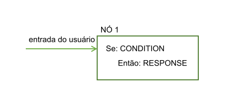

- Condição: Especifica as informações que devem estar presentes na entrada do usuário para que esse nó no diálogo seja acionado. As informações podem ser uma intenção específica, um valor de entidade ou um valor variável de contexto. Consulte [Condições](#conditions) para obter informações adicionais.
- Resposta: A elocução que o serviço usa para responder ao usuário. A resposta também pode ser configurada para acionar ações programáticas. Consulte [Respostas](#responses) para obter informações adicionais.

É possível pensar no nó como tendo uma construção if/then: se esta condição for verdadeira, então retornar essa resposta.

Por exemplo, o nó a seguir é acionado se a função de processamento de linguagem natural do serviço determina que a entrada do usuário contém a intenção `#cupcake-menu`. Como resultado do nó sendo acionado, o serviço responde com uma resposta apropriada.

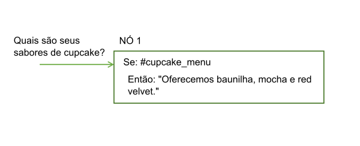

Um nó único com uma condição e resposta pode manipular solicitações simples do usuário. Porém, mais frequentemente, os usuários têm perguntas mais sofisticadas ou desejam ajuda com tarefas mais complexas. É possível incluir nós-filhos que pedem para o usuário fornecer qualquer informação adicional que o serviço necessite.


### Fluxo de diálogo

O diálogo que você cria é processado pelo serviço de cima para baixo.

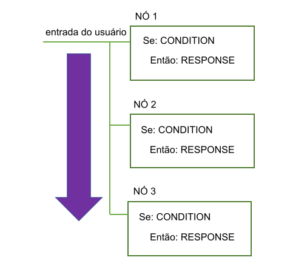

À medida que ele viajar pela árvore, se o serviço localizar uma condição que foi atendida, ele acionará aquele nó. Ele então se moverá da esquerda para a direita no nó acionado para verificar a entrada do usuário com relação a quaisquer condições do nó-filho. Conforme verifica os nós-filhos, ele se move novamente de cima para baixo.

Os serviços continuam funcionando através da árvore de diálogo de cima para baixo, da esquerda para a direita, depois de cima para baixo e da esquerda para a direita até chegarem ao último nó na ramificação que estão seguindo.

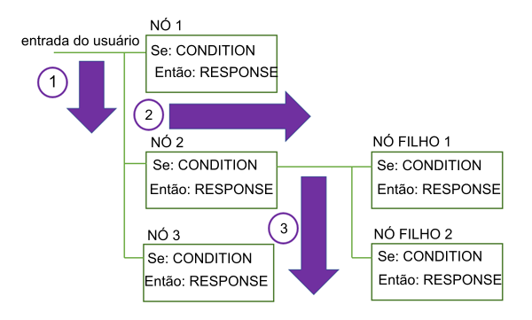

Ao iniciar a construção do diálogo, deve-se determinar as ramificações a serem incluídas e onde colocá-las. A ordem das ramificações é importante porque os nós são avaliados de cima para baixo. O primeiro nó base cuja condição corresponda à entrada é usado; quaisquer nós que venham abaixo na árvore não são acionados.

## Condições
{: #conditions}

Uma condição de nó determina se esse nó é usado na conversa. As condições de resposta determinam qual resposta exibir para um usuário.
É possível usar um ou mais dos seguintes artefatos em qualquer combinação para definir uma condição:

- **Variável de contexto**: o nó é usado se a expressão da variável de contexto que você especifica é verdadeira. Use a sintaxe `$variable_name:value` ou `$variable_name == 'value'`. Consulte [Variáveis de contexto](#context).

  Não defina um nó ou condição de resposta com base no valor de uma variável de contexto no mesmo nó de diálogo no qual você configura o valor da variável de contexto.
  {: tip}

- **Entidade**: O nó é usado quando qualquer valor ou sinônimo para a entidade é reconhecido na entrada do usuário. Use a sintaxe `@entity_name`. Por exemplo `@city`.

  Tenha certeza de criar um nó de mesmo nível para manipular o caso em que nenhum dos valores ou sinônimos da entidade são reconhecidos.
  {: tip}

- **Valor da entidade**: o nó é usado se o valor da entidade é detectado na entrada do usuário. Use a sintaxe `@entity_name:value`. Por exemplo: `@city:Boston`. Especifique um valor definido para a entidade, não um sinônimo.

  Se você procurar a presença da entidade, sem especificar um valor específico para ela, em um nó de mesmo nível, certifique-se de colocar o nó que procura esse valor de entidade específico acima dele.
{: tip}

- **Intenção**: a condição mais simples é uma única intenção. O nó é usado se a entrada do usuário é mapeada para essa intenção. Use a sintaxe `#intent-name`. Por exemplo, `#weather` verifica se a intenção detectada na entrada do usuário é `weather`. Em caso afirmativo, o nó é processado.

- **Condição especial**: condições que são fornecidas com o serviço que você pode usar para executar funções de diálogo comuns.

  <table>
  <tr>
    <td>Nome da condição</td>
    <td>Descrição</td>
  </tr>
  <tr>
    <td>anything_else</td>
    <td>É possível usar essa condição no final de um diálogo, para ser processada quando a entrada do usuário não corresponde a nenhum outro nó de diálogo. O nó **Qualquer outra coisa** é acionado por essa condição.</td>
  </tr>
  <tr>
    <td>conversation_start</td>
    <td>Como **welcome**, essa condição é avaliada como true durante a primeira rodada do diálogo. Diferentemente de **welcome**, é true se a solicitação inicial do aplicativo contém entrada do usuário ou não. Um nó com a condição **conversation_start** pode ser usado para inicializar variáveis de contexto ou executar outras tarefas no início do diálogo.</td>
  </tr>
  <tr>
    <td>false</td>
    <td>Essa condição é sempre avaliada como false. É possível usá-la na parte superior de uma ramificação que está em desenvolvimento para evitar que seja usada ou como a condição para um nó que fornece uma função comum e é usada apenas como o destino de uma ação **Ir para**.</td>
  </tr>
  <tr>
    <td>irrelevant</td>
    <td>Essa condição será avaliada como true se a entrada do usuário for determinada como sendo irrelevante pelo serviço de Conversa.</td>
  </tr>
  <tr>
    <td>true</td>
    <td>Essa condição é sempre avaliada como true. É possível usá-la no final de uma lista de nós ou respostas para capturar quaisquer respostas que não correspondam a nenhuma das condições anteriores.</td>
  </tr>
  <tr>
    <td>welcome</td>
    <td>Essa condição é avaliada como true durante a primeira rodada do diálogo (quando a conversa começa), apenas se a solicitação inicial do aplicativo não contém nenhuma entrada do usuário. Ela é avaliada como false em todas as rodadas de diálogo subsequentes. O nó **Welcome** é acionado por essa condição. Geralmente, um nó com essa condição é usado para saudar o usuário, por exemplo, para exibir uma mensagem como "Bem-vindo ao nosso aplicativo de pedidos de pizza."</td>
  </tr>
  </table>

### Sintaxe da condição

Use uma dessas opções de sintaxe para criar expressões válidas em condições:

- A linguagem Spring Expression (SpEL), que é uma linguagem de expressão que suporta a consulta e a manipulação de um gráfico do objeto no tempo de execução. Consulte [Linguagem Spring Expression Language (SpEL) ](http://docs.spring.io/spring/docs/current/spring-framework-reference/html/expressions.html){: new_window} para obter informações adicionais.

- Notações abreviadas para consultar intenções, entidades e variáveis de contexto. Consulte [Acessando e avaliando objetos](expression-language.html).

Use expressões regulares para procurar valores para uma condição. Para localizar uma sequência correspondente, por exemplo, é possível usar o método `String.find`. Consulte [Métodos](dialog-methods.html) para obter mais detalhes.

### Dicas de uso da condição

- Se você deseja avaliar apenas o valor da primeira instância detectada de um tipo de entidade, poderá usar a sintaxe `@entity == 'specific-value'` em vez do formato `@entity:(specific-value)`. Por exemplo, quando você usa `@appliance == 'air conditioner'`, você está avaliando apenas o valor da primeira entidade `@appliance` detectada. Mas, o uso de `@appliance:(air conditioner)` é expandido para `entity['appliance'].contains('air conditioner')`, que corresponderá sempre que houver pelo menos uma entidade `@appliance` com o valor 'air conditioner' detectado na entrada do usuário.
- Ao usar variáveis numéricas, certifique-se de que as variáveis possuam valores. Se uma variável não tiver um valor, ela será tratada como tendo um valor nulo (0) em uma comparação numérica. Por exemplo, se você verificar o valor de uma variável com a condição `@price < 100` e a entidade @price for nula, a condição será avaliada como `true` porque 0 é menor do que 100, embora o preço nunca tenha sido configurado. Para evitar a verificação de variáveis nulas, use uma condição como `@price AND @price < 100`. Se @price não tiver nenhum valor, essa condição corretamente retornará false.
- Se você usar uma entidade como a condição e a correspondência difusa estiver ativada, `@entity_name` será avaliada como true apenas se a confiança da correspondência for maior que 30%. Ou seja, apenas se `@entity_name.confidence > .3`.

## Respostas
{: #responses}

A resposta do diálogo define como responder ao usuário.

É possível responder com um desses tipos de resposta:

- [Resposta de texto simples](#simple-text)
- [Diversas respostas condicionadas](#multiple)
- [Resposta complexa](#complex)

### Resposta de texto simples
{: #simple-text}

Se você deseja fornecer uma resposta de texto, simplesmente insira o texto que deseja que o serviço exiba para o usuário.


#### Incluindo variedade
{: #variety}

Se seus usuários retornam ao seu serviço de conversa com frequência, eles podem ficar entediados de sempre ouvir as mesmas saudações e respostas. É possível incluir *variações* para suas respostas para que sua conversa possa responder à mesma condição de diferentes maneiras.

<iframe class="embed-responsive-item" id="youtubeplayer" type="text/html" width="640" height="390" src="https://www.youtube.com/embed/nAlIW3YPrAs?rel=0" frameborder="0" webkitallowfullscreen mozallowfullscreen allowfullscreen> </iframe>

Neste exemplo, a resposta que o serviço fornece em resposta a perguntas sobre locais da loja difere de uma interação para a outra:

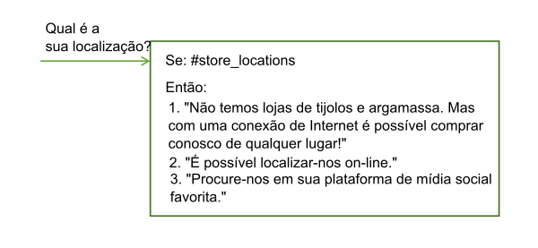

É possível optar por alternar pelas variações de respostas sequencialmente ou em ordem aleatória. Por padrão, as respostas são alternadas sequencialmente, como se fossem escolhidas em uma lista ordenada.

### Respostas condicionadas
{: #multiple}

Um único nó de diálogo pode fornecer diferentes respostas, cada uma acionada por uma condição diferente. Use essa abordagem para abordar cenários múltiplos em um único nó.

<iframe class="embed-responsive-item" id="youtubeplayer" type="text/html" width="640" height="390" src="https://www.youtube.com/embed/KcvVQAsnhLM?rel=0" frameborder="0" webkitallowfullscreen mozallowfullscreen allowfullscreen> </iframe>

O nó ainda tem uma condição principal, que é a condição para usar o nó e processar as condições e respostas que ele contém.

Neste exemplo, o serviço usa informações que ele coletou anteriormente sobre a localização do usuário para customizar sua resposta e fornecer informações sobre a loja mais próxima do usuário. Consulte [Variáveis de contexto](#context) para obter informações adicionais sobre como armazenar informações coletadas do usuário.

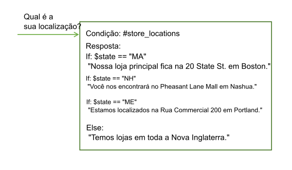

Esse nó único agora fornece a função equivalente de quatro nós separados.

As condições em um nó são avaliadas na ordem, assim como os nós. Certifique-se de que suas condições e respostas estejam listadas na ordem correta. Se você precisar mudar a ordem, selecione uma condição e mova-a para cima ou para baixo na lista usando as setas que aparecem. Se você desejar atualizar o contexto, deve-se fazer isso em cada resposta individual. Não há uma seção de resposta comum. A ação **Ir para** é processada após uma resposta ser selecionada e entregue. Se você incluir uma ação **Ir para**, ela será executada após qualquer resposta retornada do nó.
{: tip}

### Uma resposta complexa
{: #complex}

Para especificar uma resposta mais complexa, é possível usar o editor JSON para especificar a resposta na propriedade `"output":{}`.

Para incluir um valor de variável de contexto na resposta, use a sintaxe `$variable-name` para especificar isso. Veja [Variáveis de contexto](#context) para obter mais informações.

```json
{
  "output": {
    "text": "Hello $user"
  }
}
```
{: codeblock}

Para especificar mais de uma instrução que você deseja exibir em linhas separadas, defina a saída como uma matriz JSON.

```json
{
  "output": {
    "text": ["Hello there.", "How are you?"]
  }
}
```
{: codeblock}

A primeira sentença é exibida em uma linha e a segunda sentença é exibida como uma nova linha abaixo dela.

Para implementar um comportamento mais complexo, é possível definir o texto de saída como um objeto JSON complexo. Por exemplo, é possível usar um objeto complexo na saída JSON para imitar o comportamento de incluir variações de resposta no nó. É possível incluir as propriedades a seguir no objeto complexo:

- **values**: uma matriz JSON de sequências que contém várias versões de texto de saída que este nó de diálogo pode retornar. A ordem na qual os valores na matriz são retornados depende do atributo `selection_policy`.

- **selection_policy**: os valores a seguir são válidos:

    - **random**: o sistema seleciona aleatoriamente o texto de saída da matriz `values` e não os repete consecutivamente. Por exemplo, considere output.text, que contém três valores. Nas três primeiras vezes, um valor aleatório é selecionado, mas não repetido outra vez. Após todos os valores de saída serem fornecidos, o sistema seleciona aleatoriamente outro valor e repete o processo.

        ```json
        {
            "output":{
                "text":{
                    "values":["Hello.","Hi.","Howdy!"],
                    "selection_policy":"random"
                }
            }
        }
        ```
        {: codeblock}

    O sistema retorna uma saudação dessas três opções que ele seleciona aleatoriamente. Na próxima vez que a resposta é acionada, outra saudação da lista é exibida. A saudação é novamente escolhida aleatoriamente, exceto a saudação usada anteriormente que intencionalmente não é repetida.

    - **sequential**: o sistema retorna o primeiro texto de saída na primeira vez que o nó de diálogo é acionado, o segundo texto de saída na segunda vez que o nó é acionado e assim por diante.

        ```json
        {
            "output":{
                "text":{
                    "values":["Hello.", "Hi.", "Howdy!"],
                    "selection_policy":"sequential"
                }
            }
        }
        ```
        {: codeblock}

- **append**: especifica se deve-se anexar um valor em uma matriz ou sobrescrever os valores na matriz com o novo valor ou valores. Quando configurada como false, a saída coletada em nós de diálogo executados anteriormente é sobrescrita pelo valor de texto especificado nesse nó específico.

    ```json
    {
        "output":{
            "text":{
                "values": ["Hello."],
                "append":false
            }
        }
    }
    ```
    {: codeblock}

    Nesse caso, todos os outros textos de saída serão sobrescritos por esse texto de saída.

O comportamento padrão assume `selection_policy = random` e `append = true`. Quando a matriz de valores contém mais de um item, o texto de saída é selecionado aleatoriamente de seus elementos.

### Definindo o que fazer em seguida
{: #jump-to}

Depois de fazer a resposta especificada, você pode instruir o serviço a fazer uma das seguintes coisas:

- **Aguardar entrada do usuário**: o serviço aguarda o usuário fornecer nova entrada que a resposta induz. Por exemplo, a resposta poderá fazer ao usuário uma pergunta de sim ou não. O diálogo não progredirá até que o usuário forneça mais entrada.
- **Ir para outro nó de diálogo**: use esta opção quando desejar efetuar bypass na espera de entrada do usuário e desejar que a conversa vá diretamente para os nós-filhos ou para um nó de diálogo totalmente diferente. É possível usar uma ação Ir Para para rotear o fluxo para um nó de diálogo comum por meio de múltiplos locais na árvore, por exemplo.
  >Nota: o nó de destino para o qual você deseja ir deve existir antes que você possa configurar a ação Ir Para para usá-lo.

#### Configurando a ação Ir Para

Se você optar por pular para outro nó, deverá especificar se a ação se destina à **resposta** ou à **condição** do nó de diálogo selecionado

- **Resposta**: se a instrução destinar-se à parte da resposta do nó de diálogo selecionado, ela será executada imediatamente. Ou seja, o sistema não avaliará a parte da condição do nó de diálogo selecionado e executará a parte da resposta do nó de diálogo selecionado imediatamente.

  Destinar a resposta é útil para encadear vários nós de diálogo juntos. A parte da resposta do nó de diálogo selecionado é processada como se a condição desse nó de diálogo fosse verdadeira. Se o nó de diálogo selecionado tiver outra ação **Ir para**, essa ação também será executada imediatamente.
- **Condição**: se a instrução se destina à parte da condição do nó de diálogo selecionado, o serviço verifica primeiro se a condição do nó de destino é avaliada como true.
    - Se a condição for avaliada como true, o sistema processará esse nó imediatamente atualizando o contexto com o contexto do nó de diálogo e a saída com a saída do nó de diálogo.
    - Se a condição não for avaliada como true, o sistema continuará o processo de avaliação de uma condição do próximo nó irmão do nó de diálogo de destino e assim por diante, até que localize um nó de diálogo com uma condição que seja avaliada como true.
    - Se o sistema processar todos os irmãos e nenhuma condição for avaliada como true, a estratégia básica de fallback será usada e o diálogo também avaliará os nós no nível superior.

    Destinar a condição é útil para encadear as condições de nós de diálogo. Por exemplo, você pode desejar primeiro verificar se a entrada contém uma intenção, tal como `#turn_on` e, se contém, você pode desejar verificar se a entrada contém entidades, como `@lights`, `@radio` ou `@wipers`. O encadeamento das condições ajuda a estruturar árvores de diálogo maiores.

**Nota**: o processamento de ações **Ir para** mudou com a liberação de 3 de fevereiro de 2017. Consulte [Atualizando a área de trabalho ](upgrading.html){: new_window} para obter mais detalhes.

#### Mais informações

Para obter informações sobre a linguagem de expressão usada pelo diálogo, além de métodos, entidades do sistema e outros detalhes úteis, consulte a seção Referência na área de janela de Navegação.

## Variáveis de contexto
{: #context}

O diálogo está sem estado, significando que ele não retém informações de uma troca com o usuário para o próximo. Seu aplicativo é responsável por manter qualquer informação contínua necessária. No entanto, o aplicativo pode transmitir informações para o diálogo e o diálogo pode atualizar essas informações e transmiti-las de volta para o aplicativo. Ele faz isso usando variáveis de contexto.

Uma variável de contexto é uma variável que você define em um nó e, opcionalmente, para a qual especifica um valor padrão. Outros nós ou lógicas de aplicativo podem posteriormente configurar ou mudar o valor da variável de contexto. 

É possível condicionar com relação aos valores de variáveis de contexto referenciando uma variável de contexto de uma condição de nó de diálogo para determinar se deve executar um nó. E você pode referenciar uma variável de contexto de condições de resposta do nó de diálogo para mostrar diferentes respostas, dependendo de um valor fornecido por um serviço externo ou pelo usuário.

### Transmitindo o contexto do aplicativo

Transmita informações do aplicativo para o diálogo configurando uma variável de contexto e transmitindo a variável de contexto para o diálogo.

Por exemplo, seu aplicativo pode configurar uma variável de contexto $time_of_day e transmiti-la para o diálogo, que pode usar as informações para customizar a saudação exibida para o usuário.

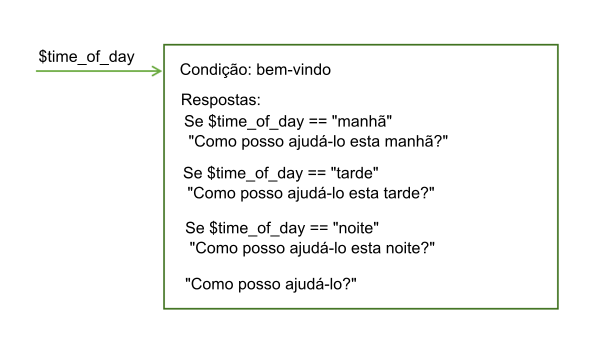

Neste exemplo, o diálogo sabe que o aplicativo configura a variável com um destes valores: *manhã*, *tarde* ou *noite*. Ele pode verificar cada valor e, dependendo de qual valor estiver presente, retornar a saudação apropriada. Se a variável não for transmitida ou possuir um valor que não corresponde a um dos valores esperados, uma saudação mais genérica será exibida para o usuário.

### Transmitindo o contexto de nó para nó

O diálogo também pode incluir variáveis de contexto para transmitir informações de um nó para outro ou para atualizar os valores de variáveis de contexto. Conforme o diálogo pede e obtém informações do usuário, ele pode rastrear as informações e fazer referência a elas mais tarde na conversa.

Por exemplo, em um nó você pode perguntar o nome dos usuários e, em um nó posterior, tratá-los pelo nome.

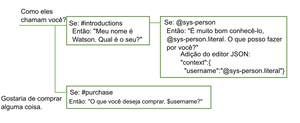

Neste exemplo, a entidade do sistema @sys-person será usada para extrair o nome do usuário da entrada, se o usuário fornecer um. No editor JSON, a variável de contexto username é definida e configurada com o valor @sys-person. Em um nó subsequente, a variável de contexto $username é incluída na resposta para tratar o usuário pelo nome.

### Definindo uma variável de contexto

Defina uma variável de contexto incluindo um par `name` e `value` na seção `{context}` da definição de nó do diálogo JSON. O par deve atender a estes requisitos:

- O `name` pode conter quaisquer caracteres alfabéticos em maiúsculas e minúsculas, caracteres numéricos (0-9) e sublinhados.

  **Nota**: é possível incluir outros caracteres, como pontos e hifens, no nome. No entanto, se você o fizer, deverá usar uma das abordagens a seguir para fazer referência à variável:
  - context['variable-name']: The sintaxe da expressão SpEL completa.
  - $(variable-name): sintaxe abreviada com o nome da variável entre parênteses.

  Consulte [Acessando e avaliando objetos](expression-language.html#shorthand-syntax-for-context-variables) para obter mais detalhes.

- O `value` pode ser qualquer tipo JSON suportado, tal como uma variável de sequência simples, um número, uma matriz JSON ou um objeto JSON.

A amostra JSON a seguir define valores para a sequência $dessert, a matriz $toppings_array e as variáveis de contexto numéricas $age:

```json
{
  "context": {
    "dessert": "ice-cream",
    "toppings_array": ["onion", "olives"],
    "age": 18
  }
}
```
{: codeblock}

Para definir uma variável de contexto, conclua as etapas a seguir:

1.  Na visualização de edição do nó, abra o editor JSON clicando no ícone  e, em seguida, selecionando **JSON**.

1.  Na frente do bloco `"output":{}`, inclua um bloco `"context":{}` se um não estiver presente.

    ```json
    {
      "context":{},
      "output":{}
    }
    ```
    {: codeblock}

1.  No bloco de contexto, inclua um par de nome e valor para cada variável de contexto que você deseja definir.

    ```json
    {
      "context":{
        "name": "value"
    },
    ...
    }
    ```
    {: codeblock}

  Para referenciar a variável de contexto subsequentemente, use a sintaxe `$name` em que *name* é o nome da variável de contexto que você definiu.

Outras tarefas comuns incluem:

- Para armazenar a sequência inteira que foi inserida pelo usuário, use `input.text`:

    ```json
    {
      "context": {
        "repeat": "<?input.text?>"
      }
    }
    ```
    {: codeblock}

- Para armazenar o valor de uma entidade em uma variável de contexto, use esta sintaxe:

    ```json
    {
      "context": {
        "place": "@place"
      }
    }
    ```
    {: codeblock}

- Para armazenar em uma variável de contexto o valor de uma sequência extraída da entrada do usuário usando uma expressão regular, use esta sintaxe:

    ```json
    {
      "context": {
         "number": "<?input.text.extract('^[^\\d]*[\\d]{11}[^\\d]*$',0)?>"
      }
    }
    ```
    {: codeblock}

- Para armazenar o valor de uma entidade padrão em uma variável de contexto, anexe .literal ao nome da entidade. O uso desta sintaxe assegura que a extensão exata de texto da entrada do usuário que correspondeu ao padrão especificado seja armazenada na variável.

    ```json
    {
      "context": {
        "email": "@email.literal"
      }
    }
    ```
    {: codeblock}

### Ordem de operação
{: #order-of-context-var-ops}

A ordem na qual você define as variáveis de contexto não determina a ordem na qual elas são avaliadas pelo serviço. O serviço avalia as variáveis, que são definidas como pares de nome e valor JSON, em ordem aleatória. Não configure um valor na primeira variável de contexto e espere ser capaz de usá-lo na segunda, porque não há garantia de que a primeira variável de contexto em sua lista será executada antes da segunda em sua lista. Por exemplo, não use duas variáveis de contexto para implementar a lógica que retorna um número aleatório entre zero e algum valor mais alto que é transmitido ao nó.

```json
"context": {
    "upper": "<? @sys-number.numeric_value + 1?>",
    "answer": "<? new Random().nextInt($upper) ?>"
}
```
{: codeblock}

Use uma expressão um pouco mais complexa para evitar ter que depender do valor da variável de contexto $upper ser avaliado antes da variável de contexto $answer ser avaliada.

```json
"context": {
    "answer": "<? new Random().nextInt(@sys-number.numeric_value + 1) ?>"
}
```
{: codeblock}

### Atualizando um valor da variável de contexto
{: #updating-a-context-variable-value}

Se um nó configura o valor de uma variável de contexto que já foi configurado, o valor anterior é sobrescrito.

#### Atualizando um objeto JSON complexo

Os valores anteriores são sobrescritos para todos os tipos de JSON, exceto um objeto JSON. Se a variável de contexto é um tipo complexo tal como o objeto JSON, um procedimento de mesclagem JSON é usado para atualizar a variável. A operação de mesclagem inclui quaisquer propriedades recém-definidas e sobrescreve quaisquer propriedades existentes do objeto.

Neste exemplo, uma variável de contexto name é definida como um objeto complexo.

```json
{
  "context": {
    ...
    "complex_object": {
      "user_firstname" : "Paul",
      "user_lastname" : "Pan"
      "has_card" : false
    }
  }
}
```
{: codeblock}

Um nó de diálogo atualiza o objeto JSON da variável de contexto com os valores a seguir:

```json
{
  "complex_object": {
    "user_firstname": "Peter",
    "has_card": true
  }
}
```
{: codeblock}

O resultado é este contexto:

```json
{
  "complex_object": {
    "user_firstname": "Peter",
    "user_lastname": "Pan",
    "has_card": true
  }
}
```
{: codeblock}

#### Atualizando matrizes

Se seus dados de contexto de diálogo contiverem uma matriz de valores, você poderá atualizar a matriz anexando valores, removendo um valor ou substituindo todos os valores.

Escolha uma dessas ações para atualizar a matriz. Em cada caso, vemos a matriz antes da ação, a ação e a matriz após a ação ter sido aplicada.

- **Anexar**: para incluir valores no final de uma matriz, use o método `append`.

    Para esse Contexto de tempo de execução de diálogo:

    ```json
    {
      "context": {
        "toppings_array": ["onion", "olives"]
      }
    }
    ```
    {: codeblock}

    Faça essa atualização:

    ```json
    {
      "context": {
        "toppings_array": "<? $toppings_array.append('ketchup', 'tomatoes') ?>"
      }
    }
    ```
    {: codeblock}

    Resultado:

    ```json
    {
      "context": {
        "toppings_array": ["onion", "olives", "ketchup", "tomatoes"]
      }
    }
    ```
    {: codeblock}

- **Remover**: Para remover um elemento, use o método `remove` e especifique seu valor ou posição na matriz.

    - **Remover por valor** remove um elemento de uma matriz por seu valor.

        Para esse Contexto de tempo de execução de diálogo:

        ```json
        {
          "context": {
            "toppings_array": ["onion", "olives"]
          }
        }
        ```
        {: codeblock}

        Faça essa atualização:

        ```json
        {
          "context": {
            "toppings_array": "<? $toppings_array.removeValue('onion') ?>"
          }
        }
        ```
        {: codeblock}

        Resultado:

        ```json
        {
          "context": {
            "toppings_array": ["olives"]
          }
        }
        ```
        {: codeblock}

    - **Remover por posição**: removendo um elemento de uma matriz por sua posição de índice:

        Para esse Contexto de tempo de execução de diálogo:

        ```json
        {
          "context": {
            "toppings_array": ["onion", "olives"]
          }
        }
        ```
        {: codeblock}

        Faça essa atualização:

        ```json
        {
          "context": {
            "toppings_array": "<? $toppings_array.remove(0) ?>"
          }
        }
        ```
        {: codeblock}

        Resultado:

        ```json
        {
          "context": {
            "toppings_array": ["olives"]
          }
        }
        ```
        {: codeblock}

- **Sobrescrever**: para sobrescrever os valores em uma matriz, simplesmente configure a matriz com os novos valores:

    Para esse Contexto de tempo de execução de diálogo:

        ```json
        {
          "context": {
            "toppings_array": ["onion", "olives"]
          }
        }
        ```
        {: codeblock}

    Faça essa atualização:

        ```json
        {
          "context": {
            "toppings_array": ["ketchup", "tomatoes"]
          }
        }
        ```
        {: codeblock}

    Resultado:

        ```json
        {
          "context": {
            "toppings_array": ["ketchup", "tomatoes"]
          }
        }
        ```
        {: codeblock}

**Atenção**: se você salvar a matriz como parte de uma sequência, ela se tornará um objeto String em vez de uma Matriz. Por exemplo, a variável de contexto $array a seguir é uma matriz, mas a variável de contexto $string_array é uma sequência.

```json
{
  "context": {
    "array": [
      "one",
      "two"
    ],
    "array_in_string": "this is my array: $array"
  }
}
```
{: codeblock}

Se você verificar os valores dessas variáveis de contexto na área de janela Experimente, verá seus valores especificados conforme a seguir:

**$array** : `["one","two"]`

**$array_in_string** : `"this is my array: [\"one\",\"two\"]"`

É possível executar métodos de matriz subsequentemente na variável $array, tal como `<? $array.removeValue('two') ?>`, mas não a variável $array_in_string.

## Criando um diálogo
{: #create}

Use a ferramenta {{site.data.keyword.conversationshort}} para criar um diálogo.

### Limites do nó de diálogo
{: #dialog-node-limits}

O número de nós de diálogo que podem ser criados depende de seu plano de serviço.

| Plano de Serviço     | Nós de diálogo por área de trabalho |
|------------------|---------------------------:|
| Standard/Premium |                    100.000 |
| Lite             |                     25.000 |

Limite de profundidade da árvore: o serviço suporta 2.000 descendentes de nó do diálogo; o conjunto de ferramentas é melhor executado com 20 ou menos.

### Procedimento

Para criar um diálogo, conclua as etapas a seguir:

1.  Abra a página **Construir** na barra de navegação, clique na guia **Diálogo** e, em seguida, clique em **Criar**.

    Quando você abre o construtor de diálogo pela primeira vez, os nós a seguir são criados para você:
    - **Welcome**: o primeiro nó. Ele contém uma saudação que é exibida para seus usuários quando eles se relacionam pela primeira vez com o serviço. É possível editar a saudação.
    - **Anything else**: O nó final. Ele contém frases que são usadas para responder aos usuários quando suas entradas não são reconhecidas. É possível substituir as respostas que são fornecidas ou incluir mais respostas com um significado semelhante para incluir variedade à conversa. Também é possível escolher se deseja que o serviço retorne cada resposta que está definida por vez ou as retorne em ordem aleatória.
1.  Para incluir mais nós na árvore de diálogo, clique no ícone **Mais**  no nó **Bem-vindo** e, em seguida, selecione **Incluir nó abaixo**.
1.  Insira uma condição que, quando atendida, aciona o serviço para processar o nó.

    À medida que você começa a definir uma condição, uma caixa será exibida mostrando suas opções. É possível inserir um dos caracteres a seguir e, em seguida, escolher um valor na lista de opções que é exibida.

    <table>
    <tr>
      <td>Caractere</td>
      <td>Lista os valores definidos para esses tipos de artefato</td>
    </tr>
    <tr>
      <td>`#`</td>
      <td>intenções</td>
    </tr>
    <tr>
      <td>`@`</td>
      <td>entidades</td>
    </tr>
    <tr>
      <td>`@{entity-name}:`</td>
      <td>Valores de {entity-name}</td>
    </tr>
    <tr>
      <td>`$`</td>
      <td>Variáveis de contexto que você definiu ou referenciou em outro lugar no diálogo</td>
    </tr>
    </table>

    É possível criar uma nova intenção, entidade, valor de entidade ou variável de contexto definindo uma nova condição que a use. Se você criar um artefato dessa maneira, certifique-se de voltar e concluir quaisquer outras etapas que sejam necessárias para que o artefato seja criado completamente, tal como definir elocuções de amostra para uma intenção.

    Para definir um nó que é acionado com base em mais de uma condição, insira uma condição e, em seguida, clique no ícone de sinal de mais (+) próximo a ela. Se você deseja aplicar um operador `OR` nas várias condições em vez de `AND`, clique no `and` que é exibido entre os campos para mudar o tipo de operador. As operações AND são executadas antes das operações OR, mas você pode mudar a ordem usando parênteses. Por exemplo:
    `$isMember:true AND ($memberlevel:silver OR $memberlevel:gold)`

    A condição que você define deve ser menor que 500 caracteres de comprimento.

    Para obter mais informações sobre como testar valores em condições, consulte [Condições](#conditions).
1.  **Opcional**: se você deseja coletar várias partes de informações do usuário nesse nó, clique em **Customizar** e ative **Intervalos**. Consulte [Reunindo informações com intervalos](#slots) para obter mais detalhes.
1.  Insira uma resposta.
    - Inclua o texto que você deseja que o serviço exiba para o usuário como uma resposta.
    - Para obter informações sobre respostas condicionais, tal como incluir uma variedade de respostas ou como especificar o que deve acontecer após o nó ser acionado, consulte [Respostas](#responses).
1.  **Opcional**: nomeie o nó.

    O nome do nó de diálogo pode conter letras (em Unicode), números, espaços, sublinhados, hifens e pontos.

    A nomeação do nó torna mais fácil para você lembrar de seu propósito e localizar o nó quando ele é minimizado. Se você não fornecer um nome, a condição de nó será usada como o nome.

1.  Para incluir mais nós, selecione um nó na árvore e, em seguida, clique no ícone **Mais** .
    - Para criar um nó de mesmo nível que será verificado em seguida se a condição para o nó existente não for atendida, selecione **Incluir nó abaixo**.
    - Para criar um nó de mesmo nível que será verificado antes de a condição para o nó existente ser verificada, selecione **Incluir nó acima**.
    - Para criar um nó-filho para o nó selecionado, selecione **Incluir nó-filho**. Um nó-filho é processado após seu nó pai.

    Para obter mais informações sobre a ordem na qual os nós de diálogo são processados, consulte [Visão Geral do Diálogo](#overview).
1.  Teste o diálogo à medida que você o constrói.
   Consulte [Testando seu diálogo](#test) para obter informações adicionais.

## Reunindo informações com intervalos
{: #slots}

Inclua intervalos em um nó de diálogo para reunir várias partes de informações de um usuário dentro desse nó. Os intervalos coletam informações no ritmo dos usuários. Detalhes que o usuário fornece inicialmente são salvos e o serviço pede apenas os detalhes não fornecidos.

<iframe class="embed-responsive-item" id="youtubeplayer" type="text/html" width="640" height="390" src="https://www.youtube.com/embed/ES4GHcDsSCI?rel=0" frameborder="0" webkitallowfullscreen mozallowfullscreen allowfullscreen> </iframe>

### Por que incluir intervalos?
{: #why-add-slots}

Use intervalos para obter as informações de que precisa antes de poder responder com precisão ao usuário. Por exemplo, se os usuários perguntarem sobre as horas de funcionamento, mas as horas diferirem por localização da loja, você poderá fazer uma pergunta complementar sobre qual local da loja eles planejam visitar antes de responder. Em seguida, será possível incluir condições de resposta que considerem as informações de local fornecidas.

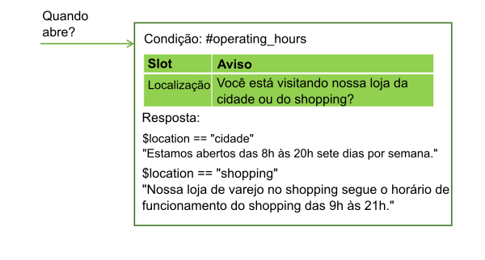

Os intervalos podem ajudá-lo a coletar várias partes de informações que você precisa para concluir uma tarefa complexa para um usuário, tal como fazer uma reserva para jantar.

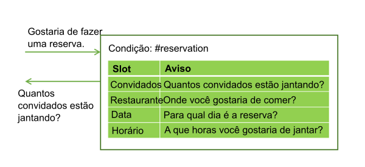

O usuário pode fornecer valores para vários intervalos de uma vez. Por exemplo, a entrada poderia incluir as informações: "Haverá 6 de nós jantando às 19h". Esta entrada contém dois dos valores necessários ausentes: o número de convidados e o horário da reserva. O serviço reconhece e armazena ambos, cada um em seu intervalo correspondente. Ele então exibe o prompt que está associado ao próximo slot vazio.

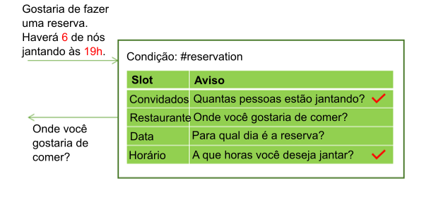

Os intervalos tornam possível para o serviço responder às perguntas complementares sem precisar restabelecer o objetivo do usuário. Por exemplo, um usuário pode solicitar uma previsão do tempo, então fazer uma pergunta complementar sobre o clima em outro local ou em um dia diferente. Se você salvar as variáveis de previsão necessárias, como local e dia, em intervalos, se um usuário fizer uma pergunta complementar com novos valores de variáveis, você poderá sobrescrever os valores de intervalo com os novos valores fornecidos, e dar uma resposta que reflita as novas informações.

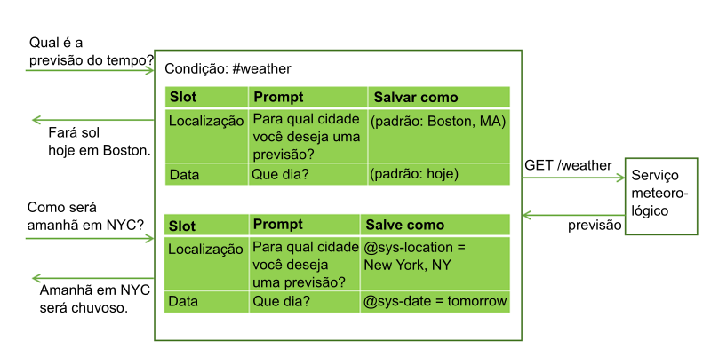

O uso de intervalos produz um fluxo de diálogo mais natural entre o usuário e o serviço e é mais fácil para você gerenciar do que tentar coletar as informações usando muitos nós separados.

#### Incluindo intervalos
{: #add-slots}

1.  Identifique as unidades de informações que deseja coletar. Por exemplo, para pedir uma pizza para alguém, você pode desejar coletar as informações a seguir:

    - Horário da entrega
    - Tamanho

1.  Na visualização de edição do nó de diálogo, clique em **Customizar** e, em seguida, selecione a caixa de seleção **Intervalos**.

    **Nota**: para obter mais informações sobre o campo **Prompt para tudo**, consulte [Solicitando tudo de uma vez](dialog-build.html#slots-prompt-for-everything).

1.  **Inclua um intervalo para cada unidade de informações necessárias**.

    Para cada intervalo, especifique estes detalhes:

    - **Verificar**: identifique o tipo de informações que deseja extrair da resposta do usuário para o prompt do intervalo. Na maioria dos casos, você verifica valores de entidade, mas também é possível verificar uma intenção. É possível usar os operadores AND e OR aqui para definir condições mais complexas.

      **Nota**: se a entidade tiver padrões definidos para isso, depois de incluir o nome da entidade, anexe `.literal` nele. Por exemplo, após você escolher `@email` na lista de entidades definidas, edite o campo *Verificar* para conter `@email.literal`. Ao incluir a propriedade `.literal`, você indica que deseja capturar o texto exato que foi inserido pelo usuário e que foi identificado como um endereço de e-mail com base em seu padrão.

      Evite verificar os valores das variáveis de contexto. O valor *Verificar* é usado primeiro como uma condição, mas depois se torna o valor da variável de contexto que você nomeia no campo *Salvar como*. Se você usar uma variável de contexto na condição, ela poderá levar a um comportamento inesperado quando for usada no contexto.
      {: tip}

    - **Salvar como**: forneça um nome para a variável de contexto na qual armazenar o valor de interesse da resposta do usuário no prompt do intervalo. Não especifique uma variável de contexto que foi usada anteriormente no diálogo e, portanto, pode ter um valor. Somente quando a variável de contexto para o intervalo é nula que o prompt para o intervalo é exibido.

    - **Prompt**: grave uma instrução que extraia a parte das informações que você precisa do usuário. Após exibir esse prompt, a conversa pausa e o serviço aguarda o usuário responder.

    - Se você editar o intervalo, também poderá definir respostas para mostrar depois que o usuário responder ao prompt do intervalo.
      - **Localizado**: executado após o usuário fornecer as informações esperadas.
      - **Não localizado**: executado se as informações fornecidas pelo usuário não são compreendidas ou não são fornecidas no formato esperado. O texto que você especifica aqui pode indicar mais explicitamente o tipo de informação que você precisa que o usuário forneça. Se o intervalo for preenchido com êxito ou se a entrada do usuário for entendida e manipulada por um manipulador no nível do nó, essa condição nunca será acionada.

    Esta tabela mostra valores de intervalo de exemplo para um nó que ajuda os usuários a fazer um pedido de pizza.

    <table>
    <tr>
      <td>Informações</td>
      <td>Verificar</td>
      <td>Salvar como</td>
      <td>Prompt</td>
      <td>Acompanhar, se localizado</td>
      <td>Acompanhar, se não localizado</td>
    </tr>
    <tr>
      <td>Tamanho</td>
      <td>@size</td>
      <td>$size</td>
      <td>"Qual tamanho de pizza você gostaria?"</td>
      <td>"É $size."</td>
      <td>"Qual tamanho você quer? Temos pequeno, médio e grande."</td>
    </tr>
    <tr>
      <td>DeliverBy</td>
      <td>@sys-time</td>
      <td>$time</td>
      <td>"Quando você precisa da pizza?"</td>
      <td>"Para entrega às $time."</td>
      <td>"Que horas você quer que ela seja entregue? Precisamos de pelo menos meia hora para prepará-la."</td>
    </tr>
    </table>

    **Intervalos opcionais**: se você deseja incluir um intervalo que capture informações, mas que seja opcional, não especifique um prompt para ele.

    Por exemplo, você pode incluir um intervalo que captura informações de restrição alimentar caso o usuário especifique alguma. No entanto, você não deseja solicitar informações de dieta a todos os usuários, pois isso é irrelevante na maioria dos casos.

    <table>
    <tr>
      <td>Informações</td>
      <td>Verificar</td>
      <td>Salvar como</td>
    </tr>
    <tr>
      <td>Restrição de trigo</td>
      <td>@dietary</td>
      <td>$dietary</td>
    </tr>
    </table>

    Quando você inclui um intervalo sem um prompt, o serviço trata o intervalo como opcional.

    Se você tornar um intervalo opcional, referencie sua variável de contexto no texto da resposta no nível do nó apenas se puder descrevê-la de maneira que faça sentido mesmo que não seja fornecido nenhum valor para o intervalo. Por exemplo, você pode escrever uma instrução de resumo como esta: "Estou pedindo uma pizza $dietary $size para entrega às $time". O texto resultante ainda faz sentido se as informações de restrição alimentar, como `gluten-free` ou `dairy-free` não são fornecidas, "Estou pedindo uma pizza grande para entrega às 15h."
    {: tip}
1.  **Mantenha os usuários no trilho**.
    Opcionalmente, é possível definir manipuladores no nível do nó que fornecem respostas às perguntas que os usuários possam fazer durante a interação que sejam divergentes do propósito do nó.

    Por exemplo, o usuário pode perguntar sobre a receita de molho de tomate ou onde você obtém seus ingredientes. Para lidar com tais digressões, clique no link **Gerenciar Manipuladores** e inclua uma condição e resposta para cada pergunta antecipada.

    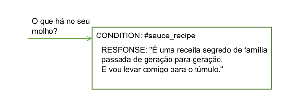

    Após responder à digressão, o prompt associado ao slot vazio atual é exibido.

    Essa condição é acionada se o usuário fornece entrada que corresponde às condições do manipulador a qualquer momento durante o fluxo do nó de diálogo até que a resposta no nível do nó seja exibida.
1.  **Incluir uma resposta no nível do nó**.
    Essa resposta no nível do nó não é executada até após o preenchimento de todos os intervalos necessários. É possível incluir uma resposta que resuma as informações que você coletou. Por exemplo, "Uma pizza `$size` está planejada para entrega às `$time`. Aproveite!"

1.  **Incluir lógica que reconfigura as variáveis de contexto do intervalo**.
    À medida que você coleta respostas do usuário por intervalo, elas são salvas em variáveis de contexto. É possível usar as variáveis de contexto para passar as informações para outro nó ou para um aplicativo ou serviço externo para uso. No entanto, após passar as informações, deve-se configurar as variáveis de contexto para nulo para reconfigurar o nó para que ele possa começar a coletar informações novamente. Não é possível anular as variáveis de contexto dentro do nó atual porque o serviço não sairá do nó até que os intervalos necessários sejam preenchidos. Em vez disso, considere usar um dos métodos a seguir:
    - Inclua processamento para o aplicativo externo que anule as variáveis.
    - Inclua um nó filho que anule as variáveis.
    - Insira um nó pai que anule as variáveis e, em seguida, vá para o nó com os intervalos.

Considere essas abordagens sugeridas para manipular tarefas comuns.

#### Pedindo tudo de uma vez
{: #slots-prompt-for-everything}

Inclua um prompt inicial para o nó inteiro que informe claramente aos usuários quais unidades de informações você deseja que eles forneçam. Exibir esse prompt primeiro dá aos usuários a oportunidade de fornecer todos os detalhes de uma vez e de não precisar esperar a solicitação de cada parte da informação uma de cada vez.

Por exemplo, quando o nó é acionado porque um cliente deseja pedir uma pizza, é possível responder com o prompt preliminar: "Posso anotar seu pedido de pizza. Diga-me o tamanho da pizza e o horário que deseja que ela seja entregue".

Se o usuário fornecer uma parte dessas informações em seu pedido inicial, o prompt não será exibido. Por exemplo, a entrada inicial pode ser: "Eu quero pedir uma pizza grande". Quando o serviço analisa a entrada, ele reconhece o "grande" como o tamanho da pizza e preenche o intervalo **Tamanho** com o valor fornecido. Como um dos intervalos foi preenchido, ele ignora a exibição do prompt inicial para evitar pedir as informações de tamanho da pizza novamente. Em vez disso, ele exibe os prompts para quaisquer intervalos restantes com informações ausentes.

Na área de janela Customizar na qual você ativou o recurso Intervalos, selecione a caixa de seleção **Prompt para tudo** para ativar o prompt inicial. Essa configuração inclui o campo **Se nenhum intervalo foi preenchido previamente, solicitar isso primeiro** no nó, em que é possível especificar o texto que solicita tudo ao usuário.

#### Capturando diversos valores
{: #slots-multiple-entity-values}

É possível solicitar uma lista de itens e salvá-los em um intervalo.

Por exemplo, você pode desejar perguntar aos usuários se eles querem coberturas em suas pizzas. Para isso, defina uma entidade (@toppings) e os valores aceitos para ela (pepperoni, queijo, cogumelo, etc.). Inclua um intervalo que pergunte ao usuário sobre as coberturas. Use a propriedade values do tipo de entidade para capturar diversos valores, se fornecidos.

<table>
<tr>
  <td>Informações</td>
  <td>Verificar</td>
  <td>Salvar como</td>
  <td>Prompt</td>
  <td>Acompanhar, se localizado</td>
  <td>Acompanhar, se não localizado</td>
</tr>
<tr>
  <td>Coberturas</td>
  <td>@toppings.values</td>
  <td>$toppings</td>
  <td>Qualquer recheio nisso?</td>
  <td>"Ótima escolha."</td>
  <td>"Quais coberturas você gostaria? Oferecemos..."</td>
</tr>
</table>

Para referenciar as coberturas especificadas pelo usuário mais tarde, use a sintaxe `<? $entity-name.join(',') ?>` para listar cada item na matriz de coberturas e separar os valores com uma vírgula. Por exemplo, "Estou pedindo uma pizza $size com `<? $toppings.join(',') ?>` planejada para entrega às $time."

#### Reformatando valores
{: #slots-reformat-values}

Como você está pedindo informações do usuário e precisa referenciar suas entradas nas respostas, considere reformatar os valores para que possa exibi-los em um formato mais amigável.

Por exemplo, os valores de horário são salvos no formato `hh:mm:ss`. É possível usar o editor JSON para o intervalo para reformatar o valor de horário à medida que você o salvar para que ele use o formato `hour:minutes AM/PM` ao invés:

```json
{
  "context":{
    "time": "<? @sys-time.reformatDateTime('h:mm a') ?>"
  }
}
```
{: codeblock}

Consulte [Métodos para processar valores](dialog-methods.html) para obter outras ideias de reformatação.

#### Obtendo confirmação
{: #slots-get-confirmation}

Inclua um intervalo abaixo dos outros que solicita ao usuário para confirmar se as informações coletadas estão precisas e completas. O intervalo pode procurar por respostas que correspondam à intenção #yes.

<table>
<tr>
  <td>Informações</td>
  <td>Verificar</td>
  <td>Salvar como</td>
  <td>Prompt</td>
  <td>Acompanhar, se localizado</td>
  <td>Acompanhar, se não localizado</td>
</tr>
<tr>
  <td>Confirmação</td>
  <td>#yes</td>
  <td>$confirmation</td>
  <td>"Eu vou pedir uma pizza `$size` para entrega às `$time`. Devo prosseguir?"</td>
  <td>"Sua pizza está a caminho!"</td>
  <td>veja abaixo</td>
</tr>
</table>

Como os usuários podem incluir declarações afirmativas em outros momentos durante o diálogo (*Oh sim, nós queremos que a pizza seja entregue às 17h*), use a propriedade `slot_in_focus` para deixar claro na condição do intervalo que você está procurando por uma resposta Sim apenas para o prompt para esse intervalo.

```json
#yes && slot_in_focus
```
A propriedade `slot_in_focus` sempre é avaliada para um valor Booleano (true ou false). Inclua-a apenas em uma condição para a qual você deseja um resultado booleano. Não a use em condições do intervalo que verificam um tipo de entidade e, em seguida, salvam o valor da entidade, por exemplo.
{: tip}

No prompt **Não Localizado**, peça todas as informações novamente e reconfigure as variáveis de contexto que você salvou anteriormente.

```json
{
  "output":{
    "text": {
      "values": [
        "Let's try this again. Tell me what size pizza you want and the time..."
      ]
    }
  },
  "context":{
    "size": null,
    "time": null
  }
}
```
{: codeblock}

#### Substituindo um valor de variável de contexto do intervalo
{: #slots-found-handler-event-properties}

Se, a qualquer momento antes de o usuário sair de um nó com intervalos, o usuário fornecer um novo valor para um intervalo, o novo valor será salvo na variável de contexto do intervalo, substituindo o valor especificado anteriormente. Seu diálogo pode reconhecer explicitamente que essa substituição ocorreu usando propriedades especiais que são definidas para o manipulador de eventos da condição Found:

- `event.previous_value`: valor anterior da variável de contexto para esse intervalo.
- `event.current_value`: valor atual da variável de contexto para esse intervalo.

Por exemplo, seu diálogo pede uma cidade de destino para uma reserva de voo. O usuário fornece `Paris.` Você configura a variável de contexto de intervalo $destination como *Paris*. Em seguida, o usuário diz, `Oh, wait. I want to fly to Madrid instead.` Se você configurar a condição Found conforme a seguir, seu diálogo poderá lidar com esse tipo de mudança tranquilamente.

```json
When user responds, if @destination is found:
Condition: event.previous_value != null
    Response: Ok, updating destination from <? event.previous_value ?> to <? event.current_value ?>.
Response: Ok, destination is $destination.literal.
```

Essa configuração do slot permite que seu diálogo reaja à mudança do usuário no destino dizendo: `Ok, updating the destination from Paris to Madrid.`

#### Evitar confusão de números
{: #slots-avoid-number-confusion}

Alguns valores que são fornecidos pelos usuários podem ser identificados como mais de um tipo de entidade.

É possível ter dois intervalos que armazenam o mesmo tipo de valor, como uma data de chegada e uma data de partida, por exemplo. Construa a lógica para suas condições do intervalo para distinguir esses valores semelhantes um do outro.

Além disso, o serviço pode reconhecer vários tipos de entidade em uma única entrada do usuário. Por exemplo, quando um usuário fornece uma moeda, ela é reconhecida como um tipo de entidade @sys-currency e @sys-number. Faça um teste na área de janela "Experimente" para entender como o sistema interpretará diferentes entradas do usuário e construa a lógica para suas condições para evitar possíveis interpretações errôneas.

Na lógica que é exclusiva para o recurso de intervalos, quando duas entidades são reconhecidas em uma única entrada do usuário, aquela com a maior extensão é usada. Por exemplo, se o usuário inserir *2 de maio*, mesmo que o serviço de Conversa reconheça duas entidades @sys-date (05022017) e @sys-number (2) no texto, apenas a entidade com maior extensão (@sys-date) será registrada e aplicada em um intervalo, se aplicável.
{: tip}

#### Evitando que uma resposta Found seja exibida quando ela não é necessária
{: #slots-stifle-found-responses}

Se você especificar respostas Found para múltiplos intervalos, se um usuário fornecer valores para múltiplos intervalos de uma vez, a resposta Found para pelo menos um dos intervalos será exibida. Você provavelmente deseja que a resposta Found para todos eles ou nenhum deles seja retornada.

Para evitar que as respostas Found sejam exibidas, é possível executar um dos procedimentos a seguir para cada resposta Found:

- Inclua uma condição na resposta que evite que ela seja exibida se intervalos específicos forem preenchidos. Por exemplo, é possível incluir uma condição como `!($size && $time)`, que evita que a resposta seja exibida se ambas as variáveis de contexto $size e $time forem fornecidas.
- Inclua a condição `!all_slots_filled` na resposta. Essa configuração evita que a resposta seja exibida se todos os intervalos forem preenchidos. Não use essa abordagem se você estiver incluindo um intervalo de confirmação. O intervalo de confirmação também é um intervalo e você geralmente deseja evitar que respostas Found sejam exibidas antes do próprio intervalo de confirmação ser preenchido.

#### Manipulando solicitações para sair do processo
{: #slots-node-level-handler}

Inclua pelo menos um manipulador no nível do nó que possa reconhecer quando um usuário deseja sair do nó.

Por exemplo, em um nó que coleta informações para planejar um agendamento de banho de animal de estimação, é possível incluir um manipulador no nível do nó que esteja condicionado à intenção #cancel, que reconhece elocuções como: "Esqueça. Eu mudei de ideia."

1.  No editor JSON para o manipulador, preencha todas as variáveis de contexto do intervalo com valores simulados para evitar que o nó continue pedindo alguma que esteja ausente. E, na resposta do manipulador, inclua uma mensagem como: "Ok, vamos parar por aí. Nenhum compromisso será planejado."
1.  Na resposta no nível do nó, inclua uma condição que verifique se há um valor simulado em uma das variáveis de contexto do intervalo. Se localizado, mostre uma mensagem final como "Se você decidir marcar um compromisso mais tarde, estou aqui para ajudar." Se não localizado, ele exibe a mensagem de resumo padrão para o nó, tal como "Estou agendando um banho para seu $animal às $time em $date."
1.  Leve em conta a lógica usada em condições que foram avaliadas antes deste manipulador de nível de nó para que você possa construir condições distintas nelas. Quando uma entrada do usuário é recebida, as condições são avaliadas na ordem a seguir:

    - Condições If Found no nível do intervalo atual.
    - Manipuladores no nível do nó na ordem em que estão listados.
    - Condições If Not Found no nível do slot atual.

Tenha cuidado com a inclusão de condições que sempre são avaliadas como true (como as condições especiais `true` ou `anything_else`) como manipuladores de nível de nó. Por intervalo, se o manipulador de nível de nó é avaliado como true, a condição If Not Found é completamente ignorada. Portanto, o uso de um manipulador no nível do nó que sempre é avaliado como true evita efetivamente que a condição If Not Found seja avaliada para cada intervalo.
{: tip}

Por exemplo, você dá banho em todos os animais, exceto gatos. Para o intervalo Animal, você pode ser levado a usar a condição do intervalo a seguir para evitar que `cat` seja salvo no intervalo Animal:

```json
Check for @animal && !@animal:cat, then save it as $animal.
```
{: codeblock}

E para permitir que os usuários saibam que você não aceita gatos, você pode especificar o valor a seguir na condição Not Found do intervalo Animal:

```json
If @animal && !@animal:cat then, "I'm sorry. We do not groom cats."
```
{: codeblock}

Embora lógico, se você também definir um manipulador de solicitação de saída no nível do nó, então - dada a ordem de avaliação desta condição - a condição Not Found provavelmente nunca será acionada. Em vez disso, você poderá usar essa condição do intervalo:

```json
Check for @animal, then save it as $animal.
```
{: codeblock}

E, para lidar com uma possível resposta `cat`, inclua esse valor na condição Found:

```josn
If @animal:cat then, "I'm sorry. We do not groom cats."
```
{: codeblock}

No editor JSON para a condição Found, reconfigure o valor da variável de contexto $animal porque ele está atualmente configurado para gato e não deve estar.

```json
{
  "output":{
    "text": {
      "values": [
        "I'm sorry. We do not groom cats."
      ]
    }
  },
  "context":{
    "animal": null
  }
}
```
{: codeblock}

Aqui está uma amostra de JSON que define um manipulador de nível de nó para o exemplo de pizza:

```json
{
"conditions": "#cancel",
 "output": {
   "text": {
     "values": [
       "Ok, we'll stop there. No pizza delivery will be scheduled."
     ],
    "selection_policy": "sequential"
    }
  },
"context": {
   "time": "12:00:00",
   "size": "dummy",
   "confirmation":"true"
}
}
```

#### Exemplos de slots

Para acessar arquivos JSON que implementam diferentes cenários de uso de slot comuns, acesse a comunidade [repositório de conversa ](https://github.com/watson-developer-cloud/community/tree/master/conversation){: new_window} no GitHub.

Para explorar um exemplo, faça download de um dos arquivos JSON de exemplo e, em seguida, importe-o como uma nova área de trabalho. Na guia Diálogo, é possível revisar os nós de diálogo para ver como os slots foram implementados para tratar diferentes casos de uso.

## Testando seu diálogo
{: #test}

À medida que você faz mudanças em seu diálogo, é possível testá-lo a qualquer momento para ver como ele reage à entrada.

1.  Na guia Diálogo, clique no ícone .
1.  Na área de janela de bate-papo, digite algum texto e, em seguida, pressione Enter.

    Certifique-se de que o sistema tenha concluído o treinamento sobre suas mudanças mais recentes antes de iniciar a testar o diálogo. Se o sistema ainda estiver treinando, aparecerá uma mensagem no topo da área de janela de bate-papo:
    {: tip}

    
1.  Verifique a resposta para ver se o diálogo interpretou corretamente sua entrada e escolheu a resposta certa.

    A janela de bate-papo indica quais intenções e entidades foram reconhecidas na entrada:

    

    Na área de janela do editor de diálogo, o nó atualmente ativo é destacado.
1.  Para verificar ou configurar o valor de uma variável de contexto, clique no link **Gerenciar contexto**.

    Quaisquer variáveis de contexto que você definiu no diálogo serão exibidas.

    Além disso, uma variável de contexto `$timezone` é listada. A interface com o usuário da área de janela "Experimente" recebe informações de código do idioma do usuário do navegador da web e as usa para configurar a variável de contexto `$timezone`. Esta variável de contexto torna mais fácil lidar com referências de horário em trocas de diálogo de teste. Considere fazer algo semelhante em seu aplicativo de usuário. Se não especificado, a Hora de Greenwich (GMT) é usada.

    É possível incluir uma variável e configurar seu valor para ver como o diálogo responde na próxima rodada do diálogo de teste. Esse recurso é útil se, por exemplo, o diálogo foi configurado para mostrar diferentes respostas com base em um valor de variável de contexto que é fornecido pelo usuário.

    1.  Para incluir uma variável de contexto, especifique o nome da variável e pressione **Enter**.
    1.  Para definir um valor padrão para a variável de contexto, localize a variável de contexto incluída na lista e, em seguida, especifique um valor para ela.

    Veja [Variáveis de contexto](#context) para obter mais informações.

1.  Continue interagindo com o diálogo para ver como a conversa flui através dele.
    - Para localizar e reenviar uma elocução de teste, é possível pressionar a tecla Para Cima para percorrer suas entradas recentes.
    - Para remover elocuções de teste anteriores da área de janela de bate-papo e recomeçar, clique no link **Limpar**. Não apenas as elocuções e respostas de teste são removidas, mas essa ação também limpa os valores de quaisquer variáveis de contexto que foram configuradas como resultado de suas interações com o diálogo. Os valores de variáveis de contexto que você configurar ou mudar explicitamente não serão limpos.

### O que fazer em seguida

Se você determinar que intenções ou entidades erradas estão sendo reconhecidas, poderá precisar modificar suas definições de intenção ou entidade.

Se as intenções e entidades corretas estiverem sendo reconhecidas, mas os nós errados estiverem sendo acionados em seu diálogo, certifique-se de que suas condições foram gravadas corretamente.

## Movendo um nó de diálogo
{: #move-node}

Cada nó que você cria pode ser movido para outro lugar na árvore de diálogo.

Você pode desejar mover um nó criado anteriormente para outra área do fluxo para mudar a conversa. É possível mover nós para que se tornem irmãos ou de mesmo nível em outra ramificação.

1.  No nó que você deseja mover, clique no ícone **Mais**  e, em seguida, selecione **Mover**.
1.  Selecione um nó de destino que esteja localizado na árvore perto de onde você deseja mover este nó. Escolha se deseja colocar esse nó acima ou abaixo do nó de destino, ou torná-lo um filho do nó de destino.

## Localizando um nó de diálogo pelo ID do nó
{: #get-node-id}

Talvez você deseje localizar o nó de diálogo que está associado a um ID de nó conhecido por qualquer um dos motivos a seguir:

- Você está revisando logs e o log refere-se a uma seção do diálogo pelo ID do nó.
- Você deseja mapear os IDs de nó listados na propriedade `nodes_visited` da saída de mensagem da API para nós que você pode ver em sua árvore de diálogo.
- Uma mensagem de erro de tempo de execução do diálogo informa você sobre um erro de sintaxe e usa um ID de nó para identificar o nó que você precisa corrigir.

Para descobrir um nó com base em seu ID do nó, conclua as etapas a seguir:

1.  Na guia Diálogo do conjunto de ferramentas, selecione qualquer nó em sua árvore de diálogo.
1.  Feche a visualização de edição se ela estiver aberta para o nó atual.
1.  No campo de local do navegador da web, deve ser exibida uma URL que possa a sintaxe a seguir:

    ```json
    https://watson-conversation.ng.bluemix.net/space/instance-id/workspaces/workspace-id/build/dialog#node=node-id
    ```

1.  Edite a URL substituindo o valor `node-id` atual pelo ID do nó que você deseja localizar e, em seguida, envie a nova URL.
1.  Se necessário, destaque a URL editada novamente e reenvie-a.

O conjunto de ferramentas é atualizado e muda o foco para o nó de diálogo com o ID do nó que você especificou.

**Nota**: atualmente, não é possível usar esse método para localizar um slot, um manipulador de slot ou um manipulador de nível do nó. Para localizar um nó desses tipos por seus IDs, deve-se exportar a área de trabalho, usar um editor JSON para localizar o node-id no JSON e anotar seu título (se especificado) ou sua condição. Na guia Diálogo do conjunto de ferramentas, use a função de procura do navegador para procurar o nó de diálogo com esse título ou condição.
