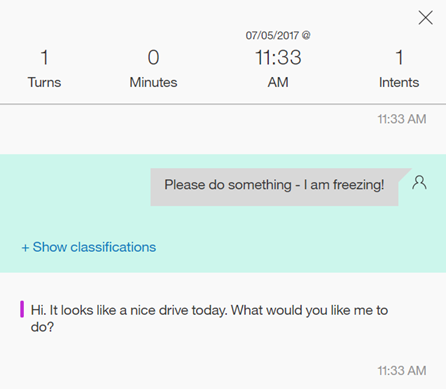
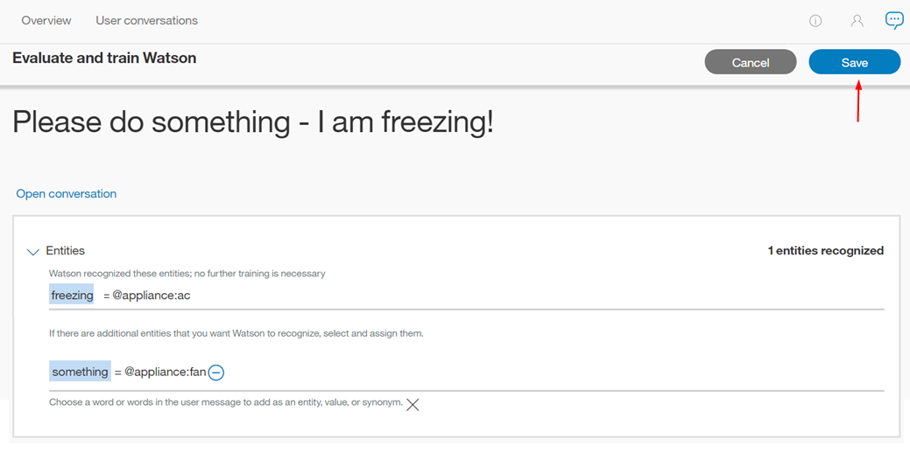

---

copyright:
  years: 2015, 2017
lastupdated: "2017-08-30"

---

{:shortdesc: .shortdesc}
{:new_window: target="_blank"}
{:tip: .tip}
{:pre: .pre}
{:codeblock: .codeblock}
{:screen: .screen}
{:javascript: .ph data-hd-programlang='javascript'}
{:java: .ph data-hd-programlang='java'}
{:python: .ph data-hd-programlang='python'}
{:swift: .ph data-hd-programlang='swift'}

# Trabalhando com conversas
{: #logs_convo}

Para abrir uma lista de interações entre usuários e seu robô, selecione **Conversas do usuário** na barra de navegação. Se **Conversas do usuário** não estiver visível, use o menu  para abrir a página.
{: shortdesc}

Quando você abre a página **Conversas do usuário**, a visualização padrão lista resultados para o último dia, com os resultados mais recentes primeiro. A intenção superior (#intent) e qualquer valor de entidade (@entity) reconhecido usado na mensagem e o texto da mensagem estão disponíveis. Para as intenções que não são reconhecidas, o valor mostrado é *Irrelevante*. Se uma entidade não é reconhecida ou não foi fornecida, o valor mostrado é *Nenhuma entidade localizada*. 

## Limites de log
{: #log-limits}

O período de tempo em que as mensagens de bate-papo são retidas depende de seu plano de serviço do {{site.data.keyword.conversationshort}}:

  Plano de Serviço                     | Retenção de log de bate-papo
  ------------------------------------ | ------------------------------------
  Premium                              | Últimos 90 dias
  Padrão                               | Últimos 30 dias
  Livre                                | Últimos 7 dias

## Filtrando elocuções

É importante observar que a página **Conversas do usuário** exibe o número total de *elocuções* entre usuários e seu robô. Uma elocução é uma única mensagem que o usuário envia para o robô. Cada conversa pode ser composta por várias elocuções. Assim, o número de resultados nesta página **Conversas do usuário** é diferente do número de conversas mostrado na página [Visão Geral](logs_oview.html).

É possível filtrar elocuções por *Procurar instruções do usuário*, *Intenções*, *Entidades* e *Últimos* n *dias*:

*Procurar instruções do usuário* - digite uma palavra na barra de procura. Isso procura as entradas dos usuários, mas não as respostas do robô.

*Intenções* - selecione o menu suspenso e digite uma intenção no campo de entrada ou escolha na lista preenchida. É possível selecionar mais de uma intenção, que filtra os resultados usando qualquer uma das intenções selecionadas, incluindo *Irrelevante*.

*Entidades* - selecione o menu suspenso e digite um nome de entidade no campo de entrada ou escolha na lista preenchida. É possível selecionar mais de uma entidade, que filtra os resultados por qualquer uma das entidades selecionadas. Se você filtrar por intenção *e* entidade, seus resultados incluirão as mensagens que possuem ambos os valores. Também é possível filtrar por resultados com *Nenhuma entidade encontrada*.

Elocuções podem levar algum tempo para atualizar. Permita pelo menos 30 minutos após uma interação do usuário com seu robô antes de tentar filtrar esse conteúdo.

## Visualizando uma elocução individual
É possível expandir cada entrada de elocução para ver o que o usuário disse na conversa toda e como seu robô respondeu. Para fazer isso, selecione **Abrir conversa**. Você é levado automaticamente para a elocução selecionada nessa conversa.

É possível então optar por mostrar a classificação(ões) para a elocução que você selecionou.

## Corrigindo uma intenção

1.  Para corrigir uma intenção, selecione o ícone editar  ao lado da #intent escolhida.
1.  Na lista fornecida, selecione a intenção correta para esta entrada.
    - Comece digitando no campo de entrada e a lista de intenções é filtrada.
    - Também é possível escolher **Marcar como irrelevante** neste menu. (Para obter informações adicionais, consulte "[Marcar como irrelevante](intents.html#mark-irrelevant)".) Ou é possível escolher **Não treinar com a intenção**, que não salva essa elocução como um exemplo para treinamento.

    
1.  Selecione **Salvar**.

    

## Incluindo um valor de entidade ou sinônimo

1.  Para incluir um valor de entidade ou sinônimo, selecione o ícone editar  ao lado da @entity escolhida.
1.  Selecione **Incluir entidade**.

    
1.  Agora, selecione uma palavra ou frase na entrada do usuário sublinhada.

    
1.  Escolha uma entidade à qual a frase destacada será incluída como um valor.
    - Comece digitando no campo de entrada e a lista de entidades e valores é filtrada.
    - Para incluir a frase destacada como um sinônimo para um valor existente, escolha o "@entity:value" na lista suspensa.

    
1.  Selecione **Salvar**.

    
