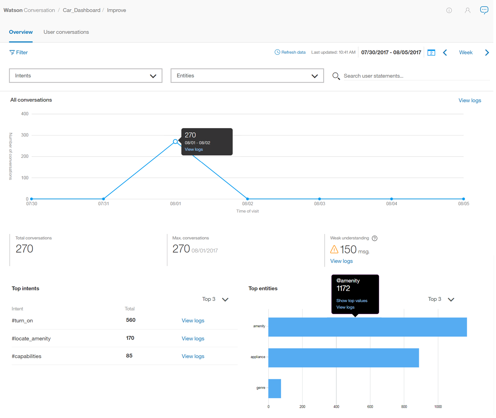

---

copyright:
  years: 2015, 2017
lastupdated: "2017-08-30"

---

{:shortdesc: .shortdesc}
{:new_window: target="_blank"}
{:tip: .tip}
{:pre: .pre}
{:codeblock: .codeblock}
{:screen: .screen}
{:javascript: .ph data-hd-programlang='javascript'}
{:java: .ph data-hd-programlang='java'}
{:python: .ph data-hd-programlang='python'}
{:swift: .ph data-hd-programlang='swift'}

# Página Visão Geral

A página Visão Geral do painel **Melhorar** fornece um resumo de interações entre usuários e seu robô. É possível visualizar a quantia de tráfego para um determinado período de tempo, bem como as intenções e entidades que foram reconhecidas mais frequentemente nas conversas do usuário.
{: shortdesc}

As estatísticas que são exibidas na página Visão Geral cobrem um período de tempo maior que o período para o qual os logs de conversas do usuário são retidos.  Essas estatísticas representam tráfego externo - usuários ou chamadas de API - que tenham interagido com seu robô; elas não incluem as interações do painel **Experimente** na ferramenta.

É possível usar a página Visão Geral para responder perguntas como:

* Quais meses tiveram o maior e o menor número de conversas no ano passado?
* Qual era o número médio de conversas por semana durante o primeiro trimestre?
* Quais intenções apareceram mais vezes na semana passada?
* Quais valores de entidade foram reconhecidos na maioria das vezes durante setembro?

Para abrir a página Visão Geral, selecione **Visão Geral** na barra de navegação. Se **Visão Geral** não estiver visível, use o menu  para abrir a página.

A parte superior da página inclui os seguintes controles:

* *Filtrar* -Alterna a opção de filtro ativado ou desativado. Quando ativado, você verá seletores suspensos para **Intenções** e **Entidades**
* *Atualizar dados* - Permite atualizar as estatísticas da página Visão Geral imediatamente. A página Visão Geral mostra quando os dados que ela exibe foram atualizados pela última vez. É possível selecionar **Atualizar dados** se você acha que dados mais recentes podem estar disponíveis.
* Controle do período de tempo - Use este controle para escolher o período para o qual os dados são exibidos. Esse controle afeta todos os dados mostrados na página: não apenas o número de conversações exibidas no gráfico, mas também as estatísticas exibidas juntamente com o gráfico e as listas de principais intenções e entidades.

  

É possível escolher se deseja visualizar dados para um único dia, uma semana, um mês, um trimestre ou um ano. Em cada caso, os pontos de dados no gráfico são ajustados para um período de medição apropriado. Por exemplo, ao visualizar um gráfico para um dia, os dados são apresentados em valores por hora, mas ao visualizar um gráfico para uma semana, os dados são mostrados por dia. Uma semana sempre é executada de domingo até sábado. Não é possível criar períodos de tempo customizados, como uma semana que é executada de quinta à quarta-feira seguinte, ou um mês que começa em qualquer data diferente do dia primeiro.

## Todas as conversas

Um gráfico exibe o número total de conversas para o intervalo de data selecionado.

**Nota:** Uma 'conversa' é considerada qualquer interação com o robô, então se houver conversas nas quais o robô disse "Oi, como posso te ajudar?"e então o usuário fechou o navegador, essa conversa é incluída na contagem total de conversa.

É possível selecionar **Visualizar logs** para abrir a página [Conversas do usuário](logs_convo.html), com o intervalo de data filtrado para corresponder ao período de tempo que você selecionou para a página Visão Geral. Dependendo de seu plano e o intervalo de data que você selecionou, você pode não ver nenhum dado. Por exemplo, o {{site.data.keyword.conversationshort}} [Plano de serviço padrão](logs_convo.html#log-limits) apenas retém os logs de bate-papo por 30 dias; se você escolher um intervalo de data maior do que 30 dias, você não verá nenhum dado.

**Nota:** a página [Conversas do usuário](logs_convo.html) exibe o número total de *elocuções*. Uma elocução é uma única mensagem que o usuário envia para o robô. Cada conversa pode ser composta por múltiplas elocuções. Portanto, o número de resultados na página [Conversas do usuário](logs_convo.html) é diferente do número de conversas mostrado nesta página Visão Geral.

Ao visualizar o gráfico, é possível clicar em um ponto de dados individual para ver o valor numérico, conforme mostrado aqui:

Abaixo do gráfico, estatísticas relacionadas aos dados exibidos são mostradas:

* *Total de Conversas* - O número total de conversas que ocorreram durante este período de tempo
* *Máx. Conversas* - O número máximo de conversas para um ponto de dados único dentro do período de tempo
* *Entendimento fraco* - O número de conversas com entendimento fraco. Essas conversas não são classificadas por uma intenção e não contêm quaisquer entidades conhecidas. Isso pode ser útil para identificar problemas de diálogo potenciais.

## Intenções principais e Entidades principais

Também é possível visualizar as intenções e as entidades que foram reconhecidas com maior frequência durante o período especificado. Por padrão, você vê as três principais de cada, mas você pode mudar isso para um número maior, como 5 ou 10.

* *Intenções principais* - Intenções são mostradas em uma lista simples. Além de ver o número de vezes que uma intenção foi reconhecida, é possível usar o link **Visualizar logs** para abrir a página Conversas do usuário com o intervalo de data filtrado para corresponder aos dados que você está visualizando e a intenção filtrada para corresponder à intenção selecionada.

* *Entidades principais* são mostradas em um gráfico de barras. Para cada entidade, é possível selecionar a barra para ver o número que a barra representa.

  

  Selecione **Mostrar valores principais** para ver uma lista dos valores mais comuns que foram identificados para essa entidade durante o período de tempo. Selecione **Visualizar logs** para abrir a página [Conversas do usuário](logs_convo.html) com o intervalo de data filtrado para corresponder aos dados que você está visualizando e a entidade filtrada para corresponder à entidade selecionada.
