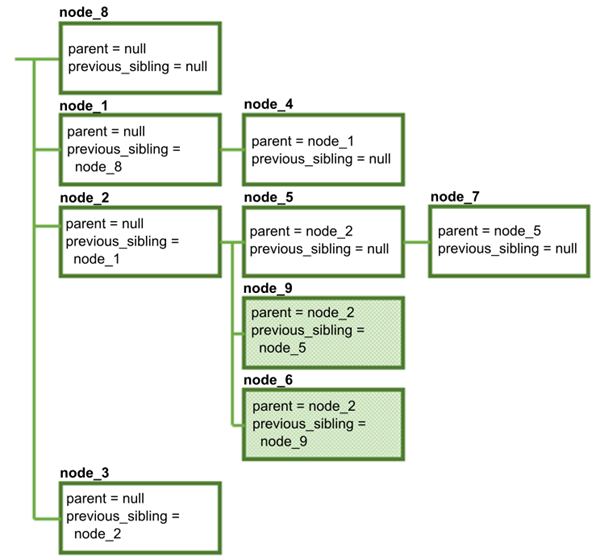
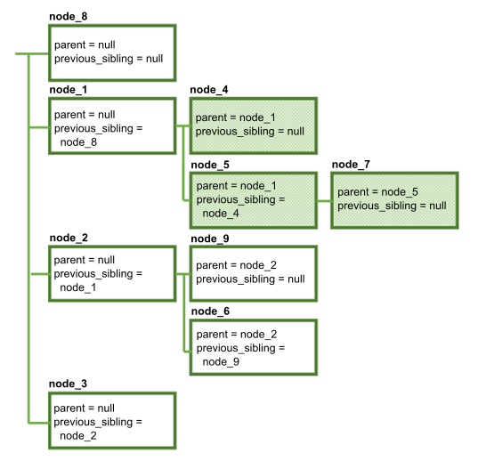

---

copyright:
  years: 2015, 2017
lastupdated: "2017-09-21"

---

{:shortdesc: .shortdesc}
{:new_window: target="_blank"}
{:tip: .tip}
{:pre: .pre}
{:codeblock: .codeblock}
{:screen: .screen}
{:javascript: .ph data-hd-programlang='javascript'}
{:java: .ph data-hd-programlang='java'}
{:python: .ph data-hd-programlang='python'}
{:swift: .ph data-hd-programlang='swift'}

# 使用 API 修改对话

{{site.data.keyword.conversationshort}} REST API 支持通过编程方式（而不使用 {{site.data.keyword.conversationshort}} 工具）修改对话。可以使用 /dialog_nodes API 来创建、删除或修改对话节点。


请记住，此对话是互连节点树，并且必须符合特定规则才有效。这意味着对对话节点所做的任何更改都可能会对其他节点或对话结构具有级联影响。在使用 /dialog_nodes API 来修改对话之前，请确保了解更改将如何影响对话的其余部分。

有效的对话始终满足以下条件：

- 每个对话节点都具有唯一标识（`dialog_node` 属性）。
- 子节点知道其父节点（`parent` 属性）。但是，父节点并不知道其子节点。
- 节点知道其前一个直接同代（如果有）（`previous_sibling` 属性）。这意味着给定父代的所有同代会构成一个链接列表，其中每个节点指向前一个节点。
- 给定父代只有一个子代可以作为第一个同代（也就是说其 `previous_sibling` 值为空）。
- 节点指向的前一个同代不能是其他父代的子代。
- 两个节点不能指向相同的前一个同代。
- 节点可以指定下一个要执行的节点（`next_step` 属性）。
- 节点不能是其自己的父代或其自己的同代。
- 类型为 `response_condition` 的节点不能具有子代。

以下示例显示各种修改会如何导致级联更改。

## 创建节点
{: #create-node}

请考虑以下简单对话树：


可以使用以下主体向 /dialog_nodes 发起 POST 请求来创建新节点：

```json
{
  "dialog_node": "node_8"
}
```

现在，该对话类似于：


由于已创建 **node_8** 但未指定 `parent` 或 `previous_sibling` 的值，因此现在该节点是对话中的第一个节点。请注意，除了创建 **node_8** 外，该服务还修改了 **node_1**，以使其 `previous_sibling` 属性指向新节点。

可以通过指定父代和前一个同代，在对话中的其他地方创建节点：

```json
{
  "dialog_node": "node_9",
  "parent": "node_2",
  "previous_sibling": "node_5"
}
```

为 `parent` 和 `previous_node` 指定的值必须有效：

- 这两个值都必须引用现有节点。
- 指定的父代必须与前一个同代的父代相同（或者如果前一个同代没有父代，那么为 `null`）。
- 父代不能是类型为 `response_condition` 的节点。

生成的对话类似于：



除了创建 **node_9** 外，该服务还自动更新了 *node_6* 的 `previous_sibling` 属性，以使其指向新节点。

## 将节点移至其他父代
{: #change-parent}

下面使用具有以下主体的 POST /dialog_nodes/node_5 方法，将 **node_5** 移至其他父代：

```json
{
  "parent": "node_1"
}
```

为 `parent` 指定的值必须有效：
- 必须引用现有节点。
- 不能引用正在修改的节点（节点不能是其自己的父代）。
- 不能引用正在修改的节点的后代。
- 不能引用类型为 `response_type` 的节点。

这将生成以下已更改的结构：


在此发生了以下几个情况：
- **node_5** 移至其新父代时，**node_7** 将随其一起移动（因为 **node_7** 的 `parent` 值未更改）。移动节点时，该节点的所有后代都始终与该节点在一起。
- 由于我们没有为 **node_5** 指定 `previous_sibling` 值，因此现在该节点是 **node_1** 下的第一个同代。
- **node_4** 的 `previous_sibling` 属性已更新为 `node_5`。
- **node_9** 的 `previous_sibling` 属性已更新为 `null`，因为现在该节点是 **node_2** 下的第一个同代。

## 对同代重新排序
{: #change-sibling}

现在，我们将使 **node_5** 成为第二个同代，而不是第一个同代。为此，可以使用具有以下主体的 POST /dialog_nodes/node_5 方法：

```json
{
  "previous_sibling": "node_4"
}
```

修改 `previous_sibling` 时，新值必须有效：
- 必须引用现有节点
- 不能引用正在修改的节点（节点不能是其自己的同代）
- 必须引用同一父代的子代（所有同代必须具有相同的父代）

结构更改如下所示：



同样请注意，**node_7** 与其父代始终在一起。此外，修改了 **node_4**，以使其 `previous_sibling` 为 `null`，因为现在该节点是第一个同代。

## 删除节点
{: #delete-node}

现在，我们将使用 DELETE /dialog_nodes/node_1 方法来删除 **node_1**。

结果如下所示：


请注意，**node_1**、**node_4**、**node_5** 和 **node_7** 已全部删除。删除节点时，该节点的所有后代都会一起删除。因此，如果删除一个基本节点，实际上是删除对话树的一整个分支。对已删除节点的其他任何引用（例如，`next_step` 引用）都会更改为 `null`。

此外，**node_2** 将更新为指向 **node_8** 作为其新的前一个同代。

## 重命名节点
{: #rename-node}

最后，我们将使用具有以下主体的 POST /dialog_nodes/node_2 方法来重命名 **node_2**：

```json
{
  "dialog_node": "node_X"
}
```


对话的结构并未更改，但再一次修改了多个节点以反映更改后的名称：

- **node_9** 和 **node_6** 的 `parent` 属性
- **node_3** 的 `previous_sibling` 属性

此外，对已修改节点的其他任何引用（例如，`next_step` 引用）也会更改。
