---

copyright:
  years: 2015, 2017
lastupdated: "2017-10-19"

---

{:shortdesc: .shortdesc}
{:new_window: target="_blank"}
{:tip: .tip}
{:pre: .pre}
{:codeblock: .codeblock}
{:screen: .screen}
{:javascript: .ph data-hd-programlang='javascript'}
{:java: .ph data-hd-programlang='java'}
{:python: .ph data-hd-programlang='python'}
{:swift: .ph data-hd-programlang='swift'}

# 构建对话
{: #dialog-build}

对话使用在用户输入中识别到的意向和实体以及应用程序中的上下文与用户进行交互，并最终提供有用的响应。
{: shortdesc}

响应可能是对问题（例如，`在哪里能加点天然气？`）的回答，也可能是执行命令，例如打开收音机。意向和实体的信息可能足以确定正确的响应，但若不能，对话可能会要求用户提供正确响应所需的更多输入。例如，如果用户询问：“我在哪里能找到吃的？”您可能希望弄清楚他们是想去餐馆还是杂货店，是要去店里吃还是外卖等等。您可以在文本响应中要求提供更多详细信息，并创建一个或多个子节点来处理新的输入。

<iframe class="embed-responsive-item" id="youtubeplayer" type="text/html" width="640" height="390" src="https://www.youtube.com/embed/oQUpejt6d84?rel=0" frameborder="0" webkitallowfullscreen mozallowfullscreen allowfullscreen> </iframe>

## 对话概述
{: #overview}

对话在工具中以图形方式表示为树。创建分支来处理您希望会话处理的每个意向。分支由多个节点组成。

### 对话节点

每个对话节点至少包含一个条件和一个响应。

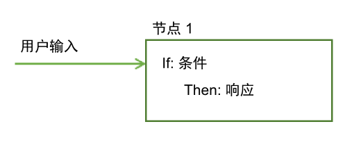

- 条件：指定要触发对话中的此节点，用户输入中必须提供的信息。信息可以是特定意向、实体值或上下文变量值。有关更多信息，请参阅[条件](#conditions)。
- 响应：服务用于响应用户的发声。响应还可以配置为触发程序化操作。有关更多信息，请参阅[响应](#responses)。

您可以将节点视为具有 if/then 构造：如果此条件为 true，那么返回此响应。

例如，如果服务的自然语言处理功能确定用户输入包含 `#cupcake-menu` 意向，那么将触发以下节点。触发节点的结果是，服务会使用相应的回答进行响应。


具有一个条件和响应的单个节点可以处理简单的用户请求。但是，用户往往会有更复杂的问题，或者希望获得更复杂任务的帮助。为此，可以添加子节点，这些子节点会要求用户提供服务所需的任何其他信息。

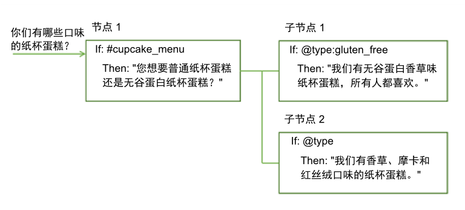

### 对话流

创建的对话由服务从上到下进行处理。

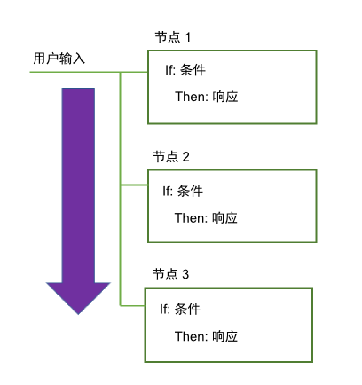

服务沿着树一路向下，如果发现符合的条件，就会触发相应节点。然后，服务会在触发的节点上从左到右移动，以根据任何子节点条件检查用户输入。服务检查子节点时，同样是从上到下移动。

服务将继续在对话树中从上到下、从左到右移动，然后再从上到下、从左到右移动，直至到达分支中的最后一个节点。

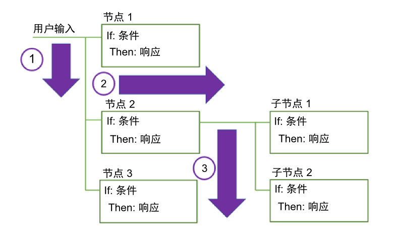

开始构建对话时，必须确定要包含的分支数以及这些分支的放置位置。分支的顺序非常重要，因为节点是按从上到下的顺序求值的。如果使用的第一个基本节点的条件与输入匹配，那么不会触发树中低于基本节点的任何节点。

## 条件
{: #conditions}

节点条件确定会话中是否使用该节点。响应条件确定要向用户显示的响应。可以使用下列一个或多个工件的任何组合来定义条件：

- **上下文变量**：如果指定的上下文变量表达式为 true，那么将使用该节点。请使用语法 `$variable_name:value` 或 `$variable_name == 'value'`。请参阅[上下文变量](#context)。

  不要在已设置上下文变量值的同一对话节点中，基于该上下文变量值来定义节点或响应条件。
  {: tip}

- **实体**：在用户输入中识别到实体的任何值或同义词时，将使用该节点。请使用语法 `@entity_name`。例如，`@city`。

  确保创建对等节点来处理未识别到任何实体值或同义词的情况。
  {: tip}

- **实体值**：如果在用户输入中检测到实体值，那么将使用该节点。请使用语法 `@entity_name:value`。例如：`@city:Boston`。请为实体指定定义的值，而不要指定同义词。

  如果在对等节点中检查实体（没有为其指定特定值）是否存在，请确保将检查此特定实体值的节点置于其上方。
{: tip}

- **意向**：最简单的条件是单个意向。如果用户的输入映射到该意向，那么将使用该节点。请使用语法 `#intent-name`。例如，`#weather` 检查用户输入中检测到的意向是否为 `weather`。如果是，那么会处理该节点。

- **特殊条件**：随服务一起提供可用于执行通用对话函数的条件。

  <table>
  <tr>
    <td>条件名</td>
    <td>描述</td>
  </tr>
  <tr>
    <td>anything_else</td>
    <td>可以在对话末尾使用此条件，在用户输入与其他任何对话节点都不匹配时，将处理此条件。此条件将触发**其他**节点。</td>
  </tr>
  <tr>
    <td>conversation_start</td>
    <td>与 **welcome** 一样的是，此条件在第一轮对话期间会求值为 true。但与 **welcome** 不同的是，无论应用程序的初始请求是否包含用户输入，其都为 true。具有 **conversation_start** 条件的节点可用于在对话开始时初始化上下文变量或执行其他任务。</td>
  </tr>
  <tr>
    <td>false</td>
    <td>此条件始终求值为 false。可以在正在开发的分支顶部使用此项，以阻止使用此分支，或者将其用作提供常见函数且仅用作**跳转至**操作目标的节点的条件。</td>
  </tr>
  <tr>
    <td>irrelevant</td>
    <td>如果确定用户的输入与 Conversation 服务无关，那么此条件将求值为 true。</td>
  </tr>
  <tr>
    <td>true</td>
    <td>此条件始终求值为 true。可以在节点或响应列表末尾使用此条件，以捕获与任何先前条件都不匹配的任何响应。</td>
  </tr>
  <tr>
    <td>welcome</td>
    <td>仅当应用程序的初始请求不包含任何用户输入时，才会在第一轮对话期间（当会话启动时），将此条件求值为 true。在所有随后的多轮对话中，都会将其求值为 false。此条件会触发**欢迎**节点。通常，使用此条件的节点用于对用户进行问候，例如要显示诸如“欢迎使用我们的披萨订购应用程序”之类的消息。</td>
  </tr>
  </table>

### 条件语法

使用以下某个语法选项在条件中创建有效的表达式：

- Spring Expression (SpEL) 语言，这是一种表达式语言，用于支持在运行时查询和操作对象图形。有关更多信息，请参阅 [Spring Expression Language (SpEL) 语言 ](http://docs.spring.io/spring/docs/current/spring-framework-reference/html/expressions.html){: new_window}。

- 用于引用意向、实体和上下文变量的速记符号。请参阅[访问对象和对象求值](expression-language.html)。

使用正则表达式来检查是否有以其为条件的值。例如，要查找匹配的字符串，可以使用 `String.find` 方法。有关更多详细信息，请参阅[方法](dialog-methods.html)。

### 条件用法提示

- 如果要仅对检测到的实体类型的第一个实例值求值，那么可以使用语法 `@entity == 'specific-value'`，而不使用 `@entity:(specific-value)` 格式。例如，使用 `@appliance == 'air conditioner'` 时，将仅对检测到的第一个 `@appliance` 实体的值求值。但是，使用 `@appliance:air conditioner` 会扩展到 `entity['appliance'].contains('air conditioner')`，只要在用户输入中检测到至少一个值为“空调”的 `@appliance` 实体，即为匹配。
- 使用数字变量时，请确保变量具有值。如果变量没有值，那么在数字比较中，会将其视为空值 (0)。例如，如果通过条件 `@price < 100` 来检查变量的值，但 @price 实体为空，那么条件会求值为 `true`，因为 0 小于 100，虽然从未设置过价格。要避免检查空变量，请使用诸如 `@price AND @price < 100` 这样的条件。如果 @price 没有值，那么此条件会正确返回 false。
- 如果将实体用作条件并启用了模糊匹配，那么仅当匹配的置信度大于 30% 时，`@entity_name` 才会求值为 true。即，仅当 `@entity_name.confidence > .3` 时才会求值为 true。

## 响应
{: #responses}

对话响应定义如何回复用户。

可以使用以下某种响应类型进行回复：

- [简单文本响应](#simple-text)
- [多个条件响应](#multiple)
- [复杂响应](#complex)

### 简单文本响应
{: #simple-text}

如果要提供文本响应，只需输入您希望服务向用户显示的文本即可。

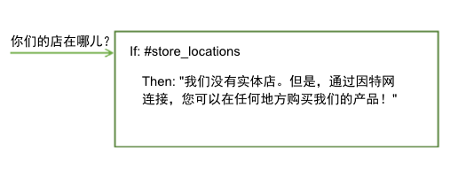

#### 添加变体
{: #variety}

如果用户频繁返回到 Conversation 服务，那么若是他们每次都听到相同的问候和响应，可能会感到厌烦。为此，可以向响应添加*变体*，以便会话能够以不同方式对同一条件进行响应。

<iframe class="embed-responsive-item" id="youtubeplayer" type="text/html" width="640" height="390" src="https://www.youtube.com/embed/nAlIW3YPrAs?rel=0" frameborder="0" webkitallowfullscreen mozallowfullscreen allowfullscreen> </iframe>

在此示例中，服务在响应有关门店位置的问题时，针对不同的交互提供不同的回答：

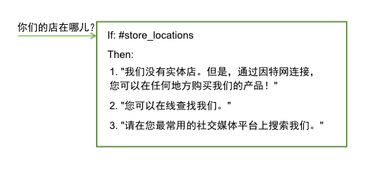

可以选择按顺序或按随机顺序循环提供响应变体。缺省情况下，响应按顺序循环，如同从排序的列表中进行选择一样。

### 条件响应
{: #multiple}

单个对话节点可以提供不同的响应，每个响应由不同的条件触发。使用此方法可在单个节点中应对多个场景。

<iframe class="embed-responsive-item" id="youtubeplayer" type="text/html" width="640" height="390" src="https://www.youtube.com/embed/KcvVQAsnhLM?rel=0" frameborder="0" webkitallowfullscreen mozallowfullscreen allowfullscreen> </iframe>

节点仍然具有一个主要条件，也就是可以使用该节点并处理其所包含的条件和响应的条件。

在此示例中，服务使用其先前收集的有关用户位置的信息来定制其响应，并提供有关离该用户最近的门店的信息。有关如何存储从用户那里所收集的信息的更多信息，请参阅[上下文变量](#context)。

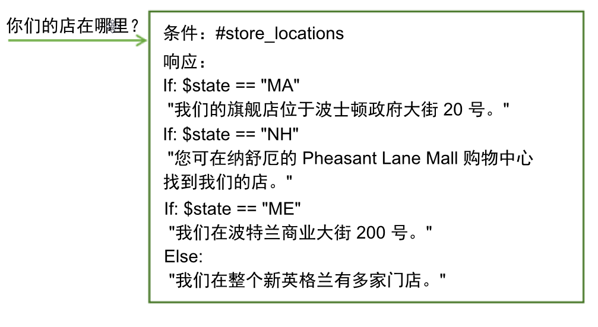

现在，此单个节点提供的功能相当于四个单独的节点。

节点中的条件按顺序进行求值，如同节点一样。请确保条件和响应按正确的顺序列出。如果需要更改顺序，请选择一个条件，然后使用显示的箭头在列表中上移或下移该条件。如果要更新上下文，必须在每个响应中执行此操作。没有常见响应部分。选择并传递响应后，将处理**跳转至**操作。如果添加**跳转至**操作，那么会在从节点返回任何响应之后运行此操作。
{: tip}

### 复杂响应
{: #complex}

要指定更复杂的响应，可以使用 JSON 编辑器在 `"output":{}` 属性中指定响应。

要在响应中包含上下文变量值，请使用语法 `$variable-name` 来指定上下文变量值。有关更多信息，请参阅[上下文变量](#context)。

```json
{
  "output": {
    "text": "Hello $user"
  }
}
```
{: codeblock}

要指定多个语句并分别显示在单独的行上，请将输出定义为 JSON 数组。

```json
{
  "output": {
    "text": ["Hello there.", "How are you?"]
  }
}
```
{: codeblock}

第一句会显示在一行上，第二句会另起一行显示在第一句下面。

要实现更复杂的行为，可以将输出文本定义为复杂 JSON 对象。例如，可以在 JSON 输出中使用复杂对象来模拟将响应变体添加到节点的行为。可以在复杂对象中包含以下属性：

- **values**：包含此对话节点可返回的多个输出文本版本的字符串 JSON 数组。数组中值的返回顺序取决于属性 `selection_policy`。

- **selection_policy**：以下值有效：

    - **random**：系统将从 `values` 数组中随机选择输出文本，并且不会连续重复这些文本。例如，假设 output.text 包含三个值。在前三次均会选择一个随机值，但不会重复选择值。在提供过所有输出值之后，系统会随机选择其他值并重复该过程。

        ```json
        {
            "output":{
                "text":{
                    "values":["Hello.","Hi.","Howdy!"],
                    "selection_policy":"random"
                }
            }
        }
        ```
        {: codeblock}

    系统会从随机选取的这三个选项中返回一个问候语。下一次触发响应时，将显示列表中的另一个问候语。该问候语同样是随机选择的，但会有意不重复先前使用过的问候语。

    - **sequential**：系统在第一次触发对话节点时返回第一个输出文本，第二次触发节点时返回第二个输出文本，依此类推。

        ```json
        {
            "output":{
                "text":{
                    "values":["Hello.", "Hi.", "Howdy!"],
                    "selection_policy":"sequential"
                }
            }
        }
        ```
        {: codeblock}

- **append**：指定是将值附加到数组还是使用新值覆盖数组中的值。设置为 false 时，先前执行的对话节点中收集的输出将被此特定节点中指定的文本值覆盖。

    ```json
    {
        "output":{
            "text":{
                "values": ["Hello."],
                "append":false
            }
        }
    }
    ```
    {: codeblock}

    在本例中，其他所有输出文本都会被此输出文本覆盖。

缺省行为假定 `selection_policy = random` 和 `append = true`。如果值数组包含多个项，那么会从其元素中随机选择输出文本。

### 定义后续操作
{: #jump-to}

在做出指定的响应后，可以指示服务执行以下某项操作：

- **等待用户输入**：服务等待用户提供响应引导的新输入。例如，响应可能会询问用户“是”或“否”问题。在用户提供更多输入之前，此对话不会继续。
- **跳转至其他对话节点**：希望绕过等待用户输入并且希望会话直接转至子节点或完全不同的对话节点时，请使用此选项。例如，可以使用“跳转至”操作将流从树中的多个位置路由到常见对话节点。
  >注：必须存在要跳转至的目标节点，然后才能配置“跳转至”操作来使用该节点。

#### 配置“跳转至”操作

如果选择跳转至其他节点，那么必须指定操作的目标是所选对话节点的**响应**还是**条件**

- **响应**：如果语句的目标是所选对话节点的响应部分，那么会立即运行。即，系统不会对所选对话节点的条件部分求值，而是立即运行所选对话节点的响应部分。

  将响应设置为目标对于将多个对话节点链接在一起很有用。对所选对话节点的响应部分的处理，就像此对话节点的条件为 true 时一样。如果所选对话节点有其他**跳转至**操作，那么该操作也会立即运行。
- **条件**：如果语句的目标是所选对话节点的条件部分，那么服务会首先检查目标节点的条件是否求值为 true。
    - 如果条件求值结果为 true，那么系统会通过使用对话节点上下文来更新上下文，并使用对话节点输出来更新输出，以立即处理此节点。
    - 如果条件未求值为 true，那么系统将继续对目标对话节点的下一个同代节点的条件执行求值过程，直到找到具有求值为 true 的条件的对话节点为止。
    - 如果系统处理了所有同代，仍然没有任何条件求值为 true，那么将使用基本回退策略，并且对话还会对顶级节点求值。

    将条件设置为目标对于链接对话节点的条件很有用。例如，您可能希望首先检查输入是否包含意向，例如 `#turn_on`；如果输入包含意向，那么您可能希望检查输入是否包含实体，例如 `@lights`、`@radio` 或 `@wips`。链接条件有助于构造更大的对话树。

**注**：**跳转至**操作的处理已于 2017 年 2 月 3 日发行版中进行了更改。有关更多详细信息，请参阅[升级工作空间 ](upgrading.html){: new_window}。

#### 更多信息

有关对话使用的表达式语言及方法和系统实体的信息以及其他有用的详细信息，请参阅“导航”窗格中的“参考”部分。

## 上下文变量
{: #context}

对话是无状态的，这意味着在从一个用户交流转至下一个用户交流时，对话不会保留相关信息。应用程序负责维护所需的任何连续信息。但是，应用程序可以将信息传递到对话，对话可以更新此信息，然后将其传递回应用程序。这是使用上下文变量来执行的。

上下文变量是在节点中定义的变量，可选择为其指定缺省值。其他节点或应用程序逻辑可以随后设置或更改上下文变量的值。 

可以通过引用对话节点条件中的上下文变量来根据上下文变量值检查条件，以确定是否执行节点。还可以引用对话节点响应条件中的上下文变量，以根据外部服务或用户提供的值来显示不同响应。

### 从应用程序传递上下文

通过设置上下文变量并将上下文变量传递到对话，可将信息从应用程序传递到对话。

例如，应用程序可以设置 $time_of_day 上下文变量，并将其传递到对话，该对话可以使用此信息来定制其向用户显示的问候语。

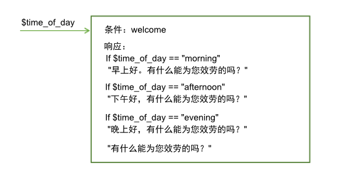

在此示例中，对话知道应用程序将此变量设置为以下某个值：*morning*、*afternoon* 或 *evening*。它可以检查每个值，并根据提供的值，返回相应的问候语。如果该变量未传递或具有与某个期望值不匹配的值，那么会向用户显示更通用的问候语。

### 在节点之间传递上下文

对话还可以添加上下文变量，以将信息从一个节点传递到另一个节点，或更新上下文变量的值。对话要求用户提供信息，从用户那里获得信息后，即可以跟踪信息，并且稍后在会话中引用这些信息。

例如，在一个节点中，您可能要求用户提供名字，然后在后面的节点中用名字来称呼他们。

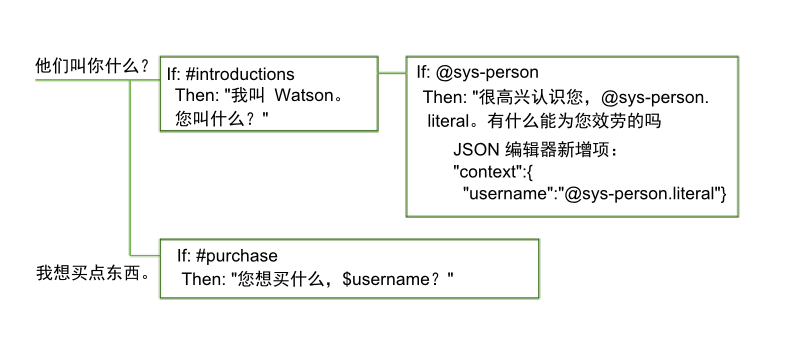

在此示例中，系统实体 @sys-person 用于从输入中抽取用户的名字（如果用户提供了名字）。在 JSON 编辑器中，username 上下文变量已定义并设置为 @sys-person 值。在随后的节点中，$username 上下文变量包含在响应中，这样就可以用名字来称呼用户。

### 定义上下文变量

通过向 JSON 对话节点定义的 `{context}` 部分中添加 `name` 和 `value` 对来定义上下文变量。该对必须满足以下要求：

- `name` 可以包含任何大写和小写字母字符、数字字符 (0-9) 和下划线。

  **注**：可以在名称中包含其他字符，例如句点和连字符。但是，如果这样做，那么必须使用以下某种方法来引用该变量：
  - context['variable-name']: The：完整 SpEL 表达式语法。
  - $(variable-name)：用圆括号括起变量名的简写语法。

  有关更多详细信息，请参阅[访问对象和对象求值](expression-language.html#shorthand-syntax-for-context-variables)。

- `value` 可以是任何受支持的 JSON 类型，如简单字符串变量、数字、JSON 数组或 JSON 对象。

以下 JSON 样本定义 $dessert 字符串、$toppings_array 数组和 $age number 上下文变量的值：

```json
{
  "context": {
    "dessert": "ice-cream",
    "toppings_array": ["onion", "olives"],
    "age": 18
  }
}
```
{: codeblock}

要定义上下文变量，请完成以下步骤：

1.  在节点的编辑视图中，通过单击  图标，然后选择 **JSON** 来打开 JSON 编辑器。

1.  在 `"output":{}` 块前面，添加 `"context":{}` 块（如果不存在）。

    ```json
    {
      "context":{},
      "output":{}
    }
    ```
    {: codeblock}

1.  在 context 块中，为要定义的每个上下文变量添加名称/值对。

    ```json
    {
      "context":{
        "name": "value"
    },
    ...
    }
    ```
    {: codeblock}

  要随后引用上下文变量，请使用语法 `$name`，其中 *name* 是定义的上下文变量的名称。

其他常见任务包括：

- 要存储由用户输入的整个字符串，请使用 `input.text`：

    ```json
    {
      "context": {
        "repeat": "<?input.text?>"
      }
    }
    ```
    {: codeblock}

- 要在上下文变量中存储实体的值，请使用以下语法：

    ```json
    {
      "context": {
        "place": "@place"
      }
    }
    ```
    {: codeblock}

- 要使用正则表达式在上下文变量中存储从用户输入中抽取的字符串的值，请使用以下语法：

    ```json
    {
      "context": {
         "number": "<?input.text.extract('^[^\\d]*[\\d]{11}[^\\d]*$',0)?>"
      }
    }
    ```
    {: codeblock}

- 要在上下文变量中存储模式实体的值，请将 .literal 附加到实体名称。使用此语法可确保将用户输入中与指定模式匹配的精确范围的文本存储在变量中。

    ```json
    {
      "context": {
        "email": "@email.literal"
      }
    }
    ```
    {: codeblock}

### 操作顺序
{: #order-of-context-var-ops}

定义上下文变量的顺序不会确定服务对其进行求值的顺序。服务会按随机顺序对定义为 JSON 名称/值对的变量进行求值。不要在第一个上下文变量中设置值，并且期望能够在第二个上下文变量中使用该值，因为无法保证列表中的第一个上下文变量将在列表中的第二个上下文变量之前执行。例如，如果要实现的逻辑是：返回传递到该节点的零与某个更高值之间的随机数，请不要使用两个上下文变量。

```json
"context": {
    "upper": "<? @sys-number.numeric_value + 1?>",
    "answer": "<? new Random().nextInt($upper) ?>"
}
```
{: codeblock}

使用略复杂一些的表达式，可避免在对 $answer 上下文变量求值之前，必须依赖于对 $upper 上下文变量求值。

```json
"context": {
    "answer": "<? new Random().nextInt(@sys-number.numeric_value + 1) ?>"
}
```
{: codeblock}

### 更新上下文变量值
{: #updating-a-context-variable-value}

如果节点为已经设置的上下文变量设置值，那么新设置的值将覆盖先前的值。

#### 更新复杂 JSON 对象

这将覆盖除 JSON 对象以外的所有 JSON 类型的先前值。如果上下文变量是复杂类型（如 JSON 对象），那么会使用 JSON 合并过程来更新变量。合并操作将添加任何新定义的属性，并覆盖对象的任何现有属性。

在此示例中，名称上下文变量定义为复杂对象。

```json
{
  "context": {
    ...
    "complex_object": {
      "user_firstname" : "Paul",
      "user_lastname" : "Pan"
      "has_card" : false
    }
  }
}
```
{: codeblock}

对话节点使用以下值来更新该上下文变量 JSON 对象：

```json
{
  "complex_object": {
    "user_firstname": "Peter",
    "has_card": true
  }
}
```
{: codeblock}

结果为以下上下文：

```json
{
  "complex_object": {
    "user_firstname": "Peter",
    "user_lastname": "Pan",
    "has_card": true
  }
}
```
{: codeblock}

#### 更新数组

如果对话上下文数据包含值的数组，那么可以通过附加值、除去值或替换所有值来更新该数组。

选择以下某个选项以更新数组。在每种情况下，都会看到应用了操作之前的数组、操作和应用了操作之后的数组。

- **附加**：要将值添加到数组末尾，请使用 `append` 方法。

    对于以下对话运行时上下文：

    ```json
    {
      "context": {
        "toppings_array": ["onion", "olives"]
      }
    }
    ```
    {: codeblock}

    进行以下更新：

    ```json
    {
      "context": {
        "toppings_array": "<? $toppings_array.append('ketchup', 'tomatoes') ?>"
      }
    }
    ```
    {: codeblock}

    结果：

    ```json
    {
      "context": {
        "toppings_array": ["onion", "olives", "ketchup", "tomatoes"]
      }
    }
    ```
    {: codeblock}

- **除去**：要除去元素，请使用 `remove` 方法并在数组中指定其值或位置。

    - **按值除去**：按元素的值从数组中除去元素。

        对于以下对话运行时上下文：

        ```json
        {
          "context": {
            "toppings_array": ["onion", "olives"]
          }
        }
        ```
        {: codeblock}

        进行以下更新：

        ```json
        {
          "context": {
            "toppings_array": "<? $toppings_array.removeValue('onion') ?>"
          }
        }
        ```
        {: codeblock}

        结果：

        ```json
        {
          "context": {
            "toppings_array": ["olives"]
          }
        }
        ```
        {: codeblock}

    - **按位置除去**：按元素的索引位置从数组中除去元素：

        对于以下对话运行时上下文：

        ```json
        {
          "context": {
            "toppings_array": ["onion", "olives"]
          }
        }
        ```
        {: codeblock}

        进行以下更新：

        ```json
        {
          "context": {
            "toppings_array": "<? $toppings_array.remove(0) ?>"
          }
        }
        ```
        {: codeblock}

        结果：

        ```json
        {
          "context": {
            "toppings_array": ["olives"]
          }
        }
        ```
        {: codeblock}

- **覆盖**：要覆盖数组中的值，只需将数组设置为新值即可：

    对于以下对话运行时上下文：

        ```json
        {
          "context": {
            "toppings_array": ["onion", "olives"]
          }
        }
        ```
        {: codeblock}

    进行以下更新：

        ```json
        {
          "context": {
            "toppings_array": ["ketchup", "tomatoes"]
          }
        }
        ```
        {: codeblock}

    结果：

        ```json
        {
          "context": {
            "toppings_array": ["ketchup", "tomatoes"]
          }
        }
        ```
        {: codeblock}

**注意**：如果将数组保存为字符串的一部分，那么它将成为字符串对象而不是数组。例如，以下 $array 上下文变量是数组，但 $string_array 上下文变量是字符串。

```json
{
  "context": {
    "array": [
      "one",
      "two"
    ],
    "array_in_string": "this is my array: $array"
  }
}
```
{: codeblock}

如果在“试用”窗格中检查这些上下文变量的值，那么将看到其指定的值如下所示：

**$array** : `["one","two"]`

**$array_in_string** : `"this is my array: [\"one\",\"two\"]"`

可以随后对 $array 变量（例如，`<? $array.removeValue('two') ?>`）执行数组方法，而不能对 $array_in_string 变量执行。

## 创建对话
{: #create}

使用 {{site.data.keyword.conversationshort}} 工具来创建对话。

### 对话节点限制
{: #dialog-node-limits}

可以创建的对话节点数取决于服务套餐。

| 服务套餐         | 每个工作空间的对话节点数   |
|------------------|---------------------------:|
| 标准/高级        |                    100,000 |
| Lite             |                     25,000 |

树深度限制：服务支持 2,000 个对话节点后代；节点数不超过 20 个时，工具的性能最好。

### 过程

要创建对话，请完成以下步骤：

1.  从导航栏打开**构建**页面，单击**对话**选项卡，然后单击**创建**。

    首次打开对话构建器时，将为您创建以下节点：
    - **欢迎**：第一个节点。此节点包含用户首次使用服务时向用户显示的问候语。可以编辑问候语。
    - **其他**：最后一个节点。此节点包含用于在无法识别用户输入时对用户进行回复的短语。可以替换所提供的响应，或者添加其他具有类似含义的响应，以向会话添加各种变体。还可以选择希望服务是依次返回定义的每个响应，还是按随机顺序返回响应。
1.  要向对话树添加更多节点，请单击**欢迎**节点上的**更多 ** 图标，然后选择**在下方添加节点**。
1.  输入条件，在满足该条件时会触发服务处理该节点。

    开始定义条件时，会显示一个框，框中显示选项。可以输入以下某个字符，然后从显示的选项列表中选择一个值。

    <table>
    <tr>
      <td>字符</td>
      <td>列出以下工件类型的定义值</td>
    </tr>
    <tr>
      <td>`#`</td>
      <td>意向</td>
    </tr>
    <tr>
      <td>`@`</td>
      <td>实体</td>
    </tr>
    <tr>
      <td>`@{entity-name}:`</td>
      <td>{entity-name} 值</td>
    </tr>
    <tr>
      <td>`$`</td>
      <td>在对话其他位置定义或引用的上下文变量</td>
    </tr>
    </table>

    可以通过定义使用新意向、实体、实体值或上下文变量的新条件来创建意向、实体、实体值或上下文变量。如果通过此方式创建工件，请确保返回并完成要完全创建工件所需的其他任何步骤，例如定义意向的样本发声。

    要定义基于多个条件触发的节点，请输入一个条件，然后单击其旁边的加号 (+) 图标。如果要将 `OR` 运算符（而不是 `AND`）应用于多个条件，请单击字段之间显示的 `and` 以更改运算符类型。AND 运算会在 OR 运算之前执行，但可以使用括号来更改这一顺序。例如：`$isMember:true AND ($memberlevel:silver OR $memberlevel:gold)`

    定义的条件的长度必须小于 500 个字符。

    有关如何测试条件中的值的更多信息，请参阅[条件](#conditions)。
1.  **可选**：如果要在此节点中从用户那里收集多条信息，请单击**定制**，然后启用**槽**。有关更多详细信息，请参阅[使用槽收集信息](#slots)。
1.  输入响应。
    - 添加您希望服务作为响应向用户显示的文本。
    - 有关条件响应、如何添加响应变体或如何指定节点触发后应该发生情况的信息，请参阅[响应](#responses)。
1.  **可选**：对节点命名。

    对话节点名可以包含字母（Unicode 格式）、数字、空格、下划线、连字符和句点。

    对节点命名会更容易记住其用途，并且在最小化时更方便找到节点。如果未提供名称，那么将使用节点条件作为名称。

1.  要添加更多节点，请选择树中的节点，然后单击**更多**  图标。
    - 要创建不符合现有节点的条件时，对其进行检查的下一个对等节点，请选择**在下方添加节点**。
    - 要创建检查现有节点的条件之前，先对其进行检查的对等节点，请选择**在上方添加节点**。
    - 要为所选节点创建子节点，请选择**添加子节点**。子节点会在其父节点后进行处理。

    有关对话节点处理顺序的更多信息，请参阅[对话概述](#overview)。
1.  在构建对话时对其进行测试。有关更多信息，请参阅[测试对话](#test)。

## 使用槽收集信息
{: #slots}

向对话节点添加槽可从该节点内的用户那里收集多条信息。槽会按用户的速度收集信息。将保存用户在前面提供过的详细信息，并且服务仅要求用户提供其未提供过的详细信息。

<iframe class="embed-responsive-item" id="youtubeplayer" type="text/html" width="640" height="390" src="https://www.youtube.com/embed/ES4GHcDsSCI?rel=0" frameborder="0" webkitallowfullscreen mozallowfullscreen allowfullscreen> </iframe>

### 为什么要添加槽？
{: #why-add-slots}

使用槽可获取所需的信息，然后可以准确响应用户。例如，如果用户询问营业时间，但营业时间因门店位置而异，那么在回答用户之前，可询问有关用户计划访问的门店位置的跟进问题。然后，可以添加将提供的位置信息考虑在内的响应条件。

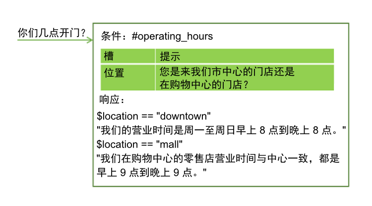

槽可以帮助您收集完成用户复杂任务所需的多条信息，例如晚餐预定。

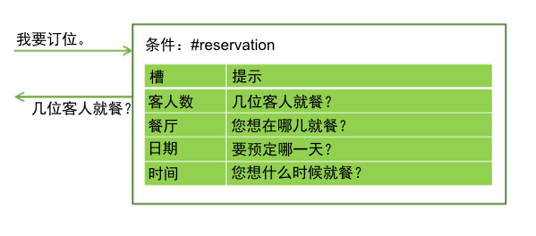

用户可同时为多个槽提供值。例如，输入可能包含信息：“6 人就餐，晚上 7 点。”这一个输入包含两个缺少的必需值：客人数和预定时间。服务可识别并存储这两个值，每个值都位于其相应的槽中。然后服务会显示与下一个空槽关联的提示。

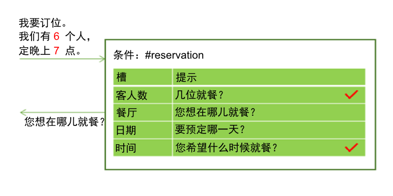

槽使服务能够回答跟进问题，而无需重新确定用户的目标。例如，用户可能会询问天气预报，然后询问有关其他位置或其他日期天气情况的跟进问题。如果在槽中保存必需的预测变量（例如，位置和日期），那么如果用户使用新的变量值询问跟进问题，就可以使用所提供的新值来覆盖槽值，并给出反映新信息的响应。

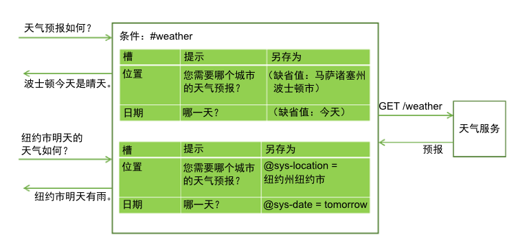

使用槽可在用户和服务之间生成更自然的对话流，而且相比尝试使用许多单独的节点来收集信息，管理起来也更方便。

#### 添加槽
{: #add-slots}

1.  确定要收集的信息单元。例如，要为某人订披萨，您可能希望收集以下信息：

    - 送餐时间
    - 尺寸

1.  在对话节点编辑视图中，单击**定制**，然后选中**槽**复选框。

    **注**：有关**提示提供所有信息**字段的更多信息，请参阅[一次询问所有信息](dialog-build.html#slots-prompt-for-everything)。

1.  **为每个所需信息单元添加槽**。

    对于每个槽，请指定以下详细信息：

    - **检查对象**：确定要从用户对槽提示的响应中抽取的信息类型。在大多数情况下，可检查实体值，但也可以检查意向。在此可以使用 AND 和 OR 运算符来定义更复杂的条件。

      **注**：如果实体定义了模式，那么在添加实体名称后，应附加 `.literal`。例如，从已定义实体的列表中选择 `@email` 后，编辑*检查对象*字段以包含 `@email.literal`。通过添加 `.literal` 属性，可以指示要捕获用户输入的确切文本，并基于其模式将其标识为电子邮件地址。

      避免检查上下文变量值。*检查对象*值首先用作条件，然后成为在*另存为*字段中指定的上下文变量的值。如果在条件中使用上下文变量，那么在上下文中使用时，会导致意外的行为。
      {: tip}

    - **另存为**：提供上下文变量的名称，以存储用户对槽提示的响应中相关的值。不要指定在对话中先前使用过的上下文变量，这些变量可能具有值。仅当槽的上下文变量为空时，才会显示该槽的提示。

    - **提示**：编写语句，以引导用户提供所需的信息。显示此提示后，对话会暂停，服务会等待用户进行响应。

    - 如果编辑槽，那么还可以定义要在用户响应槽提示后显示的响应。
      - **已找到**：在用户提供期望的信息后执行。
      - **找不到**：用户提供的信息不可理解或未以所需的格式提供时执行。此处指定的文本可以更明确地声明您需要用户提供的信息类型。如果成功填充了槽，或者节点级别处理程序理解并处理了用户输入，那么不会触发此条件。

    下表显示了帮助用户下披萨订单的节点的示例槽值。

    <table>
    <tr>
      <td>信息</td>
      <td>检查对象</td>
      <td>另存为</td>
      <td>提示</td>
      <td>如果已找到，跟进问题</td>
      <td>如果找不到，跟进问题</td>
    </tr>
    <tr>
      <td>尺寸</td>
      <td>@size</td>
      <td>$size</td>
      <td>"您要订多大的披萨？"</td>
      <td>"$size 大小。"</td>
      <td>"您要订多大的？我们有小号、中号、大号的。"</td>
    </tr>
    <tr>
      <td>送餐时间</td>
      <td>@sys-time</td>
      <td>$time</td>
      <td>"您希望的送餐时间？"</td>
      <td>"不迟于 $time 送达。"</td>
      <td>"您希望的送餐时间？备餐时间最短半个小时。"</td>
    </tr>
    </table>

    **可选槽**：如果要添加用于捕获信息的可选槽，那么不要对其指定提示。

    例如，可以添加槽来捕获用户指定的任何饮食禁忌信息。但是，您并不想向所有用户询问饮食信息，因为在大多数情况下这些信息都无关紧要。

    <table>
    <tr>
      <td>信息</td>
      <td>检查对象</td>
      <td>另存为</td>
    </tr>
    <tr>
      <td>忌食小麦</td>
      <td>@dietary</td>
      <td>$dietary</td>
    </tr>
    </table>

    添加不带提示的槽时，服务会将该槽视为可选。

    如果将槽设置为可选，那么仅在节点级别响应文本中引用其上下文变量（如果可以用文字有意义地表述），即便没有为该槽提供任何值也是如此。例如，可以将一个类似于下面的摘要声明用文字表述为“我要订一个 $size $dietary 的披萨，送餐时间是 $time”。如果未提供饮食禁忌信息（例如，`gluten-free` 或 `dairy-free`），生成的文本仍然有意义：“我要订一个大号披萨，送餐时间是下午 3:00。”
    {: tip}
1.  **不让用户跑题**。可以选择定义节点级别处理程序，用于对用户在交互期间可能会询问的与节点用途不太相关的问题提供响应。

    例如，用户可能会询问番茄酱配方或配料购自哪里。要处理此类不相关的问题，请单击**管理处理程序**链接，然后为每个预期问题添加条件和响应。

    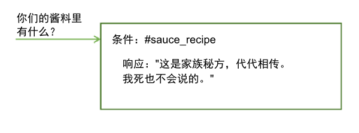

    响应不相关的问题后，将显示与当前空槽关联的提示。

    如果用户在对话节点流期间一直到显示节点级别响应之前的任意时间，提供与处理程序条件匹配的输入，都会触发此条件。
1.  **添加节点级别响应**。填充所有必需槽后，才会执行此节点级别的响应。可以添加用于汇总所收集信息的响应。例如，“一个`$size`披萨，预计 `$time` 送达。祝您用餐愉快！”

1.  **添加用于重置槽上下文变量的逻辑**。从每个槽中收集用户的回答时，这些回答会保存在上下文变量中。可以使用上下文变量将信息传递到其他节点、应用程序或外部服务以供使用。但是，传递信息后，必须将上下文变量设置为空以重置节点，这样该节点才能再次开始收集信息。不能将当前节点中的上下文变量设置为空，因为在填充必需的槽之前，服务不会退出节点。请考虑使用以下某种方法：
    - 将处理添加到将变量设置为空的外部应用程序。
    - 添加将变量设置为空的子节点。
    - 插入将变量设置为空的父节点，然后跳转至使用槽的节点。

请考虑这些处理常见任务的建议方法。

#### 一次询问所有信息
{: #slots-prompt-for-everything}

包括整个节点的初始提示，以明确告诉用户您希望他们提供哪些信息单元。显示此提示首先使用户有机会一次提供所有详细信息，而不必等待提示，一次提供一条信息。

例如，由于客户要订披萨而触发节点时，可以通过初步提示进行响应：“可以接单。请问您要多大的披萨，希望几点送餐。”

如果用户在其初始请求中提供了哪怕是此信息的一部分，就不会再显示此提示。例如，初始输入可能是“我要大号披萨”。服务分析输入时，会将“大号”识别为披萨的尺寸，并使用提供的值填充**尺寸**槽。由于其中一个槽已填充，因此服务将跳过显示初始提示，以避免再次询问披萨尺寸信息。它会改为显示其余所有缺少信息的槽的提示。

在启用了“槽”功能的“定制”窗格中，选中**提示提供所有信息**复选框以启用初始提示。此设置会向节点添加**如果未预填充任何槽，请首先询问此问题**字段，在其中可以指定提示用户提供所有信息的文本。

#### 捕获多个值
{: #slots-multiple-entity-values}

可以要求提供项列表，并将其保存在一个槽中。

例如，您可能希望询问用户是否要在披萨上加馅料。为此，请定义实体 (@topping) 及其接受的值（洋葱胡椒、奶酪、蘑菇等等）。添加一个槽，用于向用户询问有关馅料的问题。使用该实体类型的值属性来捕获多个值（如果提供）。

<table>
<tr>
  <td>信息</td>
  <td>检查对象</td>
  <td>另存为</td>
  <td>提示</td>
  <td>如果已找到，跟进问题</td>
  <td>如果找不到，跟进问题</td>
</tr>
<tr>
  <td>馅料</td>
  <td>@toppings.values</td>
  <td>$toppings</td>
  <td>要加馅料吗？</td>
  <td>"能加太好了。"</td>
  <td>"要加哪种馅料？我们有..."</td>
</tr>
</table>

要稍后引用用户指定的馅料，请使用 `<? $entity-name.join(',') ?>` 语法，以列出馅料数组中的每个项，并使用逗号分隔各值。例如，“我要订一个$size披萨，加`<? $toppings.join(',') ?>`馅料，送餐时间是 $time。”

#### 重新设置值的格式
{: #slots-reformat-values}

由于您会要求用户提供信息，并且需要在响应中引用其输入，因此请考虑重新设置值的格式，以便可以使用更友好的格式来显示这些值。

例如，时间值以 `hh:mm:ss` 格式保存。可以使用 JSON 编辑器来设置在槽保存时间值时重新设置值的格式，使其改为使用 `hour:minutes AM/PM` 格式：

```json
{
  "context":{
    "time": "<? @sys-time.reformatDateTime('h:mm a') ?>"
  }
}
```
{: codeblock}

有关其他重新设置格式的构想，请参阅[值处理方法](dialog-methods.html)。

#### 获取确认
{: #slots-get-confirmation}

在其他槽下面添加一个槽，用于要求用户确认所收集的信息是否准确且完整。该槽可以查找与 #yes 意向相匹配的响应。

<table>
<tr>
  <td>信息</td>
  <td>检查对象</td>
  <td>另存为</td>
  <td>提示</td>
  <td>如果已找到，跟进问题</td>
  <td>如果找不到，跟进问题</td>
</tr>
<tr>
  <td>确认</td>
  <td>#yes</td>
  <td>$confirmation</td>
  <td>"我会为您订一个`$size`披萨，送餐时间是 `$time`。可以下单了吗？"</td>
  <td>"您的披萨已接单！"</td>
  <td>请参阅下文</td>
</tr>
</table>

由于用户可能在对话期间的其他时间包含肯定的语句（*对，我希望披萨下午 5 点送到*），因此请使用 `slot_in_socus` 属性使槽条件中明确，查找的是仅对此槽的提示做出的 Yes 响应。

```json
#yes && slot_in_focus
```
`slot_in_focus` 属性始终求值为布尔值（true 或 false）。请仅将其包含在需要布尔结果的条件中。例如，不要在检查实体类型，然后保存实体值的槽条件中使用此属性。
{: tip}

在**找不到**提示中，重复一遍要求提供信息，并重置先前保存的上下文变量。

```json
{
  "output":{
    "text": {
      "values": [
        "我们再试一下吧。请问您要多大的披萨，希望的送餐时间是..."
      ]
    }
  },
  "context":{
    "size": null,
    "time": null
  }
}
```
{: codeblock}

#### 替换槽上下文变量值
{: #slots-found-handler-event-properties}

如果节点有槽，而用户在退出该节点之前为槽提供了新值，那么新值会保存在槽上下文变量中，并替换先前指定的值。对话可以使用为“已找到”条件事件处理程序定义的特殊属性来明确确认已发生此替换：

- `event.previous_value`：此槽的上下文变量的先前值。
- `event.current_value`：此槽的上下文变量的当前值。

例如，对话询问预订航班的目的地城市。用户提供了`巴黎`。您将 $destination 槽上下文变量设置为*巴黎*。然后，用户说`等一下。我要改成飞马德里。`如果按如下所示设置了“已找到”条件，那么对话就可以正常处理此类型的更改。

```json
用户响应后，如果已找到 @destination：
条件：event.previous_value != null
    响应：好，更新目的地，<? event.previous_value ?>改为<? event.current_value ?>。
响应：好，目的地是$destination.literal。
```

通过此槽配置，对话能够对用户的目的地更改做出反应，回答：`好，更新目的地，巴黎改为马德里。`

#### 避免数字混淆
{: #slots-avoid-number-confusion}

用户提供的一些值可以识别为多个实体类型。

例如，您可能有两个槽存储的是相同类型的值，如到达日期和出发日期。在槽条件中构建逻辑，可将此相似的值相互区分开来。

此外，服务可以识别单个用户输入中的多个实体类型。例如，用户提供货币时，货币会识别为 @sys-currency 和 @@sys-number 实体类型。在“试用”窗格中进行一些测试，以了解系统将如何解释不同的用户输入，然后在条件中构建逻辑以防止可能的错误解释。

在槽功能的唯一逻辑中，当在单个用户输入中识别到两个实体时，将使用其中一个具有较大范围的实体。例如，如果用户输入 *5 月 2 日*，那么即便 Conversation 服务识别到文本中的 @sys-date (05022017) 和 @sys-number (2) 实体，也只会注册范围较长 (@sys-date) 的实体并将其应用于槽（如果适用）。
{: tip}

#### 阻止在不需要时显示“已找到”响应
{: #slots-stifle-found-responses}

如果为多个槽指定“已找到”响应，那么当用户同时为多个槽提供值时，将显示至少一个槽的“已找到”响应。您可能希望返回所有这些槽的“已找到”响应，或者不返回任何“已找到”响应。

要阻止显示“已找到”响应，可以对每个“已找到”响应执行以下某项操作：

- 向响应添加条件，以阻止其在填充特定槽时显示。例如，可以添加条件，如 `!($size && $time)`，这将在同时提供了 $size 和 $time 上下文变量时，阻止显示响应。
- 将 `!all_slots_filled` 条件添加到响应。如果填充了所有槽，那么此设置将阻止显示响应。如果要包含确认槽，请不要使用此方法。确认槽也是一个槽，您通常希望在填充确认槽本身之前，阻止显示“已找到”响应。

#### 处理请求以退出过程
{: #slots-node-level-handler}

至少添加一个节点级别处理程序，用于识别用户要退出节点的情况。

例如，在收集信息以安排宠物美容预约的节点中，可以添加一个节点级别处理程序，用于以 #cancel 意向为条件，此条件会识别诸如“算了，我改变主意了。”之类的发声。

1.  在处理程序的 JSON 编辑器中，使用哑元值填充所有槽上下文变量，以阻止节点继续要求提供任何缺少的信息。在处理程序响应中，添加一条消息，如“好，停止预约。我们不会为您安排预约。”
1.  在节点级别响应中，添加一个条件，用于检查其中一个槽上下文变量中是否有哑元值。如果找到哑元值，将显示最终消息，例如“如果您决定稍后再预约，我随时恭候。”如果找不到哑元值，那么将显示该节点的标准摘要消息，例如“我会为您安排$animal的美容预约，时间是 $date $time。”
1.  考虑在此节点级别处理程序之前求值的条件中所使用的逻辑，以便您可以在其中构建不同的条件。收到用户输入时，将按以下顺序对条件求值：

    - 当前槽级别“如果已找到”条件。
    - 节点级别处理程序，按其列出顺序执行。
    - 当前槽级别“如果找不到”条件。

将始终求值为 true 的条件（例如，特殊条件 `true` 或 `anything_else`）添加为节点级别处理程序时务必谨慎。如果节点级别处理程序都求值为 true，那么将完全跳过每个槽的“如果找不到”条件。因此，使用始终求值为 true 的节点级别处理程序可有效地阻止对每个槽的“如果找不到”条件求值。
{: tip}

例如，您为除猫以外的其他所有动物提供美容服务。对于“动物”槽，可尝试使用以下槽条件来阻止`猫`保存在“动物”槽中：

```json
检查 @animal && !@animal:cat，然后将其保存为 $animal。
```
{: codeblock}

为了让用户知道您不接受猫，可以在“动物”槽的“找不到”条件中指定以下值：

```json
如果 @animal && !@animal:cat，那么显示“对不起，我们不为猫咪美容。”
```
{: codeblock}

逻辑上，如果还定义了节点级别出口请求处理程序，那么当提供了条件求值顺序时，有可能从来不会触发此“找不到”条件。可以改为使用以下槽条件：

```json
检查 @animal，然后另存为 $animal。
```
{: codeblock}

为了处理可能的`猫`响应，请将此值添加到“已找到”条件：

```josn
如果 @animal:cat，那么显示“对不起，我们不为猫咪美容。”
```
{: codeblock}

在 JSON 编辑器中，为“已找到”条件重置 $animal 上下文变量的值，因为该变量当前设置为猫，这是不应该的设置。

```json
{
  "output":{
    "text": {
      "values": [
        "对不起，我们不为猫咪美容。"
      ]
    }
  },
  "context":{
    "animal": null
  }
}
```
{: codeblock}

下面是为披萨示例定义节点级别处理程序的 JSON 样本：

```json
{
"conditions": "#cancel",
 "output": {
   "text": {
     "values": [
       "好，停止预约。我们不会为您安排披萨送货。"
     ],
    "selection_policy": "sequential"
    }
  },
"context": {
   "time": "12:00:00",
   "size": "dummy",
   "confirmation":"true"
}
}
```

#### 槽示例

要访问实现不同常用槽使用方案的 JSON 文件，请转至 GitHub 中的社区 [conversation repo ](https://github.com/watson-developer-cloud/community/tree/master/conversation){: new_window}。

要试用示例，请下载某个示例 JSON 文件，然后将其作为新的工作空间导入。在“对话”选项卡中，可以查看对话节点以了解如何实现槽来解决不同用例。

## 测试对话
{: #test}

更改对话时，可以随时对其进行测试，以了解其如何对输入进行响应。

1.  在“对话”选项卡中，单击 图标。
1.  在交谈窗格中，输入一些文本，然后按 Enter 键。

    在开始测试对话之前，请确保系统已完成对最新更改的培训。如果系统仍在培训，交谈窗格顶部将显示一条消息：
    {: tip}

    
1.  检查响应，以确定是否对话是否正确解释了输入，并选择了正确的响应。

    交谈窗口会指示在输入中识别到的意向和实体：

    

    在对话编辑器窗格中，将突出显示当前活动的节点。
1.  要检查或设置上下文变量的值，请单击**管理上下文**链接。

    这将显示在对话中已定义的所有上下文变量。

    此外，还会列出 `$timezone` 上下文变量。“试用”窗格用户界面会从 Web 浏览器获取用户语言环境信息，并使用此信息来设置 `$timezone` 上下文变量。通过此上下文变量，能更轻松地在测试对话交流中处理时间引用。请考虑在用户应用程序中执行类似操作。如果未指定，将使用格林威治标准时间 (GMT)。

    可以添加变量并设置其值，以查看对话如何在下一轮测试对话中进行响应。例如，如果将对话设置为根据用户提供的上下文变量值来显示不同响应，那么此功能非常有用。

    1.  要添加上下文变量，请指定变量名称，然后按 **Enter** 键。
    1.  要为上下文变量定义缺省值，请查找在列表中添加的上下文变量，然后为其指定值。

    有关更多信息，请参阅[上下文变量](#context)。

1.  继续与对话交互以查看会话如何在其中进行。
    - 要找到并重新提交测试发声，可以按“向上”键来循环浏览最近的输入。
    - 要从交谈窗格中除去先前的测试发声，然后从头开始，请单击**清除**链接。此操作不仅会除去测试发声和响应，还会清除因与对话交互而设置的任何上下文变量的值。但不会清除显式设置或更改的上下文变量值。

### 后续操作

如果确定识别到错误的意向或实体，那么可能需要修改意向或实体定义。

如果识别到正确的意向和实体，但在对话中触发了错误的节点，请确保条件编写正确。

## 移动对话节点
{: #move-node}

您创建的每个节点都可以移动到对话树中的其他位置。

您可能希望将先前创建的节点移至流的另一个区域以更改会话。可以移动节点，使其成为另一个分支中的同代或对等节点。

1.  在要移动的节点上，单击**更多**  图标，然后选择**移动**。
1.  要将此节点移动到哪个位置，即在树中的该位置附近选择一个目标节点。选择是将此节点放在目标节点上方还是下方，还是使其成为目标节点的子节点。

## 按节点标识查找对话节点
{: #get-node-id}

出于以下任何原因，您可能希望查找与已知节点标识关联的对话节点：

- 您在查看日志，并且日志通过对话节点标识引用了对话的某个部分。
- 您希望将 API 消息输出的 `nodes_visited` 属性中列出的节点标识，映射到可以在对话树中查看的节点。
- 对话运行时错误消息通知您有关语法错误的信息，并使用节点标识来标识需要修正的节点。

要根据节点标识来发现节点，请完成以下步骤：

1.  在工具的“对话”选项卡中，选择对话树中的任一节点。
1.  如果当前节点的编辑视图已打开，请将其关闭。
1.  在 Web 浏览器的“位置”字段中的 URL 显示的语法应该如下所示：

    ```json
    https://watson-conversation.ng.bluemix.net/space/instance-id/workspaces/workspace-id/build/dialog#node=node-id
    ```

1.  编辑该 URL 并将当前 `node-id` 值替换为要查找的节点的标识，然后提交新的 URL。
1.  如果需要，请再次突出显示已编辑的 URL，然后重新进行提交。

工具会刷新，并将焦点切换到具有您指定节点标识的对话节点。

**注**：不能使用此方法来查找当前槽、槽处理程序或节点级别处理程序。要按标识查找这些类型的节点，必须导出工作空间，使用 JSON 编辑器查找 JSON 格式的节点标识，并记下其标题（如果已指定）或其条件。在工具的“对话”选项卡中，使用浏览器搜索功能来搜索具有该标题或条件的对话节点。
