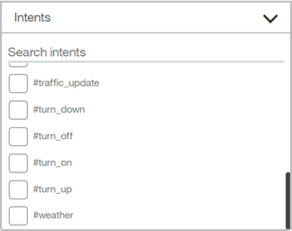

---

copyright:
  years: 2015, 2017
lastupdated: "2017-08-30"

---

{:shortdesc: .shortdesc}
{:new_window: target="_blank"}
{:tip: .tip}
{:pre: .pre}
{:codeblock: .codeblock}
{:screen: .screen}
{:javascript: .ph data-hd-programlang='javascript'}
{:java: .ph data-hd-programlang='java'}
{:python: .ph data-hd-programlang='python'}
{:swift: .ph data-hd-programlang='swift'}

# 使用会话
{: #logs_convo}

要打开用户与机器人之间的交互列表，请选择导航栏中的**用户会话**。如果**用户会话**未显示，请使用  菜单来打开该页面。
{: shortdesc}

打开**用户会话**页面时，缺省视图将列出最后一天的结果，最新的结果最先列出。提供的信息包括：消息中使用的最热门意向 (#intent) 、识别到的所有实体 (@entity) 值，以及消息文本。对于未识别到的意向，显示的值为*不相关*。如果未识别到实体或未提供实体，那么显示的值为*找不到实体*。

## 日志限制
{: #log-limits}

保留交谈消息的时间长度取决于 {{site.data.keyword.conversationshort}} 服务套餐：

  服务套餐                             | 交谈日志保留时间
  ------------------------------------ | ------------------------------------
  高级                                 | 最近 90 天
  标准                                 | 最近 30 天
  免费                                 | 最近 7 天

## 过滤发声

值得注意的是，**用户会话**页面会显示用户与机器人之间的*发声*总数。一个发声是用户向机器人发送的单条消息。每个会话可能由多个发声组成。因此，此**用户会话**页面上的结果数与[概述](logs_oview.html)页面上显示的会话数不同。

可以按*搜索用户语句*、*意向*、*实体*以及*最近* n *天*来过滤发声：

*搜索用户语句* - 在搜索栏中输入一个词。这将搜索用户的输入，但不会搜索机器人的回复。

*意向* - 选择下拉菜单并在输入字段中输入意向，或者从填充的列表中进行选择。可以选择多个意向，这将使用任一所选意向（包括*不相关*）来过滤结果。

*实体* - 选择下拉菜单并在输入字段中输入实体名称，或者从填充的列表中进行选择。可以选择多个实体，这将按任一所选实体来过滤结果。如果按意向*和*实体进行过滤，那么结果将包含同时具有这两种值的消息。还可以使用*找不到实体*来过滤结果。

更新发声可能需要一些时间。在尝试过滤该内容之前，请至少允许用户与机器人交互 30 分钟。

## 查看单个发声
可以展开每个发声条目，以查看用户在整个会话中所说的内容，以及机器人是如何回答的。要执行此操作，请选择**打开会话**。这将自动转至该会话中的所选发声。

然后，可以选择显示所选发声的分类。

## 更正意向

1.  要更正意向，请选择所选 #intent 旁边的 “编辑”图标。
1.  从提供的列表中，选择此输入的正确意向。
    - 在输入字段中开始输入，这将过滤意向列表。
    - 还可以从此菜单中选择**标记为不相关**。（有关更多信息，请参阅[标记为不相关](intents.html#mark-irrelevant)。）或者，可以选择**不对意向进行培训**，这样此发声就不会保存为培训示例。

    
1.  选择**保存**。

    

## 添加实体值或同义词

1.  要添加实体值或同义词，请选择所选 @entity 旁边的 “编辑”图标。
1.  选择**添加实体**。

    
1.  现在，在带下划线的用户输入中选择一个词或短语。

    
1.  选择一个实体以将突出显示的短语添加为其值。
    - 在输入字段中开始输入，这将过滤实体和值的列表。
    - 要将突出显示的短语添加为现有值的同义词，请从下拉列表中选择“@entity:value”。

    
1.  选择**保存**。

    
