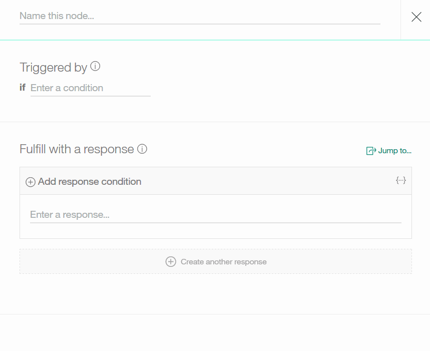
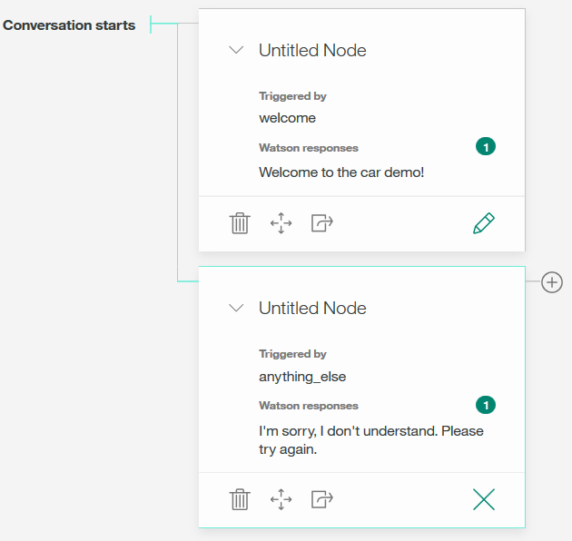
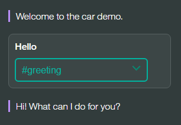
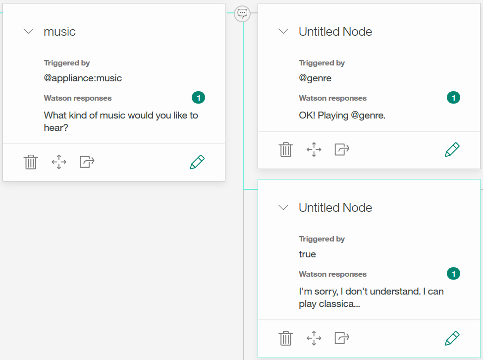

---

copyright:
  years: 2015, 2017
lastupdated: "2017-06-09"

---

{:shortdesc: .shortdesc}
{:new_window: target="_blank"}
{:tip: .tip}
{:pre: .pre}
{:codeblock: .codeblock}
{:screen: .screen}
{:javascript: .ph data-hd-programlang='javascript'}
{:java: .ph data-hd-programlang='java'}
{:python: .ph data-hd-programlang='python'}
{:swift: .ph data-hd-programlang='swift'}

# Stage 5: Create a dialog

A dialog is a set of conversational nodes that are contained in a workspace. Together the set of nodes makes a dialog tree, on which every branch is a conversation that can be had with a user.
{:shortdesc}

## Start the dialog
First we need to create a starting node for the dialog:

1.  On the Car tutorial workspace page, select the Dialog tab.
1.  Select **Create**. The dialog is created with a single node.  This node is displayed in the dialog tree:

    

    The edit view of the node is also displayed.  This is where you modify the node.

    

1.  In the edit view, specify the condition and response for the starting node of the conversation:

    1.  In the **Triggered by** field, start typing `welcome`.
    1.  Select **welcome (create new condition)** from the list. This node is triggered at the beginning of the conversation.  
        
        When you create the condition in your first dialog node, a node with the condition `anything_else` is created in the dialog tree.  We'll look at this node soon.
    1.  Add the first response from your bot in the **Fulfill with a response** field:

        ```
        Welcome to the car demo!
        ```
        {:screen}

        Your bot will issue this response when the specified condition is true (in this case, when the conversation starts).

    1.  Select the `anything_else` node that was created when you defined the conversation_start node.  
        
        The edit view now shows the `anything_else` node rather than the welcome node.
    1.  Add a response in the **Fulfill with a response** field of the `anything_else` node:

        ```
        I'm sorry, I don't understand. Please try again.
        ```
        {:screen}

        Your bot will issue this response when the user input doesn't match any other node.

    1. Close the edit view.
    The tree view now shows the updates that you have made to these two nodes:

    
    

### Test the initial conversation

1.  Select the  icon. In the chat pane, you should see the response, `Welcome to the car demo`.
1.  Type anything and press Enter.

    Because you haven't defined any other nodes, you should see the response, `I'm sorry, I don't understand. Please try again.`

1.  Close the chat pane.

## Create branches for intents

Now we can create dialog branches that handle the defined intents.

### Create a branch to respond to #greeting

The #greeting intent requires a simple response, so the branch has a single node.

1.  Select the **welcome** node.
1.  Select the **+** icon on the bottom of the node to create a root-level node. Because this new node is a peer of the welcome node (rather than a child node), it represents an alternative conversation.
    The edit view is opened for the new node.
1.  In the **Triggered by** field, start typing `#greeting`.
1.  Select **#greeting (create new condition)**  from the list. This condition is triggered by any input that matches the #greeting intent.
1.  Add a response in the **Fulfill with a response** field:

    ```
    Hi! What can I do for you?
    ```
    {:screen}

1. In the `anything_else` node, select the minimize icon.  This unclutters the tree view by minimizing this node.
    Here is the tree view now:

    

### Test the first intent branch

1.  Select the  icon to open the chat pane.
1.  Type `Hello` and press Enter.



The output shows that the #greeting intent is recognized, and the appropriate response appears.

### Add a root-level node for #turn_on
Create another dialog branch to respond to the #turn_on intent.

Because there are multiple possibilities for what the user might want to turn on, this branch  represents a more complex conversation.

Start by creating the root-level node:

1.  Select the **+** icon on the bottom of the `#greeting` node to create a root-level node.  If the **+** icon isn't visible, select the `#greeting` node to put it into focus.
1.  In the **Name this node** field, enter `turn on`.  The title does not affect the processing of the node, but it makes it easier to find.
1.  In the edit view, in the **Triggered by** field, start typing `#turn_on`.
1.  Select **#turn_on** from the list. This condition is triggered by any input that matches the #turn_on intent.
1.  Do not enter a response in this node.

### Add multiple child nodes for #turn_on
The #turn_on intent requires additional processing, because the dialog needs to determine which appliance the user wants to turn on. To handle this, we create multiple responses based on additional conditions.
There are three possible scenarios, based on the intents and entities that we have defined:

1. The user wants to turn on the music, in which case we need to ask for the genre.
1. The user wants to turn on any other valid appliance, in which case we simply echo the name of the requested appliance in a message that indicates that we're turning it on.
1. The user does not specify a recognizable appliance name, in which case we need to ask for clarification.

We'll check the conditions in this order.  Determining the most efficient order in which to check conditions is an important skill in building dialog trees.
If you find a branch is becoming very complex, check the conditions to see whether you can simplify your dialog by reordering them.  It's often best to process the most specific conditions first.  

To check the input, add a child node:

1.  Select the **+** icon on the side of the `turn on` node to create a child node.
1.  In the **Name this node** field, enter `music`.  
1.  Under **Triggered by**, enter `@appliance:music`.  This condition is true if the value of the @appliance entity is `music` or one of its synonyms, as defined on the Entities tab.
1.  Under **Fulfill with a response**, enter `What kind of music would you like to hear?`
1.  Exit the edit view of this node.

We want to jump directly from the `turn on` node to the `music` node without asking for any more user input.
To do this, we use a **Jump to** action.

1.  In the `turn_on` node, select the **Jump to** icon . 
1.  Select the `music` node, and then select **Go to condition**.  We want to process the condition of the `music` node.


Note that you had to create the target node (the node to which you want to jump) before you added the **Jump to** action.  

After you select **Go to condition** you see a new box in the tree:


Now we need a node to process the type of music that the user requests.  

1.  Select the **+** icon on the right side of the `music` node to create a child node. This child node is evaluated only after the user has responded to the question about the type of music.
Because we need a user input before this node, there is no need to use a **Jump to** action.
1.  Under **Triggered by**, enter `@genre`.  This condition is true whenever a valid value for the @genre entity is detected.
1.  Under **Fulfill with a response**,  enter `OK! Playing @genre.`  This response uses the value that the user entered.

We also need a node to respond when the user does not specify a recognized value for @genre.

1.  Select the **+** icon on the bottom of the `genre` node to create a peer node.
1.  Under **Triggered by**, enter `true`.  This condition specifies that if the dialog flow reaches this node, it should always evaluate as true. (If the user specifies a valid @genre value, this node will never be reached.)
1.  Under **Fulfill with a response**,  enter `I'm sorry, I don't understand. I can play classical, rhythm and blues, or rock music.`

    
    
That takes care of all the cases where the user asked us to turn on the music.  

### Test the dialog for music

1.  Select the  icon to open the chat pane.
1.  Type `Play music`.
    The bot recognizes the #turn_on intent and the @appliance:music entity, and it responds by asking for a musical genre.

1.  Type the name or a synonym for a valid @genre value (for example, `pop`). The bot recognizes the @genre entity and responds appropriately.
1.  Type `Play music` again, but this time specify an invalid response for the genre.

    The bot responds that it does not understand.

### Create nodes for other appliances

Next, we'll create a node that is used when the user specifies any other valid value for @appliance.
For these other values of @appliance, we don't need to ask for any more input.   We just give a positive response.

1.  Select the `music` node, so that the options to create child and peer nodes are displayed.
1.  Select the **+** icon on the bottom of the music node to create a peer node.
1.  Under **Triggered by**, enter `@appliance`.  
This condition is triggered if the user input includes any recognized value for the @appliance entity, except music.
1.  Under **Fulfill with a response**,  enter `OK! Turning on the @appliance.`  This response uses the value that the user entered.

Now add a peer node that will be triggered if the user input did not specify a valid appliance:

1.  Select the **+** icon on the bottom of the `@appliance` node to create a peer node.
1.  Under **Triggered by**, enter `true`.  This condition specifies that if the dialog flow reaches this node, it should always evaluate as true. (If the user specifies a valid @appliance value, this node will never be reached.)
1.  Under **Fulfill with a response**,  enter `I'm sorry, I don't know how to do that. I can turn on music, headlights, or air conditioning.`

### Test the dialog with other appliances

1.  Select the  icon to open the chat pane.
1.  Type `lights on`.

    The bot recognizes the #turn_on intent and the @appliance:headlights entity, and it responds with `OK, turning on the headlights`.

1.  Type `turn on the air`.

    The bot recognizes the #turn_on intent and the @appliance:(air conditioning) entity, and it responds with `OK, turning on the air conditioning.`

1.  Try variations on all of the supported commands based on the example utterances and entity synonyms you defined.

    If the bot fails to recognize the correct intent, you can retrain it directly from the chat window. Select the incorrect intent and type the correct one in the field.

    **Tip**: Don't include the `#` character when you type the intent name.

### What to do next

Now that your bot is complete, you can experiment by enhancing it with new functions. For example:

-   Define entities for additional appliances and musical genres
-   Add synonyms for entities
-   Add a new intent to turn off appliances
-   Add capability for turning on music and specifying a musical genre with a single command
